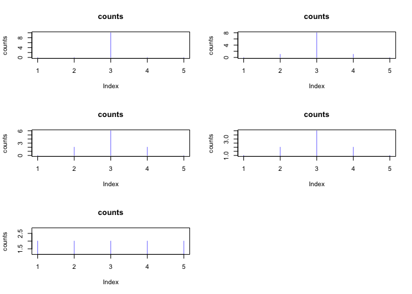
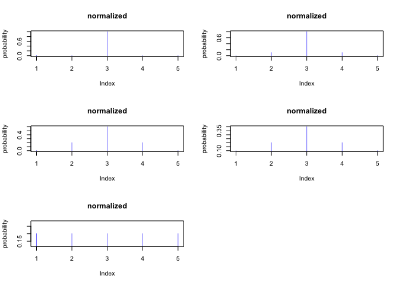
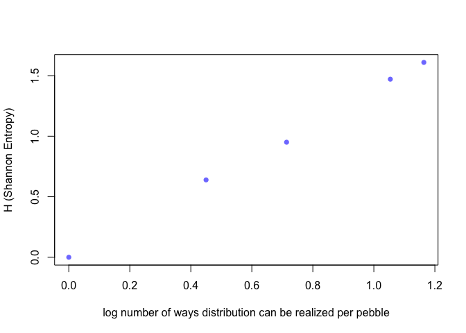
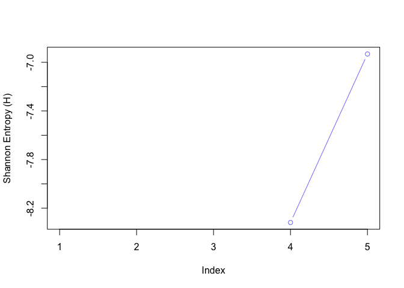
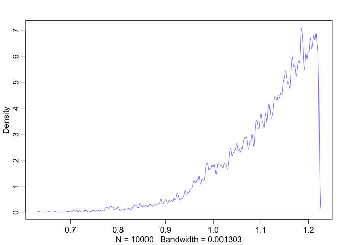

ch 10 maximum entropy and generalized linear models
================

GLMs replace a parameter in a likelihood funxtion with a linear model.
We choose a link function. The principal of maximum entropy helps us
choose the distribution that makes the least assumptions given our state
of knowledge.

### Maximum entropy

Simulate 10 pebbles in 5 buckets realized different ways

``` r
suppressMessages(library(rethinking))


## R code 10.1
p <- list()
p$A <- c(0,0,10,0,0)
p$B <- c(0,1,8,1,0)
p$C <- c(0,2,6,2,0)
p$D <- c(1,2,4,2,1)
p$E <- c(2,2,2,2,2)

par(mfrow = c(3,2))
lapply(p, plot, type = 'h', col = rangi2, main = 'counts', ylab = 'counts')
```

    ## $A
    ## NULL
    ## 
    ## $B
    ## NULL
    ## 
    ## $C
    ## NULL
    ## 
    ## $D
    ## NULL
    ## 
    ## $E
    ## NULL

``` r
## R code 10.2
# normalize by the total 
p_norm <- lapply( p , function(q) q/sum(q))

# plot distributions 
par(mfrow = c(3,2))
```

<!-- -->

``` r
lapply(p_norm, plot, type = 'h', col = rangi2, 
       main = 'normalized', ylab = 'probability')
```

    ## $A
    ## NULL
    ## 
    ## $B
    ## NULL
    ## 
    ## $C
    ## NULL
    ## 
    ## $D
    ## NULL
    ## 
    ## $E
    ## NULL

<!-- -->

Compute the informaiton entropy of each distribution.  
We need to use `ifelse(q==0,0, ... )` because we cant take log(0), so we
use L’Hopital’s rule to invoke the limit as log(0) approaches 0 -\> 0

``` r
## R code 10.3
H <- sapply( p_norm , function(q) -sum(ifelse(q==0,0,q*log(q))) ) 
plot(H,col = rangi2, type = 'b', ylab = 'H (Shannon Entropy)')
```

<!-- -->

Information Entropy is a way of counting how many unique arrangements of
the observations corespond to a distribution. The distribution that can
happen the mst ways is the Maximum Entropy distribution – Max Ent
distribution is the center of gravity for plausible distributions.

The log number of ways each of the above distribution of pebbles in the
bucket can occur vs entropy

``` r
## R code 10.4
ways <- c(1,90,1260,37800,113400)
logwayspp <- log(ways)/10

plot(x = logwayspp, y = H,
     xlab = 'log number of ways distribution can be realized per pebble',
     col = rangi2, pch = 16, ylab = 'H (Shannon Entropy)')
```

<!-- -->

### The Gaussian distribution is the maximum entropy distribution for any continuous distribution with finite variance

see book p 305-306.  
For some distribution with finite variance, e.g. sigma = 1, we can
calculate “Generalized normal” distributions with different shape
parameters.  
The shape parameter puts different probability mass in the center vs
tail of the distribution. It can be shown using KL Divergence as well as
graphically that the distribution maximuzing Entropy has a shape
parameter = 2. This is the Gaussian distribution.

Fixed variance means we constrain the probability around a area near the
mean – a uniform distribution would have more entropy but also infinite
variance.

*If all we are willing to assume about a distribution of measures is
that it has some fixed, finite variance, the Gaussian is the most
conservative distribution to assign to those measurements*

We can use the same principle of maximum entropy to choose a probability
distribution to fit to the data by adding additional
assumptions.

### The Binomial distribution is the maximum entropy distribution for 2 unordered events with some constant or unknown expected value

In this example we go back to pulling blue and white marbles from a bag.
Assume that the expected value is 1 blue marble after 2 draws. We
consider a list of candidate distributions with the same expected value
for 1 blue marble and compute which has highest entropy.

``` r
## R code 10.5
# build list of the candidate distributions
p <- list()
p[[1]] <- c(1/4,1/4,1/4,1/4)
p[[2]] <- c(2/6,1/6,1/6,2/6)
p[[3]] <- c(1/6,2/6,2/6,1/6)
p[[4]] <- c(1/8,4/8,2/8,1/8)
par(mfrow = c(2,2))
sapply(p, plot, type = 'b', col = rangi2)
```

The first distribution is a binomial distribution.

Confirm these have the same expected value for 1 blue on 2 draws (see
drawn diagram on book p308 in the code box)

``` r
# compute expected value of each
sapply( p , function(p) sum(p*c(0,1,1,2)) )
```

    ## Warning in p * c(0, 1, 1, 2): longer object length is not a multiple of
    ## shorter object length
    
    ## Warning in p * c(0, 1, 1, 2): longer object length is not a multiple of
    ## shorter object length
    
    ## Warning in p * c(0, 1, 1, 2): longer object length is not a multiple of
    ## shorter object length
    
    ## Warning in p * c(0, 1, 1, 2): longer object length is not a multiple of
    ## shorter object length
    
    ## Warning in p * c(0, 1, 1, 2): longer object length is not a multiple of
    ## shorter object length

    ##  A  B  C  D  E 
    ## 10 11 12 10  8

calculate the entropy for the binomial.

``` r
p1 = p[[1]]
-sum(p1 * log(p1))
```

    ## [1] NaN

``` r
# compute entropy of each distribution
plot(
    sapply( p , function(p) -sum( p*log(p))),
    type = 'b', col = rangi2, ylab = "Shannon Entropy (H)" 
     )
```

<!-- -->

What if we changed the expected value to 1.4 blue marbles?  
1.4 blue on 2 draws = (1.4 x 10 )/ 2 = 7 blue on 10 draws so p = 0.7;
that’s our expect value

``` r
## R code 10.7
p <- 0.7
A <- c( (1-p)^2 , p*(1-p) , (1-p)*p , p^2 ) 

## R code 10.8
binomial.entropy=  -sum( A*log(A) )
binomial.entropy
```

    ## [1] 1.221729

This is cool below- we write a function to compute 1000 random
distributions and compare them to the binomial distribution

``` r
## R code 10.9
sim.p <- function(G=1.4) {
    
    # test 
    # G = 1.4
    
    # sample 3 random uniforms
    x123 <- runif(3)  # e.g. 0.38, 0.39, 0.85
    
    # what is the expected value of the 4th draw using the expected value of 1.4? 
    x4 <- ( (G)*sum(x123)-x123[2]-x123[3] )/(2-G) # e.g.  1.74 
    
    # convert to a probability 
    p <- c( x123 , x4 )/ sum( c(x123,x4) )
    
    # calculate entropy 
    list( H=-sum( p*log(p) ) , p=p )
}

## R code 10.10
H <- replicate( 1e4 , sim.p(G =  1.4) )

dens( as.numeric(H[1,]) , adj=0.1 , col = rangi2)
```

<!-- -->

How does the binomial entropy for the expect value of 1.4 compare to
entropy from 1000 simulations of possible distributions?  
Amazing, they are the same. the binomial maximizes entropy

``` r
## R code 10.11
entropies <- as.numeric(H[1, ])
distributions <- H[2,]

max(entropies)
```

    ## [1] 1.221718

``` r
binomial.entropy
```

    ## [1] 1.221729

Obvviously the goal is usually to *estimate* the expected value np. This
is the same problem. Assuming a distribution has a constant expected
value leads to the binomial distribution wiht unknown np – if only 2 un
ordered outcomes are possible (and there is time invariance) the most
conservative distribution to use is the binomial.
