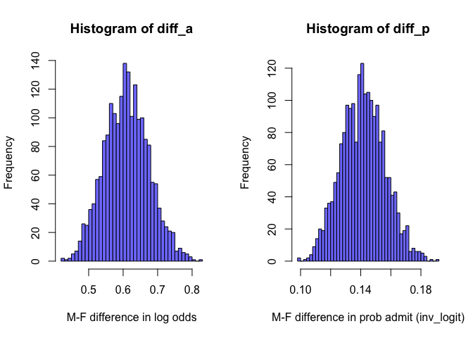
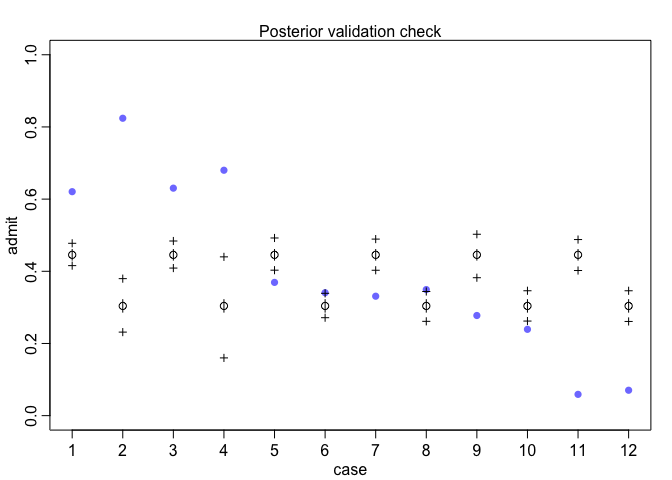
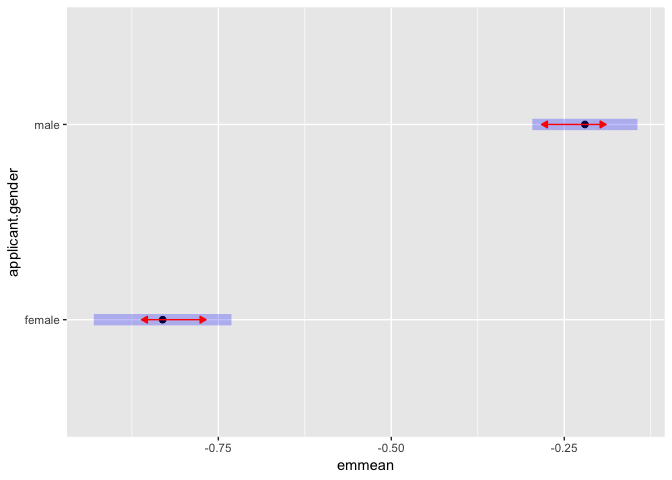
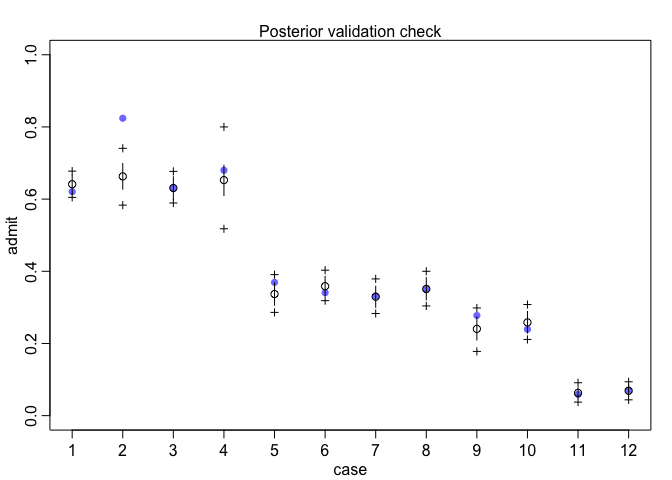
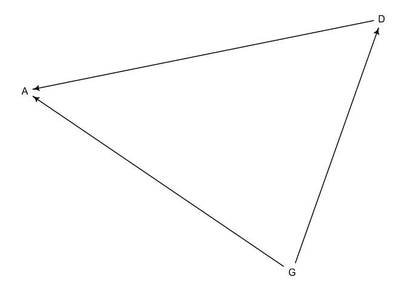

Ch 11 part Ib: Aggregated binomial regression
================

### Aggregated binmoial model - Berkley admissions dataset

This is a small dataset with department, acceptance rate, applicants and
sex.

``` r
## R code 11.28
suppressMessages(library(rethinking))
r = rangi2
data(UCBadmit)
d <- UCBadmit
d
```

    ##    dept applicant.gender admit reject applications
    ## 1     A             male   512    313          825
    ## 2     A           female    89     19          108
    ## 3     B             male   353    207          560
    ## 4     B           female    17      8           25
    ## 5     C             male   120    205          325
    ## 6     C           female   202    391          593
    ## 7     D             male   138    279          417
    ## 8     D           female   131    244          375
    ## 9     E             male    53    138          191
    ## 10    E           female    94    299          393
    ## 11    F             male    22    351          373
    ## 12    F           female    24    317          341

These 12 rows are a summary of \~4500 applications – they are aggregated
already.

``` r
sum(d$applications)
```

    ## [1] 4526

### A Bayesian model of admission \~ sex

we make a index variable for sex, and model admit status as a function
of sex; here we are saying a indicator term indexed over levels of sex
predicts admit status. Admit is binomially distributed with probability
p with total count “applications”.

``` r
## R code 11.29
dat_list <- list(
    admit = d$admit,
    applications = d$applications,
    gid = ifelse( d$applicant.gender=="male" , 1 , 2 )
)
# formula 
f11.7 = alist(
  admit ~ dbinom( applications , p ) ,
  logit(p) <- a[gid],
  a[gid] ~ dnorm( 0 , 1.5 )
)
# fit model 
m11.7 <- ulam(f11.7 , data=dat_list , chains=4 )
```

    ## Trying to compile a simple C file

``` r
precis( m11.7 , depth=2 )
```

The mean for probability of admisssion on the log odds scale is higher
for males. Compute the contrast effect sizes on the logit scale and
outcome scale.

The model was fit on the log odds (logit) scale so the contrast on the
posterior tells the log odds difference between male and female, below:
`diff_a`. If we want to *back transform that to a probability scale* we
take the inverse logit transform to get the difference in probability of
admission `diff_p`

``` r
## R code 11.30
post <- extract.samples(m11.7)
diff_a <- post$a[,1] - post$a[,2]
diff_p <- inv_logit(post$a[,1]) - inv_logit(post$a[,2])
precis( list( diff_a=diff_a , diff_p=diff_p ) )
```

    ##             mean         sd      5.5%     94.5%   histogram
    ## diff_a 0.6102415 0.06414009 0.5080162 0.7139713   ▁▁▃▇▇▅▂▁▁
    ## diff_p 0.1415856 0.01444558 0.1183813 0.1648783 ▁▁▂▃▇▇▅▂▁▁▁

p admission male effect increases by 14%

``` r
par(mfrow = c(1,2))
hist(diff_a , col = r, breaks = 50, xlab = "M-F difference in log odds");
hist(diff_p, col = r, breaks = 50, xlab = "M-F difference in prob admit (inv_logit)")
```

<!-- -->

``` r
## R code 11.31
postcheck( m11.7 )
```

<!-- -->

### a frequentist binomial model of admission \~ sex

Using the convention of n/total with weights = total.

``` r
suppressMessages(library(emmeans))
f1 = admit/applications ~ 0 + applicant.gender
fm = glm(formula = f1, family = binomial(link = 'logit'), data = d, weights = applications)
```

Compare the mcmc model and the frequentist model coefficients – they are
the same.

``` r
summary(fm)$coefficients
```

    ##                          Estimate Std. Error    z value     Pr(>|z|)
    ## applicant.genderfemale -0.8304864 0.05077208 -16.357146 3.868379e-60
    ## applicant.gendermale   -0.2201340 0.03878810  -5.675297 1.384479e-08

``` r
precis(m11.7,depth = 2)
```

    ##            mean         sd       5.5%      94.5%     n_eff    Rhat4
    ## a[1] -0.2187509 0.03841133 -0.2778544 -0.1590850 1464.2343 1.000005
    ## a[2] -0.8289924 0.05041841 -0.9107645 -0.7475116  952.2706 1.001272

### Understanding model output from glm

``` r
summary(fm)
```

    ## 
    ## Call:
    ## glm(formula = f1, family = binomial(link = "logit"), data = d, 
    ##     weights = applications)
    ## 
    ## Deviance Residuals: 
    ##      Min        1Q    Median        3Q       Max  
    ## -16.7915   -4.7613   -0.4365    5.1025   11.2022  
    ## 
    ## Coefficients:
    ##                        Estimate Std. Error z value Pr(>|z|)    
    ## applicant.genderfemale -0.83049    0.05077 -16.357  < 2e-16 ***
    ## applicant.gendermale   -0.22013    0.03879  -5.675 1.38e-08 ***
    ## ---
    ## Signif. codes:  0 '***' 0.001 '**' 0.01 '*' 0.05 '.' 0.1 ' ' 1
    ## 
    ## (Dispersion parameter for binomial family taken to be 1)
    ## 
    ##     Null deviance: 1107.08  on 12  degrees of freedom
    ## Residual deviance:  783.61  on 10  degrees of freedom
    ## AIC: 856.55
    ## 
    ## Number of Fisher Scoring iterations: 4

-   **Deviance Residuals** For every data point the **deviance** is
    calculated and the model output **Deviance Residuals** is describing
    their distribution.  

-   **coefficients** The coefficients are on the logit scale – they are
    log odds. To convert to probability we can do `exp(x)/(1+exp(x))`.

-   **Null deviance**: this is used to compare to the line below it,
    residual deviance. The null model here is just using an intercept
    term without covariates, deviance. The deviance (see chapter 10
    notes) is similar to KL divergence but we only calculate a score sum
    log q\[i\] - a log probability score for the data \| model. This
    number is multiplied by -2 so that smaller deviance scores are
    better; but the absolute values are meaningless; we again need to
    compare 2 scores – we compare the null deviance intercept only model
    to the residual deviance – the deviance of our model and the smaller
    fit of the residual deviance indicates our model is capturing some
    informaiton. With the mcmc model we calculate the log pointwise
    predictive density but in the frequentist model we use the deviance
    values directly.

**Residual deviance**: See above.

AIC only useful in model comparison.

Number of Fisher Scoring iterations: not important.

Converting logit (log odds) coefficient estimates to probabilities:

``` r
# estimate 
logit.fm = summary(fm)$coefficients[ ,1 ]
exp(logit.fm) / (1 + exp(logit.fm))
```

    ## applicant.genderfemale   applicant.gendermale 
    ##              0.3035422              0.4451877

### Contrast the male vs female effect on the log odds scale

This is how to do this [using emmeans for a simple 1 factor
experiment](https://cran.r-project.org/web/packages/emmeans/vignettes/comparisons.html)

*In its out-of-the-box configuration, pairs() sets two defaults for
summary(): adjust = “tukey” (multiplicity adjustment), and infer =
c(FALSE, TRUE) (test statistics, not confidence intervals). You may
override these, of course, by calling summary() on the result with
different values for these. In the example above, EMMs for later factor
levels are subtracted from those for earlier levels; if you want the
comparisons to go in the other direction, use pairs(pigs.emm.s, reverse
= TRUE). Also, in multi-factor situations, you may specify by factor(s)
to perform the comparisons separately at the levels of those factors.*

``` r
em = emmeans(object = fm, ~ applicant.gender)
cres = pairs(em, reverse = TRUE)
summary(cres, infer = c(TRUE,TRUE))
```

    ##  contrast      estimate     SE  df asymp.LCL asymp.UCL z.ratio p.value
    ##  male - female     0.61 0.0639 Inf     0.485     0.736 9.553   <.0001 
    ## 
    ## Results are given on the log odds ratio (not the response) scale. 
    ## Confidence level used: 0.95

Graphical summary:

``` r
plot(em, comparisons = TRUE)
```

<!-- -->

Another way using multcomp package:

``` r
suppressMessages(library(multcomp))
ec = multcomp::glht(model = fm)
summary(glht(fm, mcp(applicant.gender="Tukey")))
```

    ## 
    ##   Simultaneous Tests for General Linear Hypotheses
    ## 
    ## Multiple Comparisons of Means: Tukey Contrasts
    ## 
    ## 
    ## Fit: glm(formula = f1, family = binomial(link = "logit"), data = d, 
    ##     weights = applications)
    ## 
    ## Linear Hypotheses:
    ##                    Estimate Std. Error z value Pr(>|z|)    
    ## male - female == 0  0.61035    0.06389   9.553   <2e-16 ***
    ## ---
    ## Signif. codes:  0 '***' 0.001 '**' 0.01 '*' 0.05 '.' 0.1 ' ' 1
    ## (Adjusted p values reported -- single-step method)

## Fitting the model with another index variable for department.

The above model assessed what the average male vs female admission rate
was across all departments. Now we want to ask what is the average
difference in probability of admission between male femal within
departments. To do this we add a covariate for department – each
department gets its own log odds of admission but there is still
universal adjustments that are the same for all departments for male vs
female applicants.

``` r
d
```

    ##    dept applicant.gender admit reject applications
    ## 1     A             male   512    313          825
    ## 2     A           female    89     19          108
    ## 3     B             male   353    207          560
    ## 4     B           female    17      8           25
    ## 5     C             male   120    205          325
    ## 6     C           female   202    391          593
    ## 7     D             male   138    279          417
    ## 8     D           female   131    244          375
    ## 9     E             male    53    138          191
    ## 10    E           female    94    299          393
    ## 11    F             male    22    351          373
    ## 12    F           female    24    317          341

``` r
f2 = admit / applications ~ 0 + applicant.gender + dept 
fm2 = glm(formula = f2,data = d)
summary(fm2)
```

    ## 
    ## Call:
    ## glm(formula = f2, data = d)
    ## 
    ## Deviance Residuals: 
    ##         1          2          3          4          5          6  
    ## -0.083733   0.083733  -0.006820   0.006820   0.032296  -0.032296  
    ##         7          8          9         10         11         12  
    ##  0.008802  -0.008802   0.037152  -0.037152   0.012301  -0.012301  
    ## 
    ## Coefficients:
    ##                        Estimate Std. Error t value Pr(>|t|)    
    ## applicant.genderfemale  0.74034    0.04760  15.554 2.00e-05 ***
    ## applicant.gendermale    0.70434    0.04760  14.797 2.55e-05 ***
    ## deptB                  -0.06716    0.06232  -1.078 0.330406    
    ## deptC                  -0.36740    0.06232  -5.895 0.001997 ** 
    ## deptD                  -0.38221    0.06232  -6.133 0.001673 ** 
    ## deptE                  -0.46400    0.06232  -7.445 0.000689 ***
    ## deptF                  -0.65766    0.06232 -10.553 0.000132 ***
    ## ---
    ## Signif. codes:  0 '***' 0.001 '**' 0.01 '*' 0.05 '.' 0.1 ' ' 1
    ## 
    ## (Dispersion parameter for gaussian family taken to be 0.003883918)
    ## 
    ##     Null deviance: 2.55056  on 12  degrees of freedom
    ## Residual deviance: 0.01942  on  5  degrees of freedom
    ## AIC: -27.062
    ## 
    ## Number of Fisher Scoring iterations: 2

Now the male effect is slightly smaller than the female effect.
Calculate contrasts:

``` r
em2 = emmeans(object = fm2, ~ applicant.gender)
cres2 = pairs(em2, reverse = TRUE)
summary(cres2, infer = c(TRUE,TRUE))
```

    ##  contrast      estimate    SE  df asymp.LCL asymp.UCL z.ratio p.value
    ##  male - female   -0.036 0.036 Inf    -0.107    0.0345 -1.001  0.3170 
    ## 
    ## Results are averaged over the levels of: dept 
    ## Confidence level used: 0.95

There is now no evidence of a preference for male applicants once the
model accounts for the variation due to department.

### MCMC model of the model with added index variable for department.

Now repeat using th MCMC model with the indexing variable strategy from
rethinking.

``` r
## R code 11.32
dat_list$dept_id <- rep(1:6,each=2)
#dat_list

f11.8 = alist(
  admit ~ dbinom(applications, p ),
  # likelihood 
  logit(p) <- a[gid] + delta[dept_id], 
  # priors 
  a[gid] ~ dnorm( 0 , 1.5 ),
  delta[dept_id] ~ dnorm( 0 , 1.5 )
)

m11.8 <- ulam(flist = f11.8, data=dat_list , chains=4 , iter=4000 )
```

    ## Trying to compile a simple C file

``` r
precis( m11.8 , depth=2 )
```

``` r
postcheck(m11.8)
```

<!-- -->

Now as above contrast on the log odds scale and the probability scale

``` r
## R code 11.33
post <- extract.samples(m11.8)
diff_a <- post$a[,1] - post$a[,2]
diff_p <- inv_logit(post$a[,1]) - inv_logit(post$a[,2])
precis( list( diff_a=diff_a , diff_p=diff_p ) )
```

    ##               mean         sd        5.5%       94.5%     histogram
    ## diff_a -0.09659127 0.08109269 -0.22466154 0.033887225 ▁▁▁▁▂▅▇▇▅▂▁▁▁
    ## diff_p -0.02174576 0.01868918 -0.05195156 0.007694565     ▁▁▁▂▇▇▂▁▁

The reason is that men and women applied to different departments.

``` r
suppressMessages(library(dagitty))
set.seed(126)
dag = dagitty::dagitty(
"dag{
G -> A
G -> D -> A
}")
drawdag(dag)
```

<!-- -->

There is a difference between knowing the direct causal effect of G -\>
A vs the total effect of G -\> A.

In the DAG above, G influences A by influencing what department each G
tends to apply to; G is a mediator, it mediates its effect through
choice of D.  
To know the direct effect of G -\> A, we need to adjust for the mediator
D.

``` r
sessionInfo()
```

    ## R version 3.5.3 Patched (2019-03-11 r77192)
    ## Platform: x86_64-apple-darwin15.6.0 (64-bit)
    ## Running under: macOS Mojave 10.14.6
    ## 
    ## Matrix products: default
    ## BLAS: /Library/Frameworks/R.framework/Versions/3.5/Resources/lib/libRblas.0.dylib
    ## LAPACK: /Library/Frameworks/R.framework/Versions/3.5/Resources/lib/libRlapack.dylib
    ## 
    ## locale:
    ## [1] en_US.UTF-8/en_US.UTF-8/en_US.UTF-8/C/en_US.UTF-8/en_US.UTF-8
    ## 
    ## attached base packages:
    ## [1] parallel  stats     graphics  grDevices utils     datasets  methods  
    ## [8] base     
    ## 
    ## other attached packages:
    ##  [1] dagitty_0.3-1        multcomp_1.4-10      TH.data_1.0-10      
    ##  [4] MASS_7.3-51.1        survival_2.43-3      mvtnorm_1.0-10      
    ##  [7] emmeans_1.3.4        rethinking_2.12      rstan_2.19.3        
    ## [10] ggplot2_3.1.1        StanHeaders_2.21.0-1
    ## 
    ## loaded via a namespace (and not attached):
    ##  [1] Rcpp_1.0.1         lattice_0.20-38    prettyunits_1.0.2 
    ##  [4] ps_1.3.0           zoo_1.8-6          assertthat_0.2.1  
    ##  [7] digest_0.6.25      V8_2.3             R6_2.4.0          
    ## [10] plyr_1.8.4         stats4_3.5.3       evaluate_0.14     
    ## [13] coda_0.19-2        pillar_1.4.1       rlang_0.4.5       
    ## [16] lazyeval_0.2.2     curl_3.3           callr_3.2.0       
    ## [19] Matrix_1.2-15      rmarkdown_1.13     labeling_0.3      
    ## [22] splines_3.5.3      stringr_1.4.0      loo_2.3.1         
    ## [25] munsell_0.5.0      compiler_3.5.3     xfun_0.7          
    ## [28] pkgconfig_2.0.2    pkgbuild_1.0.3     shape_1.4.4       
    ## [31] htmltools_0.3.6    tidyselect_0.2.5   tibble_2.1.1      
    ## [34] gridExtra_2.3      codetools_0.2-16   matrixStats_0.54.0
    ## [37] crayon_1.3.4       dplyr_0.8.5        withr_2.1.2       
    ## [40] grid_3.5.3         jsonlite_1.6       xtable_1.8-4      
    ## [43] gtable_0.3.0       magrittr_2.0.1     scales_1.0.0      
    ## [46] estimability_1.3   cli_1.1.0          stringi_1.4.3     
    ## [49] boot_1.3-20        sandwich_2.5-1     tools_3.5.3       
    ## [52] glue_1.3.1         purrr_0.3.3        processx_3.3.1    
    ## [55] yaml_2.2.0         inline_0.3.15      colorspace_1.4-1  
    ## [58] knitr_1.23
