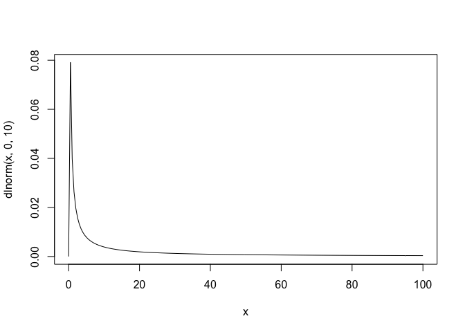
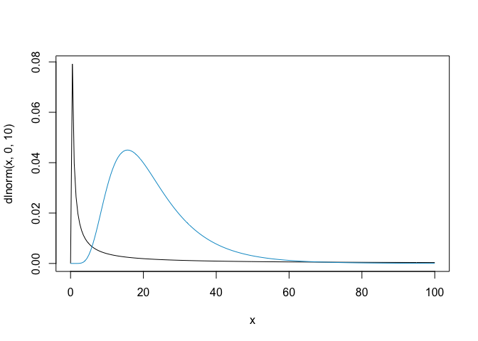
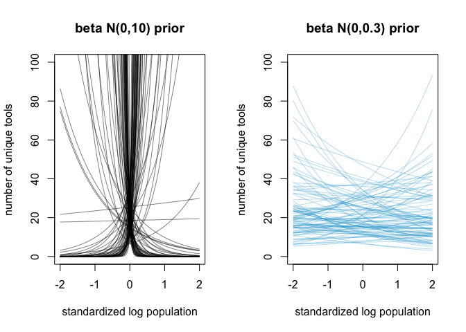
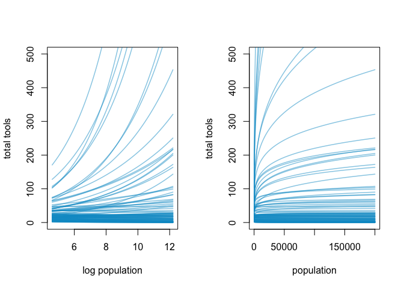
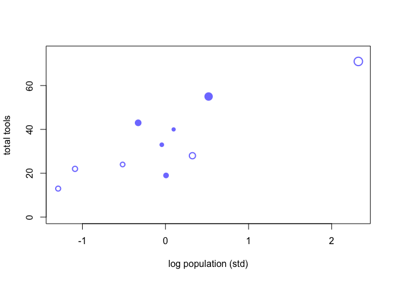
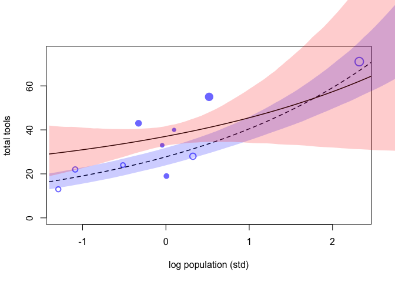
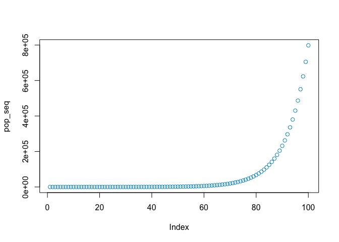
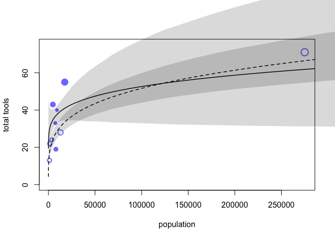

Ch 11 part II: Poisson and Gamma Poisson (NB) regression
================

``` r
r = 'deepskyblue3'
suppressMessages(library(rethinking))
```

### Poisson regression

a binomial event with very small probability and large number of trials
with an unknown upper bound. Expected value is Np. Variance is 1- Np
which is approximately Np when N large p small.

Simulating a binomial with very small p and large n is indeed very
similar to scrnaseq counts. Same as globe toss – we model

``` r
set.seed(10)
y = rbinom(n = 500, size = 100, prob = 1/1000)
y
```

    ##   [1] 0 0 0 0 0 0 0 0 0 0 0 0 0 0 0 0 0 0 0 0 0 0 0 0 0 0 0 0 0 0 0 0 0 0 0
    ##  [36] 0 0 1 0 0 0 0 0 0 0 0 0 0 0 0 0 1 0 0 0 0 0 0 0 0 0 0 0 0 0 0 0 0 0 0
    ##  [71] 0 0 0 0 0 0 0 1 0 0 0 0 0 0 0 0 0 0 0 0 0 0 0 0 0 0 0 0 0 0 0 0 0 0 1
    ## [106] 0 1 0 0 0 0 0 0 0 0 1 0 0 0 0 0 0 0 0 0 0 0 0 0 1 0 0 0 0 0 0 0 0 0 0
    ## [141] 0 0 0 1 0 0 0 0 0 0 0 0 0 0 0 0 0 0 1 0 0 0 0 0 0 0 0 1 0 0 0 0 0 0 1
    ## [176] 0 0 0 0 0 0 0 0 0 0 0 0 0 0 0 0 0 0 0 0 0 0 0 0 0 0 0 0 0 0 0 0 2 0 0
    ## [211] 0 0 0 0 0 0 0 0 0 0 0 0 0 0 0 0 0 0 0 0 0 0 0 0 0 0 0 0 0 0 0 0 0 0 0
    ## [246] 0 0 0 0 0 0 0 0 0 0 0 0 0 0 0 1 0 0 0 0 0 0 0 0 0 0 2 0 0 0 1 0 0 0 0
    ## [281] 0 2 0 1 0 1 1 0 0 0 0 1 0 1 0 0 1 0 0 0 0 0 0 0 0 0 0 0 0 0 0 0 0 0 0
    ## [316] 0 0 0 0 0 0 0 0 2 0 0 0 0 0 1 0 0 0 0 0 0 0 0 0 1 0 0 0 0 0 0 0 0 0 0
    ## [351] 0 1 0 0 0 0 0 0 0 0 0 0 0 0 0 0 0 0 0 1 1 0 0 0 0 0 0 0 0 0 0 0 0 0 0
    ## [386] 0 0 0 0 0 0 0 0 0 0 0 0 0 0 1 0 0 0 0 1 0 0 0 0 0 0 0 0 0 0 0 0 0 0 0
    ## [421] 0 0 0 0 0 1 0 2 0 0 0 0 0 0 0 0 0 0 0 0 0 2 0 0 0 0 0 1 0 0 0 1 0 0 1
    ## [456] 0 0 0 1 0 0 0 0 0 0 0 0 1 0 0 0 0 0 0 0 0 0 0 0 0 1 0 0 0 0 1 0 0 0 0
    ## [491] 0 0 0 0 0 0 0 0 0 0

Simulate many trials and compare mean and variance of the outcome. They
are very similar

``` r
mean(y); var(y)
```

    ## [1] 0.092

    ## [1] 0.1077515

The poisson only has one parameter, lambda, its shape, which is the
expected value of the outcome y. It’s low. It’s also the variance of y
as shown above.

With Poisson regression we use a log link function. the GLM takes the
form:

y\[i\] = Poisson(lambda\[i\])  
log(lambda\[i\]) = alpha + B(x\[i\])

the purpose of the log link is to prevent the linear model from
predicting a negative value for the number of events becaue that is not
possible. It also assumes the parameters value is the exponential of the
linear model:

exp(log(lambda)) = lambda  
lambda = exp(alpha + B(x\[i\]))

we need to be careful about the exponential relationship.

### Kline data - oceana tool complexity

The full dataset is below.

``` r
## R code 11.36
suppressMessages(library(rethinking))
data(Kline)
d <- Kline
d
```

    ##       culture population contact total_tools mean_TU
    ## 1    Malekula       1100     low          13     3.2
    ## 2     Tikopia       1500     low          22     4.7
    ## 3  Santa Cruz       3600     low          24     4.0
    ## 4         Yap       4791    high          43     5.0
    ## 5    Lau Fiji       7400    high          33     5.0
    ## 6   Trobriand       8000    high          19     4.0
    ## 7       Chuuk       9200    high          40     3.8
    ## 8       Manus      13000     low          28     6.6
    ## 9       Tonga      17500    high          55     5.4
    ## 10     Hawaii     275000     low          71     6.6

hypothesis: number of unique tools increase as a function of log
population size and contact rates and the impact of population on total
tools is moderated by high contact rates – an interaction effect.

T\[i\] ~ Poisson(lambda\[i\])  
log(lambda\[i\]) = a\[contactID\] + B\[contactID\]\*log(P\[i\])  
~then set priors for alpha\[j\] and beta\[j\]~

Standardize variables.

``` r
## R code 11.37
d$P <- scale( log(d$population) )
d$contact_id <- ifelse( d$contact=="high" , 2 , 1 )
```

For sake of comparison with a frequentist poisson glm:

``` r
d$contact = factor(d$contact, levels = c('low', 'high'))
m1 = glm(formula = total_tools ~ P + contact + P*contact, 
         family = poisson(link = "log"),
         data = d)
precis(m1)
```

    ##                    mean         sd        5.5%     94.5%
    ## (Intercept)   3.3158273 0.08962675  3.17258646 3.4590682
    ## P             0.4022722 0.05400819  0.31595668 0.4885877
    ## contacthigh   0.2864988 0.11757738  0.09858743 0.4744101
    ## P:contacthigh 0.1046385 0.26274186 -0.31527376 0.5245507

``` r
emmeans::emmeans(m1,specs = ~contact)
```

    ## NOTE: Results may be misleading due to involvement in interactions

    ##  contact emmean     SE  df asymp.LCL asymp.UCL
    ##  low       3.32 0.0896 Inf      3.14      3.49
    ##  high      3.60 0.0761 Inf      3.45      3.75
    ## 
    ## Results are given on the log (not the response) scale. 
    ## Confidence level used: 0.95

``` r
exp(m1$coefficients)
```

    ##   (Intercept)             P   contacthigh P:contacthigh 
    ##     27.545173      1.495218      1.331757      1.110309

Back to the bayesian model: setting priors for alpha and beta helps
understand how the model works. Transformation from the link function
means that scale of linear model and count cale of outcome == something
flat on linear model scale will not be flat on outcome scale.

An intercept only model:  
T\[i\] = Poisson(lambda\[i\])  
log(lambda\[i\]) = alpha  
alpha = N(0,10)

What does the flat prior on alpha imply?  
In other words, what does the prior look like on the outcome scale
lambda? Alpha is normally distributed so lambda is log normally
disributed

``` r
## R code 11.38
curve( dlnorm( x , 0 , 10 ) , from=0 , to=100 , n=200 )
```

<!-- -->

The mean is at 0 that is fine but what does the long tail imply about
possible values for the mean number of unique tools?

``` r
## R code 11.39
a <- rnorm(1e4,0,10)
# log(lambda) = a
lambda <- exp(a)
mean( lambda )
```

    ## [1] 7.158661e+12

too many tools.

### Intuition for the log link function

The log link puts all numbers from -inf to 0 between 0, 1 on the outcome
scale. If we use a 0-centered prior, with a log normal outcome we will
put half of the probability mass below 0, *half* of the prior mass on
the outcome scale lambda will be between 0 and 1. Below we compare this
to a prior on alpha of N(3, 0.5).

``` r
curve( dlnorm( x , 0 , 10 ) , from=0 , to=100 , n=200 )
curve( dlnorm( x , 3 , 0.5 ) , from=0 , to=100 , n=200,
       add = TRUE, col = r)
```

<!-- -->

The same thing applies to the prior on beta in the interaction model.  
Below we simulate 100 trends for unique tools ~ log population based on
the interaction model, using a flat prior on beta or using a weakly
informative regularizing pror that does not put half of the probability
mass between 0 and 1. This model in black predicts either explosive
growth of tools just before the population mean or catastrohpic decline
in number of tools just above the population mean. This is an insane
prior.

We can also look at a regularizing prior in blue.

``` r
## R code 11.41
N <- 100 # number of simulations 
a <- rnorm( N , 3 , 0.5 ) # alpha prior 
b <- rnorm( N , 0 , 10 ) # flat beta prior 
b2 <- rnorm( N , 0 , 0.2 ) # flat beta prior 

par(mfrow = c(1,2))
plot( NULL , xlim=c(-2,2) , ylim=c(0,100), 
      xlab = 'standardized log population', 
      ylab = 'number of unique tools', main = "beta N(0,10) prior" )
for ( i in 1:N ){ 
  curve( exp( a[i] + b[i]*x ) , add=TRUE , col=grau())
}

plot( NULL , xlim=c(-2,2) , ylim=c(0,100), 
      xlab = 'standardized log population', 
      ylab = 'number of unique tools', main = "beta N(0,0.3) prior" )
for ( i in 1:N ){ 
  curve( exp( a[i] + b2[i]*x ) , add=TRUE , col=col.alpha(r, 0.3))
}
```

<!-- -->

### understanding different scales of the predictor variable

Below we look at simulation on the standardized and unstandardized
population scale we also use a regularizing prior on beta. In the left
plot the unstandardized log population size is used. Then on the right
we exponentiate the predictor x (population) put it back on the raw
population scale.

model:  
log(lambda) = a + bx  
lambda = exp( a + bx )  
b as log population  
then b as exp(log(population)) puts population on the raw scale.

``` r
# use a regularizing prir on beta 
b <- rnorm( N , 0, 0.2)

# simulate x (population) values on the log scale 
x_seq <- seq( from=log(100) , to=log(200000) , length.out=100 )

# compute predicted values for lambda - n unique Tools predicted by model for each populaiton value 
lambda <- sapply( x_seq , function(x) exp( a + b*x ) )

# plot 
par(mfrow = c(1,2))
plot( NULL , xlim=range(x_seq) , ylim=c(0,500) , 
      xlab="log population" , ylab="total tools")
for ( i in 1:N ){
  lines( x_seq , lambda[i,] , col=col.alpha(r, 0.5) , lwd=1.5 )
}

## R code 11.44
# on the natural population scale 
plot( NULL , xlim=range(exp(x_seq)) , ylim=c(0,500) , xlab="population" ,
    ylab="total tools" )
for ( i in 1:N ) lines( exp(x_seq) , lambda[i,] , col=col.alpha(r, 0.5) , lwd=1.5 )
```

<!-- -->

The natural population scale curves bend in the other direction. This
happens when we put a log predictor variable inside a linear model.
Poisson models with a log link make **log linear** relationships with
the predictor variables, i.e. the relationships implied by te model as
shown on the left would be linear if we logged lambda as implied by
log(lambda) = a + Bx. When one of the predictor variables is itself
logged, that assumes diminishing returns for the raw variable as seen on
the right.

This diminishing returns phemoninon is a good reason to use log
transformed predictor variables.

### Fitting the models

Now we fit the models both a intercept only and a interaction model.
Remember – cid means contact id its a binary high low variable.

``` r
# Format data for stan
dat <- list( 
  T = d$total_tools ,
  P = d$P ,
  cid = d$contact_id 
  )

# intercept only model 
f11.9 = alist(
  T ~ dpois(lambda), 
  log(lambda) <- a, 
  a ~ dnorm(3, 0.5)
)

# interaction model
f11.10 = alist(
  T ~ dpois(lambda), 
  log(lambda) <- a[cid] + b[cid]*P, 
  a[cid] ~ dnorm( 3 , 0.5 ),
  b[cid] ~ dnorm( 0 , 0.2 )
)
```

Now fit the models with stan MCMC

``` r
m11.9 <- ulam(f11.9, data=dat , chains=4 , log_lik=TRUE )
```

    ## Trying to compile a simple C file

``` r
m11.10 <- ulam( f11.10, data=dat , chains=4 , log_lik=TRUE )
```

    ## Trying to compile a simple C file

``` r
## R code 11.46
compare( m11.9 , m11.10 , func=PSIS )
```

    ## Some Pareto k values are high (>0.5). Set pointwise=TRUE to inspect individual points.

    ## Some Pareto k values are very high (>1). Set pointwise=TRUE to inspect individual points.

The column `pPSIS` is the number of effective parameters – remember this
is a not so great name for the overfitting penalty. In simple linear
regression with flat priors th number of parameters we add to the model
increases over fitting. In other models, for example bounded models such
as this poisson model, there is not a clear relationship because
parameter values near the boundary produce less overfitting than those
near the boundary.

Quick comparison to the simple glm fit.

The parameters `contactlow` and `contacthigh` are analagous to the
intercept terms inexed over contact levels from the bayesian model
`a[cid]`. The beta for population is `P` which is `b[1]` in the bayesian
model and the interaction effect is `p:contact` which is `b[2]` in the
bayesian model. The bayesian model has a bit higher interaction effect
average but the overall estimate is highly uncertain.

``` r
m1 = glm(formula = total_tools ~ 0 + P + contact + P*contact,
         family = poisson(link = "log"),
         data = d)
precis(m1)
```

    ##                    mean         sd       5.5%     94.5%
    ## P             0.4022722 0.05400819  0.3159567 0.4885877
    ## contactlow    3.3158273 0.08962675  3.1725865 3.4590682
    ## contacthigh   3.6023261 0.07610181  3.4807007 3.7239515
    ## P:contacthigh 0.1046385 0.26274186 -0.3152738 0.5245507

``` r
precis(m11.10, depth = 2)
```

    ##           mean         sd        5.5%     94.5%    n_eff     Rhat4
    ## a[1] 3.3189615 0.09036483  3.17333074 3.4605894 1742.413 0.9990073
    ## a[2] 3.6097267 0.07367122  3.49091916 3.7312709 2151.040 0.9998439
    ## b[1] 0.3779884 0.05180452  0.29629178 0.4594334 2058.545 1.0007617
    ## b[2] 0.1940692 0.16144209 -0.07366433 0.4553161 2124.490 0.9988197

Plot the raw data with points labeled by contact rates open points for
low contact societies, size for pareto k values.

``` r
## R code 11.47
k <- PSIS( m11.10 , pointwise=TRUE )$k
```

    ## Some Pareto k values are very high (>1). Set pointwise=TRUE to inspect individual points.

``` r
plot(dat$P , dat$T,  
     xlab="log population (std)" , ylab="total tools" ,
     col=rangi2 , 
     pch=ifelse( dat$cid==1 , 1 , 16 ) , lwd=2 ,
     ylim=c(0,75) , cex=1+normalize(k) 
     )
```

<!-- -->

now superompise posterior predictions

``` r
plot(dat$P , dat$T,  
     xlab="log population (std)" , ylab="total tools" ,
     col=rangi2 , 
     pch=ifelse( dat$cid==1 , 1 , 16 ) , lwd=2 ,
     ylim=c(0,75) , cex=1+normalize(k) 
     )
# set up the horizontal axis values to compute predictions at
ns <- 100
P_seq <- seq(from = -1.4 ,to = 3, length.out = ns)

# predictions for cid=1 (low contact)
lambda <- link( m11.10 , data=data.frame( P=P_seq , cid=1 ) )
lmu <- apply( lambda , 2 , mean )
lci <- apply( lambda , 2 , PI )
lines( P_seq , lmu , lty=2 , lwd=1.5 )
shade( lci , P_seq , xpd=TRUE , col =col.alpha('blue', 0.2))

# predictions for cid=2 (high contact)
lambda <- link( m11.10 , data=data.frame( P=P_seq , cid=2 ) )
lmu <- apply( lambda , 2 , mean )
lci <- apply( lambda , 2 , PI )
lines( P_seq , lmu , lty=1 , lwd=1.5 )
shade( lci , P_seq , xpd=TRUE , col = col.alpha('red', 0.2))
```

<!-- -->

It is very helpful to see how highly leveraged the point (Hawaii) is on
Now the raw scale. Vlsualize this by computing predictions over a
differeent population sequence:

``` r
ns <- 100
P_seq <- seq( from=-5 , to=3 , length.out=ns )
# 1.53 is sd of log(population)
# 9 is mean of log(population)
pop_seq <- exp( P_seq*1.53 + 9 )
plot(pop_seq, col = r)
```

<!-- -->

``` r
## R code 11.48
plot( d$population , d$total_tools , xlab="population" , ylab="total tools" ,
    col=rangi2 , pch=ifelse( dat$cid==1 , 1 , 16 ) , lwd=2 ,
    ylim=c(0,75) , cex=1+normalize(k) )

ns <- 100
P_seq <- seq( from=-5 , to=3 , length.out=ns )
# 1.53 is sd of log(population)
# 9 is mean of log(population)
pop_seq <- exp( P_seq*1.53 + 9 )

lambda <- link( m11.10 , data=data.frame( P=P_seq , cid=1 ) )
lmu <- apply( lambda , 2 , mean )
lci <- apply( lambda , 2 , PI )
lines( pop_seq , lmu , lty=2 , lwd=1.5 )
shade( lci , pop_seq , xpd=TRUE )

lambda <- link( m11.10 , data=data.frame( P=P_seq , cid=2 ) )
lmu <- apply( lambda , 2 , mean )
lci <- apply( lambda , 2 , PI )
lines( pop_seq , lmu , lty=1 , lwd=1.5 )
shade( lci , pop_seq , xpd=TRUE )
```

<!-- -->

### Replacing a linear model with a dynamical model

innovation adds tools to a population  
proceses of loss remove them  
innovation is proportional to populaiton size with some diminishing
returns  
Change in number of tools in some time step  
∆T = tool production - tool loss  
∆T = alphaP^beta - gamma(T)  
As in stochastic simulations we solve for the equilibrium number of
tools by setting ∆T = 0  
T = alphaP^beta / gamma

Now we have a scientific function for T, we can **embed this in a glm**.
The noise around the outcome T is still Poisson distributed because it
is the maximum entropy distribution for finite counts with no clear
upper bound. (analagous to the ‘error model’).

T\[i\] = Poisson( lambda\[i\] )  
lambda\[i\] = alphaP^beta / gamma

There is no linear model or link function.

``` r
## R code 11.49
dat2 <- list( T=d$total_tools, P=d$population, cid=d$contact_id )
f11.11 = alist(
  # poisson noise around the outcome variable:
  T ~ dpois( lambda ),
  # the dynamical model for the rate parameter:
  lambda <- exp( a[cid] )*P^b[cid]/g,
  
  # priors need to be positive.
  a[cid] ~ dnorm(1,1),
  b[cid] ~ dexp(1),
  g ~ dexp(1)
  )
m11.11 <- ulam(f11.11, data=dat2 , chains=4 , log_lik=TRUE )
```

    ## Trying to compile a simple C file

``` r
precis(m11.11, depth = 2)
```

### Gamma Poisson (Negative Binomial)

NB is a mixture of Poissons similar to how the students-t is a mixture
of normals. help explain unexplained variation in the rate parameter.

See written notes on offset and exposure. *lambda is a rate* realizing
that helps intuition behind the offset because we can write lambda\[i\]
as µ\[i\] / tau\[i\]. This lets us write the linear models as:  
log(µi) = log(tau\[i\]) + a + bx – see written notes. What this
translate to is we can model cases with different **exposures**
(denominator in the rate) by incorporating log(tau) into the linear
model as a parameter for the exposure, i.e. log(number of UMIs)
representing the exposure for a single cell.

Based on the equations this is always log( exposure ).

Simulating manuscript copyign example with a true rate of 1.5
manuscripts copied per day.

``` r
## R code 11.50
num_days <- 30
y <- rpois( num_days , 1.5 )
```

Now we have a norther monestary that copies 0.5 per day but we only have
data on number per month.

``` r
## R code 11.51
num_weeks <- 4
y_new <- rpois( num_weeks , 0.5*7 )
```

Now we have days as an offset variable in the model

``` r
## R code 11.52
y_all <- c( y , y_new )
exposure <- c( rep(1,30) , rep(7,4) )
monastery <- c( rep(0,30) , rep(1,4) )
d <- data.frame( y=y_all , days=exposure , monastery=monastery )
d
```

    ##    y days monastery
    ## 1  2    1         0
    ## 2  3    1         0
    ## 3  2    1         0
    ## 4  0    1         0
    ## 5  2    1         0
    ## 6  1    1         0
    ## 7  2    1         0
    ## 8  2    1         0
    ## 9  0    1         0
    ## 10 0    1         0
    ## 11 1    1         0
    ## 12 0    1         0
    ## 13 1    1         0
    ## 14 3    1         0
    ## 15 1    1         0
    ## 16 1    1         0
    ## 17 2    1         0
    ## 18 3    1         0
    ## 19 2    1         0
    ## 20 1    1         0
    ## 21 2    1         0
    ## 22 1    1         0
    ## 23 2    1         0
    ## 24 3    1         0
    ## 25 0    1         0
    ## 26 1    1         0
    ## 27 1    1         0
    ## 28 1    1         0
    ## 29 0    1         0
    ## 30 2    1         0
    ## 31 1    7         1
    ## 32 3    7         1
    ## 33 2    7         1
    ## 34 5    7         1

Now we fit a glm to estimate the rate at each monestary adding the log
of the exposure.

``` r
## R code 11.53
# compute the offset
d$log_days <- log( d$days )

f11.12 = alist(
  y ~ dpois( lambda ), # estimand
  
  # log lambda = offset + intercept + slope
  log(lambda) <- log_days + a + b*monastery,
  
  # priors       
  a ~ dnorm( 0 , 1 ),
  b ~ dnorm( 0 , 1 )
) 

# fit the model
m11.12 <- quap(flist = f11.12, data=d)
precis(m11.12)
```

    ##         mean        sd      5.5%      94.5%
    ## a  0.3016066 0.1534205  0.056411  0.5468021
    ## b -1.1375105 0.3101755 -1.633231 -0.6417902

So the second monestary effect was 1 less per day which is what we
simulated (a true rate of 0.5 per day vs 1.5 per day).

When we do predictions we don’t incorporate the offset becuse the model
posteriors are already in terms of days.

``` r
## R code 11.54
post <- extract.samples( m11.12 )
lambda_old <- exp( post$a )
lambda_new <- exp( post$a + post$b )
precis( data.frame( lambda_old , lambda_new ) )
```

    ##                 mean        sd      5.5%    94.5%    histogram
    ## lambda_old 1.3676738 0.2104188 1.0563418 1.727123   ▁▁▃▇▅▂▁▁▁▁
    ## lambda_new 0.4509491 0.1266350 0.2789216 0.675201 ▁▂▇▇▃▂▁▁▁▁▁▁
