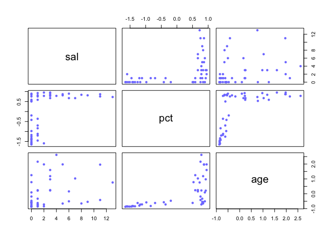

Ch 11 p set
================

``` r
suppressMessages(library(rethinking))
suppressMessages(library(magrittr))
```

11E1 - log odds of pr = 0.35

``` r
log(0.35  / (1- 0.35))
```

    ## [1] -0.6190392

11E2 - log odds of event = 3.2 what is p

``` r
inv_logit(3.2)
```

    ## [1] 0.9608343

to get a feel for log odds vs p:  
at 50% p, log odds is 0 at 0.1 its around -2 and at 0.9 its around 2.

``` r
pvec = seq(0, 1, by = 0.1)
plot(pvec, log(pvec / (1-pvec)))
```

<!-- -->

11E3 logistic regression beta = 1.7 what does it say about proportional
change in odds of the event?

logistic regression coefs are in units of log odds, so 1.7 is log odds.
The odds is the exponentiated coefficient (transforms to the outcome
scale)

``` r
exp(1.7)
```

    ## [1] 5.473947

11E4  
Poisson regression requires an offset because the totla counts per class
(exposure) can be different, i.e. sampling one hospital for events for a
year and another for 2 years. Or in scRNAseq the rate parameter for a
gene tells you something but to conrast, the total genes per cell (log
UMI) needs to be accounted for.

11M1  
the likelihood is the probability of the data given the model so in the
case of aggregated binomial globe toss, 3 water one land, that is 3 W in
4 trials, by embedding this into the binomial probability distribution
we are aggregating the the data, the multiplicity term wiht n choose k
\* 1-k is multiplying the number of ways to observe, ie. W L W W | W W W
L | W W L W etc. we then plug in the probability. For individual counts,
we calculate p \* (1- p) for each separately. Basically p is independent
of the likeihood function.

11M2

Poisson regression coefficient 1.7:

y\[i\] = Poisson(lambda\[i\])  
log(lambda\[i\]) = a + Bx\[i\]

the a + bX term is equal to log(lambda)

``` r
exp(1.7)
```

    ## [1] 5.473947

Fr every 1 unit change in the predictor there is a 5.47 unit change in
the outcome variable. *note, in looking up the correct answer to this,
there was a slightly more nuanced answerusing ratio of means exp( a + Bx
+ 1) / exp(a + Bx); the top part of the fraction is the 1 unit of change
in predictor, solving you get exp(B), as i calculated above. but
important to note that the interpretation of this is the proportional
change in the expected count very similar to proportional change in log
odds from logistic regression*

11M3 explain why logit link appropriate for binomial GLM.

Because binomial is mapping the linar model output which is 0 , inf onto
2 possible outcomes, yes, no, heads, tails, 1, 0 etc. The odds makes
sense to use because we can write probability functions in terms of one
outcome like heads then the odds (logit) captures p ( 1-p ).

11M4 explain why log link appropriate for Poisson.

The log link constrains predictions from the linear model onto a space
that will not predict negative counts. When we get a prediction from the
linear model:

log(lambda) = a + Bx

then lambda = exp(a + Bx)  
exp is raising e to the power of the linear model, so say a+ Bx
evaluated to -5, the log link will make lambda at i =

``` r
exp(-5)
```

    ## [1] 0.006737947

meaning basically

``` r
2.71^-5
```

    ## [1] 0.006841535

*It is conventional to use a logit link for a binomial GLM because we
need to map the continuous linear model value to a probability parameter
that is bounded between zero and one.*

*It is conventional to use a log link for a Poisson GLM because we need
to map the continuous linear model value to a mean that must be
positive.*

11M5 could it make sense to use a logit link with a poisson GLM?  
using a logit link makes the outcome bounded between 0 and 1.  
basically if you want to put a upper bound on the estimates. see manual
ed 1 p73. One could potentially do this – a cell does have an upper
bound as to what the total counts could be, so we would expect the
counts of individual genes to be some fraction of that total; we’d have
to define this for eahc cell type and its more a function of the
technology used.

M116 State constraints under which poisson and binomial have maximum
entropy

The binomial distribution has maximum entropy for a binary outcome with
a constant expected rate, for example a globe toss with expected
probability of water 0.7 what is the likelihood of observing 5 waters in
a row – the likeliood function with the least assumptions is the one
that can happen the most ways which is the binomial.

A Poisson distribution has maximum entropy under the constraint that
there is a constant expected rate, as the binomial with low probability
of observing a “success” (count) in each trial. its a generalization of
the binomial.

11M8 Kline data without hawaii- fit an interaction model

likelihood for interaction model with a category and continuous var:  
y = a\[group\] + B\[group\] \* predictor

embed that in the glm using the link function on outcome  
log( y ) = …

``` r
data("Kline")
d = Kline
d = d[!d$culture == 'Hawaii', ]
d$pop = log(d$population)


# fit mcmc binomial model 
f1.1 = alist(
  # estimand
  total_tools ~ dpois(lambda), 
  # likelihood
  log(lambda) <- a[cid] + B[cid]*pop, 
  # priors 
  a[cid] ~ dnorm(3, 0.3), 
  B[cid] ~ dnorm(0, 0.1)
)

# specify data for stan
dat = list(
  total_tools = d$total_tools, 
  pop = d$pop, 
  cid = d$contact
)

# fit model 
m1.1 = ulam(flist = f1.1, data = dat,cores = 4)
```

    ## Trying to compile a simple C file

``` r
# coefficients
precis(m1.1, depth = 2)
```

Important – the model converts the ‘high’, ‘low’ factor to indicators
for contact ID; this screwed up the ability to use ‘high low’ in the
step idx = which(<m1.1@data$cid> ==ct). So probably best to use the data
that is stored in the stan model fit when using link.

``` r
suppressMessages(library(tidyverse))

# extract posterior 
post = extract.samples(m1.1)
m1.1@data
```

    ## $total_tools
    ## [1] 13 22 24 43 33 19 40 28 55
    ## 
    ## $pop
    ## [1] 7.003065 7.313220 8.188689 8.474494 8.909235 8.987197 9.126959 9.472705
    ## [9] 9.769956
    ## 
    ## $cid
    ## [1] 2 2 2 1 1 1 1 2 1

``` r
pop.seq = seq(min(d$pop), max(d$pop), length.out = 45)
pop.lim = c(min(d$pop), max(d$pop))
tool.seq = c(min(d$total_tools), max(d$total_tools))
## 

par(mfrow=c(1,2))
for (ct in c(1,2)) {
  
  idx = which(m1.1@data$cid ==ct)
  
  # compute the posterior for the levels of contact ID 
  mu = link(m1.1, data = data.frame(cid = ct, pop = pop.seq))
  plot( d$pop[idx], d$total_tools[idx], xlim = pop.lim, ylim = tool.seq)
  for (i in 1:20) {
    lines(x = pop.seq, y = mu[i, ], col = col.alpha('grey', 0.4))
  }
}
```

<!-- -->

another way to visualize the interaction

``` r
pop.seq = c(min(d$pop), max(d$pop))
tool.seq = c(min(d$total_tools), max(d$total_tools))

mu1 = link(m1.1,data = data.frame(cid = 1 , pop = pop.seq))
mu1.mean = apply(mu1, 2, mean)
mu1.pi = apply(mu1, 2, PI)

mu2 = link(m1.1,data = data.frame(cid = 2 , pop = pop.seq))
mu2.mean = apply(mu2, 2, mean)
mu2.pi = apply(mu2, 2, PI)

plot(dat$pop, dat$total_tools, col = rangi2, pch = 16)
lines(pop.seq, mu1.mean, col = 'grey')
shade(mu1.pi, lim = pop.lim)
lines(pop.seq, mu2.mean, col = 'black')
shade(mu2.pi, lim = pop.lim)
```

<!-- -->

compare to frequentist glm fit

``` r
# fit frequentist binomial glm with log link
f1 = total_tools ~  pop + contact + pop:contact
m1 = glm(formula = f1, family = poisson(link = 'log'),data = d)
precis(m1)
```

    ##                      mean        sd        5.5%     94.5%
    ## (Intercept)     0.6250813 1.5349121 -1.82800474 3.0781673
    ## pop             0.3316524 0.1682311  0.06278659 0.6005181
    ## contactlow      0.6938106 1.7735513 -2.14066699 3.5282881
    ## pop:contactlow -0.1142124 0.1996576 -0.43330374 0.2048790

``` r
par(mfrow = c(1,2))

plot(
  exp(predict(m1, newdata = data.frame(pop =  dat$pop, contact = 'high'))), 
  pch = 16, col = rangi2)

plot(
  exp(mean(post$a[,1]) + mean(post$B[ ,1])*dat$pop), 
  pch = 16, col = rangi2
  )
```

<!-- -->

11H3

was struggling to get ulam to fit this prob bc of bad priors.

``` r
suppressMessages(library(rethinking))
suppressMessages(library(tidyverse))

data(salamanders)
d = salamanders

d$s = d$SALAMAN
d$p = (d$PCTCOVER - mean(d$PCTCOVER) ) / sd(d$PCTCOVER)
d$a = (d$FORESTAGE - mean(d$FORESTAGE)) / sd(d$FORESTAGE)

dlist = list( 
  sal = d$s, 
  pct = d$p,
  age = d$a
  )

pairs(dlist, col = rangi2, pch = 16)
```

<!-- -->

it looks like old growth forests have increased ground cover based on
pct ~ age. Once the forest hits a certain percentage the salmon
population can take off (it becomes more like gaussian dist).

There is a direct causal effect maybe of forest age on salamander, but
also an effect mediated through percent coverage.

``` r
f1 <- alist(
  sal ~ dpois(lambda), 
  log(lambda) <- a + b*pct,
  b ~ dnorm(0, 1),
  a ~ dnorm(0, sd = 1)
)

m1 <- ulam(flist = f1, data = dlist, chains = 4, cores = 4)
```

    ## Trying to compile a simple C file

``` r
trankplot(m1)
```

<!-- -->

``` r
precis(m1)
```

    ##        mean        sd      5.5%     94.5%    n_eff    Rhat4
    ## b 1.1621025 0.1832245 0.8773138 1.4614119 451.7618 1.006363
    ## a 0.4139804 0.1507255 0.1759496 0.6503762 479.1354 1.006637

``` r
# extract parameters 
post <- extract.samples(m1, n = 50)
head(post)
```

    ## $b
    ##  [1] 1.3899719 0.9848315 1.1105280 1.2500895 1.3157950 1.2666473 1.1746639
    ##  [8] 1.1113239 1.2481761 0.9298945 0.9246618 1.2725582 1.1446831 1.1844731
    ## [15] 0.8580935 1.2850709 1.2486840 1.1528623 1.0209209 1.3453694 1.0045400
    ## [22] 1.1516852 1.3073858 1.0949009 0.8371926 1.1611149 1.4395357 1.0195830
    ## [29] 1.0094839 1.0531873 1.1842098 1.4091014 1.0579197 0.9267113 1.3599678
    ## [36] 1.1028129 1.2950466 0.9285571 1.2339387 1.1971323 0.9476554 1.2155894
    ## [43] 1.3678317 0.8696366 0.8572579 1.4778445 0.8953100 0.9731468 1.1270411
    ## [50] 1.2225455
    ## 
    ## $a
    ##  [1] 0.2019868 0.4603918 0.3712874 0.1907964 0.3152179 0.2726432 0.3892916
    ##  [8] 0.6123657 0.3957678 0.4574073 0.4476871 0.4423211 0.5201230 0.4120975
    ## [15] 0.7238909 0.2165338 0.4186749 0.3452994 0.5985974 0.3026558 0.6468276
    ## [22] 0.3493443 0.1493897 0.4667353 0.5659756 0.5652136 0.2187654 0.4149490
    ## [29] 0.4683906 0.4752281 0.3852098 0.2029520 0.4655038 0.4834354 0.3305080
    ## [36] 0.4839490 0.4268560 0.5423129 0.3004032 0.4930805 0.5808886 0.4402996
    ## [43] 0.2914644 0.6434553 0.6264694 0.2075440 0.6426067 0.5797128 0.4063202
    ## [50] 0.4269316

``` r
xseq = seq(-2,2, length.out = 30)
# summarize estimand based on new predictor values
mu = link(m1, n = 100, data = data.frame(pct = xseq))
mu.mean = apply(mu, 2, mean)
mu.PI = apply(mu, 2, PI)

# simulate uncertainty in estimates based on full model 
dsim = sim(fit = m1, data = data.frame(pct = xseq))
sim.pi = apply(dsim, 2, PI)

# plot summary
plot(sal ~ pct, dlist, col = rangi2, pch = 16)
lines(x = xseq,y = mu.mean, lwd = 3) # mean
shade(object = mu.PI, lim = xseq) # mean uncertainty
shade(object = sim.pi,lim = xseq)
```

<!-- -->

Given the pairs plot the model `log(lambda) <- a + b*pct + b2*age` woudl
prob predict better but would be harder to understand the estimates.
Same prediction vs interpretability trade off but here we can see this
is because the 2 predictors are highly **collinear**. There is a
fundamental different scientific process for undertanding the links
between variables and doing predictive modeling.
