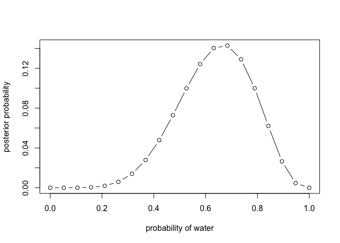
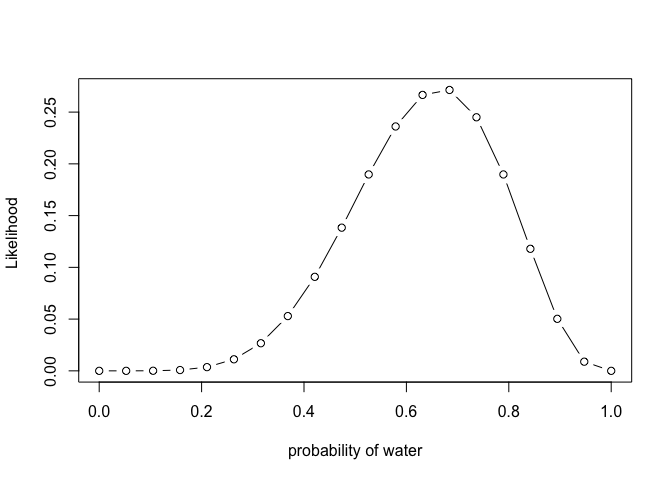
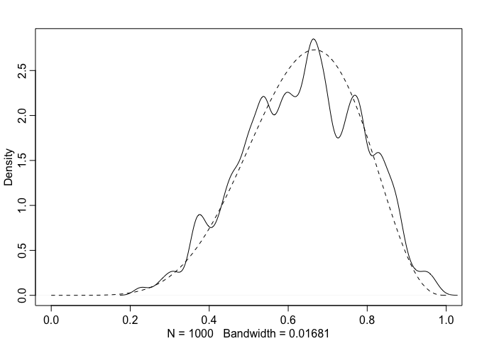
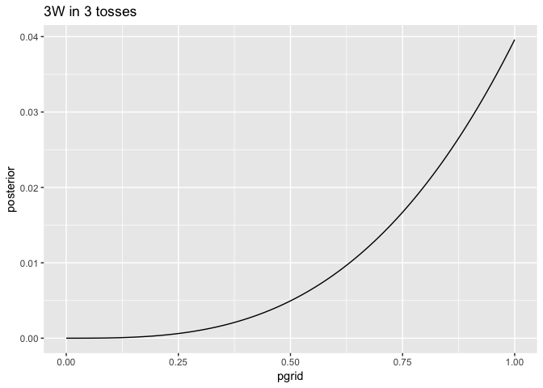
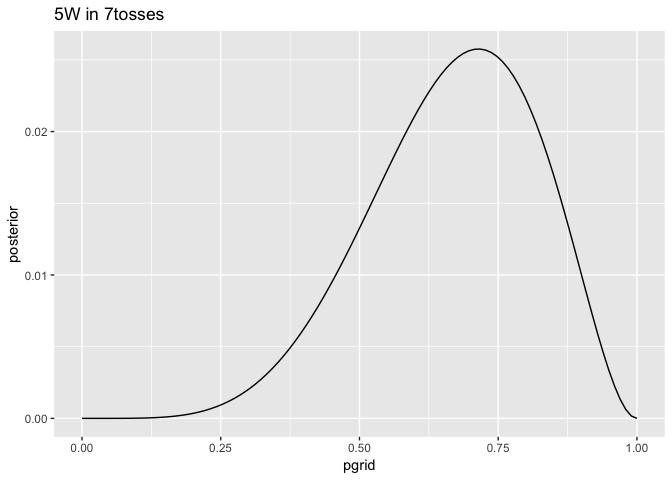
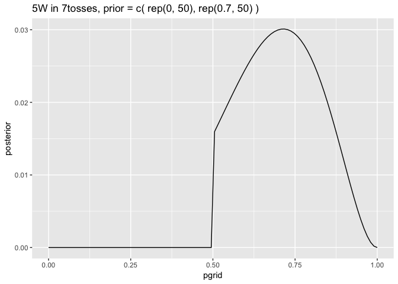

Chapter 2
================

<!--   output: -->

<!--   html_document: -->

<!--     df_print: paged -->

<!-- editor_options: -->

<!--   chunk_output_type: inline -->

``` r
suppressMessages(library(tidyverse))
suppressMessages(library(rethinking))
```

A likelihood is a distribution function assigned to an observed
variable. A non-Bayesian likelihood is a function of the parameters
conditional only on the observed data l(param|data) . In bayesian stats
it is reasonable to write p(data | param).

Binomial distibution of 6 globe tosses the d in dbinom means density.
the partner functions include dbinom, rbinom - r for random distribution
of a given size, and pbinom for cumulative probability.

``` r
dbinom(x = 5, size = 10, prob = 0.7)
```

    ## [1] 0.1029193

``` r
dbinom(x = 9, size = 10, prob = 0.3)
```

    ## [1] 0.000137781

``` r
#  a random binomial sample 
rbinom(n = 50,size = 10, 0.7)
```

    ##  [1]  9  9  8  8  7  8  6  6  7  7  9  9  8  9  6  6  7  5  8  8  8  5  6
    ## [24] 10  7  8  7  8  5  5  5  5  7  6  9  7  7  6  6 10  6  4  7  7  8  8
    ## [47]  7  5  9  6

The binomial distribution is the maximum entropy (Ch 10) way to count
binary events.

The distributions assigned to observed variables here are the parameters
- in the case of the binomial the parameter p was the probability of
sampling a head on a coin toss. Generalize to things like variation
among group average treatment effect from a contrast etc.

For every parameter in the bayesian “golem” I am constructing, I must
provide a distribution of prior plausibility - an initial plausibility
assigmnent for each posible value of the parameter.

Bayes theorm summarized is  
**Posterior = probability of data x prior / average probability of
data**

For the water/land example where W and L represent landing on water r
land from the globe toss:

Pr(p|W,L) = Pr(W,L | p ) \* Pr(p) / Pr(W,L)

the denominator is the confusing part. It is the probabiliity of data
averaged over the prior. The format for the denominator is an
expectation **E()** means take the **expectation** - this average is
commonly called a **marginal likelihood** the whole point of this is to
standardize the posterior so that it sums to 1. In mathematical stats
format:  
E(Pr(W,L|p) -\> this means computing the average over a continuous
distribution of values by calculating the integral: ∫PR(W,L|p)Pr(p)dp  
So the overall equation would be  
Pr(p|W,L) = Pr(W,L | p ) \* Pr(p) / ∫PR(W,L|p)Pr(p)dp

This is all unimportant formal stuff the key is posterior is
proportional to the prior \* p(data) because for each specific value of
p, the number of paths through the garden of forking data is the prior
number of paths times the new number of paths. Average on the bottom
turns it into a probability.

Bayesian analysis is not about Baayes theorm it is about quantifying
uncertainty about parameters and models.

### Conditioning engines

The action/ verb of the motor of the bayesian machine can be thought of
as “conditioning”. Conditioning engines are used for approximating the
conditioning that would be done with integral calculus which is not
posible for most models. **Conditioning engines**  
1\) Grid approximation  
2\) Quadratic Approximation  
3\) Markov Chain Monte Carlo (MCMC)

Grid approximation is kind of like fundamental theorm of calculus in
that we can approximate continuous parameters by considering a finite
grid of parameter values. This does not scale to many parameter models.

### Grid approximation

``` r
# define grid 
p_grid <- seq( from=0 , to=1 , length.out=20 )

# define prior 
prior <- rep( 1 , 20 )

# compute likelihood (6 waters, 9 tosses calculated at each p above in grid)
likelihood <- dbinom(x = 6, size = 9, prob = p_grid)

# compute product of likelihood and prior 
unstd.posterior <- likelihood * prior

# standardize the posterior, so it sums to 1 
posterior <- unstd.posterior / sum(unstd.posterior)

plot( x = p_grid , y = posterior , type="b" , xlab="probability of water" , ylab="posterior probability" )
```

<!-- -->

``` r
plot( x = p_grid , y = likelihood , type="b" , xlab="probability of water" , ylab="Likelihood " )
```

<!-- -->

### Quadratic approximation

Approximate the posterior distribution with a Gaussian distribution
which can conveniently be described by computing only the mean and
variance. The name Quadratic comes from parabolic, the shape of the
logarithm of a gaussian distribution…

This just uses a optomization algorithm to find the peak of
posterior(the mode) and then estimate the curvature near the peak -
algos do this by knowing the slope at each point. use the **quap**
function.

``` r
globe.qa <- quap(
  alist( 
    # binomial likelihood 
    W ~ dbinom(W+L, p), 
    
    # uniform prior
    p ~ dunif(0,1)
    ),
  # specify input data 
  data=list(W=6,L=3) 
)

# display summary of quadratic approximation
precis( globe.qa )
```

    ##        mean        sd      5.5%     94.5%
    ## p 0.6666598 0.1571354 0.4155271 0.9177925

Assuming a Gaussian posterior, it is maximized at 0.67 with a SD of
0.16.

With more data this gets much better. It can do things like assign
positive probability to p = 1 which we know is false because we observed
both W and L.

Note this is often equivalent to MLE with a uniform prior / lots of data
- see Huber chapter on MLE.

An aside about **Hessians** which appear in error messages: *A Hessian
is a square matrix of second derivatives. In the quadratic approximation
it is second derivatives of the log of posterior probability with
respect to the parameters. It turns out that these derivatives are
sufficient to describe a Gaussian distribution, because the logarithm of
a Gaussian distribution is just a parabola. **Parabolas have no
derivatives beyond the second**, so once we know the center of the
parabola (the posterior mode) and its second derivative, we know
everything about it. And indeed the second derivative (with respect to
the outcome) of the logarithm of a Gaussian distribution is proportional
to its inverse squared standard deviation (its “precision”: page 79). So
knowing the standard deviation tells us everything about its shape. The
standard deviation is typically computed from the Hessian, so computing
the Hessian is nearly always a necessary step. But sometimes the
computation goes wrong, and your golem will choke while trying to
compute the Hessian. In those cases, you have several options. Not all
hope is lost. But for now it’s enough to recognize the term and
associate it with an attempt to find the standard deviation for a
quadratic approximation.*

### Markov Chain Monte Carlo

Instead of computing or infering the posterior distribution directly,
draw samples from the posterior (in proportion to their relative
frequency).

multilevel models do not always allow us to write down a single unified
function forr the posterior distribution. The function to maximize when
computing the maximum a posterori estimation is not known and must be
computed in peices.

``` r
n_samples = 1000 
p = rep( NA , n_samples ) 
p[1] = 0.5
W = 6 
L = 3 

for ( i in 2:n_samples ) {
  p_new <- rnorm( n = 1 ,mean =  p[i-1] , sd = 0.1 )
  if ( p_new < 0 ) p_new <- abs( p_new )
  if ( p_new > 1 ) p_new <- 2 - p_new
  q0 <- dbinom(x =  W , size =  W+L , prob =  p[i-1] )
  q1 <- dbinom( x = W , size = W+L ,prob =  p_new )
  p[i] <- ifelse( runif(1) < q1/q0 , p_new , p[i-1] )
}
```

*The values in p are samples from the posterior distribution. To compare
to the analytical posterior:*

``` r
dens( p , xlim=c(0,1) )
curve( dbeta( x , W+1 , L+1 ) , lty=2 , add=TRUE )
```

<!-- -->

*It’s weird. But it works. I’ll explain this algorithm, the Metropolis
algorithm, in Chapter 9.*

## Summary

The target of Bayesian inference is a posterior probability distribution
= the relative number of ways each conjectured cause of the data could
have produced the data. These relative numbers of ways represent
plausabilities of the conjectures. The plausibilities are updated in
light of new observations by bayesian updating which is multiplying the
prior \* likelihood.

A Bayesian model is a composite of variables and distributional
definitions of the variables. The prior provides plausibility of each
plausible value for the parameters before accounting for the data. The
plausibliities after accounting for the data are computed by Bayes
theorm, resulting in a posterior distribution. These are fit with the 3
options above.

## Qs

2E1.  
2 + 4

2E2.

3

2E3.

1, 4

4 is the product rule P(A and B) = P(A | B) \* P(B)

2E4.

2M1. Recall the globe tossing model from the chapter. Compute and plot
the grid approximate posterior distribution for each of the following
sets of observations. In each case, assume a uniform prior for p.

1)  W, W, W

<!-- end list -->

``` r
# define a grid of parameter values 
# define prior (in this case uniform)
# compute value for the prior for each parameter value on the grid 
# compute the Likelihood at each parameter value
# condition (compute posterior)  
# standardize posterior 

# the grid is a grid of potential parameter values for proportion of water  
pgrid = seq( from=0 , to=1 , length.out= 100)

# define prior 
prior = rep( 1 , 100 )

# compute likelihood
likelihood = 
  dbinom(
    # number of heads 
    x = 3,
    # number of tosses 
    size = 3, 
    # probability of heads = the model parameter = the vector defined by the grid 
    prob = pgrid)

# compute product of likelihood and prior 
posterior = likelihood * prior 

# standardize the posterior
posterior <- unstd.posterior / sum(unstd.posterior)

posterior = likelihood * prior / sum(likelihood*prior)

df = data.frame(pgrid = pgrid, posterior = posterior)
ggplot(data = df, aes(x = pgrid, y = posterior)) + 
  geom_line() +
  ggtitle("3W in 3 tosses")
```

<!-- -->

``` r
pgrid = seq( from=0 , to=1 , length.out= 100)
prior = rep( 1 , 100 )
likelihood = 
  dbinom(
    # number of heads 
    x = 5,
    # number of tosses 
    size = 7, 
    # probability of heads = the model parameter = the vector defined by the grid 
    prob = pgrid)

posterior = likelihood * prior / sum(likelihood * prior)

df = data.frame(pgrid = pgrid, posterior = posterior)
ggplot(data = df, aes(x = pgrid, y = posterior)) + 
  geom_line() +
  ggtitle("5W in 7tosses")
```

<!-- -->

2M2. assume a prior for p that = zero when p \< 0.5 and = positive
constant when p ≥ 0.5.

``` r
prior = c(
  rep(0, 50), 
  rep(0.7, 50)
) 
pgrid = seq( from=0 , to=1, length.out = 100 ) 
likelihood = 
  dbinom(
    # number of heads 
    x = 5,
    # number of tosses 
    size = 7, 
    # probability of heads = the model parameter = the vector defined by the grid 
    prob = pgrid)

posterior = likelihood * prior / sum(likelihood * prior)

df = data.frame(pgrid = pgrid, posterior = posterior)
ggplot(data = df, aes(x = pgrid, y = posterior)) + 
  geom_line() +
  ggtitle("5W in 7tosses, prior = c( rep(0, 50), rep(0.7, 50) ) ")
```

<!-- -->

2M3. Suppose there are two globes, one for Earth and one for Mars. The
Earth globe is 70% covered in water. The Mars globe is 100% land.
Further suppose that one of these globes—you don’t know which—was tossed
in the air and produced a “land” observation. Assume that each globe was
equally likely to be tossed. Show that the posterior probability that
the globe was the Earth, conditional on seeing “land” (Pr(Earth |
land)), is 0.23.

``` r
# params 
lerth = 0.3 
lmrs = 1
# 
ptoss = 0.5 

# data 
"L"
```

    ## [1] "L"

``` r
# (Pr(Earth | land)) =  (Pr( land | earth )) * p(earth) / pland

( 0.3 * 0.5 ) 
```

    ## [1] 0.15

2M4. Suppose you have a deck with only three cards. Each card has two
sides, and each side is either black or white. One card has two black
sides. The second card has one black and one white side. The third card
has two white sides. Now suppose all three cards are placed in a bag and
shuffled. Someone reaches into the bag and pulls out a card and places
it flat on a table. A black side is shown facing up, but you don’t know
the color of the side facing down. Show that the probability that the
other side is also black is 2/3. Use the counting method (Section 2 of
the chapter) to approach this problem. This means counting up the ways
that each card could produce the observed data (a black side facing up
on the table).

2M5. Now suppose there are four cards: B/B, B/W, W/W, and another B/B.
Again suppose a card is drawn from the bag and a black side appears face
up. Again calculate the probability that the other side is black.

2M6. Imagine that black ink is heavy, and so cards with black sides are
heavier than cards with white sides. As a result, it’s less likely that
a card with black sides is pulled from the bag. So again assume there
are three cards: B/B, B/W, and W/W. After experimenting a number of
times, you conclude that for every way to pull the B/B card from the
bag, there are 2 ways to pull the B/W card and 3 ways to pull the W/W
card. Again suppose that a card is pulled and a black side appears face
up. Show that the probability the other side is black is now 0.5. Use
the counting method, as before.

2M7. Assume again the original card problem, with a single card showing
a black side face up. Before looking at the other side, we draw another
card from the bag and lay it face up on the table. The face that is
shown on the new card is white. Show that the probability that the first
card, the one showing a black side, has black on its other side is now
0.75. Use the counting method, if you can. Hint: Treat this like the
sequence of globe tosses, counting all the ways to see each observation,
for each possible first card.

Hard. 48

2.  SMALL WORLDS AND LARGE WORLDS

2H1. Suppose there are two species of panda bear. Both are equally
common in the wild and live in the same places. They look exactly alike
and eat the same food, and there is yet no genetic assay capable of
telling them apart. They differ however in their family sizes. Species A
gives birth to twins 10% of the time, otherwise birthing a single
infant. Species B births twins 20% of the time, otherwise birthing
singleton infants. Assume these numbers are known with certainty, from
many years of field research.

Now suppose you are managing a captive panda breeding program. You have
a new female panda of unknown species, and she has just given birth to
twins. What is the probability that her next birth will also be twins?

2H2. Recall all the facts from the problem above. Now compute the
probability that the panda we have is from species A, assuming we have
observed only the first birth and that it was twins.

2H3. Continuing on from the previous problem, suppose the same panda
mother has a second birth and that it is not twins, but a singleton
infant. Compute the posterior probability that this panda is species A.

2H4. A common boast of Bayesian statisticians is that Bayesian inference
makes it easy to use all of the data, even if the data are of different
types.

So suppose now that a veterinarian comes along who has a new genetic
test that she claims can identify the species of our mother panda. But
the test, like all tests, is imperfect. This is the information you have
about the test:

• The probability it correctly identifies a species A panda is 0.8.

• The probability it correctly identifies a species B panda is 0.65. The
vet administers the test to your panda and tells you that the test is
positive for species A. First ignore your previous information from the
births and compute the posterior probability that your panda is species
A. Then redo your calculation, now using the birth data as well.
