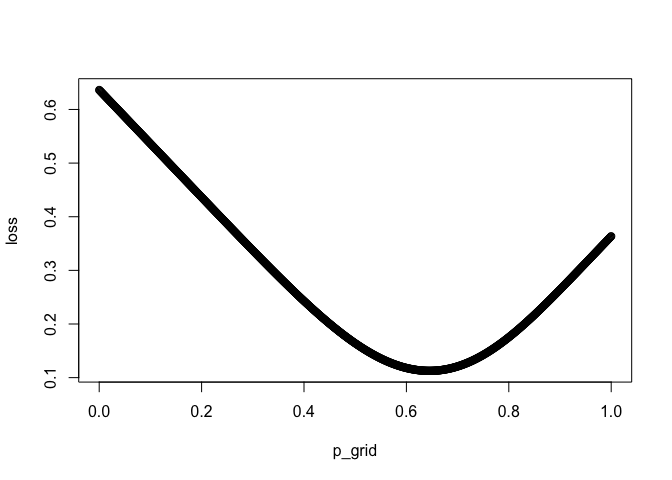

Chapter 3 sampling the imaginary
================

<!--   output: -->

<!--   html_document: -->

<!--     df_print: paged -->

<!-- editor_options: -->

<!--   chunk_output_type: inline -->

``` r
suppressMessages(library(tidyverse))
suppressMessages(library(rethinking))
```

This chapter sets up use of sampling from a posterior distribution which
is basis of markov chain monte carlo, this converts calculus problems
(the probability in some interval) into data summary problems bc we now
have counts.

Beginning of the chapter discusses the rationale behind SPin SNout for
diagnostic testing. Intuition summary: whenever the disease is rare have
to be careful; a positive result does not have that much information.
Consider population 1e5 with disease rate 100 / 1e5 and sn = 95% sp 99%:
95 will test positive. But *if you test everyone* 99,900 no disease \*
0.01 = 999 test positive without disease.

Natural frequency format can be more intuitive than bayes; exploiting
this we can take posterior probability distributions and sample from
them to produce counts - counts of parameter values. Posterior defines
the expected frequency parameter values will appear

(rethinking) This is a reframing of the famous Iannodias paper but in
the footnotes, he points out how it relies on “falsification of a
hypothesis paradigm” which earlier he refered to as “folk popperism”.
But still interesting to think about: the testing format can be used to
reframe scientific discovery as signal detection problems. p(signal |
result true ) is the power of a test. p(signal | result wrong) is the
false positive rate. To use bayes theorm we need the probability of a
true positive result - this is the base rate - it is unknown but if we
assume it is small like 1% P(true | signal ) is only 16% if power is 95%
and false positive rate is 5%. We don’t need more testing we need to
improve the base rate (“and that requires
thinking”).

### globe toss posterior probability of p conditioned on data; data = 6 waters on 9 globe tosses.

``` r
# define grid 
p_grid = seq( from=0 , to=1 , length.out=1000 )

# define (uniform) prior
prob_p = rep( 1 , 1000 ) 

# define probability of data for each theoretical value of p 
prob_data <- dbinom(x = 6, size = 9, prob = p_grid)

# calculate the likelihood by multiplying by the prior 
posterior <- prob_data * prob_p

# standardize the likelihood 
posterior <- posterior / sum(posterior)

plot(p_grid, posterior)
```

<!-- -->

``` r
sum(posterior)
```

    ## [1] 1

Imagine this as a “bucket of parameter values” - if we sample with
replacement they will apear in exact proportion to their frequency. The
function sample pulls values from a vector. We pull values from the
vector in porportion to their posterior probability calculated above.

``` r
samples = sample(x = p_grid, 
                 # define the proportion of each from the posterior calculation above 
                 prob = posterior,
                 # define the number of samples with replacement 
                 size=1e5, replace=TRUE)

df  = data.frame(p_grid = p_grid, posterior = posterior, samples = samples, n = 1:length(samples)) 
p1 = ggplot(df , aes(x = n, y = samples)) + 
  geom_bin2d(bins = 100) + 
  scale_fill_viridis_c() +
  ggtitle("1e5 samples drawn from posterior \n grid approximation for p water \n data = 9 globe tosses 6 water ")

p2 = ggplot(df, aes (x = samples)) + 
  geom_freqpoly(bins = 100) +
  ggtitle("1e5 samples drawn from posterior \n grid approximation for p water \n data = 9 globe tosses 6 water ")
cowplot::plot_grid(p1, p2, nrow = 1)
```

<!-- -->

Now we want to summarize the posterior, we can do this many ways for
example:  
• How much posterior probability lies below some parameter value?  
• How much posterior probability lies between two parameter values?  
• Which parameter value marks the lower 5% of the posterior
probability?  
• Which range of parameter values contains 90% of the posterior
probability?  
• Which parameter value has highest posterior probability?

In the lecture and book examples of cases when the standard 95% CI don’t
contain the most frequent value and the intuiton that there are INFINITE
95% CI.

Break these up into:

## intervals of defined boundaries

What is the probability that water is \< 50% - this won’t be easy when
there are many parameters but it is simple to do and generalizes to nany
problem with samples from the posterior.

``` r
length(samples[samples < 0.5] ) / length(samples)
```

    ## [1] 0.17469

### confidence credibility and compatibility..

interval of defined mass often called confidence interval. Interval of
posterior probabilities in Bayesian stats are called credible intervals
but these adjectives have unwarranted implications. See Gelman
<https://www.bmj.com/content/366/bmj.l5381>

**The interval indicates a range of values compatible with the model and
the data. The model and data may not inspire confidence or credibility
so the word compatble keeps it a “small world” interpretation.**

To find the intervals we can just think of samples as data. These
intervals describe the shape of a distribution if it is not very
assymetrical.

``` r
quantile(x = samples, probs = c(0.05, 0.95))
```

    ##        5%       95% 
    ## 0.3933934 0.8498498

Since these can miss the most common value the **Highest Posterior
Density Interval HPDI** is introduced: this is *the narrowist containing
the specified probability mass* so below, 50% of the posterior values
are between 0.56 and 0.75.

``` r
rethinking::HPDI(samples, prob = 0.5)
```

    ##      |0.5      0.5| 
    ## 0.5565566 0.7507508

From Gelman BDA: \*When the posterior distribution has a closed form…
summaries such as the mean, median, and standard deviation of the
posterior distribution are often available in closed form. For example,
applying the distributional results in Appendix A, the mean of the beta
distribution in (2.3) is n+2 y+1 , and the mode is n y , which is well
known from different points of view as the maximum likelihood and
(minimum variance) unbiased estimate of θ. … \[on intervals\]….In
addition to point summaries, it is nearly always important to report
posterior uncertainty. Our usual approach is to present quantiles of the
posterior distribution of estimands of interest or, if an interval
summary is desired, a central interval of posterior probability, which
corresponds, in the case of a 100(1 − α)% interval, to the range of
values above and below which lies exactly 100(α/2)% of the posterior
probability. \*\*A slightly different summary of posterior uncertainty is
the highest posterior density region: the set of values that contains
100(1 − α)% of the posterior probability and also has the characteristic
that the density within the region is never lower than that outside.
Such a region is identical to a central posterior interval if the
posterior distribution is unimodal and symmetric.\*

HDPI has simulation variance so n samples matters.

**It is also harder to understand and many scientific audiences will not
appreciate its features, while they will immediately understand a
percentile interval, as ordinary non-Bayesian intervals are typically
interpreted (incorrectly) as percentile intervals (although see the
Rethinking box below). -\> It is common to hear that a 95% “confidence”
interval means that there is a probability 0.95 that the true parameter
value lies within the interval. In strict non-Bayesian statistical
inference, such a statement is never correct, because strict
non-Bayesian inference forbids using probability to measure uncertainty
about parameters. Instead, one should say that if we repeated the study
and analysis a very large number of times, then 95% of the computed
intervals would contain the true parameter value.**

## Point estimates

you don’t have to chose a point estimate it is often harmful and it
discards informaiton.

The maximum a posterori estiat (MAP)

``` r
which.max(posterior)
```

    ## [1] 667

``` r
p_grid[which.max(posterior)]
```

    ## [1] 0.6666667

samples

``` r
rethinking::chainmode(chain = samples, adj = 0.01)
```

    ## [1] 0.6793727

Its hard to choose a point estimate so we need a *loss function* which
is a rule that tells you the cost of using any given value as the point
estimate.

Different loss functions imply different optimal poinnt estimates.

think of as a bet of the true proportion of water; loss as proportional
to the absolute value of the distance from this value. How do we
maximize our expected
winnings?

``` r
# assume my bet for proportion of water is 0.5 and the true value is 0.7 
abs(0.5 - 0.7)
```

    ## [1] 0.2

``` r
# the average loss for each estimate in the grid (this doesnt tell us much)
mean(abs( 0.5 - p_grid ) )
```

    ## [1] 0.2502503

``` r
#  compute the weighted average loss where each loss is weighted by its corresponding posterior probability.
# to do this calculate each value for loss then multiply those values by their relative proportions
# then add up all of the possible loss values in proportion to their frequency. 
# taking advantage of vectorized calculations calculate the expected loss for each value of p_grid

# notice how p_grid is used recursively here. 
loss <- sapply(p_grid, function(d) sum(posterior * abs(d - p_grid)) )
p_grid[which.min(loss)]
```

    ## [1] 0.6446446

``` r
plot(p_grid, loss)
```

<!-- --> This is the
posterior median

``` r
p_grid[which.min(loss)]
```

    ## [1] 0.6446446

``` r
median(samples)
```

    ## [1] 0.6436436

You can also prove that the quadratic loss (d - p)^2 is the mean.

``` r
loss <- sapply(p_grid, function(d) sum(posterior * (d - p_grid)^2))
p_grid[which.min(loss)]
```

    ## [1] 0.6366366

``` r
plot(p_grid, loss)
```

<!-- -->

``` r
mean(samples)
```

    ## [1] 0.6352205

## sampling for simulating data

useful for: - model design (we can sample from the prior too and see
what the implications of the prior are)  
\- software validation: simulate observations under a known model and
attempt to recover values the data were simulated under. - research
design: baseically power analysis. - forecasting: simulate new
predictions and future observations to revise and critize the model.

Bayesian models are generative we can go the opposite direction from
chapter 2. In Ch 2 we had observations and we wanted to quantify the
plausibility of parameter estimates. the opposite direction is given
only the parameters the likelihood function defines a distribution of
possible observations = we can sample from to *simulate* observation.

Globe toss follows a binomial distribution: assume 2 tosses simulate 3
possible observations 0 water, 1 water, 2 waters

``` r
dbinom(x = 0:2,size = 2,prob = 0.7)
```

    ## [1] 0.09 0.42 0.49

This means that there’s a 9% chance of observing w = 0, a 42% chance of
w = 1, and a 49% chance of w = 2.

Now sample from this distribution (the rbinom rnorm etc are wrappers
around sample)

``` r
set.seed(1)
rbinom( 1 , size=2 , prob=0.7 )
```

    ## [1] 2

This means both tosses were water in this sample.

a set of 100 samples of 2 tosses

``` r
plot(rbinom( n = 100 , size=2 , prob=0.7 ))
```

<!-- -->

100,000 samples prouce samples in proportion to their likelihood.

``` r
dummy_w <- rbinom( 1e5 , size=2 , prob=0.7 )
table(dummy_w)/1e5
```

    ## dummy_w
    ##       0       1       2 
    ## 0.09031 0.41950 0.49019

These are very similar to the analytically derived likelihoods:

``` r
dbinom( 0:2 , size=2 , prob=0.7 )
```

    ## [1] 0.09 0.42 0.49

# now simulating a sample size of 9 tosses:

``` r
dummy_w <- rbinom(
  # produce 100,000 samples 
  n = 1e5,
  # of 9 tosses 
  size = 9, 
  # where the probability of water is 70% 
  prob=0.7)
# plot 
rethinking::simplehist( dummy_w , xlab="dummy water count" )
```

<!-- -->

# Questions:

``` r
p_grid = seq(0, 1, length.out = 1000)
prior = rep(1, 1000)
likelihood = dbinom(x = 6, size = 9, prob = p_grid) # p.52 prob_data <- dbinom( 6 , size=9 , prob=p_grid ) 
posterior = prior * likelihood
posterior = posterior / sum(posterior)

# sample from the posterior 
# prob   = a vector of probability weights for obtaining the elements of the vector being sampled.
set.seed(100)
samples = sample(x = p_grid, prob = posterior,  size =  1e4, replace = TRUE) 
```

3E1. How much posterior probability lies below p = 0.2?

``` r
length(samples[samples < 0.2 ]) / length(samples)
```

    ## [1] 5e-04

3E2. How much posterior probability lies above p = 0.8?

``` r
length(samples[samples > 0.8 ]) / length(samples)
```

    ## [1] 0.1117

3E3. How much posterior probability lies between p = 0.2 and p = 0.8?

``` r
length(samples[samples < 0.8 & samples > 0.2 ]) / length(samples)
```

    ## [1] 0.8878

3E4. 20% of the posterior probability lies below which value of p?

``` r
# 'an interval of defined mass' 
quantile(samples, 0.2 ) 
```

    ##       20% 
    ## 0.5195195

3E5. 20% of the posterior probability lies above which value of p?

``` r
# 'an interval of defined mass' 
quantile(samples, 0.8) 
```

    ##       80% 
    ## 0.7567568

3E6. Which values of p contain the *narrowest interval equal to 66% of
the posterior probability?*

That is th HDPI; you can calculate the HDPI of a posterior distribution
cprresponding to any percentile

``` r
rethinking::HPDI(samples = samples, prob = 0.66)
```

    ##     |0.66     0.66| 
    ## 0.5205205 0.7847848

3E7. Which values of p contain 66% of the posterior probability,
assuming equal posterior probability both below and above the interval?

``` r
rethinking::PI(samples = samples, prob = 0.66)
```

    ##       17%       83% 
    ## 0.5005005 0.7687688

3M1. Suppose the globe tossing data had turned out to be 8 water in 15
tosses. Construct the posterior distribution, using grid approximation.
Use the same flat prior as before.

``` r
p_grid = seq(0, 1, length.out = 1000)
prior = rep(1, 1000)
likelihood = dbinom(x = 8, size = 15 ,prob = p_grid)
posterior = prior * likelihood / sum(prior * likelihood)
plot(p_grid, posterior)
```

<!-- -->

3M2. Draw 10,000 samples from the grid approximation from above. Then
use the samples to calculate the 90% HPDI for p.

``` r
samples = sample(x = p_grid, size = 1e4, replace = T,prob = posterior)
rethinking::HPDI(samples = samples, prob = 0.9)
```

    ##      |0.9      0.9| 
    ## 0.3383383 0.7317317

3M3. **Construct a posterior predictive check for this model and data.**
This means simulate the distribution of samples, averaging over the
posterior uncertainty in p. What is the probability of observing 8 water
in 15 tosses?

``` r
rb = rbinom(n = 1e4, 
       size = 15,
       prob = samples # p success on each trial is from the samples that are proportional to posterior. 
       )

length(rb[rb ==8]) / length(rb)
```

    ## [1] 0.1428

3M4. Using the posterior distribution constructed from the new (8/15)
data, now calculate the probability of observing 6 water in 9 tosses.

``` r
rb2 = rbinom(n = 1e4,size = 9, prob = samples)
length(rb2[rb2 == 6]) / length(rb2)
```

    ## [1] 0.1695

3M5. Start over at 3M1, but now use a prior that is zero below p = 0.5
and a constant above p = 0.5. This corresponds to prior information that
a majority of the Earth’s surface is water. Repeat each problem above
and compare the inferences. What difference does the better prior make?
If it helps, compare inferences (using both priors) to the true value p
= 0.7.

``` r
p_grid = seq(0, 1,  length.out = 1000)
prior2 = c(rep(0, 500), rep(1, 500))
likelihood = dbinom(x = 8, size = 15, prob = p_grid)
posterior2 = prior2 * likelihood / sum(prior * likelihood)
plot(p_grid, posterior2)
```

<!-- -->

``` r
# Draw 10,000 samples from the grid approximation from above. Then use the samples to calculate the 90% HPDI for p.
samples = sample(x = p_grid, size = 1e4, replace = T, prob = posterior2 )
HPDI(samples = samples, prob = 0.9)
```

    ##      |0.9      0.9| 
    ## 0.5005005 0.7097097

``` r
# **Construct a posterior predictive check for this model and data.**
# This means simulate the distribution of samples, averaging over the posterior uncertainty in p.
# What is the probability of observing 8 water in 15 tosses?
rb3 = rbinom(n = 1e4, size = 15, prob = samples)
length(rb3[rb3 ==8]) / length(rb3)
```

    ## [1] 0.1592

Basically the probability of observing the data is slightly higher of
the because of the change in the prior to eliminate any proportion of
water \< 0.5 because it is taken as known that pwater \> 0.7

``` r
simplehist(rb3)
```

<!-- -->

There is a shift in density away from the data (8) because of the prior
which makes low values of *p* impossible causes of the data.

Hard.

Introduction. The practice problems here all use the data below. These
data indicate the gender (male=1, female=0) of officially reported first
and second born children in 100 two-child families. So for example, the
first family in the data reported a boy (1) and then a girl (0). The
second family reported a girl (0) and then a boy (1). The third family
reported two girls. You can load these two vectors into R’s memory by
typing:

``` r
data(homeworkch3)
birth1
```

    ##   [1] 1 0 0 0 1 1 0 1 0 1 0 0 1 1 0 1 1 0 0 0 1 0 0 0 1 0 0 0 0 1 1 1 0 1 0
    ##  [36] 1 1 1 0 1 0 1 1 0 1 0 0 1 1 0 1 0 0 0 0 0 0 0 1 1 0 1 0 0 1 0 0 0 1 0
    ##  [71] 0 1 1 1 1 0 1 0 1 1 1 1 1 0 0 1 0 1 1 0 1 0 1 1 1 0 1 1 1 1

``` r
birth2
```

    ##   [1] 0 1 0 1 0 1 1 1 0 0 1 1 1 1 1 0 0 1 1 1 0 0 1 1 1 0 1 1 1 0 1 1 1 0 1
    ##  [36] 0 0 1 1 1 1 0 0 1 0 1 1 1 1 1 1 1 1 1 1 1 1 1 1 1 1 0 1 1 0 1 1 0 1 1
    ##  [71] 1 0 0 0 0 0 0 1 0 0 0 1 1 0 0 1 0 0 1 1 0 0 0 1 1 1 0 0 0 0

3H1. Using grid approximation, compute the posterior distribution for
the probability of a birth being a boy. Assume a uniform prior
probability. Which parameter value maximizes the posterior probability?

``` r
# so any birth being a boy regardless of sequence: 
p_grid = seq(0, 1, length.out = 1000)
prior = rep(1, 1000)
lkhd = dbinom(x = sum(birth1 + birth2), 
              size = length(c(birth1, birth2)),
              prob = p_grid)
pstr = lkhd * prior / sum(lkhd * prior)

# parameter value maximizes the posterior 
p_grid[which.max(pstr)]
```

    ## [1] 0.5545546

3H2. Using the sample function, draw 10,000 random parameter values from
the posterior distribution you calculated above. Use these samples to
estimate the 50%, 89%, and 97% highest posterior density intervals.

``` r
# samples of the probability distribution 
prob_samples = sample(x = p_grid, size = 1e4,replace = T, prob = pstr)

rethinking::HPDI(samples = prob_samples,prob = 0.89)
```

    ##     |0.89     0.89| 
    ## 0.5005005 0.6116116

``` r
# etc. 
```

3H3. Use rbinom to simulate 10,000 replicates of 200 births. You should
end up with 10,000 numbers, each one a count of boys out of 200 births.
Compare the distribution of predicted numbers of boys to the actual
count in the data (111 boys out of 200 births). There are many good ways
to visualize the simulations, but the dens command (part of the
rethinking package) is probably the easiest way in this case. Does it
look like the model fits the data well? That is, does the distribution
of predictions include the actual observation as a central, likely
outcome?

``` r
# Use rbinom to simulate 10,000 replicates of 200 births. 
rbb = rbinom(n = 1e4, size = 200, prob = prob_samples)
dens(rbb,show.HPDI = 0.40) 
```

<!-- --> Yes the model
fits the data well. The distribution of predictions includes 111 as a
central outcome.

3H4. Now compare 10,000 counts of boys from 100 simulated first borns
only to the number of boys in the first births, birth1. How does the
model look in this light?

``` r
b1 = rbinom( 10000 , size=100 , prob = prob_samples )
dens(b1)
abline(v = length(birth1[birth1 == 1]))
```

<!-- -->

3H5. The model assumes that sex of first and second births are
independent. To check this assumption, focus now on second births that
followed female first borns. Compare 10,000 simulated counts of boys to
only those second births that followed girls. To do this correctly, you
need to count the number of first borns who were girls and simulate that
many births, 10,000 times. Compare the counts of boys in your
simulations to the actual observed count of boys following girls. How
does the model look in this light? Any guesses what is going on in these
data?

``` r
b01 = birth2[birth1==0] 
# repeat 
rb01 = rbinom( 1e4 , size=length(b01) , prob= samples )
dens(rb01) 
abline( v=sum(b01) )
```

<!-- -->
