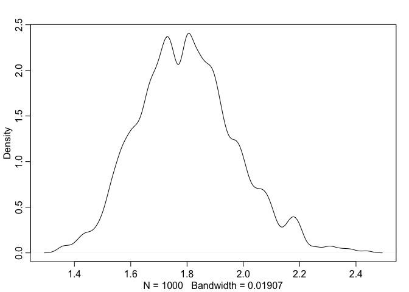
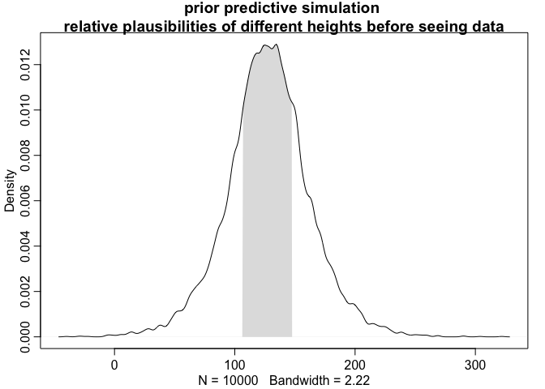
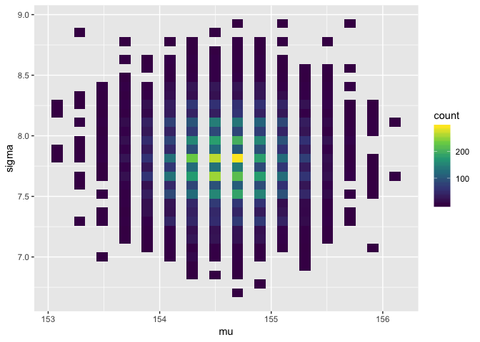
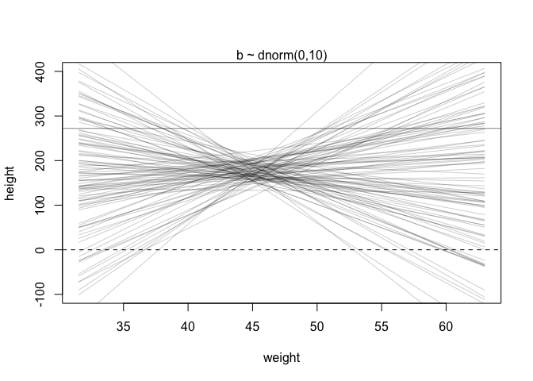
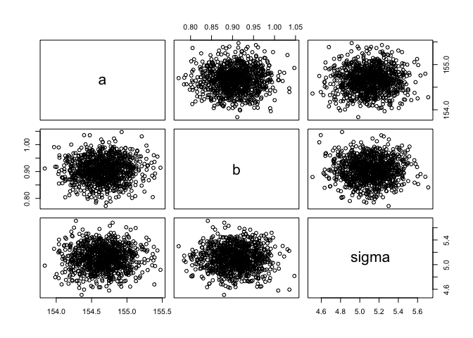
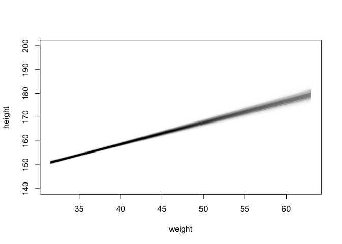
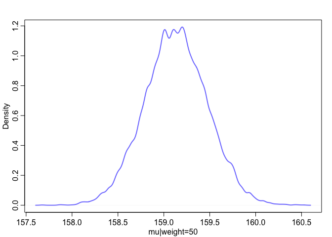

Chapter 4 Geocentric Models (linear regression)
================

<!--   output: -->

<!--   html_document: -->

<!--     df_print: paged -->

<!-- editor_options: -->

<!--   chunk_output_type: inline -->

*Linear regression is the geocentric model of applied statistics*  
Linear regression is a descriptive model corresponding to many process
models. It is a ‘golem’ that tries to learn the mean and variance of
some measurement from an addative combination of other measurements.

As a Bayesian procedure we interpret linear regression under a Bayesian
framework, it uses a Gaussian distribution to describe the uncertainty
about some measurement of interest.

``` r
suppressMessages(library(tidyverse))
suppressMessages(library(rethinking))
```

Motivating normal distributions.

Random walks from a 50 yard line L / R based on a coin flip on a field
will converge to normally distributed distances from the center. The
intuition is that when you add many *fluctuations* together they
converge to a normal distribution. There are many possible combinations
of 16 coin flips.

Each coin flip is a fluctuation, whatever the average value of the
source distribution, each sample from it can be thought of as a
fluctuation from that sample. **Any process that adds together random
values from the same distribution converges to normal** This is
basically the central limit theorm but it is not stated in the text
explicitally and gives a more intuitive explanation- the more terms you
add (rhe more samples you take) the more likely an extreme value in one
direction will be cancelled by another extreme value in the opposite
direction making the most probable total sum a 0. The result is a 0
centered gaussian
distribution.

``` r
# To simulate this, we generate for each person a list of 16 random numbers between −1 and 1.
runif(n = 16, min = -1, max = 1)
```

    ##  [1] -0.16197898 -0.97520747  0.16590517  0.82674626 -0.65123626
    ##  [6] -0.94780757 -0.48684143 -0.31403944  0.22617678 -0.82761854
    ## [11]  0.66931168  0.75653910 -0.52561248  0.03735404  0.39906623
    ## [16]  0.65710746

``` r
# These are the individual steps. Then we add these steps together to get the position after 16 steps.
# plot positions after doingthis procedure 1000 times 
pos  = replicate(n = 1000 , expr = sum(runif(n = 16, min = -1, max = 1)))
plot(density(pos))
```

<!-- -->

``` r
# 25 random numbers between -10 and 10 
runif(n = 25 ,min = -10, max = 10)
```

    ##  [1] -0.5963342  4.3393680  1.3950367  7.5819935 -3.6258292 -6.6562550
    ##  [7] -0.9421627  7.1267013 -8.6590167 -5.3953797  7.4933544  4.3861701
    ## [13]  8.4099582 -8.8671042  6.9898499  3.2232033  8.4947313 -1.6098762
    ## [19] -7.8284025  7.2470129  9.8902643 -3.3912484  7.3113606 -5.9543720
    ## [25] -5.2628204

``` r
# sum of 25 numbers betweeen -1 and 1
set.seed(1)
sum(runif(n = 25 ,min = -1, max = 1))
```

    ## [1] 1.589279

``` r
pos2 = replicate(n = 1e4, sum(runif(n = 25 ,min = -1, max = 1)))
plot(density(pos2))
```

<!-- -->

Processes that lead to a Gaussian distribution: Addition  
Multiplication (which is addition)  
Logarithms of products (which is addition)

Bell curves tell you almost nothing about the generative process, all
that is preserved is the two moments mu and sigma. See ch 7 for maximum
entropy argument.

## Convergence on a Gaussian via Multiplication of small effect sizes

assume growth rate is positively influenced by 12 alleles that increase
growth by a percentage. That means their effects are multiplicative.

``` r
# 12 random alleles with small effect size 
runif(n = 12,min = 0, max = 0.1)
```

    ##  [1] 0.01088807 0.02882970 0.05791419 0.01548083 0.03755309 0.06296206
    ##  [7] 0.05979336 0.05900954 0.05025683 0.06937136 0.02377177 0.03508414

``` r
# simulate the product of 12 random alleles with multiplicative increase on growth of 0-10%.
prod(1 + runif(n = 12,min = 0, max = 0.1))
```

    ## [1] 1.989233

^ This is a growth rate.

``` r
# distribution of growth rates 
dens(replicate(n = 1000, expr = prod(1 + runif(n = 12,min = 0, max = 0.1)) ))
```

<!-- -->

The *product* of these random fluctuations is still Gaussian because
multiplying small numbers is equivalent to adding numbers. The effect
size of each locus is small. *Small effects multiplied together are
approximately additive *

If we assume the effect sizes can be high as 80%, we don’t get a
Gaussian distribution.

``` r
# 12 random alleles with between 0 and 80% effect size 
# simulate effect sizes with runif 
runif(n = 12,min = 0, max = 0.8)
```

    ##  [1] 0.49339223 0.32336330 0.63573741 0.33448951 0.50586215 0.39726826
    ##  [7] 0.37624567 0.01955251 0.64895455 0.12846027 0.57860367 0.33236592

``` r
dens(replicate(n = 1000, expr = prod(1 + runif(n = 12,min = 0, max = 0.8) ) ))
```

<!-- -->

### Large deviations multiplied together *on a log scale* converge to Gaussian

However, if we add up the log of the distributions, adding logs is the
same as multiplying the original numbers, multiplicative interactions of
large deviations can produce Gaussian distributions if we measure the
outcome on a log
scale.

``` r
dens(replicate(n = 1000, expr = log10( prod(1 + runif(n = 12,min = 0, max = 0.8)) ))) 
```

<!-- -->

### Justifications for using Gaussians

#### Ontological

An ontological reason means there is a priori evidence not requiring
reason - the world is full of Gaussian distributions (why? this is due
to principles of maximum entropy discussed in ch7)  
\#\#\#\# Epistomological  
When all we are willing to say of a measure is the mean and variance,
the Gaussian is the most consistent with our assumptions: it can be
realized the largest number of ways.

The Gaussian distribution p(y | µ, sigma) ~ exp (y - mu)^2 / sigma

Basically the intuition behind the shape is the meat is in the y - mu
squared which gives the quadratic shape and exponentiating it gives the
long tails <https://www.wolframalpha.com/input/?i=exp%28-x%5E2++%29>

Sometimes Gaussian is defined with tau which = 1 / sigma squared

### Language of statistical models

Globe toss example  
W ~ Binomial(N, p)  
p ~ Uniform( 0, 1)

1)  The count W is distributed binomially with sample size N and
    probability p.  
2)  The prior for p is assumed to be uniform between zero and one.

1 - the first line always defines the likelihood function used in Bayes
Theorm. 2 - the other lines define the priors.  
The symbol “~” means there is a stochastic relationship. A stochastic
relationship is the mapping of a variable or parameter onto a
distribution. It is stochastic because no single instance of the
variable is known with certainty. The mapping is instead probabilistic.
Some values are more probable than others but many different values are
plausible under any model.

the model definition to define the posterior distribution using Bayes
theorm:

probability of prior is proportional to the likelihood times the pripor
/ average probability.

Pr(p | w, n) = Binomial(w | n, p) \* Uniform(p | 0, 1) / ∫ Binomial(w |
n, p)Uniform(p | 0, 1)dp

## Bayesian model of height - Howell data

Here we construct a Bayesian machine that considers possible
distributions of mu and sigma and ranks them by posterior plausibility -
the logical compatibility of the distribution with the data and the
model. The model estimates a entire posterior distribution of gaussian
distributions - a distribution of distributions.

``` r
data("Howell1")
d  = Howell1

# a very nice summary function from rethinking: 
precis(d)
```

    ##               mean         sd      5.5%     94.5%     histogram
    ## height 138.2635963 27.6024476 81.108550 165.73500 ▁▁▁▁▁▁▁▂▁▇▇▅▁
    ## weight  35.6106176 14.7191782  9.360721  54.50289 ▁▂▃▂▂▂▂▅▇▇▃▂▁
    ## age     29.3443934 20.7468882  1.000000  66.13500     ▇▅▅▃▅▂▂▁▁
    ## male     0.4724265  0.4996986  0.000000   1.00000    ▇▁▁▁▁▁▁▁▁▇

``` r
# only consider adults 
d2 = d %>% filter( age > 18)
```

### the Bayesian model

Here we are just making a model of height without other predictor
variables.

hi ~ N(µ,σ)

The i represents each individual element of the height vector, the rows
of the data. The model so far just knows each height is defined by the
same normal distribution with mean µ and sigma σ. The model assumes h is
IID independently and identically distributed. Rethinking section:  
Each height is assumed to be uncorrelated with the other heights,
knowing one height tells you nothing about the other heights etc. *The
i.i.d. assumption is about how the Golem represents its uncertainty. It
is an epistemological assumption. It is not a physical assumption about
the world, an ontological one, unless you insist that it is. E. T.
Jaynes (1922–1998) called this the mind projection fallacy, the mistake
of confusing epistemological claims with ontological claims.* … in
ignorance of such correlations the most conservative distribution to use
is i.i.d. IID is a ‘small world’ problem it concerns how the model
represents uncertainty. See related:
[Jaynes](https://en.wikipedia.org/wiki/Edwin_Thompson_Jaynes)  
[mind projection
fallacy](https://en.wikipedia.org/wiki/Mind_projection_fallacy)

Model of height: hi ∼ Normal( µ , σ) \[likelihood\] µ ∼ Normal(178, 20)
\[ µ prior\] σ ∼ Uniform(0, 50) \[ σ prior\]

Priors are specified independently for each parameter. This assumes: Pr(
µ , σ) = Pr( µ ) Pr(σ)

prior for height - the average height (not an individual height) is
somewhere between 150 and 220.

``` r
par(mfrow = c(1, 2))

# prior for mu-the average height is somewhere between 150 adn 220.
curve(dnorm(x, 178, 20), from=100, to=250, main = " prior for µ ")

# prior for standard deviation flat prior 
# We constrain it to have a positive value between 0 and 50
# sd can only be positive. 
curve(dunif(x, 0, 50), from=-10, to=60 , main = "sd")
```

<!-- -->

### What do the priors imply about the possible distribution of individual heights ? Prior predictive simulation

Priors for h mu and sigma imply a joint prior distribution for
individual heights that can be sampled from.

``` r
# sample from the prior for individual heights 
sample_mu = rnorm(n = 1e4, mean = 128, sd = 20)

#sample from a uniform distribution with runif random-uniform
sample_sigma = runif(n = 1e4, min = 0, max = 50)

# define a prior distribution for h 
prior_h = rnorm(n = 1e4, mean = sample_mu, sd = sample_sigma)

dens(prior_h, show.HPDI = 0.50,
     main = "prior predictive simulation \n relative plausibilities of different heights before seeing data ")
```

<!-- -->

**400 cm is 13 feet - the model accepts a 13 foot human is plausible**
the prior predictive simulation is the relative plausibilities given the
model before seeing the data, we can do better than accepting
Hagrid-sized humans. Also this model accepts people with *negative
height*

We need to base the priors on *scientific knowledge* of the data before
we see it, *not the data itself*. Using data itself is an ‘emperical
bayes’
procedure.

``` r
# sample from the prior for individual heights **with a much flatter less informative prior
sample_mu = rnorm(n = 1e4, mean = 128, sd = 50)
sample_sigma = runif(n = 1e4,min = 0, max = 50)
prior_h = rnorm(n = 1e4, mean = sample_mu, sd = sample_sigma)
dens(prior_h, show.HPDI = 0.50,
     main = " prior predictive simulation \n poorly specified prior - model accepts implausible values")
```

<!-- -->

## calculating the posterior with brute force grid approximation

You’d never do this but this is to illustrate what we are approximating
with the quadratic approximation which is similar to EM algorithms,
e.g. thosed used in mclust to fit gaussian mixtures.

In this case we have 2 parameters so the grid is literally comprised of
the possible values of sigma for each possible mu visa versa. We then
calculate the log likelihood of each combination of mu and sigma.
Everything must be done on the log scale. Doing this with the tidy
translation with ‘map2’ to keep the command in line with the pipe. I
would have used apply. Here, like in chapter 1-3 where the dbinom was
used to calculate the likelihood, here we use dnrom to calculate the
likelihood.  
For each row, we map the likelihood function which calculates the
relative number of ways that particular combination of mu and sigma
could have produced the data d2$height.

``` r
#constrict the grid. 
n = 100
d_grid = crossing(mu = seq(from = 140, to = 160,length.out = n), 
                  sigma = seq(from = 4, to = 9, length.out = n))

glimpse(d_grid)
```

    ## Observations: 10,000
    ## Variables: 2
    ## $ mu    <dbl> 140, 140, 140, 140, 140, 140, 140, 140, 140, 140, 140, 140…
    ## $ sigma <dbl> 4.000000, 4.050505, 4.101010, 4.151515, 4.202020, 4.252525…

``` r
# define a function to map that calculates the log likelihood at each combination of mu and sigma. 
grid_function = function(mu, sigma) {
  # calculate the likelihood with dnorm
  dnorm(x = d2$height, mean = mu, sd = sigma, log = T) %>% sum()
}


# d_grid2 = d_grid %>% mutate(log.lik = purrr::map2(.x = mu, .y = sigma, .f = grid_function))
# tester = unnest(d_grid2)
# tester %>% head 
d_grid_lk = 
  d_grid %>% 
  # map the likelihood function across each row combination of mu and sigma 
  mutate(log_likelihood = purrr::map2(.x = mu, .y = sigma, .f = grid_function)) %>% 
  unnest(log_likelihood) %>% 
  # specify the prior
  mutate(prior_mu    = dnorm(mu,    mean = 178, sd  = 20, log = T),
         prior_sigma = dunif(sigma, min  = 0,   max = 50, log = T)) %>% 
  # calculate the unstandardized probability 
  mutate(product = log_likelihood + prior_mu + prior_sigma) %>% 
  # standardize the probability 
  mutate(probability = exp(product - max(product)))
```

``` r
d_grid_lk %>% 
  ggplot(aes(x = mu, y = sigma, fill = probability)) + 
  geom_raster() + 
  scale_fill_viridis_c() + 
  labs(x = expression(mu), y = expression(sigma)) +
  coord_cartesian(xlim = range(d_grid$mu),
                  ylim = range(d_grid$sigma)) +
  theme(panel.grid = element_blank())
```

<!-- -->

### Sampling parameter values from the posterior

``` r
d_grid_samples <- 
  d_grid_lk %>% 
  sample_n(size = 1e4, replace = T, weight = probability)

ggplot(d_grid_samples, aes(x = mu, y = sigma)) +
  geom_bin2d(bins = 30) +
  scale_fill_viridis_c()
```

<!-- -->

Summarizing the samples from the posterior: the marginal posterior
density of mu (marginal meaning averaged over sigma)

``` r
dens(d_grid_samples$mu)
HPDI(d_grid_samples$mu, prob = 0.94)
```

    ##    |0.94    0.94| 
    ## 153.9394 155.3535

``` r
# summarize the widths of the sampled densities with the highest posterior compatibility intervals
PI(d_grid_samples$mu)
```

    ##       5%      94% 
    ## 153.9394 155.3535

``` r
dens(d_grid_samples$mu, norm.comp = TRUE)
```

<!-- -->

## Quadratic approximation

More practically we use quadratic approcimation rather than brute force
grid approximation. We can quickly make inferences about the shape of
the posterior. The posterior’s peak will lie at the maximum a posteriori
estimate (MAP), and we can get a useful image of the posterior’s shape
by using the quadratic approximation of the posterior distribution at
this peak. This is similar to how frequentist tests work without priors.

### model in symbolic formula and code

hi ∼ Normal( µ , σ) -\> height ~ dnorm(mu,sigma)  
µ ∼ Normal(178, 20) -\> mu ~ dnorm(156,10)  
σ ∼ Uniform(0, 50) -\> sigma ~ dunif(0,50)

``` r
# specify model formula 
flist <- alist(
  height ~ dnorm(mu, sigma),
  mu ~ dnorm(178 ,20),
  sigma ~ dunif(0, 50)
  )

# fit the model with QUAP 
m4.1 <- quap( flist , data=d2 )
precis(m4.1)
```

    ##             mean        sd       5.5%      94.5%
    ## mu    154.654533 0.4172153 153.987742 155.321323
    ## sigma   7.762329 0.2950800   7.290735   8.233924

**What the output of Precis means here: ** this is the marginal
posterior distribution for both parameters mu and sigma. E.g. *posterior
for mu, after averaging over values of sigma* is given by a normal
distribution with mean 154 and sigma 0.4.

The quadratic approximation of a posterior distribution with more than
one parameter is just a multi-dimensional gaussian distribution. Just
like the first two moments (mean and variance) of a univariate Gaussian
distribution are sufficient to describe a Gaussian distribution, the
**variance-covariance matrix** is sufficient to describe a multivariate
Gaussian distribution. It tells you how each parameter relates to each
other parameter. The variance covariance matrix is a vector of variances
and a correlation matrix.

``` r
vcov(m4.1)
```

    ##                 mu        sigma
    ## mu    0.1740686221 0.0002279195
    ## sigma 0.0002279195 0.0870721967

``` r
cov2cor(vcov(m4.1))
```

    ##               mu      sigma
    ## mu    1.00000000 0.00185132
    ## sigma 0.00185132 1.00000000

the diagonal in vcov gives the variances. Taking the squrare root of
these gives the standard deviation from precis

``` r
sqrt(diag(vcov(m4.1)))
```

    ##        mu     sigma 
    ## 0.4172153 0.2950800

We can extract samples from the posterior distribution:

``` r
post = rethinking::extract.samples(object = m4.1, n = 1e4)
head(post)
```

    ##         mu    sigma
    ## 1 155.3997 7.391357
    ## 2 153.9905 8.050820
    ## 3 154.4077 7.864748
    ## 4 154.3963 7.588218
    ## 5 154.3019 7.743850
    ## 6 154.5917 8.233508

Under the hood, this uses MASS which has a function mvnorm to simulate
random vectors of multivariate gaussians. We feed a vector of mu values,
the coefficients of the posteriors from the model which represent the
mean of the posterior distribution of velues for the mean hieght
conditioned on the prior and data, and the mean of the posterior
distribution of values for sigma conditioned on the prior and data.

``` r
post2 = MASS::mvrnorm(n = 1e4, 
                      # here we are actually giving both mu and sigma 
                      mu = coef(m4.1), 
                      # here we input a variance covariance matrix 
                      Sigma = vcov(m4.1))
head(post2)
```

    ##            mu    sigma
    ## [1,] 155.2991 7.788996
    ## [2,] 154.9844 7.983310
    ## [3,] 154.8203 7.401683
    ## [4,] 154.5172 7.736499
    ## [5,] 154.1527 8.007468
    ## [6,] 154.5873 8.135875

### Equivalent model fitted with brms

Code for using brms with Hamiltonian Monte Carlo (HMC) which is covered
in Ch 9.
<https://bookdown.org/content/4857/geocentric-models.html#the-model>.

``` r
b4.1 =  brms::brm(data = d2, 
                  family = gaussian, height ~ 1,
                  prior = c(
                    prior(normal(178, 20), class = Intercept), 
                    prior(uniform(0, 50), class = sigma)
                    ),
                  iter = 31000,
                  warmup = 30000, 
                  chains = 4, 
                  cores = 4,
                  seed = 4,
                  file = "fits/b04.01")
```

## 4.4 Linear Prediction (p95 in hard copy )

All of the models above were just estimating the mean height. Now we are
adding predictor variables.

“regression” to the mean - Galton - to predict son’s heights from
fathers, better to use the whole population of heights in prediction.
Arises statistically whenever individual measurements are assigned a
common distribution–leads to shrinkage as each measurement informs the
others. “shrink towards the overall
mean”.

``` r
with(data = d2, expr = plot(height, weight, col = col.alpha('black',alpha =  0.5)))
```

<!-- -->

The linear model strategy: make the parameter µ, the mean of gaussian
into a linear function of predictor variables. We instruct the golem to
assume that the predictor variable has a constant and additive
relationship to the mean of the outcome. The golem then computes the
posterior distribution of this constant relationship.

Some model parameters now stand for the strength of association between
the outcome **µ** and the value of another parameter.

The posterior in a bayesian linear model is lines ranked by their
plausibility. We constrain the model to be lines and the model tells us
it really likes this series of lines.

h\[i\] ∼ Normal(µi , σ) \[likelihood\]  
*the little i on µi indicates that the mean now depends upon the row in
contrast to the simple model of height without the linear model* we are
making a model of the mean and the mean now depends on a predictor. We
are asking what are plausible values for h at some other values of the
predictors for each observation.

µi = α + β(xi − ¯x) \[linear model\]  
*the = sign not ~ ; mu at i is deterministic not stochastic. Once we
know the other parameters we know the mu predicted at i exactly*

The mean µ is no longer a parameter to be estimated. µi is constructed
from other parameters:  
α ∼ Normal(178, 20) \[ α prior\] (intercept prior)  
β ∼ Normal(0, 10) \[ β prior\] (beta prior)  
σ ∼ Uniform(0, 50) \[ σ prior\] (sd prior)

The parameters α and β are “made up”. α and β are not for describing the
Gaussian, their purpose is manipulating µ, *allowing it to vary
systematically across cases in the data.*

Each parameter is something that must be described in the posterior
distribution–when you want to know something about the data, you ask
your golem by inventing a parameter for it.

We are asking what is the height when x = xbar – that is answered by the
intercept bc when xi = xbar µi = α. And we are asking what happens to
height when x changes by 1 unit.

### Simulate lines (posteriors) implied by the priors

``` r
set.seed(2971)
N <- 100 
a <- rnorm( N , 178 , 20 )
b <- rnorm( N , 0 , 10 )

plot(NULL, 
      xlim = range(d2$weight), xlab = "weight",
      ylim = c(-100,400), ylab = "height"
     )
abline(h = 0, lty = 2) # flat line at height of 0
abline(h = 272, lty = 1, lwd = 0.5) # flat line at tallest person ever 8ft 11 in
mtext("b ~ dnorm(0,10)") 
# define the mean weight from the model 'xbar' 
xbar <- mean(d2$weight) 
for(i in 1:N) { 
curve(expr =  a[i] + b[i]*(x - xbar),
      from = min(d2$weight), 
      to = max(d2$weight),
      add = TRUE,
      col = col.alpha("black",0.2) 
      )
}
```

<!-- -->

This is a bad model – we expect this bowtie shape because the
predictions should be tighter around the mean but the large prior on
beta give ridiculous expected values-smaller than 0 and larger than the
tallest human ever.

We use domain knowledge to instead assume *the logarithm of beta* has a
normal distribution – this enforces a positive relationship assuming as
people get larger they get taller. If the logarithm of β is normal, it
forces beta to be positive because exp(x) is greater than zero for any
real number.

With a more reasonable prior for beta with rlnorm

``` r
b <- rlnorm(1e4, 0, 1)
dens(b, xlim = c(0,5), adj=0.1)
```

<!-- -->

Prior simulation simulate with r\[function\] random\[function\].

``` r
set.seed(2971)
N <- 100 
a <- rnorm( N , 178 , 20 )
b <- rlnorm( N , 0 , 1 )

xbar <- mean(d2$weight)

plot(NULL, 
      xlim = range(d2$weight), xlab = "weight",
      ylim = c(-100,400), ylab = "height"
     )

for ( i in 1:N )
  curve( 
    expr = a[i] + b[i]*(x - xbar) ,
    from = min(d2$weight),
    to = max(d2$weight), 
    add = TRUE, ylim = c(-100, 400), 
    col = col.alpha("black",0.2)
    )
```

<!-- -->

### Running the model with quap and sampling from the posterior

``` r
# fit model 
m4.3 <- quap(
   flist = alist(
     height ~ dnorm(mu , sigma), # likelihood 
     mu <- a + b*(weight - xbar), # deterministic component 
     a ~ dnorm(178 , 20), # prior for the intercept the expected height for a person with exactly average weight
     b ~ dlnorm(0 , 1), # prior for beta (the rate of change)
     sigma ~ dunif(0 , 50) # prior for sigma
     ),  
   data = d2 
   ) 

sx = extract.samples(object = m4.3, n = 1000)
plot(sx)
```

<!-- -->

``` r
precis(m4.3)
```

    ##              mean         sd        5.5%       94.5%
    ## a     154.6487731 0.27465742 154.2098175 155.0877287
    ## b       0.9047588 0.04260921   0.8366611   0.9728566
    ## sigma   5.1094015 0.19423143   4.7989821   5.4198208

interpretation for beta: for every 1kg heavier a person is expected to
be 0.9 cm taller and 89% of the posterior probability blies between 0.84
and 0.97.

**it is not evidence that the relationship between weight and height is
linear, because the model only considered lines. It just says that, if
you are committed to a line, then lines with a slope around 0.9 are
plausible ones.**

plot samples from the posterior

``` r
plot(NULL, 
      xlim = range(d2$weight), xlab = "weight",
      ylim = c(140,200), ylab = "height"
     )
for (i in 1:nrow(sx)) { 
  curve(expr = sx$a[i] + sx$b[i]*(x-mean(d$weight)), 
        col=col.alpha("black",alpha = 0.01) , add=TRUE,
        ylim = c(110,130) 
       )
} 
```

<!-- -->

Bowtie shape is because the prediction is better around the mean and
improves with sample size.

There are infinite number of possible values of the expected mean
(height) at weight 50 and the most compatible are shown. This is based
on drawing 10,000 samples form the posterior.

``` r
post <- extract.samples(m4.3) 
mu_at_50 <- post$a + post$b*( 50 - xbar )
dens( mu_at_50 , col=rangi2 , lwd=2 , xlab="mu|weight=50" )
```

<!-- -->

``` r
PI( mu_at_50 , prob=0.89 )
```

    ##       5%      94% 
    ## 158.5829 159.6840

*the central 89% of the ways for the model to produce the data place the
average height between about 159 cm and 160 cm (conditional on the model
and data), assuming the weight is 50
kg.*

### Getting predictions and intervals from the posterior of a fit of a model - link function

The function link provides a posterior distribution of µ for each case
we feed it.  
in this case we generate posteriors for µ: the expected average height
for values of weight.

3 steps:  
1\. link() - generate distributions of posterior values for a parameter
of interest.  
2\. use mean or PI to get the average and upper/ lower bounds of
parameter of interest for each value of predictor  
3\. plot lines and intervals

Note:  
a better name for ‘mu’ would be mu.posteriors because mu is a matrix.
The matrix has a value for each value of the data we asked for a
prediction. The number of rows, 1000 corresponds to the default `n`
parameter in `link`. The columns returned by link are whatever we
supplied to the data argument. They can be the original values for the
observations in the data or a random sequence of observations as below.
The data argument is converted to variables. The variables are values of
weight, the values are Gaussians computed using the model based on the
predictor.

``` r
# define sequence of weights to compute predictions for
# these values will be on the horizontal axis
weight.seq <- seq(from=25 , to=70, by=1)

# use link to compute mu for each sample from posterior 
# and for each weight in weight.seq 
mu <- link(m4.3, data = data.frame(weight=weight.seq)) 

dim(mu); length(weight.seq)
```

    ## [1] 1000   46

    ## [1] 46

``` r
# show what the values are in the data `mu`
colnames(mu) = weight.seq
mu[1:10,1:10]
```

    ##             25       26       27       28       29       30       31
    ##  [1,] 137.2281 138.0833 138.9385 139.7937 140.6490 141.5042 142.3594
    ##  [2,] 137.0969 137.9814 138.8660 139.7505 140.6351 141.5196 142.4042
    ##  [3,] 136.1847 137.1067 138.0287 138.9507 139.8727 140.7947 141.7167
    ##  [4,] 136.8391 137.7084 138.5776 139.4468 140.3161 141.1853 142.0545
    ##  [5,] 135.6752 136.6121 137.5490 138.4858 139.4227 140.3595 141.2964
    ##  [6,] 134.8281 135.7975 136.7669 137.7364 138.7058 139.6752 140.6447
    ##  [7,] 136.6474 137.5551 138.4628 139.3705 140.2782 141.1859 142.0936
    ##  [8,] 136.5438 137.4521 138.3604 139.2687 140.1770 141.0853 141.9936
    ##  [9,] 135.9598 136.8752 137.7905 138.7059 139.6213 140.5366 141.4520
    ## [10,] 138.5191 139.3351 140.1512 140.9672 141.7832 142.5992 143.4152
    ##             32       33       34
    ##  [1,] 143.2146 144.0699 144.9251
    ##  [2,] 143.2888 144.1733 145.0579
    ##  [3,] 142.6387 143.5607 144.4827
    ##  [4,] 142.9238 143.7930 144.6622
    ##  [5,] 142.2332 143.1701 144.1069
    ##  [6,] 141.6141 142.5835 143.5530
    ##  [7,] 143.0013 143.9090 144.8167
    ##  [8,] 142.9019 143.8102 144.7185
    ##  [9,] 142.3673 143.2827 144.1980
    ## [10,] 144.2312 145.0472 145.8633

The uncertainty at the ends is greater than at the mean. Makes perfect
sense; when someone is exactly the average weight we can guess their
height better than if they are at a more extreme value where we had less
values.

``` r
mu_long = as.data.frame(mu) %>% 
  gather(weight, distribution, colnames(mu)[1]:colnames(mu)[ncol(mu)])

ggplot(mu_long, aes(x = weight, y = distribution)) + geom_violin() + theme_bw()
```

<!-- -->

These are posterior probability distributions for expected values of the
linear model of the **average** height µi at various values of weight.
We want to also calculate **prediction intervals** of posterior
distributions of actual heights, to do this we incorporate the posterior
for
sigma.

``` r
sim.height <- sim(m4.3 , data=list(weight=weight.seq)) %>% as.data.frame()
colnames(sim.height) = weight.seq

# get 89% posterior Prediction Intervals according to the model 
height.PI <- apply( sim.height , 2 , PI , prob=0.89 )
# get 25% posterior Prediction Intervals according to the model 
height.PI2 <- apply( sim.height , 2 , PI , prob=0.25 )

## 
# plot raw data 
plot( height ~ weight , d2 , col=col.alpha(rangi2,0.5), 
      main = 'points = actual data \n grey = model 89% posterior prediction intervals \n red = 25% posterior prediction intervals')
# draw PI region for simulated heights 
shade(height.PI, weight.seq)
shade(object = height.PI2, lim =  weight.seq, col = col.alpha("red", 0.3))
```

<!-- -->

``` r
## 
```

### Basis Splines and polynomial regression.

#### Polynomial regression

A polynomial function turns one less time than its degree.  
If using, it is important to standardize the predictor variable.

The Bayesian model needs a prior for every parameter including b^2.

hi ∼ Normal( µ i , σ)  
µi = α + β 1 xi + β 2 xi2  
α ∼ Normal(178, 20)  
β1 ∼ Log-Normal(0, 1)  
**β2 ∼ Normal(0, 1)**  
σ ∼ Uniform(0, 50)

#### polynomial model Problems:

1)  These polynomial parameters difficult to set realistic priors for.  
2)  (lecture) Outside the observed range of data, the function will
    flail about absolutely randomly. (this is not true of splines. With
    a polynomial fit each parameter acts globally on the shape)

### Basis splines

a bayesian basis spline (b-spline) is called a p-spline. This could be
helful with longitudinal data. Here is a insane example with dates going
back a thousand years.

Basis splines invent a series of new synthetic predictor variables. The
synthetic variable exists to gradually turn on or off a parameter within
a specific range of values on the horizontal axis. The pivot points are
called knots. 2 basis functions overlap at a time; at a given point the
x value wil intersect with 2 y value “basis values” each will exert
influence on the value of a parameter in proportion to its value. As we
move to the right, At knot 1 basis 1 has value 2, as we get more toward
knot 2, basis value 2 increases, they intersect, after that point basis
value 2 exerts more influence on the parameter than basis function 1.
You can use the mcgv package to decide where the knots should go.
<https://cran.r-project.org/web/packages/mgcv/index.html>

``` r
data(cherry_blossoms) 
d <- cherry_blossoms

ds = apply(d[ ,2:3], 2, scale) %>% as.data.frame()
ds$year = d$year
dt = ds %>% gather(var, value, doy:temp)
p = ggplot(dt, aes(x = year, y = value, fill = var)) + geom_point(shape = 21)
p
```

    ## Warning: Removed 479 rows containing missing values (geom_point).

<!-- -->

Get 15 evenly spaced dates across the data (again can use a package to
do this in a more mptomized away)

``` r
d2 <- d[ complete.cases(d$temp) , ] 
# complete cases on temp 
num_knots <- 15 
knot_list <- quantile( d2$year , probs=seq(0,1,length.out=num_knots) )
```

Choose a polynomial degree. Degree 1 means 2 basis functions combine at
each point. degree 3 means 4 combine.

The bs function makes row = year, corresponding to the rows in the d2
data frame. Each column is a basis function, a synthetic variable
defining a span of years within which a corresponding parameter will
influence prediction.

``` r
# build a 3 degree basis spline 
library(splines) 
B <- bs(x = d2$year, 
        # we shave off the first and last value bc bs() puts knots at boundaries automatically
        knots = knot_list[-c(1,num_knots)], 
        degree=3,
        intercept=TRUE )

plot(NULL, 
     xlim=range(d2$year),  ylim=c(0,1) , 
     xlab="year" , ylab="basis value") 
for ( i in 1:ncol(B) ){  
  lines( d2$year , B[,i] )
}
```

<!-- -->

Now fit the model p 117. Di ∼ Normal(µi, σ) likelihood  
µi = α + ∑ wkB(k,i) linear model  
α ∼ Normal(6, 10) prior  
wj ∼ Normal(0, 1) prior  
σ ∼ Exponential(1) prior

the µi part is multiplying each basis value by a corresponding parameter
wk and adding up the k products. The exponential distribution used in
the prior for σ is exponential witha rate of 1. exp is useful because it
forces all values to be positive. *The way to think of exp() is to think
of it as containing no more than average deviation, where the average is
the inverse of the rate.* If the rate were 0.5, the average would be 2
(1 / 0.5). These are better than uniform priors because it is more
common to have a sense of the average than of the maximum.

``` r
m4.7 <- quap(
  alist( 
    D ~ dnorm(mu, sigma), # likelihood
    mu <- a + B %*% w, # linear model with matrix algebra 
    a ~ dnorm(6,10), # prior for a, the intercept (expected D on an 'average year')
    w ~ dnorm(0,1), # prior for w, the weight parameter for basis function
    sigma ~ dexp(1) # new exponential function for expected sigma 
    ),
  # specify data 
  data=list(D = d2$temp,B = B),
  # use a start list for the weights to tell quap how many there are 
  start = list( 
    w = rep(0, ncol(B)) 
    ) 
  )
```

It is hard to interpret the model so we plot posterior

``` r
precis(m4.7, depth = 2)
```

    ##              mean          sd       5.5%      94.5%
    ## w[1]   0.09748708 0.267673700 -0.3303072  0.5252814
    ## w[2]   0.23889941 0.279070722 -0.2071095  0.6849083
    ## w[3]   1.20070941 0.271684685  0.7665048  1.6349140
    ## w[4]  -0.82197806 0.259287024 -1.2363688 -0.4075873
    ## w[5]   0.10177341 0.257448046 -0.3096783  0.5132251
    ## w[6]  -1.40469585 0.257092818 -1.8155798 -0.9938119
    ## w[7]   1.15651089 0.256907615  0.7459229  1.5670989
    ## w[8]  -1.91585723 0.256912231 -2.3264526 -1.5052619
    ## w[9]   2.34741778 0.256876163  1.9368801  2.7579555
    ## w[10] -2.32069741 0.256924423 -2.7313123 -1.9100826
    ## w[11]  0.93549338 0.256914643  0.5248942  1.3460926
    ## w[12] -1.61487532 0.257200394 -2.0259312 -1.2038194
    ## w[13]  0.18054644 0.257668483 -0.2312576  0.5923504
    ## w[14] -1.24146249 0.260466187 -1.6577378 -0.8251872
    ## w[15]  0.03147103 0.270382193 -0.4006519  0.4635940
    ## w[16]  0.99682122 0.274756512  0.5577073  1.4359352
    ## w[17]  2.03579745 0.268396744  1.6068476  2.4647473
    ## a      6.32226877 0.242765634  5.9342824  6.7102551
    ## sigma  0.34423571 0.007262237  0.3326292  0.3558422

Get the weighted basis functions

``` r
# sample from the posterior 
post <- extract.samples(m4.7) 

# plot the weighted basis functions 
w <- apply(post$w, 2, mean) 
par(mfrow = c(2,1))
plot(NULL, 
     xlim = range(d2$year), ylim = c(-2,2),
     xlab = "year", ylab = "basis * weight")
for ( i in 1:ncol(B) ) { 
  lines(x = d2$year, y = w[i]*B[,i])
}
# plot 97% posterior interval for µ , at each year:
mu <- link( m4.7 ) 
mu_PI <- apply(mu,2,PI,0.97)
plot( d2$year , d2$temp , col=col.alpha(rangi2,0.3) , pch=16 )
shade( mu_PI , d2$year , col=col.alpha("black",0.5) )
```

<!-- -->

Matrix algebra note: matrix multiplication of the basis matrix B by the
vector of parameters w: B %\*% w. This notation is just linear algebra
shorthand for (1) multiplying each element of the vector w by each value
in the corresponding column of B and then (2) summing up each row of the
result. So you end up with exactly what you need: A sum linear predictor
for each year (row). Its the same math with little tricks to compress in
a covenient format.

``` r
library(rethinking)

mu <- a + B %*% w
```

    ## Warning in a + B %*% w: longer object length is not a multiple of shorter
    ## object length

``` r
mu <- a + sapply( 1:1124 , function(i) sum( B[i,] * w)) 
```

    ## Warning in a + sapply(1:1124, function(i) sum(B[i, ] * w)): longer object
    ## length is not a multiple of shorter object length

``` r
w %>% head 
```

    ## [1]  0.09625999  0.24074450  1.20143551 -0.82194611  0.10333724 -1.40396048

``` r
B %>% head 
```

    ##              1          2            3            4 5 6 7 8 9 10 11 12 13
    ## [1,] 1.0000000 0.00000000 0.0000000000 0.000000e+00 0 0 0 0 0  0  0  0  0
    ## [2,] 0.9697645 0.03006521 0.0001700700 2.206279e-07 0 0 0 0 0  0  0  0  0
    ## [3,] 0.9401447 0.05917776 0.0006757944 1.765023e-06 0 0 0 0 0  0  0  0  0
    ## [4,] 0.9111342 0.08734939 0.0015104442 5.956954e-06 0 0 0 0 0  0  0  0  0
    ## [5,] 0.8827268 0.11459183 0.0026672909 1.412019e-05 0 0 0 0 0  0  0  0  0
    ## [6,] 0.8549160 0.14091682 0.0041396056 2.757849e-05 0 0 0 0 0  0  0  0  0
    ##      14 15 16 17
    ## [1,]  0  0  0  0
    ## [2,]  0  0  0  0
    ## [3,]  0  0  0  0
    ## [4,]  0  0  0  0
    ## [5,]  0  0  0  0
    ## [6,]  0  0  0  0

# Ch 4 problem set

4E1. In the model definition below, which line is the likelihood?

y i ∼ Normal( µ , σ)  
µ ∼ Normal(0, 10)  
σ ∼ Exponential(1)

A:  
yi ∼ Normal(µ , σ)

4E2. In the model definition just above, how many parameters are in the
posterior distribution?

A:  
The posterior is made of 2 parameters, mu and sigma.

4E3. Using the model definition above, write down the appropriate form
of Bayes’ theorem that includes the proper likelihood and priors.  
A:  
Posterior = Plausibility of model after seeing data  
The model is estimating 2 parameters mu sigma conditioned on values of y
(times priors). So the posterior as above, is the joint posterior
distribution for values of mu and sigma.  
p(mu,sigma | Y )

likelihood  
The ways model can produce data  
pr(Y | mu, sigma)  
Normal(Y | mu, sigma)

prior  
the prior plausibility of the parameters.  
mu = N(mu | 0, 10)  
sigma = Exp(sigma | 0, 1)  
joint prior = pr(mu) \* pr(sigma)

joint probability posterior = likelihood \* prior  
p(mu,sigma | Y ) = Normal(Y | mu, sigma) \* N(mu | 0, 10) \* Exp(sigma |
0, 1) / average likelihood

4E4. In the model definition below, which line is the linear model?

yi ∼ Normal( µ , σ)  
µi = α + β xi  
α ∼ Normal(0, 10)  
β ∼ Normal(0, 1)  
σ ∼ Exponential(2)

A: µi = α + β xi

4E5. In the model definition just above, how many parameters are in the
posterior distribution?

A:3 each parameter that has a prior has a posterior.

4M1. For the model definition below, simulate observed y values from the
prior (not the posterior).

y i ∼ Normal( µ , σ)  
µ ∼ Normal(0, 10)  
σ ∼ Exponential(1)

``` r
# y i ∼ Normal( µ , σ) 
# rnorm(n = 100,mean = mu, sd = sigma) # define mu sigma with priors 
mu = rnorm(n =100,mean = 0, sd = 10)
sigma = rexp(n = 100,rate = 1)
height_sim = rnorm(n = 100, mean = mu, sd = sigma)
dens(height_sim)
```

<!-- -->

4M2. Translate the model just above into a quap formula.

``` r
# mod = quap(
  flist = alist(
    y ~ dnorm(mu, sigma), 
    mu ~ dnorm(0, 10), 
    sigma ~ dexp(1)
       )
#        )
```

4M3. Translate the quap model formula below into a mathematical model
definition.

``` r
flist <- alist( 
  y ~ dnorm( mu , sigma ), 
  mu <- a + b*x,
  a ~ dnorm( 0 , 10 ),
  b ~ dunif( 0 , 1 ),
  sigma ~ dexp( 1 )
)
```

on paper /

4M4. A sample of students is measured for height each year for 3 years.
After the third year, you want to fit a linear regression predicting
height using year as a predictor. Write down the mathematical model
definition for this regression, using any variable names and priors you
choose. Be prepared to defend your choice of priors.

Assuming the scale is in cm:  
Height is normally distributed with mean mu and sd sigma.  
h\[i\] ~ N(mu, sigma)

The mean height mu is the target of the predictive modeling.  
mu now depends on year at i and some relationship strength beta.  
mu = alpha + beta(year\[i\])

Add priors for mu and alpha in cm.  
a = N(40,10)  
mu = N(40, 10) sigma = U(0,1) \*\* note the upper bound on sigma term
should be larger like U(0,30)  
beta = N(0,5)

4M5. Now suppose I remind you that every student got taller each year.
Does this information lead you to change your choice of priors? How?

Now we know the beta is positive. So add a positive rate of 1cm per
year.  
beta = N(1,5)

4M6. Now suppose I tell you that the variance among heights for students
of the same age is never more than 64cm. How does this lead you to
revise your priors?

could change intercept prior.

Prior predictive simulation.

``` r
N <- 100
a <- rnorm(100, mean = 40, sd = 10)
mu <- rnorm(100, mean = 40,sd = 10)
sigma <- runif(100, min = 0, 30) 
b <- rnorm(100,mean = 1, sd = 5) 
```

``` r
plot(NULL,
     xlim = c(0,100), ylim = c(20,300)
     )
for (i in 1:N) {
  curve(
    # the linear model: mu as a function of year
    # 60 would have come from the data - the mean of height 
    expr = a[i] + b[i] * (x - 60), 
    from = 40, to = 80, add = TRUE, col = col.alpha(acol = 'black', alpha = 0.2)
    )
}
```

<!-- -->

Now using a log normal prior for beta:

``` r
N <- 100
a <- rnorm(100, mean = 40, sd = 10)
mu <- rnorm(100, mean = 40,sd = 10)
sigma <- runif(100, min = 0, 30) 
b <- rlnorm(n = 100,meanlog = 0,sdlog = 1)
```

``` r
plot(NULL,
     xlim = c(0,100), ylim = c(20,300)
     )
for (i in 1:N) {
  curve(
    # the linear model: mu as a function of year
    # 60 would have come from the data - the mean of height 
    expr = a[i] + b[i] * (x - 60), 
    from = 40, to = 80, add = TRUE, col = col.alpha(acol = 'black', alpha = 0.2)
    )
}
```

<!-- -->

There are still some absurd values but there are less.

4H1. The weights listed below were recorded in the \!Kung census, but
heights were not recorded for these individuals. Provide predicted
heights and 89% intervals for each of these individuals. That is, fill
in the table below, using model-based predictions.

``` r
new.weight = c(46.95, 43.72, 64.78, 32.59, 54.63)

data("Howell1")
d = Howell1
d = d[d$age > 18, ]

# specify model 
f1 = alist(
  height ~ dnorm(mu, sigma),
  mu <- a + Bw*weight,
  a ~ dnorm(175, 20), # average height 
  Bw ~ dlnorm(0,1), # prior for plausible effect which should be positive. 
  sigma ~ dexp(1)
)

# fit model 
m1 <- quap(flist = f1,data = d) 

# use link to get prediction intervals for new weight 
mu.posterior = link(fit = m1, data = list(weight = new.weight))

# predict heights 
height.predict = apply(mu.posterior, 2, median)

# predict 89% compatibility interval 
height.89 = apply(mu.posterior, 2, HPDI, 0.89 )

# print result table 
data.frame(new.weight, height.predict, height.89[1,], height.89[2])
```

    ##   new.weight height.predict height.89.1... height.89.2.
    ## 1      46.95       156.3601       155.9597     156.8852
    ## 2      43.72       153.4694       153.0393     156.8852
    ## 3      64.78       172.2742       171.0836     156.8852
    ## 4      32.59       143.5466       142.5424     156.8852
    ## 5      54.63       163.2172       162.4948     156.8852

4H2. Select out all the rows in the Howell1 data with ages below 18
years of age. If you do it right, you should end up with a new data
frame with 192 rows in it.

``` r
data("Howell1")
d = Howell1
d = d[d$age < 18, ]
x_bar = mean(d$weight) 
x_bar
```

    ## [1] 18.41419

``` r
# f3 = alist(
#   height ~ dnorm(mu, sigma),
#   mu <- a + Bw*(weight - x_bar),
#   a ~ dnorm(20, 10), # estimate average height when weight is minim
#   Bw ~ dlnorm(0,1), # prior for plausible effect which should be positive. 
#   sigma ~ dunif(0, 50)
# )
# not as interpretable priors but working through the example .. 
f3 = alist(
  height ~ dnorm(mu, sigma),
  mu <- a + Bw*weight,
  a ~ dnorm(0, 10), # estimate average height when weight is 0
  Bw ~ dlnorm(0,1), # prior for plausible effect which should be positive.
  sigma ~ dunif(0, 50)
)


# fit model 
m3 <- quap(flist = f3, data = d) 
precis(m3)
```

    ##            mean         sd      5.5%     94.5%
    ## a     57.174019 1.39018393 54.952237 59.395801
    ## Bw     2.765924 0.06803665  2.657189  2.874660
    ## sigma  8.449659 0.43245718  7.758509  9.140809

1)  Fit a linear regression to these data, using quap. Present and
    interpret the estimates. For every 10 units of increase in weight,
    how much taller does the model predict a child gets?

~ 20

2)  Plot the raw data, with height on the vertical axis and weight on
    the horizontal axis. Superimpose the MAP regression line and 89%
    interval for the mean. Also superimpose the 89% interval for
    predicted heights.

<!-- end list -->

``` r
post.m3 = extract.samples(m3)
plot(height ~ weight, data = d )
curve(mean(post.m3$a) + mean(post.m3$Bw)*x , add = TRUE) 
```

<!-- -->

3)  What aspects of the model fit concern you? Describe the kinds of
    assumptions you would change, if any, to improve the model. You
    don’t have to write any new code. Just explain what the model
    appears to be doing a bad job of, and what you hypothesize would be
    a better model.

4H3. Suppose a colleague of yours, who works on allometry, glances at
the practice problems just above. Your colleague exclaims, “That’s
silly. Everyone knows that it’s only the logarithm of body weight that
scales with height\!” Let’s take your colleague’s advice and see what
happens.

``` r
min(d$age)
```

    ## [1] 0

ok so there are also infants in the dataset which explains the really
small values for weight. I cant think in cm and kg which isn’t helping.

``` r
data("Howell1")
d = Howell1
d = d[d$age < 18, ]
d$logW = log(d$weight)

f4 = alist(
  height ~ dnorm(mu, sigma),
  mu <- a + Bw*logW, 
  a ~ dnorm(0, 10), # estimate average height when weight is 0 
  Bw ~ dlnorm(0,1),
  sigma ~ dunif(0, 50)
)

# fit model 
m4 <- quap(flist = f4, data = d) 
precis(m4)
```

    ##             mean        sd       5.5%     94.5%
    ## a     -31.580330 1.8809913 -34.586517 -28.57414
    ## Bw     50.086894 0.6630876  49.027152  51.14664
    ## sigma   4.660209 0.2383512   4.279278   5.04114

``` r
# posterior for m4 
pm4 = extract.samples(m4)
beta = mean(pm4$Bw)
intercept = mean(pm4$a)
plot(height ~ logW, d)
curve(mean(pm4$a) + mean(pm4$Bw)*x , add = TRUE) 
```

<!-- -->

1)  Model the relationship between height (cm) and the natural logarithm
    of weight (log-kg). Use the entire Howell1 data frame, all 544 rows,
    adults and non-adults. Fit this model, using quadratic
    approximation:

hi ∼ Normal( µ i , σ)  
µi = α + β log(wi)  
α ∼ Normal(178, 20)  
β ∼ Log − Normal(0, 1)  
σ ∼ Uniform(0, 50)

where h i is the height of individual i and w i is the weight (in kg) of
individual i. The function for computing a natural log in R is just log.
Can you interpret the resulting estimates?

Im going to compare to the linear model (now again using all the data
not just adults / kids) and use the information criteria to compare the
models. Also using all data here.

``` r
data("Howell1")
d = Howell1

f5 = alist(
  height ~ dnorm(mu, sigma), 
  mu <- a + bW*weight, 
  a ~ dnorm(178, 20), 
  bW ~ dlnorm(0, 1), 
  sigma ~ dunif(0, 50 )
)

f6 = alist(
  height ~ dnorm(mu, sigma), 
  mu <- a + bW*log(weight), 
  a ~ dnorm(178, 20), 
  bW ~ dlnorm(0, 1), 
  sigma ~ dunif(0, 50 )
)

m5 = quap(flist = f5, data = d)
m6 = quap(flist = f6, data = d)

compare(m4, m5)
```

    ## Warning in compare(m4, m5): Different numbers of observations found for at least two models.
    ## Model comparison is valid only for models fit to exactly the same observations.
    ## Number of observations for each model:
    ## m4 192 
    ## m5 544

    ## Warning in ic_ptw1 - ic_ptw2: longer object length is not a multiple of
    ## shorter object length

    ##        WAIC       SE    dWAIC      dSE    pWAIC weight
    ## m4 1142.697 23.60736    0.000       NA 3.680827      1
    ## m5 3982.634 34.91371 2839.938 31.97762 4.037961      0

``` r
plot(compare(m4, m5))
```

    ## Warning in compare(m4, m5): Different numbers of observations found for at least two models.
    ## Model comparison is valid only for models fit to exactly the same observations.
    ## Number of observations for each model:
    ## m4 192 
    ## m5 544
    
    ## Warning in compare(m4, m5): longer object length is not a multiple of shorter object length

<!-- -->

Model 5 gets all the weight and has a much lower deviance (-2\*lppd)
indicating a better fit.

2)  Begin with this plot: Then use samples from the quadratic
    approximate posterior of the model in (a) to superimpose on the
    plot: (1) the predicted mean height as a function of weight, (2) the
    97% interval for the mean, and (3) the 97% interval for predicted
    heights.

<!-- end list -->

``` r
# m5 
weight.seq = seq(min(d$weight), max(d$weight))
m5.post = link(m5, data = list(weight = weight.seq))
height.estimates = apply(m5.post, 2, mean)
line.PI = apply(m5.post, 2, PI, prob = 0.89)
sim.height = sim(m5, data = list(weight = weight.seq))
height.PI = apply(sim.height, 2, PI, prob = 0.89)


# m6 
m6.post = link(m6, data = list(weight = weight.seq))
height.estimates.2 = apply(m6.post, 2, mean)
line.PI.2 = apply(m6.post, 2, PI, prob = 0.89)
sim.height.2 = sim(m6, data = list(weight = weight.seq))
height.PI.2 = apply(sim.height.2, 2, PI, prob = 0.89)


plot( height ~ weight , data=Howell1 , col=col.alpha(rangi2,0.9),
      main ='h~N(mu,sigma) blue: mu = a + bW*W , red: mu = a + bW*log(W), ' )
lines(weight.seq, height.estimates)
shade(line.PI, weight.seq, col = 'blue')
shade(height.PI,weight.seq, col = col.alpha('blue', alpha = 0.2))
shade(line.PI.2, weight.seq, col = 'red')
shade(height.PI.2,weight.seq,col = col.alpha('red', alpha = 0.5))
```

<!-- -->

The model with the log realtionship is another way of expressing the log
transformation of the outcome variable.

``` r
d = Howell1
d$logW = log(d$weight)

f7 = alist(
  height ~ dnorm(mu, sigma),
  mu <- a + Bw*logW, 
  a ~ dnorm(0, 10), # estimate average height when weight is 0 
  Bw ~ dlnorm(0,1),
  sigma ~ dunif(0, 50)
)
m7 = quap(flist = f7, data = d)

precis(m7)
```

    ##             mean        sd       5.5%      94.5%
    ## a     -23.354081 1.3241014 -25.470250 -21.237911
    ## Bw     46.953376 0.3794799  46.346894  47.559859
    ## sigma   5.135287 0.1557208   4.886415   5.384159

``` r
precis(m6)
```

    ##             mean        sd       5.5%      94.5%
    ## a     -22.874319 1.3342911 -25.006774 -20.741864
    ## bW     46.817791 0.3823240  46.206763  47.428818
    ## sigma   5.137088 0.1558847   4.887954   5.386222
