Chapter 5 The Many Variables & The Spurious Waffles
================

<!--   output: -->

<!--   html_document: -->

<!--     df_print: paged -->

<!-- editor_options: -->

<!--   chunk_output_type: inline -->

### causal inference, directed acyclic graphs, multiple regression, confounds

### 5.1 Spurious Association

``` r
# load data and copy 
suppressMessages(library(rethinking)) 
suppressMessages(library(tidyverse)) 
data(WaffleDivorce) 
d <- WaffleDivorce

# standardize variables
d$D <- standardize( d$Divorce )
d$M <- standardize( d$Marriage )
d$A <- standardize( d$MedianAgeMarriage )
```

The linear model:  
D\[i\] ∼ Normal( µ i , σ)  
µ\[i\] = α + βA Ai  
α ∼ Normal(0, 0.2)  
βA ∼ Normal(0, 0.5)  
σ ∼ Exponential(1)

Intuition on working with the priors with data in scaled space:

If a prior on β was 1, 1 sd change in age would lead to 1sd change in
divorce. What is 1sd in age?

``` r
sd(d$MedianAgeMarriage)
```

    ## [1] 1.24363

So with a prior on β of 1, 1.24 years delta would lead to 1sd delta in
divorce. That is too strong of an effect.

Model in quap for both variables, one at a time.

``` r
m5.1 = quap(
  flist = alist(
    D ~ dnorm(mu, sigma),
    # bA is the beta for age (bA * A is βA)
    # A is standardized age as above
    mu <- a + bA * A, 
    a ~ dnorm(0, 0.2),
    # prior for the age effect 
    bA ~ dnorm(0,0.2), 
    sigma ~ dexp(1)
    ), data = d )


## R code 5.6
m5.2 <- quap(
    alist(
        D ~ dnorm( mu , sigma ) ,
        mu <- a + bM * M ,
        a ~ dnorm( 0 , 0.2 ) ,
        bM ~ dnorm( 0 , 0.5 ) ,
        sigma ~ dexp( 1 )
    ) , data = d )
```

Simulate from the priors with extract.prior and link

``` r
## R code 5.4
set.seed(10)
prior <- extract.prior(m5.1)
mu <- link(m5.1, post = prior, data = list(A = c(-2,2) )) 
plot( NULL , xlim=c(-2,2) , ylim=c(-2,2) )
for ( i in 1:50 ) lines( c(-2,2) , mu[i,] , col=col.alpha("black",0.4) )
```

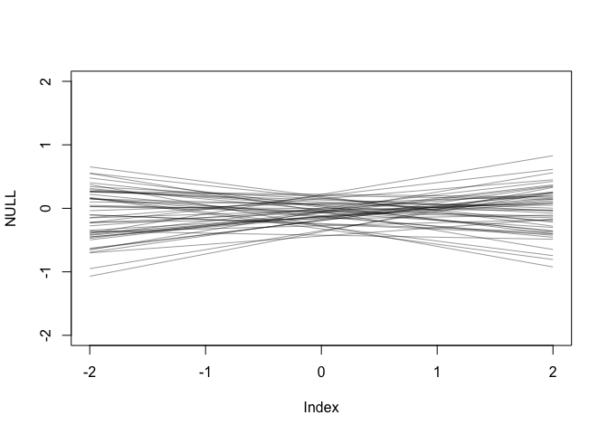<!-- -->

Posterior predictions from the model

``` r
## R code 5.5
# compute percentile interval of mean
# a vector of 30 values to input into the link function 
# corresponding to hypothetical values of A in sd space. 
A_seq <- seq( from= -3 , to=3.2 , length.out=30 )

# link - get a distribution of values for mu 
# for every value of A_seq 
# mu reflecting the mean of the outcome D at each hypothetical value of A from A_seq 
# based on the model M5.1 where we defined µ[i] as: 
# D[i] ∼ Normal( µ[i], σ)  
# µ[i] = α + βA Ai  
mu <- link(m5.1 , data=list(A=A_seq))

# dim(mu) [1] 1000   30 
# the 30 columns of mu represent 30 made up ages in age seq  
# the 1000 rows represent 1000 samples from the posterior at A = A_seq[i]

# summarize these samples for the posterior by extracting the mean value for mu 
mu.mean <- apply(mu, 2, mean)
mu.PI <- apply( mu , 2 , PI )

# plot the actual data of each state D vs A.  
plot(D ~ A, data=d , col=rangi2)
# plot the average value for the line from the posterior of lines 
lines(x = A_seq, y = mu.mean, lwd=2 )
# plot the percentile interval 
shade(mu.PI , A_seq)
```

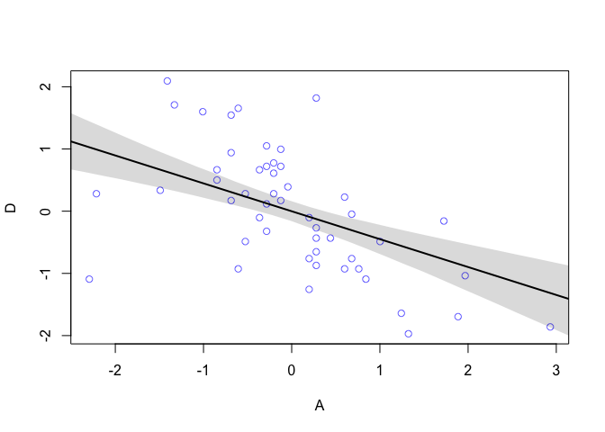<!-- -->

Here is a comparison of the coefficient estimate with a frequentist lm

``` r
coef(lm(D~A, data = d))[2]
```

    ##          A 
    ## -0.5972392

``` r
precis(object = m5.1)[2, ]$mean
```

    ## [1] -0.449981

DAGs - see in depth lecture notes.

DAGs provide a way to decide on which variables to condition estimates
on in a principled way, provided one has a scientific model about the
way that the variables relate to one another.

Most of the examples introduced in ch 5,6 have time-dependence in their
relationships. How do we know to draw the directions of the arrows like
this?

``` r
## R code 5.7
library(dagitty)
dag5.1 <- dagitty( "dag{ A -> D; A -> M; M -> D }" )
coordinates(dag5.1) <- list( x=c(A=0,D=1,M=2) , y=c(A=0,D=1,M=0) )
drawdag( dag5.1 )
```

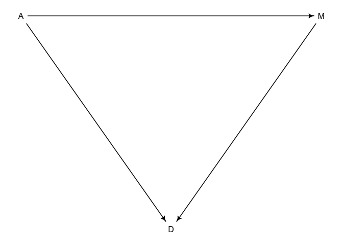<!-- -->

A - Age at marriage  
M - marriage rate  
D - divorce rate

Here the arrow of time dictates the possible causal paths, to some
degree this is possible in systems level datasets, if T = transcription
of some gene genotype -\> T and not T -\> genotype, this is the basis of
the intermediate phenotype concept of eQTL studies.

Time-dependence dictates the relationships reason we know how to draw
arrows from A to M and D and from M to D.  
A -\> D ; have to be married before D, it could influence because
younger people may change at a faster rate.  
A -\> M -\> D ; indirect effect by lowering age at marriage, therate
icreases b/c there are more young people who haven’t died to get
married.

**Conditional independencies are testable implications** Any DAG may
imply some variables are independent of others under certain conditions.
These are the model’s testable implications/ conditional independencies,
come in 2 forms:  
1\) Statements of which variables should be associated with one another
(or not) in the data. 2) Statements of which variables become
dis-associated when we condition on some other set of variables.

We can algorithmically find the conditional independencies implied by
the model, for example the

``` r
DMA_dag2 <- dagitty('dag{ D <- A -> M }') 
drawdag(DMA_dag2)
```

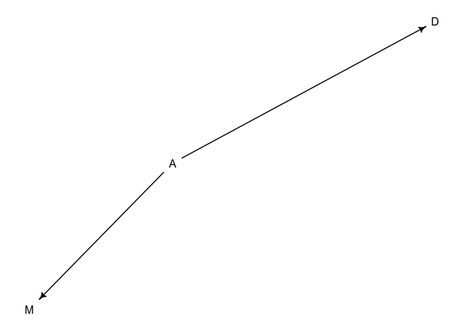<!-- -->

``` r
impliedConditionalIndependencies( DMA_dag2 )
```

    ## D _||_ M | A

Read this as "D is independent of M, Conditioned on A. This is for model
2 where

``` r
DMA_dag1 <- dagitty('dag{ D <- A -> M -> D }') 
drawdag(DMA_dag1)
```

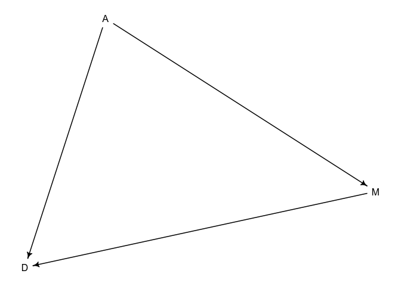<!-- -->

``` r
impliedConditionalIndependencies( DMA_dag1 )
```

There is no output:

The testable implications of DMA\_dag1 are that all pairs of variables
should be associated, whatever we condition on.  
The testable implications of DMA\_dag1 are that all pairs of variables
should be associated, before conditioning on anything, but also that S
is independent on M after condititioning on A.

A multiple regression model will condition on A so the above gives us a
principled way to decide to condition on A.

The multiple regression model asks:  
If we already know marriage rate, what additional value does knowing age
at marriage add?  
If we already know age at marriage, what additional value does knowing
marriage rate add?

### 5.1.3 (p135) Multiple regression notation

The mean of the outcome variable is a modeled as the sum of intercept+
an additive combination of products of parameters (betas) and
predictors. Since the predictors have different values, the mean will
again depend on i.

µi = α + βmMi + βaAi  
*Note p 136 box on forms of the notation*

D\[i\] ∼ Normal(µi, σ) – the outcome D is distributed normally with mean
µ dependent of row i with sd sigma.  
µ\[i\] = α + βM \* M\[i\] + βA \* Ai – the mean oud outdcome depends on
the row and is a combination of effect of A and M (i.e. µ\[i\] = α + βx1
+ βx2)  
α ∼ Normal(0, 0.2) – The prior for the intercept is normally
distributed  
βM ∼ Normal(0, 0.5) – prior for the effect of M is normally
distributed  
βA ∼ Normal(0, 0.5) – prior for the effect of A is normally
distributed  
σ ∼ Exponential(1) – prior for standard deviation of D is normal

Quap code:

``` r
## R code 5.10
m5.3 <- quap(
    alist(
        D ~ dnorm( mu , sigma ),
        mu <- a + bM*M + bA*A, # deterministic component of model, use assignment operator <- 
        a ~ dnorm( 0 , 0.2 ),
        bM ~ dnorm( 0 , 0.5 ),
        bA ~ dnorm( 0 , 0.5 ),
        sigma ~ dexp( 1)
    ) , data = d )
precis( m5.3 )
```

    ##                mean         sd       5.5%      94.5%
    ## a     -1.100372e-05 0.09708000 -0.1551636  0.1551416
    ## bM    -6.537672e-02 0.15078010 -0.3063524  0.1755990
    ## bA    -6.135168e-01 0.15099056 -0.8548289 -0.3722047
    ## sigma  7.851600e-01 0.07785376  0.6607347  0.9095854

m5.1: D ~ A  
m5.2 D ~ M  
m5.3 D ~ M+A

``` r
plot(
  coeftab(m5.1, m5.2, m5.3), 
  par=c("bA","bM")
  )
```

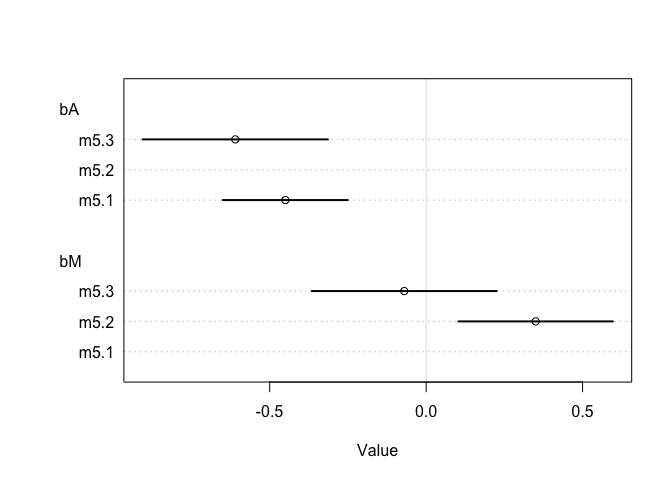<!-- -->

Interpretation of the above: M is only associated with D when Age is not
in the model. Once we know age at marriage A, there is no additional
predictive power in knowin rate of marriage M.

From a predictive standpoint M adds value to predicting D if you don’t
know A, but this model is telling us *because we have the DAG*, that the
association M -\> D is a spurious relationship **that is caused by the
influence of Age on both Marriage rate and Divorce**.

Parameter estimate interpretation always depends on the DAG / causal
model. Often on set of parameter values are consistent with many causal
models = **markov equivalence**.

Visualizing the multiple regression posteriors to get a feel for teh
influence of the conditional independences.

1)  Predictor residual plots: outcome ~ residual(m.1) help understand
    the model.

2)  Posterior prediction plots: model-based predictions vs raw data.
    useful for checking fit / predictions.

3)  Counterfactual plots: implied predictions for imaginary experiments.
    Explore causal implications of manipulating variables.

### 5.1.5.1 predictor residual plots

Average prediction error when we use all other predictor variables to
model a *predictor* of interest. So we make a model of M here using A.

``` r
## R code 5.13
m5.4 <- quap(
    alist(
        M ~ dnorm( mu , sigma ) ,
        mu <- a + bAM * A ,
        a ~ dnorm( 0 , 0.2 ) ,
        bAM ~ dnorm( 0 , 0.5 ) ,
        sigma ~ dexp( 1 )
    ) , data = d )

## R code 5.14
mu <- link(m5.4)
mu_mean <- apply( mu , 2 , mean )

# compute the residual for M after regressing on A 
# subtract observed marriage rate from the model predicted rate 
# based on the model above
mu_resid <- d$M - mu_mean

## R code 5.15
# call link without specifying new data
# so it uses original data
mu <- link( m5.3 )

# summarize samples across cases
mu_mean <- apply( mu , 2 , mean )
mu_PI <- apply( mu , 2 , PI )

# simulate observations
# again no new data, so uses original data
D_sim <- sim( m5.3 , n=1e4 )
D_PI <- apply( D_sim , 2 , PI )

## R code 5.16
plot( mu_mean ~ d$D , col=rangi2 , ylim=range(mu_PI) ,
    xlab="Observed divorce" , ylab="Predicted divorce" )
abline( a=0 , b=1 , lty=2 )
for ( i in 1:nrow(d) ) lines( rep(d$D[i],2) , mu_PI[,i] , col=rangi2 )
```

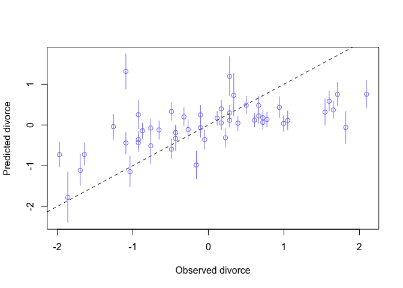<!-- -->

Plotting the residuals against the outcome:

``` r
plot(d$D ~ mu_resid, col = rangi2, xlab = 'marriage rate residual')
```

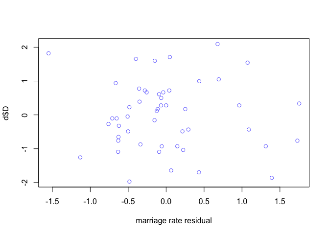<!-- --> The plot above
shows the linear relationship between divorce and marriage rates, having
“controlled” for median age of marriage.  
Average divorce rate on both sides of 0 is about the same there is
little relationship between divorce and marriage rates conditional on A.

multiple regression measures the *remaining* association *of each
predictor* with the outcome, *after already knowing the other
predictors.*

### 5.1.5.2. Posterior prediction plots

posterior predictive check by simulating predictions averaging over the
posterior to see where / how the model fails. Note linear models are
skeptical of extreme values and ‘expect’ regression to the mean. The
simulation below shows the model underpredicts D for states with very
high actual D and visa versa. Another use in this is finding what the
outliers are and understanding them in this contrived example we know
mormon population density dictates the outlier states

``` r
## R code 5.15
# call link without specifying new data
# so it uses original data
# this outputs a posterior distribution estimate for predicted D 
# for every state 
mu <- link( m5.3 )

# summarize samples from the posterior across cases
mu_mean <- apply( mu , 2 , mean )
mu_PI <- apply( mu , 2 , PI )

# simulate observations
# again no new data, so uses original data
D_sim <- sim( m5.3 , n=1e4 )
D_PI <- apply( D_sim , 2 , PI )

## R code 5.16
plot(mu_mean ~ d$D, col=rangi2 , ylim=range(mu_PI),
     xlab="Observed divorce", ylab="Predicted divorce")
# show identity line 
abline(a=0, b=1, lty=2)
for ( i in 1:nrow(d) ) lines( rep(d$D[i],2) , mu_PI[,i] , col=rangi2 )
```

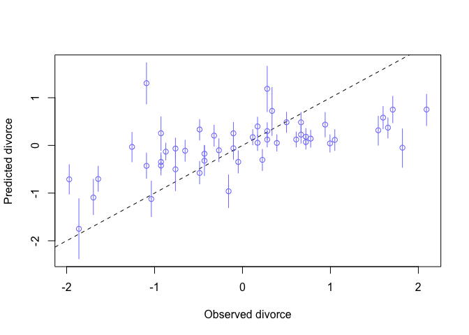<!-- -->

``` r
## R code 5.17
# identify( x=d$D , y=mu_mean , labels=d$Loc )
```

*simulate a spurrious association* assume xreal is the true variable
that causes y. Assume xspur is a spurious predictor. Assume xreal causes
both xspur and y. In this case we can think of xspur as a outcome of
xreal which we mistake for the true cause of y.

When you include both of these variables in a regression predicting y,
xspur will have a small effect.

``` r
## R code 5.18
N <- 100                         # number of cases
x_real <- rnorm( N )             # x_real as Gaussian with mean 0 and stddev 1
x_spur <- rnorm( N , x_real )    # x_spur as Gaussian with mean=x_real
y <- rnorm( N , x_real )         # y as Gaussian with mean=x_real
d <- data.frame(y,x_real,x_spur) # bind all together in data frame
pairs(d, col = rangi2)
```

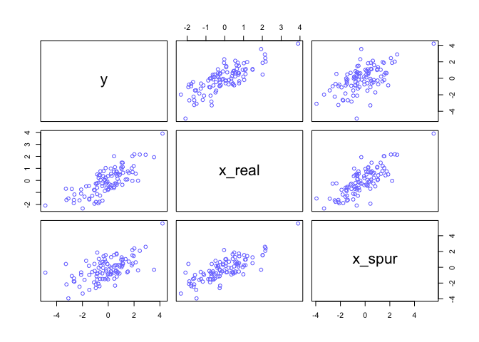<!-- -->

Assuming we have a hypothesis for the caual structure, we can simulate
how the outcome would change if we changed one parameter at a time. For
each value of thie ‘intervention variable’ we simulate from the
posterior for all other variables including the outcome. to do this we
need to know the whole DAG structure and model it in a single model.

We need to know how each variable is generated. We assume gaussian
distribution generates each.

We also need to have some question, here we are asking how would
influencing A impact the other varialbes; *to do this we need to model
something else; how A influences M* didn’t need this in m5.3 to estimate
D but now we do need it to know what the consequences of ∆A.

A counterfactual simulation of changing the values of a variable implies
a new DAG where no arrows enter the variable being manipulated (because
we manually manipulate it).

``` r
## R code 5.19
data(WaffleDivorce)
d <- list()
d$A <- standardize( WaffleDivorce$MedianAgeMarriage )
d$D <- standardize( WaffleDivorce$Divorce )
d$M <- standardize( WaffleDivorce$Marriage )

# model to learn consequence of adjusting A.  
m5.3_A <- quap(
    alist(
      ## A -> D <- M
        D ~ dnorm( mu , sigma ) ,
        mu <- a + bM*M + bA*A , # the multiple regression model for mean of D 
        # priors 
        a ~ dnorm( 0 , 0.2 ) ,
        bM ~ dnorm( 0 , 0.5 ) ,
        bA ~ dnorm( 0 , 0.5 ) ,
        sigma ~ dexp( 1 ),
      
        
        ## A -> M
        M ~ dnorm( mu_M , sigma_M ),
        mu_M <- aM + bAM*A, # the simple univariate linear regression for mean of D 
        # priors  
        aM ~ dnorm( 0 , 0.2 ),
        bAM ~ dnorm( 0 , 0.5 ),
        sigma_M ~ dexp( 1 )
    ) , data = d )

precis(m5.3_A)
```

    ##                  mean         sd       5.5%      94.5%
    ## a       -1.663428e-07 0.09707609 -0.1551465  0.1551462
    ## bM      -6.538025e-02 0.15077317 -0.3063449  0.1755844
    ## bA      -6.135128e-01 0.15098371 -0.8548140 -0.3722117
    ## sigma    7.851187e-01 0.07784356  0.6607096  0.9095277
    ## aM      -2.747247e-10 0.08684780 -0.1387996  0.1387996
    ## bAM     -6.947378e-01 0.09572687 -0.8477279 -0.5417478
    ## sigma_M  6.817365e-01 0.06757996  0.5737307  0.7897423

From this model we see bAM is negative- M and A are strongly negatively
correlated - the causal interpretation is changing A reduces M - what
happens when we change A:

``` r
## R code 5.20
A_seq <- seq( from=-2 , to=2 , length.out=30 )

## R code 5.21
# prep data
sim_dat <- data.frame( A=A_seq )

# simulate M and then D, using A_seq
# THE ORDER OF THE vars ARGUMENT IS IMPORTANT HERE 
# First we need to know the influence of A on M, 
# before we can know the joint influence of A and M on D
s <- sim( m5.3_A , data=sim_dat , vars=c("M","D") )

## R code 5.22
# this plot shows the estimated joint effect of manipulating A on D 
# given the causal model with effects A -> D and A-> M -> D
par(mfrow=c(1,2))
# simulated total A effect on D 
plot( sim_dat$A , colMeans(s$D) , ylim=c(-2,2) , type="l" ,
    xlab="manipulated A" , ylab="counterfactual D"  )
shade( object = apply(s$D,2,PI) , lim = sim_dat$A )
mtext( "Total counterfactual effect of A on D" )

# simulated effect of A on M 
plot( sim_dat$A , colMeans(s$M) , ylim=c(-2,2) , type="l" ,
    xlab="manipulated A" , ylab="counterfactual M"  )
shade( object = apply(s$D,2,PI) , lim = sim_dat$A )
mtext( "counterfactual effect of A -> M" )
```

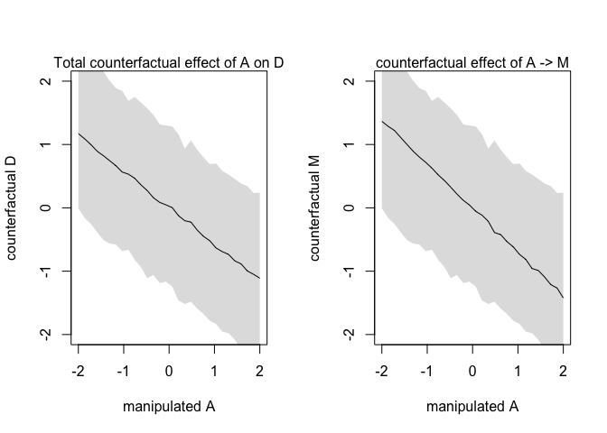<!-- -->

If we want to simulate manipulating M, we can simulate a counterfactual
for an average state values for A (which is 0 because we standardized
the variables).

``` r
## R code 5.24
sim_dat <- data.frame( M=seq(from=-2,to=2,length.out=30) , A=0 )
head(sim_dat)
```

    ##           M A
    ## 1 -2.000000 0
    ## 2 -1.862069 0
    ## 3 -1.724138 0
    ## 4 -1.586207 0
    ## 5 -1.448276 0
    ## 6 -1.310345 0

``` r
s <- sim( m5.3_A , data=sim_dat , vars="D" )
plot( sim_dat$M , colMeans(s) , ylim=c(-2,2) , type="l" ,
    xlab="manipulated M" , ylab="counterfactual D"  )
shade( apply(s,2,PI) , sim_dat$M )
mtext( "Total counterfactual effect of M on D" )
```

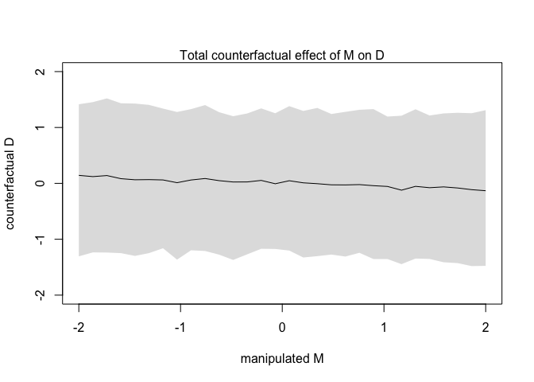<!-- -->

no evidence for a strong effect of M on D.

*Simulating counterfactuals without the sim function*  
define a range of values to assign to A  
extract posterior samples by using he model definition with the samples.
the model defines the distribution of M; convert that definition to the
corresponding simulation function–rnorm in this model.

``` r
## R code 5.25
A_seq <- seq( from=-2 , to=2 , length.out=30 )

## R code 5.26
# extract 1000 samples from the model using the samples 
post <- extract.samples( m5.3_A )
dim(post)
```

    ## [1] 10000     7

``` r
head(post)
```

    ##             a          bM         bA     sigma            aM        bAM
    ## 1  0.10406762  0.03862764 -0.5329887 0.7914565 -0.0494903809 -0.6140375
    ## 2  0.02614981 -0.13126851 -0.7373750 0.7722503 -0.0052705238 -0.8252656
    ## 3  0.10398160  0.19422539 -0.5304420 0.8139238  0.0001921837 -0.7418832
    ## 4 -0.05061325  0.03080622 -0.6058867 0.7117194  0.0744336529 -0.7363249
    ## 5  0.10708336 -0.26486829 -0.7606196 0.7067365 -0.0041000145 -0.8227664
    ## 6 -0.15837939 -0.07006958 -0.5343996 0.7670338  0.0817193911 -0.6361132
    ##     sigma_M
    ## 1 0.7049533
    ## 2 0.6549977
    ## 3 0.6841115
    ## 4 0.6865929
    ## 5 0.7035017
    ## 6 0.6699022

Now we make a dataframe with each column an age from age seq with the
corresponding normal distribution simulation of M or D using hte model
formula definition for the mean of M as the mean in the rnorm function.
With these simulated M values we can also simulate the effect of
changing A on D through
M.

``` r
# M_sim <- with(post, sapply(1:30, function(i) rnorm(n = 1e3, mean = (aM + bAM*A_seq[i]), sigma_M)))
set.seed(1990)
# for each value of A in A seq 
# make a normal distribution with n = 1000.
# ouput matrix with each column an age in age seq. 
M_sim <- with(post, 
              # 'with' doing local scoping to 'post'. instead of post$aM we just write aM. 
              sapply(1:30, function(i){
                # note we use 'aM' not 'a'. 'a' is the M5.3 model intercept for D. 
                rnorm(n = 1e3 , mean = aM + bAM*A_seq[i], sd = sigma_M)
                }) 
              )

# NOTE 
# this is how I would normally write this, this is equivalent to the above  
ls = list()
for (i in 1:length(A_seq)) {
  ls[[i]] = 
    with(post, 
         rnorm(n = 1e3, mean = aM + bAM*A_seq[i], sd = sigma_M)
         )
}
M_sim2 = do.call(cbind, ls)
all.equal(str(M_sim2), str(M_sim))
```

    ##  num [1:1000, 1:30] 0.723 1.454 2.599 1.611 2.782 ...
    ##  num [1:1000, 1:30] 0.513 1.802 0.963 1.624 1.287 ...

    ## [1] TRUE

``` r
# Now simulate D, the outcome, for each theoretical value of A. 
# the mean of D in 5.3 is defined by the multiple regression component of the model. 
## R code 5.27
D_sim <- with(post, 
              sapply( 1:30 ,
                      # bA*A_seq[i] effect of age on D 
                      # bM*M_sim[,i] the simulated effect of A -> M from the code above!  
                      function(i) rnorm(n = 1e3, mean = a + bA*A_seq[i] + bM*M_sim[,i] , sd = sigma ) 
                      ) 
              )
qplot(A_seq, colMeans(D_sim)) + 
  theme_bw() +
  ylab('total counterfactual effect of A on D') + 
  xlab('manipulated values of A') + 
  ggtitle('effect of changing A on D in m5.3 ( A -> D & A -> M -> D )')
```

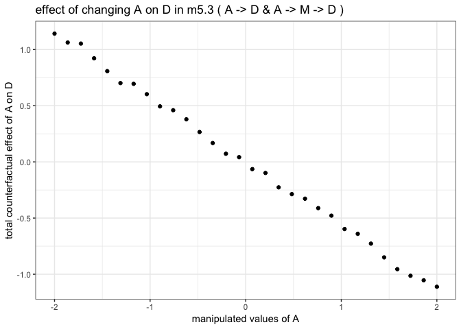<!-- -->
