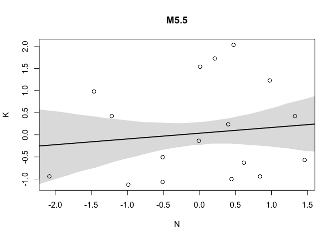

Chapter 5 The Many Variables & The Spurious Waffles
================

<!--   output: -->

<!--   html_document: -->

<!--     df_print: paged -->

<!-- editor_options: -->

<!--   chunk_output_type: inline -->

### causal inference, directed acyclic graphs, multiple regression, confounds

Note see this great discussion:
<https://github.com/paul-buerkner/brms/issues/418> relevant to contrasts
with emmeans in frequentist vs bayesian models.

### 5.1 Spurious Association

``` r
# load data and copy 
suppressMessages(library(rethinking)) 
suppressMessages(library(tidyverse)) 
data(WaffleDivorce) 
d <- WaffleDivorce

# standardize variables
d$D <- standardize( d$Divorce )
d$M <- standardize( d$Marriage )
d$A <- standardize( d$MedianAgeMarriage )
```

The linear model:  
D\[i\] ∼ Normal( µ i , σ)  
µ\[i\] = α + βA Ai  
α ∼ Normal(0, 0.2)  
βA ∼ Normal(0, 0.5)  
σ ∼ Exponential(1)

Intuition on working with the priors with data in scaled space:

If a prior on β was 1, 1 sd change in age would lead to 1sd change in
divorce. What is 1sd in age?

``` r
sd(d$MedianAgeMarriage)
```

    ## [1] 1.24363

So with a prior on β of 1, 1.24 years delta would lead to 1sd delta in
divorce. That is too strong of an effect.

Model in quap for both variables, one at a time.

``` r
m5.1 = quap(
  flist = alist(
    D ~ dnorm(mu, sigma),
    # bA is the beta for age (bA * A is βA)
    # A is standardized age as above
    mu <- a + bA * A, 
    a ~ dnorm(0, 0.2),
    # prior for the age effect 
    bA ~ dnorm(0,0.2), 
    sigma ~ dexp(1)
    ), data = d )


## R code 5.6
m5.2 <- quap(
    alist(
        D ~ dnorm( mu , sigma ) ,
        mu <- a + bM * M ,
        a ~ dnorm( 0 , 0.2 ) ,
        bM ~ dnorm( 0 , 0.5 ) ,
        sigma ~ dexp( 1 )
    ) , data = d )
```

Simulate from the priors with extract.prior and link

``` r
## R code 5.4
set.seed(10)
prior <- extract.prior(m5.1)
mu <- link(m5.1, post = prior, data = list(A = c(-2,2) )) 
plot( NULL , xlim=c(-2,2) , ylim=c(-2,2) )
for ( i in 1:50 ) lines( c(-2,2) , mu[i,] , col=col.alpha("black",0.4) )
```

<!-- -->

Posterior predictions from the model

``` r
## R code 5.5
# compute percentile interval of mean
# a vector of 30 values to input into the link function 
# corresponding to hypothetical values of A in sd space. 
A_seq <- seq( from= -3 , to=3.2 , length.out=30 )

# link - get a distribution of values for mu 
# for every value of A_seq 
# mu reflecting the mean of the outcome D at each hypothetical value of A from A_seq 
# based on the model M5.1 where we defined µ[i] as: 
# D[i] ∼ Normal( µ[i], σ)  
# µ[i] = α + βA Ai  
mu <- link(m5.1 , data=list(A=A_seq))

# dim(mu) [1] 1000   30 
# the 30 columns of mu represent 30 made up ages in age seq  
# the 1000 rows represent 1000 samples from the posterior at A = A_seq[i]

# summarize these samples for the posterior by extracting the mean value for mu 
mu.mean <- apply(mu, 2, mean)
mu.PI <- apply( mu , 2 , PI )

# plot the actual data of each state D vs A.  
plot(D ~ A, data=d , col=rangi2)
# plot the average value for the line from the posterior of lines 
lines(x = A_seq, y = mu.mean, lwd=2 )
# plot the percentile interval 
shade(mu.PI , A_seq)
```

<!-- -->

Here is a comparison of the coefficient estimate with a frequentist lm

``` r
coef(lm(D~A, data = d))[2]
```

    ##          A 
    ## -0.5972392

``` r
precis(object = m5.1)[2, ]$mean
```

    ## [1] -0.4500292

DAGs - see in depth lecture notes.

DAGs provide a way to decide on which variables to condition estimates
on in a principled way, provided one has a scientific model about the
way that the variables relate to one another.

Most of the examples introduced in ch 5,6 have time-dependence in their
relationships. How do we know to draw the directions of the arrows like
this?

``` r
## R code 5.7
library(dagitty)
dag5.1 <- dagitty( "dag{ A -> D; A -> M; M -> D }" )
coordinates(dag5.1) <- list( x=c(A=0,D=1,M=2) , y=c(A=0,D=1,M=0) )
drawdag( dag5.1 )
```

<!-- -->

A - Age at marriage  
M - marriage rate  
D - divorce rate

Here the arrow of time dictates the possible causal paths, to some
degree this is possible in systems level datasets, if T = transcription
of some gene genotype -\> T and not T -\> genotype, this is the basis of
the intermediate phenotype concept of eQTL studies.

Time-dependence dictates the relationships reason we know how to draw
arrows from A to M and D and from M to D.  
A -\> D ; have to be married before D, it could influence because
younger people may change at a faster rate.  
A -\> M -\> D ; indirect effect by lowering age at marriage, therate
icreases b/c there are more young people who haven’t died to get
married.

**Conditional independencies are testable implications** Any DAG may
imply some variables are independent of others under certain conditions.
These are the model’s testable implications/ conditional independencies,
come in 2 forms:  
1\) Statements of which variables should be associated with one another
(or not) in the data. 2) Statements of which variables become
dis-associated when we condition on some other set of variables.

We can algorithmically find the conditional independencies implied by
the model, for example the

``` r
DMA_dag2 <- dagitty('dag{ D <- A -> M }') 
drawdag(DMA_dag2)
```

<!-- -->

``` r
impliedConditionalIndependencies( DMA_dag2 )
```

    ## D _||_ M | A

Read this as "D is independent of M, Conditioned on A. This is for model
2 where

``` r
DMA_dag1 <- dagitty('dag{ D <- A -> M -> D }') 
drawdag(DMA_dag1)
```

<!-- -->

``` r
impliedConditionalIndependencies( DMA_dag1 )
```

There is no output:

The testable implications of DMA\_dag1 are that all pairs of variables
should be associated, whatever we condition on.  
The testable implications of DMA\_dag1 are that all pairs of variables
should be associated, before conditioning on anything, but also that S
is independent on M after condititioning on A.

A multiple regression model will condition on A so the above gives us a
principled way to decide to condition on A.

The multiple regression model asks:  
If we already know marriage rate, what additional value does knowing age
at marriage add?  
If we already know age at marriage, what additional value does knowing
marriage rate add?

### 5.1.3 (p135) Multiple regression notation

The mean of the outcome variable is a modeled as the sum of intercept+
an additive combination of products of parameters (betas) and
predictors. Since the predictors have different values, the mean will
again depend on i.

µi = α + βmMi + βaAi  
*Note p 136 box on forms of the notation*

D\[i\] ∼ Normal(µi, σ) – the outcome D is distributed normally with mean
µ dependent of row i with sd sigma.  
µ\[i\] = α + βM \* M\[i\] + βA \* Ai – the mean oud outdcome depends on
the row and is a combination of effect of A and M (i.e. µ\[i\] = α + βx1
+ βx2)  
α ∼ Normal(0, 0.2) – The prior for the intercept is normally
distributed  
βM ∼ Normal(0, 0.5) – prior for the effect of M is normally
distributed  
βA ∼ Normal(0, 0.5) – prior for the effect of A is normally
distributed  
σ ∼ Exponential(1) – prior for standard deviation of D is normal

Quap code:

``` r
## R code 5.10
m5.3 <- quap(
    alist(
        D ~ dnorm( mu , sigma ),
        mu <- a + bM*M + bA*A, # deterministic component of model, use assignment operator <- 
        a ~ dnorm( 0 , 0.2 ),
        bM ~ dnorm( 0 , 0.5 ),
        bA ~ dnorm( 0 , 0.5 ),
        sigma ~ dexp( 1)
    ) , data = d )
precis( m5.3 )
```

    ##                mean         sd       5.5%      94.5%
    ## a     -1.100372e-05 0.09708000 -0.1551636  0.1551416
    ## bM    -6.537672e-02 0.15078010 -0.3063524  0.1755990
    ## bA    -6.135168e-01 0.15099056 -0.8548289 -0.3722047
    ## sigma  7.851600e-01 0.07785376  0.6607347  0.9095854

m5.1: D ~ A  
m5.2 D ~ M  
m5.3 D ~ M+A

``` r
plot(
  coeftab(m5.1, m5.2, m5.3), 
  par=c("bA","bM")
  )
```

<!-- -->

Interpretation of the above: M is only associated with D when Age is not
in the model. Once we know age at marriage A, there is no additional
predictive power in knowin rate of marriage M.

From a predictive standpoint M adds value to predicting D if you don’t
know A, but this model is telling us *because we have the DAG*, that the
association M -\> D is a spurious relationship **that is caused by the
influence of Age on both Marriage rate and Divorce**.

Parameter estimate interpretation always depends on the DAG / causal
model. Often on set of parameter values are consistent with many causal
models = **markov equivalence**.

Visualizing the multiple regression posteriors to get a feel for teh
influence of the conditional independences.

1)  Predictor residual plots: outcome ~ residual(m.1) help understand
    the model.

2)  Posterior prediction plots: model-based predictions vs raw data.
    useful for checking fit / predictions.

3)  Counterfactual plots: implied predictions for imaginary experiments.
    Explore causal implications of manipulating variables.

### 5.1.5.1 predictor residual plots

Average prediction error when we use all other predictor variables to
model a *predictor* of interest. So we make a model of M here using A.

``` r
## R code 5.13
m5.4 <- quap(
    alist(
        M ~ dnorm( mu , sigma ) ,
        mu <- a + bAM * A ,
        a ~ dnorm( 0 , 0.2 ) ,
        bAM ~ dnorm( 0 , 0.5 ) ,
        sigma ~ dexp( 1 )
    ) , data = d )

## R code 5.14
mu <- link(m5.4)
mu_mean <- apply( mu , 2 , mean )

# compute the residual for M after regressing on A 
# subtract observed marriage rate from the model predicted rate 
# based on the model above
mu_resid <- d$M - mu_mean

## R code 5.15
# call link without specifying new data
# so it uses original data
mu <- link( m5.3 )

# summarize samples across cases
mu_mean <- apply( mu , 2 , mean )
mu_PI <- apply( mu , 2 , PI )

# simulate observations
# again no new data, so uses original data
D_sim <- sim( m5.3 , n=1e4 )
D_PI <- apply( D_sim , 2 , PI )

## R code 5.16
plot( mu_mean ~ d$D , col=rangi2 , ylim=range(mu_PI) ,
    xlab="Observed divorce" , ylab="Predicted divorce" )
abline( a=0 , b=1 , lty=2 )
for ( i in 1:nrow(d) ) lines( rep(d$D[i],2) , mu_PI[,i] , col=rangi2 )
```

<!-- -->

Plotting the residuals against the outcome:

``` r
plot(d$D ~ mu_resid, col = rangi2, xlab = 'marriage rate residual')
```

<!-- --> The plot above
shows the linear relationship between divorce and marriage rates, having
“controlled” for median age of marriage.  
Average divorce rate on both sides of 0 is about the same there is
little relationship between divorce and marriage rates conditional on A.

multiple regression measures the *remaining* association *of each
predictor* with the outcome, *after already knowing the other
predictors.*

### 5.1.5.2. Posterior prediction plots

posterior predictive check by simulating predictions averaging over the
posterior to see where / how the model fails. Note linear models are
skeptical of extreme values and ‘expect’ regression to the mean. The
simulation below shows the model underpredicts D for states with very
high actual D and visa versa. Another use in this is finding what the
outliers are and understanding them in this contrived example we know
mormon population density dictates the outlier states

``` r
## R code 5.15
# call link without specifying new data
# so it uses original data
# this outputs a posterior distribution estimate for predicted D 
# for every state 
mu <- link( m5.3 )

# summarize samples from the posterior across cases
mu_mean <- apply( mu , 2 , mean )
mu_PI <- apply( mu , 2 , PI )

# simulate observations
# again no new data, so uses original data
D_sim <- sim( m5.3 , n=1e4 )
D_PI <- apply( D_sim , 2 , PI )

## R code 5.16
plot(mu_mean ~ d$D, col=rangi2 , ylim=range(mu_PI),
     xlab="Observed divorce", ylab="Predicted divorce")
# show identity line 
abline(a=0, b=1, lty=2)
for ( i in 1:nrow(d) ) lines( rep(d$D[i],2) , mu_PI[,i] , col=rangi2 )
```

<!-- -->

``` r
## R code 5.17
# identify( x=d$D , y=mu_mean , labels=d$Loc )
```

*simulate a spurrious association* assume xreal is the true variable
that causes y. Assume xspur is a spurious predictor. Assume xreal causes
both xspur and y. In this case we can think of xspur as a outcome of
xreal which we mistake for the true cause of y.

When you include both of these variables in a regression predicting y,
xspur will have a small effect.

``` r
## R code 5.18
N <- 100                         # number of cases
x_real <- rnorm( N )             # x_real as Gaussian with mean 0 and stddev 1
x_spur <- rnorm( N , x_real )    # x_spur as Gaussian with mean=x_real
y <- rnorm( N , x_real )         # y as Gaussian with mean=x_real
d <- data.frame(y,x_real,x_spur) # bind all together in data frame
pairs(d, col = rangi2)
```

<!-- -->

### 5.1.5.3 counterfactual plots

Assuming we have a hypothesis for the caual structure, we can simulate
how the outcome would change if we changed one parameter at a time. For
each value of thie ‘intervention variable’ we simulate from the
posterior for all other variables including the outcome. to do this we
need to know the whole DAG structure and model it in a single model.

We need to know how each variable is generated. We assume gaussian
distribution generates each.

We also need to have some question, here we are asking how would
influencing A impact the other varialbes; *to do this we need to model
something else; how A influences M* didn’t need this in m5.3 to estimate
D but now we do need it to know what the consequences of ∆A.

A counterfactual simulation of changing the values of a variable implies
a new DAG where no arrows enter the variable being manipulated (because
we manually manipulate it).

``` r
## R code 5.19
data(WaffleDivorce)
d <- list()
d$A <- standardize( WaffleDivorce$MedianAgeMarriage )
d$D <- standardize( WaffleDivorce$Divorce )
d$M <- standardize( WaffleDivorce$Marriage )

# model to learn consequence of adjusting A.  
m5.3_A <- quap(
    alist(
      ## A -> D <- M
        D ~ dnorm( mu , sigma ) ,
        mu <- a + bM*M + bA*A , # the multiple regression model for mean of D 
        # priors 
        a ~ dnorm( 0 , 0.2 ) ,
        bM ~ dnorm( 0 , 0.5 ) ,
        bA ~ dnorm( 0 , 0.5 ) ,
        sigma ~ dexp( 1 ),
      
        
        ## A -> M
        M ~ dnorm( mu_M , sigma_M ),
        mu_M <- aM + bAM*A, # the simple univariate linear regression for mean of D 
        # priors  
        aM ~ dnorm( 0 , 0.2 ),
        bAM ~ dnorm( 0 , 0.5 ),
        sigma_M ~ dexp( 1 )
    ) , data = d )

precis(m5.3_A)
```

    ##                  mean         sd       5.5%      94.5%
    ## a       -1.663428e-07 0.09707609 -0.1551465  0.1551462
    ## bM      -6.538025e-02 0.15077317 -0.3063449  0.1755844
    ## bA      -6.135128e-01 0.15098371 -0.8548140 -0.3722117
    ## sigma    7.851187e-01 0.07784356  0.6607096  0.9095277
    ## aM      -2.747247e-10 0.08684780 -0.1387996  0.1387996
    ## bAM     -6.947378e-01 0.09572687 -0.8477279 -0.5417478
    ## sigma_M  6.817365e-01 0.06757996  0.5737307  0.7897423

From this model we see bAM is negative- M and A are strongly negatively
correlated - the causal interpretation is changing A reduces M - what
happens when we change A:

``` r
## R code 5.20
A_seq <- seq( from=-2 , to=2 , length.out=30 )

## R code 5.21
# prep data
sim_dat <- data.frame( A=A_seq )

# simulate M and then D, using A_seq
# THE ORDER OF THE vars ARGUMENT IS IMPORTANT HERE 
# First we need to know the influence of A on M, 
# before we can know the joint influence of A and M on D
s <- sim( m5.3_A , data=sim_dat , vars=c("M","D") )

## R code 5.22
# this plot shows the estimated joint effect of manipulating A on D 
# given the causal model with effects A -> D and A-> M -> D
par(mfrow=c(1,2))
# simulated total A effect on D 
plot( sim_dat$A , colMeans(s$D) , ylim=c(-2,2) , type="l" ,
    xlab="manipulated A" , ylab="counterfactual D"  )
shade( object = apply(s$D,2,PI) , lim = sim_dat$A )
mtext( "Total counterfactual effect of A on D" )

# simulated effect of A on M 
plot( sim_dat$A , colMeans(s$M) , ylim=c(-2,2) , type="l" ,
    xlab="manipulated A" , ylab="counterfactual M"  )
shade( object = apply(s$D,2,PI) , lim = sim_dat$A )
mtext( "counterfactual effect of A -> M" )
```

<!-- -->

If we want to simulate manipulating M, we can simulate a counterfactual
for an average state values for A (which is 0 because we standardized
the variables).

``` r
## R code 5.24
sim_dat <- data.frame( M=seq(from=-2,to=2,length.out=30) , A=0 )
head(sim_dat)
```

    ##           M A
    ## 1 -2.000000 0
    ## 2 -1.862069 0
    ## 3 -1.724138 0
    ## 4 -1.586207 0
    ## 5 -1.448276 0
    ## 6 -1.310345 0

``` r
s <- sim( m5.3_A , data=sim_dat , vars="D" )
plot( sim_dat$M , colMeans(s) , ylim=c(-2,2) , type="l" ,
    xlab="manipulated M" , ylab="counterfactual D"  )
shade( apply(s,2,PI) , sim_dat$M )
mtext( "Total counterfactual effect of M on D" )
```

<!-- -->

no evidence for a strong effect of M on D.

*Simulating counterfactuals without the sim function*  
define a range of values to assign to A  
extract posterior samples by using he model definition with the samples.
the model defines the distribution of M; convert that definition to the
corresponding simulation function–rnorm in this model.

``` r
## R code 5.25
A_seq <- seq( from=-2 , to=2 , length.out=30 )

## R code 5.26
# extract 1000 samples from the model using the samples 
post <- extract.samples( m5.3_A )
dim(post)
```

    ## [1] 10000     7

``` r
head(post)
```

    ##             a          bM         bA     sigma            aM        bAM
    ## 1  0.10406762  0.03862764 -0.5329887 0.7914565 -0.0494903809 -0.6140375
    ## 2  0.02614981 -0.13126851 -0.7373750 0.7722503 -0.0052705238 -0.8252656
    ## 3  0.10398160  0.19422539 -0.5304420 0.8139238  0.0001921837 -0.7418832
    ## 4 -0.05061325  0.03080622 -0.6058867 0.7117194  0.0744336529 -0.7363249
    ## 5  0.10708336 -0.26486829 -0.7606196 0.7067365 -0.0041000145 -0.8227664
    ## 6 -0.15837939 -0.07006958 -0.5343996 0.7670338  0.0817193911 -0.6361132
    ##     sigma_M
    ## 1 0.7049533
    ## 2 0.6549977
    ## 3 0.6841115
    ## 4 0.6865929
    ## 5 0.7035017
    ## 6 0.6699022

Now we make a dataframe with each column an age from age seq with the
corresponding normal distribution simulation of M or D using hte model
formula definition for the mean of M as the mean in the rnorm function.
With these simulated M values we can also simulate the effect of
changing A on D through
M.

``` r
# M_sim <- with(post, sapply(1:30, function(i) rnorm(n = 1e3, mean = (aM + bAM*A_seq[i]), sigma_M)))
set.seed(1990)
# for each value of A in A seq 
# make a normal distribution with n = 1000.
# ouput matrix with each column an age in age seq. 
M_sim <- with(post, 
              # 'with' doing local scoping to 'post'. instead of post$aM we just write aM. 
              sapply(1:30, function(i){
                # note we use 'aM' not 'a'. 'a' is the M5.3 model intercept for D. 
                rnorm(n = 1e3 , mean = aM + bAM*A_seq[i], sd = sigma_M)
                }) 
              )


# I would normally structure like below, this is equivalent to above  
ls = list()
for (i in 1:length(A_seq)) {
  ls[[i]] = 
    with(post, 
         rnorm(n = 1e3, mean = aM + bAM*A_seq[i], sd = sigma_M)
         )
}
M_sim2 = do.call(cbind, ls)
all.equal(str(M_sim2), str(M_sim))
```

    ##  num [1:1000, 1:30] 0.723 1.454 2.599 1.611 2.782 ...
    ##  num [1:1000, 1:30] 0.513 1.802 0.963 1.624 1.287 ...

    ## [1] TRUE

``` r
# Now simulate D, the outcome, for each theoretical value of A. 
# the mean of D in 5.3 is defined by the multiple regression component of the model. 
## R code 5.27
D_sim <- with(post, 
              sapply( 1:30 ,
                      # bA*A_seq[i] effect of age on D 
                      # bM*M_sim[,i] the simulated effect of A -> M from the code above!  
                      function(i) rnorm(n = 1e3, mean = a + bA*A_seq[i] + bM*M_sim[,i] , sd = sigma ) 
                      ) 
              )
qplot(A_seq, colMeans(D_sim)) + 
  theme_bw() +
  ylab('total counterfactual effect of A on D') + 
  xlab('manipulated values of A') + 
  ggtitle('effect of changing A on D in m5.3 ( A -> D & A -> M -> D )')
```

<!-- -->

## 5.2 masked relationships

Key insights p 151 top.

Using multiple predictors can reveal a relationship with outcome when
the bivariate relationships are not apparent - this happens when:  
2 predictors are correlated with one another, one is positively
associated with outcome other is negatively associated with outcome.

*Dataset: composition of milk across primate species*  
looking at mass, neocortex percentage, calories in milk. One hypothesis
from life history perspective is that larger brains require more
energetic milk to help brain grow quickly. var `neocortex.perc` below is
the percentage of brain mass that is neocortex percentage.

K = calories in milk  
N = percent of brain that is neocortex  
M = log body mass of primate

``` r
## R code 5.28
library(rethinking)
data(milk)
d <- milk
str(d)
```

    ## 'data.frame':    29 obs. of  8 variables:
    ##  $ clade         : Factor w/ 4 levels "Ape","New World Monkey",..: 4 4 4 4 4 2 2 2 2 2 ...
    ##  $ species       : Factor w/ 29 levels "A palliata","Alouatta seniculus",..: 11 8 9 10 16 2 1 6 28 27 ...
    ##  $ kcal.per.g    : num  0.49 0.51 0.46 0.48 0.6 0.47 0.56 0.89 0.91 0.92 ...
    ##  $ perc.fat      : num  16.6 19.3 14.1 14.9 27.3 ...
    ##  $ perc.protein  : num  15.4 16.9 16.9 13.2 19.5 ...
    ##  $ perc.lactose  : num  68 63.8 69 71.9 53.2 ...
    ##  $ mass          : num  1.95 2.09 2.51 1.62 2.19 5.25 5.37 2.51 0.71 0.68 ...
    ##  $ neocortex.perc: num  55.2 NA NA NA NA ...

``` r
## R code 5.29
d$K <- standardize( d$kcal.per.g )
d$N <- standardize( d$neocortex.perc )
d$M <- standardize( log(d$mass) )

## R code 5.30
# m5.5_draft <- quap(
#     alist(
#         K ~ dnorm( mu , sigma ) ,
#         mu <- a + bN*N ,
#         a ~ dnorm( 0 , 1 ) ,
#         bN ~ dnorm( 0 , 1 ) ,
#         sigma ~ dexp( 1 )
#     ) , data=d )
```

The model above produces an error: Error in quap(alist(K ~ dnorm(mu,
sigma), mu \<- a + bN \* N, a ~ dnorm(0, : initial value in ‘vmmin’ is
not finite The start values for the parameters were invalid. This could
be caused by missing values (NA) in the data or by start values outside
the parameter constraints. If there are no NA values in the data, try
using explicit start values.

This is due to passing a vector with NA values to a likelihood function
like `dnorm`. For now we will do `complete.cases` analysis and use weak
priors, do prior predictive simulation.

We are predicting the outcome K- calories in milk as a function of other
variables in different primate species.

``` r
## R code 5.31
# d$neocortex.perc

## R code 5.32
dcc <- d[complete.cases(d$K,d$N,d$M) , ]

## R code 5.33
m5.5_draft <- quap(
    alist(
        K ~ dnorm( mu , sigma ) ,
        mu <- a + bN*N ,
        a ~ dnorm( 0 , 1 ) ,
        bN ~ dnorm( 0 , 1 ) ,
        sigma ~ dexp( 1 )
    ) , data=dcc )

## R code 5.34
prior <- extract.prior( m5.5_draft )
xseq <- c(-2,2)
mu <- link( m5.5_draft , post=prior , data=list(N=xseq) )
plot( NULL , xlim=xseq , ylim=xseq , main = 'weak priors')
for ( i in 1:50 ) lines( xseq , mu[i,] , col=col.alpha("black",0.3))
```

<!-- -->

These priors imply impossible relationships. Using a smaller alpha
parameter and smaller sigma on the slope:

``` r
## R code 5.35
m5.5 <- quap(
    alist(
        K ~ dnorm( mu , sigma ) ,
        mu <- a + bN*N ,
        # prior for a 
        a ~ dnorm( 0 , 0.2 ) ,
        bN ~ dnorm( 0 , 0.5 ) ,
        sigma ~ dexp( 1 )
    ) , data=dcc )

## R code 5.34
prior <- extract.prior( m5.5 )
xseq <- c(-2,2)
mu <- link( m5.5_draft , post=prior , data=list(N=xseq) )
plot( NULL , xlim=xseq , ylim=xseq , main = 'smaller bN sd and smaller alpha')
for ( i in 1:50 ) lines( xseq , mu[i,] , col=col.alpha("black",0.3))
```

<!-- -->

``` r
## R code 5.36
precis( m5.5 )
```

    ##             mean        sd       5.5%     94.5%
    ## a     0.03994029 0.1544907 -0.2069658 0.2868463
    ## bN    0.13323422 0.2237468 -0.2243564 0.4908249
    ## sigma 0.99982010 0.1647080  0.7365850 1.2630552

The standard deviation of the relationship is 2x the posterior mean.
visualizing the posterior.

``` r
## R code 5.37
# sequence of x values for plot
xseq <- seq( from=min(dcc$N)-0.15 , to=max(dcc$N)+0.15 , length.out=30 )

# link to predict the outcome mean from the model 
# when using simulated data for the predictor N 
# produces matrix with columns  = X seq values 
# values are posterior distributions for mu
mu <- link( m5.5 , data=list(N=xseq) )

# summarize the mu values for each x seq 
mu_mean <- apply(mu,2,mean)
mu_PI <- apply(mu,2,PI)

# visualize the actual data vs the model 
plot( K ~ N , data=dcc, main = 'M5.5' )
lines( xseq , mu_mean , lwd=2 )
shade( mu_PI , xseq )
```

<!-- -->

Now fit a univariate model of body mass M predicting calories in milk K
and plot the posterior

``` r
# same as above
## R code 5.38
m5.6 <- quap(
    alist(
        K ~ dnorm( mu , sigma ) ,
        mu <- a + bM*M,
        a ~ dnorm( 0 , 0.2 ) ,
        bM ~ dnorm( 0 , 0.5 ) ,
        sigma ~ dexp( 1 )
    ) , data=dcc )
precis(m5.6)
```

    ##              mean        sd       5.5%      94.5%
    ## a      0.04680829 0.1512845 -0.1949735 0.28859007
    ## bM    -0.28262660 0.1928969 -0.5909131 0.02565991
    ## sigma  0.94937676 0.1571028  0.6982961 1.20045736

``` r
# plot posterior vs data 
xseq <- seq( from=min(dcc$N)-0.15 , to=max(dcc$N)+0.15 , length.out=30 )
mu <- link( m5.6, data = list(M = xseq))

# visualize the actual data vs the model 
plot( K ~ N , data=dcc, main = 'M5.6' )
lines( xseq , apply(mu,2,mean) , lwd=2 )
shade( apply(mu,2,PI) , xseq )
```

<!-- -->

Association of mass is negative but highly uncertain, like association
of cortex percent.

Adding both predictors:

``` r
m5.7 <- quap(
  flist = alist(
    #outcome 
    K ~ dnorm(mu,sigma), 
    # model 
    mu <- a + bN*N + bM*M, 
    # priors 
     a ~ dnorm( 0 , 0.2 ) ,
        bN ~ dnorm( 0 , 0.5 ) ,
        bM ~ dnorm( 0 , 0.5 ) ,
        sigma ~ dexp( 1 )
    ) , data=dcc )
  
precis(m5.7)
```

    ##              mean        sd       5.5%      94.5%
    ## a      0.06799174 0.1339987 -0.1461640  0.2821475
    ## bN     0.67511736 0.2482986  0.2782882  1.0719465
    ## bM    -0.70299057 0.2207870 -1.0558509 -0.3501302
    ## sigma  0.73801430 0.1324618  0.5263147  0.9497139

By including both predictors in the regression, the association of both
with outcome has increased:

``` r
## R code 5.40
plot( coeftab( m5.5 , m5.6 , m5.7 ) , pars=c("bM","bN") )
```

<!-- -->

``` r
pairs(dcc[,c('K','M', 'N')])
```

<!-- -->

see p 151, Multiple DAGs imply the same *contitional independences* -
there are no contidional independences. Since they produce the same
cond. indep. the DAGs are a *markov equivalence set.*

Assume the following DAG structure with an unknown variable U.  
M -\> K  
N -\> K  
M \<- U -\> K

We can make the counterfactual plots to see how m5.7 sees the
association between each variable on the outcome. The counterfactual
plot manipulates M and N, breaking the influence of U. We simulate
values for the posterior distribution of mu (of K) from m5.7 using
simulated values with N held fixed at 0 for a series of M, visa versa

``` r
## R code 5.41
# simulate 30 M values 
xseq <- seq(from=min(dcc$M)-0.15, to=max(dcc$M)+0.15, length.out=30)
mu <- link( m5.7 , data=data.frame( M=xseq , N=0 ) ) # hold N at 0
plot( NULL , xlim=range(dcc$M) , ylim=range(dcc$K), ylab = "K", xlab = "Msim", main = 'counterfactual; N = 0')
lines( xseq , apply(mu,2,mean) , lwd=2 )
shade( apply(mu,2,PI) , xseq )
```

<!-- -->

``` r
# simulate 
xseq <- seq(from=min(dcc$N)-0.15, to=max(dcc$N)+0.15, length.out=30)
mu <- link( m5.7 , data=data.frame( M=0 , N=xseq ) ) # hold M at 0
# plot 
plot( NULL , xlim=range(dcc$N) , ylim=range(dcc$K), ylab = "K", xlab = "Nsim", main = 'counterfactual; M = 0')
lines( xseq , apply(mu,2,mean) , lwd=2 )
shade( apply(mu,2,PI) , xseq )
```

<!-- -->

Simulating a masking relationship conditional on some DAG: the key is
understanding why we do `K <- rnorm( n = n , mean = N - M )` N - M. see
below.

There is a masking pattern: the slopes become more extreme in m5.7

I ‘cheat’ here and use the least squares estimates for simplicity.

Given this DAG:

``` r
dag = dagitty::dagitty("dag{ 
M -> K <- N
M -> N }")
drawdag(dag)  
```

<!-- -->

*simulate data* where 2 meaningful predictors M and N act to mask one
another.

``` r
n <- 100
# M causes N ; both influence K 
## R code 5.42
# M -> K <- N
# M -> N
M <- rnorm( n = n )
N <- rnorm( n = n , mean =  M )
K <- rnorm( n = n , mean =  N - M )
d_sim <- data.frame(K=K,N=N,M=M)

m5.5 = lm(K ~ N, d_sim)
m5.6 = lm(K ~ M, d_sim)
m5.7 = lm(K ~ N + M, d_sim)
plot(coeftab(m5.5,m5.6,m5.7), pars=c('M','N'), main ='simulation of a masking relationship')
```

<!-- -->

Computing the *Markov equivalence* set of DAGs for the model above:

``` r
## R code 5.44
library(dagitty)
dag5.7 <- dagitty( "dag{
    M -> K <- N
    M -> N }" )
coordinates(dag5.7) <- list( x=c(M=0,K=1,N=2) , y=c(M=0.5,K=1,N=0.5) )
MElist <- equivalentDAGs(dag5.7)
drawdag(MElist)
```

<!-- -->

# 5.3 categorical variables

How are factor variables computationally represented in GLMs?

Typically ive worked with the indicator approach for qr factorization in
limma: chapter 4 <http://genomicsclass.github.io/book/>. This is also
what lm does.

Indicator variables vs index variables. Indicator aka dummy variables,
turn “on” parameters for certain observations. sex M F M = 1. the
interpretation for alpha becomes the outcome for females only and the
beta gives you the difference between male and female. The key insight
is that with a bayesian model, using indicator variables makes
estimating the prior harder becuse we need 2 parameters the female
effect and the difference between male and female.

Index variable is just a value 1, 2, 3, etc for each category. Makes
estimating priors easier.

indicator variables are used with the design matrix approach. Index
variables are used with multilevel models, learning index approach helps
understand computational fit of multilevel models.

### 5.3.1 binary categories

male as an indicator variable has value 1.

``` r
## R code 5.45
data(Howell1)
d <- Howell1
str(d)
```

    ## 'data.frame':    544 obs. of  4 variables:
    ##  $ height: num  152 140 137 157 145 ...
    ##  $ weight: num  47.8 36.5 31.9 53 41.3 ...
    ##  $ age   : num  63 63 65 41 51 35 32 27 19 54 ...
    ##  $ male  : int  1 0 0 1 0 1 0 1 0 1 ...

Model with male indicator.

h i ∼ Normal( µ i , σ)  
µ i = α + β m mi  
α ∼ Normal(178, 20)  
β m ∼ Normal(0, 10)  
σ ∼ Uniform(0, 50)

When M = 1, µi is multiplied by bM. When M = 0 (female) µi multiplied by
0 which makes the linear model µi = alpha. *alpha now has a different
interpretation* it is the average *for females* because of the
indicator. beta is then the difference or the male effect. In the
bayesian model, there is more uncertainty about one category in the
priors arbitrarily. Male has 2 priors the average and the difference
*making the prior distribution wider*

``` r
## R code 5.46
mu_female <- rnorm(1e4,178,20)
mu_male <- rnorm(1e4,178,20) + rnorm(1e4,0,10)
qplot( mu_female );
```

    ## `stat_bin()` using `bins = 30`. Pick better value with `binwidth`.

<!-- -->

``` r
qplot( mu_male ) 
```

    ## `stat_bin()` using `bins = 30`. Pick better value with `binwidth`.

<!-- -->

*Index variable approach*

statistical model for index variable model:

h\[i\] ∼ Normal(µi, σ)  
µ\[i\] = αsex\[i\]  
*α\[j\] ∼ Normal(178, 20) , for j = 1..2* σ ∼ Uniform(0, 50)

The step in bold creates a LIST of alpha parameters, one for each value
in the index variable. Now the categories can get the same priors if we
think prior to seeing the data, there is no difference.

*index variable model with a contrast to test categorical differences*
See book p 162  
**A common error in interpretation of parameter estimates is to suppose
that because one parameter is sufficiently far from zero—is
“significant”—and another parameter is not—is “not significant”—that
the difference between the parameters is also significant. This is not
necessarily so. source 83 - Gelman paper. This isn’t just an issue for
non-Bayesian analysis: If you want to know the distribution of a
difference, then you must compute that difference, a contrast.**

``` r
## R code 5.47
d$sex <- ifelse(d$male==1, 2 , 1 )

## R code 5.48

m5.8 <- quap(
    alist(
        height ~ dnorm( mu , sigma ) ,
        mu <- a[sex] ,
        a[sex] ~ dnorm( 178 , 20 ) ,
        sigma ~ dunif( 0 , 50 )
    ) , data=d )
precis( m5.8 , depth=2 ) # depth = 2 means show vector parameter estimates like the one we just specified. 
```

    ##            mean        sd      5.5%     94.5%
    ## a[1]  134.91106 1.6068884 132.34294 137.47918
    ## a[2]  142.57840 1.6974252 139.86559 145.29121
    ## sigma  27.30918 0.8279833  25.98591  28.63246

``` r
## R code 5.49
post <- extract.samples(m5.8)

# manually compute the contrast 
post$diff_fm <- post$a[,1] - post$a[,2]
precis( post , depth=2 )
```

    ##               mean        sd      5.5%      94.5%     histogram
    ## sigma    27.316679 0.8213908  25.99641  28.635458 ▁▁▁▁▃▅▇▇▃▂▁▁▁
    ## a[1]    134.905066 1.6295318 132.32795 137.484631 ▁▁▁▂▅▇▇▅▂▁▁▁▁
    ## a[2]    142.578477 1.7027387 139.83974 145.284457 ▁▁▁▂▃▇▇▇▃▂▁▁▁
    ## diff_fm  -7.673411 2.3878915 -11.47846  -3.833166    ▁▁▁▃▇▇▃▁▁▁

Great discussion between brms and emmeans developers\!

<https://github.com/paul-buerkner/brms/issues/418>

### 5.3.2

Many categories – can usethe same index variable approach.

``` r
## R code 5.50
data(milk)
d <- milk
levels(d$clade)
```

    ## [1] "Ape"              "New World Monkey" "Old World Monkey"
    ## [4] "Strepsirrhine"

``` r
## R code 5.51
d$clade_id <- as.integer( d$clade )

## R code 5.52
d$K <- standardize( d$kcal.per.g )

# fit model 
m5.9 <- quap(
    alist(
        K ~ dnorm( mu , sigma ),
        mu <- a[clade_id],
        a[clade_id] ~ dnorm( 0 , 0.5 ),
        sigma ~ dexp( 1 )
    ) , data=d )


# plot posterior distributions 
# make labels for alpha variables 
labels <- paste( "a[" , 1:4 , "]:" , levels(d$clade) , sep="" )
# plot posteriors 
plot(
  precis(m5.9, depth = 2, pars = "a"), 
  labels = labels, xlab = "expected kcal (std)" 
  )
```

<!-- -->

``` r
## R code 5.53
set.seed(63)
d$house <- sample( rep(1:4,each=8) , size=nrow(d) )

## R code 5.54
m5.10 <- quap(
    alist(
        K ~ dnorm( mu , sigma ),
        mu <- a[clade_id] + h[house],
        a[clade_id] ~ dnorm( 0 , 0.5 ),
        h[house] ~ dnorm( 0 , 0.5 ),
        sigma ~ dexp( 1 )
    ) , data=d )
```

see book for written answers

5E1. Which of the linear models below are multiple linear regressions?

1)  µ i = α + β xi

2)  µ i = β x x i + β z zi (3) µ i = α + β (x i − z i )

3)  µ i = α + β x x i + β z zi

5E2. Write down a multiple regression to evaluate the claim: Animal
diversity is linearly related to latitude, but only after controlling
for plant diversity. You just need to write down the model definition.

5E3. Write down a multiple regression to evaluate the claim: Neither
amount of funding nor size of laboratory is by itself a good predictor
of time to PhD degree; but together these variables are both positively
associated with time to degree. Write down the model definition and
indicate which side of zero each slope parameter should be on.

5E4. Suppose you have a single categorical predictor with 4 levels
(unique values), labeled A, B, C and D. Let A i be an indicator variable
that is 1 where case i is in category A. Also suppose B i , C i , and D
i for the other categories. Now which of the following linear models are
inferentially equivalent ways to include the categorical variable in a
regression? Models are inferentially equivalent when it’s possible to
compute one posterior distribution from the posterior distribution of
another model.

1)  µ i = α + β A A i + β B B i + β D Di

2)  µ i = α + β A A i + β B B i + β C C i + β D Di

3)  µ i = α + β B B i + β C C i + β D Di

4)  µ i = α A A i + α B B i + α C C i + α D Di (5) µ i = α A (1 − B i −
    C i − D i ) + α B B i + α C C i + α D Di

Medium.

5M1. Invent your own example of a spurious correlation. An outcome
variable should be correlated with both predictor variables. But when
both predictors are entered in the same model, the correlation between
the outcome and one of the predictors should mostly vanish (or at least
be greatly reduced).

5M2. Invent your own example of a masked relationship. An outcome
variable should be correlated with both predictor variables, but in
opposite directions. And the two predictor variables should be
correlated with one another.

5M3. It is sometimes observed that the best predictor of fire risk is
the presence of firefightersStates and localities with many firefighters
also have more fires. Presumably firefighters do not cause fires.
Nevertheless, this is not a spurious correlation. Instead fires cause
firefighters. Consider the same reversal of causal inference in the
context of the divorce and marriage data. How might a high divorce rate
cause a higher marriage rate? Can you think of a way to evaluate this
relationship, using multiple regression?

5M4. In the divorce data, States with high numbers of Mormons (members
of The Church of Jesus Christ of Latter-day Saints, LDS) have much lower
divorce rates than the regression models expected. Find a list of LDS
population by State and use those numbers as a predictor variable,
predicting divorce rate using marriage rate, median age at marriage, and
percent LDS population (possibly standardized). You may want to consider
transformations of the raw percent LDS variable.

5M5. One way to reason through multiple causation hypotheses is to
imagine detailed mechanisms through which predictor variables may
influence outcomes. For example, it is sometimes argued that the price
of gasoline (predictor variable) is positively associated with lower
obesity rates (outcome variable). However, there are at least two
important mechanisms by which the price of gas could reduce obesity.
First, it could lead to less driving and therefore more exercise.
Second, it could lead to less driving, which leads to less eating out,
which leads to less consumption of huge restaurant meals. Can you
outline one or more multiple regressions that address these two
mechanisms? Assume you can have any predictor data you need.

Hard. All three exercises below use the same data, data(foxes) (part of
rethinking). 84 The urban fox (Vulpes vulpes) is a successful exploiter
of human habitat. Since urban foxes move in packs and defend
territories, data on habitat quality and population density is also
included. The data frame has five columns:

1)  group: Number of the social group the individual fox belongs to

2)  avgfood: The average amount of food available in the territory

3)  groupsize: The number of foxes in the social group

4)  area: Size of the territory

5)  weight: Body weight of the individual fox

5H1. Fit two bivariate Gaussian regressions, using quap: (1) body weight
as a linear function of territory size (area), and (2) body weight as a
linear function of groupsize. Plot the results of these regressions,
displaying the MAP regression line and the 95% interval of the mean. Is
either variable important for predicting fox body weight?

5H2. Now fit a multiple linear regression with weight as the outcome and
both area and groupsize as predictor variables. Plot the predictions of
the model for each predictor, holding the other predictor constant at
its mean. What does this model say about the importance of each
variable? Why do you get different results than you got in the exercise
just above?

5H3. Finally, consider the avgfood variable. Fit two more multiple
regressions: (1) body weight as an additive function of avgfood and
groupsize, and (2) body weight as an additive function of all three
variables, avgfood and groupsize and area. Compare the results of these
models to the previous models you’ve fit, in the first two exercises.
(a) Is avgfood or area a better predictor of body weight? If you had to
choose one or the other to include in a model, which would it be?
Support your assessment with any tables or plots you choose. (b) When
both avgfood or area are in the same model, their effects are reduced
(closer to zero) and their standard errors are larger than when they are
included in separate models. Can you explain this result?
