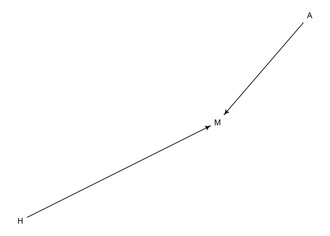
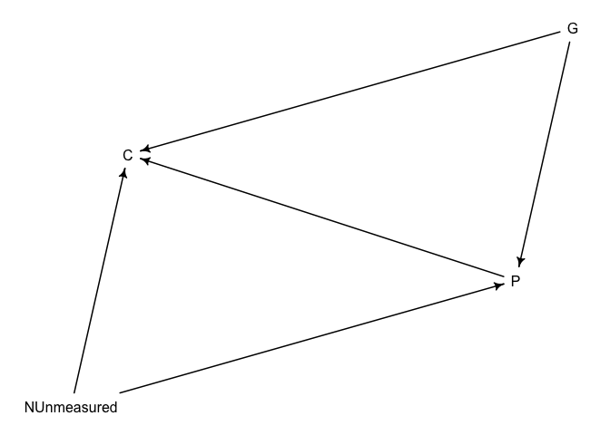

Chapter 6
================

<!--   output: -->

<!--   html_document: -->

<!--     df_print: paged -->

<!-- editor_options: -->

<!--   chunk_output_type: inline -->

``` r
suppressMessages(library(rethinking))
suppressMessages(library(magrittr))
```

### Berkson’s Paradox/selection distortion effect, multicolinearity, non-identifiability, omitted variable bias, post-treatment bias, D-separation, conditional independences, simpson’s paradox, confounding, backdoor blocking confounding paths.

This chapter introduces the 4 elemental confounds, pipe, fork, collider,
descendent and how they influence regression through simulation, then
how to correct for them with DAG analysis. This all asumes you know have
some hypothesis about the direction of association for every outcome you
are testing. If you had 10K outcome variables like genes, this approach
would require you to either assume the same causal structure (implied by
adding covariates in a model applied to all genes) or create a saparate
DAG for each outcome variable. The simulations are useful for getting
intuition on how confounding happens inside a multiple regression
problem.

Berkson’s Paradox/selection distortion effect/ collider bias:  
Strong selection induces negative correlation in the variables used for
selection. Here simulating grant proposal selection based on 2 criteria,
trustrowthiness and newsworthiness. When you select based on both
variables simultaneously, the 2 varlables which are independent **become
conditionally dependent and negatively correlated**.

``` r
## R code 6.1
set.seed(1914)
N <- 200 # num grant proposals
p <- 0.1 # proportion to select
# uncorrelated newsworthiness and trustworthiness
nw <- rnorm(N)
tw <- rnorm(N)
precis(lm(tw~nw))
```

    ##                     mean         sd       5.5%      94.5%
    ## (Intercept) -0.008272425 0.07265469 -0.1243887 0.10784381
    ## nw          -0.065088229 0.06868235 -0.1748559 0.04467943

``` r
# select top 10% of combined scores
s <- nw + tw  # total score
q <- quantile( s , 1-p ) # top 10% threshold
selected <- ifelse( s >= q , TRUE , FALSE )
cor( tw[selected] , nw[selected] )
```

    ## [1] -0.7680083

## 6.1 Multicolinearity

The correlation between 2 variables; colinearity betwen predictors
conditional on other variables in the model is most important, rather
than just raw correlation between variables.

Demonstration: correlation between height and leg length - what happens
if we include left length + right length in the model:

``` r
## R code 6.2
# number of individuals
N <- 100                  
set.seed(909)
# sim total height of each
height <- rnorm(N,10,2)           

# leg as proportion of height
leg_prop <- runif(N,0.4,0.5)      


# sim left leg as proportion + error
leg_left <- leg_prop*height + rnorm( N , 0 , 0.02 )

# sim right leg as proportion + error
leg_right <- leg_prop*height + rnorm( N , 0 , 0.02 )    
   
# combine into data frame
d <- data.frame(height,leg_left,leg_right)

## R code 6.3
m6.1 <- quap(
    alist(
        height ~ dnorm( mu , sigma ) ,
        mu <- a + bl*leg_left + br*leg_right ,
        a ~ dnorm( 10 , 100 ) ,
        bl ~ dnorm( 2 , 10 ) ,
        br ~ dnorm( 2 , 10 ) ,
        sigma ~ dexp( 1 )
    ) , data=d )

plot(precis(m6.1))
```

<!-- -->

here we are asking what is the value of knowing each predictor after
knowing all other predictors. What is the value of knowing left leg
height after knowing right leg height?

The posterior counts the relative plausibilities of every possible
combination of parameter values conditional on model + data.  
The posterior for the left leg effect and right leg effect are highly
negatively correlated in a narrow range of possible values in the
posterior. If right leg effect is large, the left leg effect must be
very small – this is obviously getting the causal story wrong.

``` r
## R code 6.5
post <- extract.samples(m6.1)
post %>% str()
```

    ## 'data.frame':    10000 obs. of  4 variables:
    ##  $ a    : num  0.935 0.965 1.001 0.865 0.67 ...
    ##  $ bl   : num  2.231 0.151 1.285 0.803 -0.245 ...
    ##  $ br   : num  -0.225 1.834 0.687 1.236 2.323 ...
    ##  $ sigma: num  0.655 0.536 0.578 0.544 0.666 ...
    ##  - attr(*, "source")= chr "quap posterior: 10000 samples from m6.1"

``` r
plot( bl ~ br , post , col=col.alpha(rangi2,0.1) , pch=16 )
```

<!-- -->

Since b1\[x1\] and b2\[x2\] are measuring the same thing, its like our
model is using the same predictor twice and doing b1\[x1\] + b2\[x1\],
so that equates to (b1 + b2)x1. Only the sum of b1 and b2 influence the
outcome variable. If we extract the sum of the 2 betas from the
posterior, we actually get the correct estimate:

``` r
## R code 6.6
sum_blbr <- post$bl + post$br
dens( sum_blbr , col=rangi2 , lwd=2 , xlab="sum of bl and br" )
```

<!-- -->

``` r
# now fit model with just 1 leg length 
## R code 6.7
m6.2 <- quap(
    alist(
        height ~ dnorm( mu , sigma ) ,
        mu <- a + bl*leg_left,
        a ~ dnorm( 10 , 100 ) ,
        bl ~ dnorm( 2 , 10 ) ,
        sigma ~ dexp( 1 )
    ) , data=d )
precis(m6.2)
```

    ##            mean         sd      5.5%    94.5%
    ## a     0.9979326 0.28364620 0.5446112 1.451254
    ## bl    1.9920676 0.06115704 1.8943269 2.089808
    ## sigma 0.6186038 0.04353998 0.5490185 0.688189

Note the incorrect model makes fine predictions it is just not
interpretable.

Another example from the monkey milk dataset.

When we include 2 highly colinear variables that contain the same
information, the effect of each in a multiple regression is diminished
highly with increased s.d. compared to the single variable regression.
This is for the same reason as aobve, we are only estimating the sum of
the effects. *Neither variable one helps as much once you know the
other.* Ideally we should not just drop highly colinear variables by
default; in order to know what do do we must know the conditional
independences which can only be inferred by the DAG structure.

``` r
## R code 6.8

data(milk)
d <- milk
d$K <- standardize( d$kcal.per.g )
d$F <- standardize( d$perc.fat )
d$L <- standardize( d$perc.lactose )

## R code 6.9
# kcal.per.g regressed on perc.fat
m6.3 <- quap(
    alist(
        K ~ dnorm( mu , sigma ) ,
        mu <- a + bF*F,
        a ~ dnorm( 0 , 0.2 ) ,
        bF ~ dnorm( 0 , 0.5 ) ,
        sigma ~ dexp( 1 )
    ) , data=d )

# kcal.per.g regressed on perc.lactose
m6.4 <- quap(
    alist(
        K ~ dnorm( mu , sigma ) ,
        mu <- a + bL*L ,
        a ~ dnorm( 0 , 0.2 ) ,
        bL ~ dnorm( 0 , 0.5 ) ,
        sigma ~ dexp( 1 )
    ) , data=d )


## R code 6.10
m6.5 <- quap(
    alist(
        K ~ dnorm( mu , sigma ) ,
        mu <- a + bF*F + bL*L ,
        a ~ dnorm( 0 , 0.2 ) ,
        bF ~ dnorm( 0 , 0.5 ) ,
        bL ~ dnorm( 0 , 0.5 ) ,
        sigma ~ dexp( 1 )
    ) ,
    data=d )


plot(precis( m6.3 ), main = 'm6.3')
```

<!-- -->

``` r
plot(precis( m6.4 ), main = 'm6.4')
```

<!-- -->

``` r
plot(precis( m6.5 ), main = 'm6.5')
```

<!-- -->

``` r
## R code 6.11
pairs( ~ kcal.per.g + perc.fat + perc.lactose , data=d , col=rangi2 )
```

<!-- -->

In this simple dataset there is a nice anthro life history
interpretation which can give us a hypothesis abotu the potential causal
structure. There is a tradeoff in milk composition high nursing
*frequency* reduces fat content and increases sugar content, reducing
overall milk energy. An evolutionary / economic model would be better
than forcing lines through the data in this case. This is an example of
*non-identifiability* the structure of the data and model do not make it
possible to estimate a parameters value technically we do estimate
values since the model integrates to 1 but the interpretation is not
clear.

How to simulate correlated predictors and view how the imprecision (sd)
of the posterior increases with increasing association between 2
predictors.

``` r
## R code 6.12
d <- milk

sim.coll <- function( r ) {
    d$x <- rnorm(n =  nrow(d), mean = r*d$perc.fat, sd = sqrt((1 - r^2) * var(d$perc.fat)))
    m <- lm( kcal.per.g ~ perc.fat + x , data=d )
    sqrt(diag(vcov(m)))[2] # stddev of parameter
}
# function that returns the standard deviation of the slope relating perc.fat to kcal milk.
rep.sim.coll <- function(r, n) {
    stddev <- replicate(n = n, expr = sim.coll(r))
    return(mean(stddev))
}
r.seq <- seq(from=0,to=0.99,by=0.1)
stddev <- sapply(r.seq ,
                 function(z){  
                     rep.sim.coll(r=z,n=100) }
                 )
plot( stddev ~ r.seq , type="l" , col=rangi2, lwd=2 ,
      xlab = "simulated correlation between simulated variable x and perc. fat", 
      ylab = "imprecision (s.d.) of perc.fat effect" )
```

<!-- -->

### Post treatment bias - a type of bias from including a confounder

In this example, plant growth effect h0 to h1 if impacted by a treatment
which exerts its effect by inhibiting fungal growth. **the imulation
explicitely makes treatment influence growth.**

``` r
## R code 6.13
set.seed(71)
# number of plants
N <- 500

# simulate initial heights
h0 <- rnorm(n = N,mean = 10,sd = 2)

# assign treatments and simulate fungus and growth
treatment <- rep(0:1, each = N/2)
# the probability of being infected is 0.5 if plant didn't get the treatment 
# and 0.1 if the plant DID get the treatment. 
fungus <- rbinom(n = N, size = 1, prob = (0.5 - treatment*0.4) )

# height after the experiment 
h1 <- h0 + rnorm(N, 5 - 3*fungus)

# compose a clean data frame
d <- data.frame( h0=h0 , h1=h1 , treatment=treatment , fungus=fungus )
precis(d)
```

    ##               mean        sd      5.5%    94.5%     histogram
    ## h0        10.14021 1.9539102  6.956927 13.40585 ▁▁▁▂▃▇▅▃▃▁▁▁▁
    ## h1        14.28632 2.5531431 10.029316 18.37813     ▁▁▃▇▇▃▂▁▁
    ## treatment  0.50000 0.5005008  0.000000  1.00000    ▇▁▁▁▁▁▁▁▁▇
    ## fungus     0.29800 0.4578376  0.000000  1.00000    ▇▁▁▁▁▁▁▁▁▃

For the model, we model the proportion of height change after the
experiment. p = 2 means doubling in height. WE can have negative growth
meaning the plants died. The prior sampling shows we expect 40% decrease
to 50% increase in growth. Kind of weird since plant death does not
reduce growth, it would be better to have some indicator for death or
something.

``` r
## R code 6.14
sim_p <- rlnorm( 1e4 , 0 , 0.25 )
precis( data.frame(sim_p) )
```

    ##           mean        sd      5.5%    94.5% histogram
    ## sim_p 1.035921 0.2635733 0.6678338 1.492814  ▁▇▇▁▁▁▁▁

``` r
## R code 6.15
m6.6 <- quap(
    alist(
        h1 ~ dnorm( mu , sigma ),
        mu <- h0*p,
        p ~ dlnorm( 0 , 0.25 ),
        sigma ~ dexp( 1 )
    ), data=d )
precis(m6.6)
```

    ##           mean          sd     5.5%    94.5%
    ## p     1.392477 0.008366485 1.379106 1.405848
    ## sigma 1.932194 0.060925139 1.834824 2.029564

This posterior of the average growth in the experiment means about 40%
(proportion = 1.39) growth.

Fit multiple regression model inclusing treatment and fungus (which was
observed *after* the experiment was finished). The treatment now has 0
effect\!

``` r
## R code 6.16
m6.7 <- quap(
    alist(
        h1 ~ dnorm( mu , sigma ),
        mu <- h0 * p,
        p <- a + bt*treatment + bf*fungus,
        a ~ dlnorm( 0 , 0.2 ) ,
        bt ~ dnorm( 0 , 0.5 ),
        bf ~ dnorm( 0 , 0.5 ),
        sigma ~ dexp( 1 )
    ), data=d )
precis(m6.7)
```

    ##              mean         sd        5.5%        94.5%
    ## a      1.49161873 0.01081458  1.47433495  1.508902520
    ## bt    -0.01409074 0.01284187 -0.03461454  0.006433046
    ## bf    -0.30006392 0.01392536 -0.32231934 -0.277808500
    ## sigma  1.33401381 0.04210162  1.26672729  1.401300334

Again, once we already know about the association between fungus and
growth, does knowing anything about treatment help us in the prediction.
No because mediates effects of growth through reducing fungus; but we
wanted to model and understand the treatment effect. Here including post
treatment variable F blocked the effect of treatment. Next omit post
treatment variable.

``` r
## R code 6.17
m6.8 <- quap(
    alist(
        h1 ~ dnorm( mu , sigma ),
        mu <- h0 * p,
        p <- a + bt*treatment,
        a ~ dlnorm( 0 , 0.2 ),
        bt ~ dnorm( 0 , 0.5 ),
        sigma ~ dexp( 1 )
    ), data=d )
precis(m6.8)
```

    ##            mean         sd       5.5%     94.5%
    ## a     1.3386427 0.01134623 1.32050924 1.3567762
    ## bt    0.1072243 0.01603240 0.08160142 0.1328472
    ## sigma 1.8524772 0.05840348 1.75913718 1.9458172

It is helpful that including fungus zeros the coefficient for treatment
because it suggests the mediation effect. Here is another way of
thinking about it with the redictor residual plots from ch 5.

``` r
d$growth_change = d$h1 - d$h0
d %>% head 
```

    ##          h0        h1 treatment fungus growth_change
    ## 1  9.136316 13.394173         0      1      4.257858
    ## 2  9.105626 15.746721         0      0      6.641095
    ## 3  9.042855 14.347099         0      0      5.304245
    ## 4 10.834291 15.305389         0      0      4.471099
    ## 5  9.164199 10.265656         0      1      1.101457
    ## 6  7.625672  8.654836         0      1      1.029164

``` r
treatment_resid = residuals(lm(treatment ~ fungus, data = d))
m1 = lm(growth_change ~ treatment_resid, data = d)
m2 = lm(growth_change ~ treatment, data = d)

plot(growth_change ~ treatment_resid, data = d, main = 'blue line = no association', 
     xlab = 'treatment residual (regressed on fungus)')
abline(m1, col = "blue")
```

<!-- -->

``` r
plot(growth_change ~ treatment, data = d,
     main = 'red line  = treatment effect')
abline(m2, col = "red")
```

<!-- -->

This helps uns understand that treatment is mediating its effects
through fungus.

Conditioning on F blocks the path to T (T is *d separated* from T when
we condition on F )

``` r
## R code 6.18
library(dagitty)
plant_dag <- dagitty( "dag {
    H_0 -> H_1
    F -> H_1
    T -> F
}")
coordinates( plant_dag ) <- list( x=c(H_0=0,T=2,F=1.5,H_1=1) ,
                                  y=c(H_0=0,T=0,F=0,H_1=0) )
drawdag( plant_dag )
```

<!-- -->

``` r
## R code 6.19
impliedConditionalIndependencies(plant_dag)
```

    ## F _||_ H_0
    ## H_0 _||_ T
    ## H_1 _||_ T | F

Assume fungus had NOTHING to do with growth. instead the correct DAG
structure is that moisture influences both F and H1 but this different
type of fungus again doesnt impact growth. If we condition on F, we
introduce **Collider bias** because F is a collider. There is no
association between F

``` r
new_dag <- dagitty( 
"dag {
    H_0 -> H_1
    M -> H_1
    M -> F
    T -> F}"
    )

drawdag( new_dag )
```

<!-- -->

Simulate this in `d2` and re-fit models

``` r
## R code 6.20
set.seed(71)
N <- 1000
h0 <- rnorm(N,10,2)
treatment <- rep( 0:1 , each=N/2 )
M <- rbern(N)
fungus <- rbinom( N , size=1 , prob=0.5 - treatment*0.4 + 0.4*M )
h1 <- h0 + rnorm( N , 5 + 3*M )
d2 <- data.frame( h0=h0 , h1=h1 , treatment=treatment , fungus=fungus )


## R code 6.16
m6.7.1 <- quap(
    alist(
        h1 ~ dnorm( mu , sigma ),
        mu <- h0 * p,
        p <- a + bt*treatment + bf*fungus,
        a ~ dlnorm( 0 , 0.2 ) ,
        bt ~ dnorm( 0 , 0.5 ),
        bf ~ dnorm( 0 , 0.5 ),
        sigma ~ dexp( 1 )
    ), data=d2 )
precis(m6.7.1)
```

    ##             mean         sd       5.5%      94.5%
    ## a     1.52211420 0.01360385 1.50037263 1.54385578
    ## bt    0.04859313 0.01415624 0.02596872 0.07121754
    ## bf    0.14276270 0.01415774 0.12013590 0.16538949
    ## sigma 2.10262855 0.04694249 2.02760537 2.17765172

``` r
## R code 6.17
m6.8.1 <- quap(
    alist(
        h1 ~ dnorm( mu , sigma ),
        mu <- h0 * p,
        p <- a + bt*treatment,
        a ~ dlnorm( 0 , 0.2 ),
        bt ~ dnorm( 0 , 0.5 ),
        sigma ~ dexp( 1 )
    ), data=d2)
precis(m6.8.1)
```

    ##              mean          sd        5.5%      94.5%
    ## a      1.62401319 0.009546625  1.60875584 1.63927054
    ## bt    -0.01051596 0.013511945 -0.03211066 0.01107874
    ## sigma  2.20520300 0.049231869  2.12652096 2.28388504

Treatment has no effect but fungus looks like it has a positive effect

Another example. Happiness H as a function of age A either conditioning
or not on marriage M. WE simulate the following causal model with a
dynamical model:

``` r
h_dag <- dagitty( 
"dag {
    H -> M
    A -> M}"
    )

drawdag( h_dag )
```

<!-- -->

simulate each year, 20 people born w/ uniformly distributed happiness.
each year happiness does not change. at age 18 people can start getting
married and odds of marriage proportional to happiness, no divorce, and
after 65 individuals leave the sample.

``` r
## R code 6.21
d <- sim_happiness( seed=1977 , N_years=1000 )
precis(d)
```

    ##                    mean        sd      5.5%     94.5%     histogram
    ## age        3.300000e+01 18.768883  4.000000 62.000000 ▇▇▇▇▇▇▇▇▇▇▇▇▇
    ## married    3.007692e-01  0.458769  0.000000  1.000000    ▇▁▁▁▁▁▁▁▁▃
    ## happiness -1.000070e-16  1.214421 -1.789474  1.789474      ▇▅▇▅▅▇▅▇

If we assume that marriage status is a confound and we want to “control
for marriage”  
µ\[i\] = alpha\[married\_index\] + bA\*A

``` r
## R code 6.22 rescale variables 
d2 <- d[ d$age>17 , ] # only adults
d2$A <- ( d2$age - 18 ) / ( 65 - 18 )

d2[sample( rownames(d2), size = 5), ] 
```

    ##     age married  happiness         A
    ## 610  35       1 -0.1052632 0.3617021
    ## 315  50       1  0.9473684 0.6808511
    ## 739  29       1  1.7894737 0.2340426
    ## 494  41       0  0.7368421 0.4893617
    ## 734  29       0  0.7368421 0.2340426

``` r
## R code 6.23
# specify index variable for marriage status 


# multiple regresion model 
d2$mid <- d2$married + 1
m6.9 <- quap(
    alist(
        happiness ~ dnorm( mu , sigma ),
        mu <- a[mid] + bA*A,
        a[mid] ~ dnorm( 0 , 1 ),
        bA ~ dnorm( 0 , 2 ),
        sigma ~ dexp(1)
    ) , data=d2 )
plot(precis(m6.9,depth=2), main = 'H ~ A + M ')
```

<!-- -->

``` r
# only including age not marriage status 
## R code 6.24
m6.10 <- quap(
    alist(
        happiness ~ dnorm( mu , sigma ),
        mu <- a + bA*A,
        a ~ dnorm( 0 , 1 ),
        bA ~ dnorm( 0 , 2 ),
        sigma ~ dexp(1)
    ) , data=d2 )
plot(precis(m6.10), main = 'H ~ A')
```

<!-- -->

Intuition:

Marriage status is a collider in the DAG. It is caused by the predictor
(A) and the outcome (H). when we condition on a collider (M), we
**induce an association** between both of the things that cause the
collider (A and H; here we induce a negative correlation).

In this model: once we know someone is married or not, their age does
not provide information on how happy they are (given the simulation).

### 6.3.2 unmeasured causes can also create collider bias:

Grandparents G parents P and children C causal diagram for educational
attainment in the presence of an **unmeasured covariate** N(Unmeasured),
which represents Neighborhood.

``` r
education_dag <- dagitty( 
"dag {
   G -> P 
   G -> C
   P -> C
   NUnmeasured -> P
   NUnmeasured -> C
}"
    )
set.seed(1)
drawdag( education_dag , goodarrow = TRUE )
```

<!-- -->

In the simulation below *WE MAKE THE EFFECT G -\> C == 0 and the effect
of the ‘unmeasured’ == 2*

``` r
## R code 6.25
N <- 200  # number of grandparent-parent-child triads
b_GP <- 1 # direct effect of G on P
b_GC <- 0 # direct effect of G on C
b_PC <- 1 # direct effect of P on C
b_U <- 2  # direct effect of U on P and C

## R code 6.26
set.seed(1)
U <- 2*rbern( N , 0.5 ) - 1
G <- rnorm( N )
P <- rnorm( N , b_GP*G + b_U*U )
C <- rnorm( N , b_PC*P + b_GC*G + b_U*U )
d <- data.frame( C=C , P=P , G=G , U=U )
pairs(d, col = rangi2)
```

<!-- -->

``` r
## R code 6.27
# multiple regression model including Parent and grandparent education
m6.11 <- quap(
    alist(
        C ~ dnorm( mu , sigma ),
        mu <- a + b_PC*P + b_GC*G,
        a ~ dnorm( 0 , 1 ),
        c(b_PC,b_GC) ~ dnorm( 0 , 1 ),
        sigma ~ dexp( 1 )
    ), data=d )


## R code 6.28
# multiple regression model including P G education AND THE UNMEASURED variable
m6.12 <- quap(
    alist(
        C ~ dnorm( mu , sigma ),
        mu <- a + b_PC*P + b_GC*G + b_U*U,
        a ~ dnorm( 0 , 1 ),
        c(b_PC,b_GC,b_U) ~ dnorm( 0 , 1 ),
        sigma ~ dexp( 1 )
    ), data=d )


# visualize coefficients 
plot(precis(m6.11), main = 'm6.11 C ~ P + G')
```

<!-- -->

``` r
plot(precis(m6.12), main = 'm 6.12 m6.11 C ~ P + G + U')
```

<!-- -->

In m 6.11 it looks like grandparents negatively influence C but that was
because we inadvertently conditioned on a hidden collider that we never
measured.

G causes P and U causes P. When we condition on P it introduces bias in
the estimate of G -\> C causing a negative correlation making it look
like grandparent education negatively influences child education.

Conditioning on P is like looking within P that have similar levels of
education, once we know P, adding G to the model invisibly tells us
about the unmeasured variable neighborhood U which is associated with
the outcome C. The only way for 2 parents with equal education to have
grandparents with very different education is for them to be from
different neighborhoods (unmeasured).

Blue cloud = good neighborhood. Black cloud = bad neighborhood.

``` r
suppressMessages(library(tidyverse))

d %>% 
  mutate(centile = ifelse(P >= quantile(P, prob = .45) & P <= quantile(P, prob = .60), "a", "b"),
         u = factor(U)) %>%
  ggplot(aes(x = G, y = C)) +
    theme_bw() + 
    geom_point(aes(shape = centile, color = u), size = 2.5, stroke = 1/4) +
    stat_smooth(data = . %>% filter(centile == "a"),
                method = "lm", se = F, size = 1/2, color = "black", fullrange = T) +
    scale_shape_manual(values = c(19, 1)) +
    scale_color_manual(values = c("black", "deepskyblue3")) +
    theme(legend.position = "none") + 
    ggtitle('filled points = parents in similar (45-65) percentile of education')
```

<!-- -->

    ## Warning: Ignoring unknown parameters: strength
    
    ## Warning: Ignoring unknown parameters: strength
    
    ## Warning: Ignoring unknown parameters: strength
    
    ## Warning: Ignoring unknown parameters: strength

``` r
library(patchwork)
p1|p2|p3|p4
```

<!-- -->

Rules for what varialbes to control for:

1)  Trace backwards starting at the predictor X ending att the outcome
    Y.  
2)  Check for colliders (these are “closed paths”)  
3)  classify each path as a backdoor path or not (arrow entering a
    predictor)  
4)  close all open backdoor paths.

This is done algorithmically with `daggity` package and we get an output
of the conditional independences given a causal dag.

``` r
## R code 6.29

dag_6.1 <- dagitty( "dag {
    U [unobserved]
    X -> Y
    X <- U <- A -> C -> Y
    U -> B <- C
}")
adjustmentSets( dag_6.1 , exposure="X" , outcome="Y" )
```

    ## { C }
    ## { A }

``` r
## R code 6.30

dag_6.2 <- dagitty( "dag {
    A -> D
    A -> M -> D
    A <- S -> M
    S -> W -> D
}")
adjustmentSets( dag_6.2 , exposure="W" , outcome="D" )
```

    ## { A, M }
    ## { S }

``` r
## R code 6.31
impliedConditionalIndependencies( dag_6.2 )
```

    ## A _||_ W | S
    ## D _||_ S | A, M, W
    ## M _||_ W | S

problems
