Chapter 7
================

<!--   output: -->

<!--   html_document: -->

<!--     df_print: paged -->

<!-- editor_options: -->

<!--   chunk_output_type: inline -->

``` r
suppressMessages(library(rethinking))
suppressMessages(library(magrittr))
```

This chapter connects the topics below to explain theory behind methods
that enable principled selection of the optimal model from a group of
candidate models.  
Cross validation vs information criteria, information theory,
regularization, overfitting, underfitting, data compression, minimum
description length, bias variance tradeoff, intro to information theory
to motivate maximum entropy probability distributions, Kullback-leiber
divergence, cross entropy, divergence vs. deviance, log pointwise
predictive density, Leave one out cross validation, pareto smoothed
importance sampling (PSIS), pareto distribution, Akaike information
criteria, ceviance information criteria, widely applicable information
criteria (WAIC), effective number of parameters, Bayesian information
criteria, bayes factor, model comparison, model averaging, robust
regression, student t. distribution.

We reframe the bias-variance tradeoff as simply underfitting(bias)
overfitting(variance). Bias is underfitting, it’s the increased training
error due to the model’s constraints, e.g. linearity; a linear model is
more ‘biased’ than complex polyniomial. Variance is the TEST SET error
from the model trained on training data. These are confusing terms
becaues bias sounds bad when its not and variance means lots of
different things.

A key insight: confounded models often produce better predictions than
non-confounded models. Trying to understand how parameters are wired
together mechanistically and cause an outcome (e.g. through the use of
DAGS or structural equation modeling) is a fundamentally different task
than making prediction. A simple DAG + GLM that we create based on
domain knowledge might help us understand how a system works. This model
will make worse predictions than a highly parameterized deep learning
model. We should use both tools in different
ways.

### Overview of information entropy, divergence vs deviance, predicting out of sample deviance without ‘out of sample’ data:

Information theory gives us the shannon entropy (H), a measure of the
uncertainty in a target distribution we want to predict; a model
predicting something difficult / hard to predict has high uncertainty
and shannon entropy measures this precisely as:  
H = -∑ pi \* log(pi)  
Accuracy is how far our model is from the true target distribution - we
measure this with something related entropy. If the true distribution of
events occurs with P1 = 0.3 P2 = 0.7 and our model predicts they happen
with Q1 = 0.25 Q2 = 0.75, how much additional uncertainty have we
introduced? This is called the KullbackLeiber divergence:

Dkl(p,q) = -∑ Pi \* log(Pi / Qi)

Now we know how to measure the distance from our model to the target
distribution with KL Divergence but we don’t know Pi, the true target
distribution so we have to estimate divergence – we do this with
Deviance. Since we are comparing candidate models q1 and q2 to qn… to
estimate the true distribution P, The relative distance from each model
to the target is all that matters–we dont have to know the true
distribution. There is an Elog(pi) term in the KL divergence equation
for candidate q1 and for candidate q2. If we want to compare q1 and q2
we ony need to know their average log probabilities. The score for
candidate q1 and q2 will have a arbitrary absolute value but the
difference tells us the relative difference from the target
distribution. We sum these over each observation. S(q) = -∑ log(qi)  
Here the i is refering to each individual observation in model q1. We
then do the same for model q2 and compare the scores. The deviance is
-2(score) for historical reasons – smaller values are better. In bayes
models we use lppd Log Posterior Predictive Density.

However there is still an issue with just using the lppd this has the
same problem as R2–the more parameters have lower scores we now need a
way to measure the out of sample error. there are 2 ways:

**Cross validation** We can just calculate leave on out cross validation
error (which measures lppd in Bayesian models). However there is a trick
to doing cross validation where we can use something called *pareto
smoothed importance sampling*; the values near the mean have less impact
on the posterior distribution than more hihgly leveraged observations.
These leveraged observations cause us to change our expectation more;
the importance ofthe observations in the posterior distribution can be
thought of as “weights”. The largest weights follow a Pareto
distribution (p218) these weights us estimate the out of sample error.

**Information Criteia** We can also estimate the expected score out of
sample – a relative out of sample KL-divergence score, the out of sample
deviance. Surprisingly looking at graphs on p 216 the training - test
error is ~ ( 2 \* number of parameters ) for each model. This is
actually a generalizable phenomenon\! This motivates **information
criteria** The expected overfitting penalty is ~2p where p = n
parameters. The AIC (Hirotugo Akaike) is:  
Deviance(training) + 2(p) = -2(lppd) + 2p

Note this is easier to intuit than how AIC introduced in isl in the form
it takes for least squares:  
AIC = 1/n(σ^2) \* (RSS + 2dσ^2)

AIC makes some assumptions about N must be greater than p. We can use
another information criterion:

**Widely Applicable Information Criterion (WAIC)**  
WAIC( y , Ø ) = -2( lppd - ∑varø log(p)(y\[i\] | Ø ) )  
the summation is an overfitting penalty term sometimes known as the
*effective number of parameters (due to the analogy to Akaike’s
observation/criteria about the 2p phemoninon* which computes the
variance in the log probabilities for each observation i (each
observaion gets a penalty score) and sums these up to get the overall
penalty. How the parameters relate to one another is more important than
the number of parameters; for example in multilevel models adding
parameters can reduce the ‘effective number of parameters’ so it is a
not great term.

**Reducing cross validation error - Ridge regression as a regularizing
prior**  
Another way to reduce cross valication error is to use **regularizing
priors** where the slope parameters are constrained - ridge regression
can actually be framed as linear models with Gaussian priors centered at
0 on the slope parameters; The lambda parameter describes the narrowness
of the prior\! In ESL, this is described as a penalty parameter that
creates “feature shrinkage”. It is still a non-Bayesian procedure
because the uncertainty is not quantified in a posterior distribution;
to integrate the prior (penalize the beta) it uses a modified OLS
integrating lambda into the QR decomposition. (lm.ridge in MASS).

**Reducing cross validation error - robust regression**  
We can replace the Gaussian with a students T distribution which is a
mixture of Gaussian distributions with different variance parameters;
the students t is parameterized by µ sigma and ‘v’ which measures how
thick the tails are. Thicker tails means the model is less surprised by
outlying observations.

Lower entropy means lower uncertainty in abu dabi because it rarely
rains, there is much less uncertainty about whether it will rain on any
given day.

### Why we need information theory

We need a “target” criteria that we want our models to be good at to
select the one that optimizes over / underfitting. Information theory
gives us a measurement scale for the distance between 2 probability
distributions accounting for the fact that some things are harder to
predict from others, some targets are harder to hit than others, some
estimates have higher uncertainty than others.

*Information is the amount of uncertainty that decreases when we learn
an outcome*

### 7.1.1 more parameters improves fit

example – hominin species. We fit brain volume as a function of body
mass. We do this with and without a regularizing prior on beta–this
regularizing prior eliminates implausible values for the relationship
eliminating negative brain size predictions, as in chapter 4.

R2 = 1 - (var(residuals) / var(outcome))

Here we look at how the R2 is minimized to 0 the more parameters we add
to the model making it sub optimal as a metric for model comparison.

``` r
suppressMessages(library(rethinking))
suppressMessages(library(magrittr))
## R code 7.1
sppnames <- c( "afarensis","africanus","habilis","boisei",
    "rudolfensis","ergaster","sapiens")
brainvolcc <- c( 438 , 452 , 612, 521, 752, 871, 1350 )
masskg <- c( 37.0 , 35.5 , 34.5 , 41.5 , 55.5 , 61.0 , 53.5 )
d <- data.frame( species=sppnames , brain=brainvolcc , mass=masskg )

## R code 7.2
d$mass_std <- (d$mass - mean(d$mass))/sd(d$mass)
d$brain_std <- d$brain / max(d$brain)

# non-regularized 'flat' prior for beta 
## R code 7.3
m7.1 <- quap(
    alist(
        brain_std ~ dnorm( mu , exp(log_sigma) ),
        mu <- a + b*mass_std,
        a ~ dnorm( 0.5 , 1 ),
        b ~ dnorm( 0 , 10 ),
        log_sigma ~ dnorm( 0 , 1 )
    ), data=d )


## R code 7.5
# compute the residual of the model fit 
set.seed(12)
# simulate 1000 predictions for each value of the predictor, (mass)
s <- sim( m7.1 )
# compute the average squared deviation from the mean (one for each predictor value)
r <- apply(s,2,mean) - d$brain_std # this has length 7 
resid_var <- var2(r) #  average squared deviation
outcome_var <- var2( d$brain_std )

# compute R squared 
1 - resid_var/outcome_var
```

    ## [1] 0.4774589

``` r
## R code 7.6
# this is a function for procedure above. 
R2_is_bad <- function( quap_fit ) {
    s <- sim( quap_fit , refresh=0 )
    r <- apply(s,2,mean) - d$brain_std
    1 - var2(r)/var2(d$brain_std)
}
```

OLS is the same procedure as above but minimizing sum of squared
residuals is equivalent to finding the posterior mean of a model with
flat priors. We can get a posterior distribution for the mean (but not
sigma) from Rs lm. s

``` r
## R code 7.4
m7.1_OLS <- lm( brain_std ~ mass_std , data=d )
post <- extract.samples( m7.1_OLS )
post %>% head 
```

    ##   Intercept   mass_std
    ## 1 0.5517624 0.03447383
    ## 2 0.5911133 0.12140716
    ## 3 0.4697504 0.29341852
    ## 4 0.5183143 0.23703206
    ## 5 0.6232160 0.30541305
    ## 6 0.5829517 0.15064827

``` r
# mean of the posterior for mean from the OLs estimate 
mean(post$mass_std)
```

    ## [1] 0.1676139

``` r
# mean of the posterior for mean from the bayesian model 
mean(extract.samples(m7.1)[[2]])
```

    ## [1] 0.1671043

Now we compare a contrived example where we have 7 data points and we
fit a 1 to 7 parameter model, exactly fitting the data with parameters.
One perspective on this obsurd model is that models with less parameters
than the number of observations are *data compression*. These models
summarize relationships among the variables, summarizing the data into a
simpler form with loss of information “lossy compression”. Parameters
can be used to create new data ‘decompresing’ it. Learning from the data
requires using a simpler model than the number of observations,
compressing it in a way that allows us to learn the relationships –
thisis known as *‘minimum description length’*

We are just fitting polynomial with degree 1-6.

``` r
## R code 7.7
m7.2 <- quap(
    alist(
        brain_std ~ dnorm( mu , exp(log_sigma) ),
        mu <- a + b[1]*mass_std + b[2]*mass_std^2,
        a ~ dnorm( 0.5 , 1 ),
        b ~ dnorm( 0 , 10 ),
        log_sigma ~ dnorm( 0 , 1 )
    ), data=d , start=list(b=rep(0,2)) )

## R code 7.8
m7.3 <- quap(
    alist(
        brain_std ~ dnorm( mu , exp(log_sigma) ),
        mu <- a + b[1]*mass_std + b[2]*mass_std^2 + b[3]*mass_std^3,
        a ~ dnorm( 0.5 , 1 ),
        b ~ dnorm( 0 , 10 ),
        log_sigma ~ dnorm( 0 , 1 )
    ), data=d , start=list(b=rep(0,3)) )

m7.4 <- quap(
    alist(
        brain_std ~ dnorm( mu , exp(log_sigma) ),
        mu <- a + b[1]*mass_std + b[2]*mass_std^2 + b[3]*mass_std^3 + b[4]*mass_std^4,
        a ~ dnorm( 0.5 , 1 ),
        b ~ dnorm( 0 , 10 ),
        log_sigma ~ dnorm( 0 , 1 )
    ), data=d , start=list(b=rep(0,4)) )

m7.5 <- quap(
    alist(
        brain_std ~ dnorm( mu , exp(log_sigma) ),
        mu <- a + b[1]*mass_std + b[2]*mass_std^2 + b[3]*mass_std^3 + b[4]*mass_std^4 + b[5]*mass_std^5,
        a ~ dnorm( 0.5 , 1 ),
        b ~ dnorm( 0 , 10 ),
        log_sigma ~ dnorm( 0 , 1 )
    ), data=d , start=list(b=rep(0,5)) )

## R code 7.9
m7.6 <- quap(
    alist(
        brain_std ~ dnorm( mu , 0.001 ),
        mu <- a + b[1]*mass_std + b[2]*mass_std^2 + b[3]*mass_std^3 + b[4]*mass_std^4 + b[5]*mass_std^5 + b[6]*mass_std^6,
        a ~ dnorm( 0.5 , 1 ),
        b ~ dnorm( 0 , 10 )
    ), data=d , start=list(b=rep(0,6)) )


# rethinking plot function 
plot.quap.brain = function(model){ 
  post <- extract.samples(model)
  mass_seq <- seq( from=min(d$mass_std) , to=max(d$mass_std) , length.out=100 )
  l <- link( model , data=list( mass_std=mass_seq ) )
  mu <- apply( l , 2 , mean )
  ci <- apply( l , 2 , PI )
  plot( brain_std ~ mass_std , data=d )
  lines( mass_seq , mu )
  shade( ci , mass_seq )
  }

mlist = list( m7.2, m7.3, m7.4, m7.5, m7.6)
lapply(mlist ,plot.quap.brain)
```

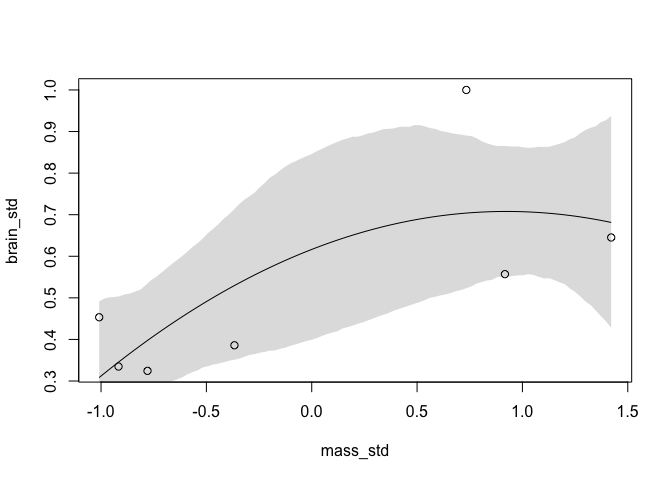<!-- -->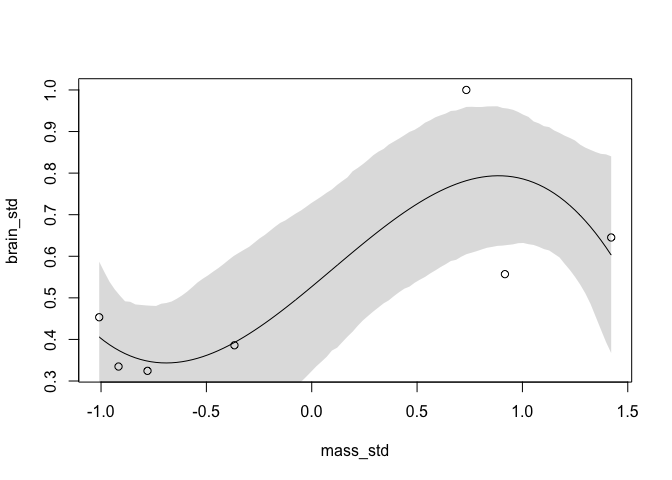<!-- -->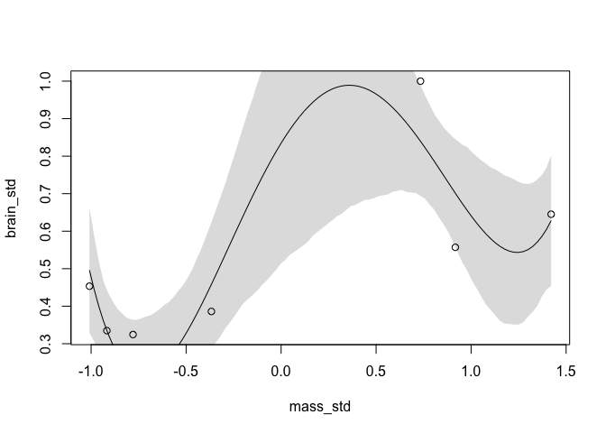<!-- -->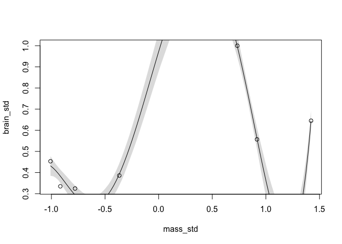<!-- -->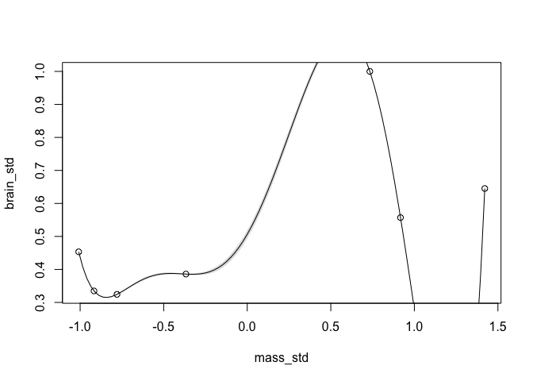<!-- -->

    ## [[1]]
    ## NULL
    ## 
    ## [[2]]
    ## NULL
    ## 
    ## [[3]]
    ## NULL
    ## 
    ## [[4]]
    ## NULL
    ## 
    ## [[5]]
    ## NULL

To evaluate a model we need a scoring system (a measure of accuracy)
that is maximized when we know the **true** model that generated the
data. This measure of accuracy turns out to be the joint probability of
the model estimates (multiply each estimated probability), usually
reported in log space. Example from weather prediction– compare 2
measures of accuracy 1) hit rate (percent of time correct over x days),
2) joint probability (the probability of predicting the exact sequence
of weather across the x days). In the book example p 203, a weather
person that always predicts 100% it will be sunny had a higher ‘hit’
rate but ignored the *cost* of predicting rain (this same idea discussed
in nate silvers book). The weather person who makes a decent guess each
day has a higher joint probability of getting the exact sequence.

How do we apply this to model fitting? We need a measure of distance
from the target that acccounts for the fact that some targets are harder
to hit than others. We measure this in units of uncertainty–these units
are in the form of information. **Information is the amount that
uncertainty is reduced when we learn an outcome.**

Now we need a measure of uncertainty that fits 3 criteria:  
1\) it’s continuous 2) it increases as the number of possible events /
was something could happen increases (a moving target as opposed to a
stationary target - 3 dimensions; predicting rain or sun vs rain, sun,
snow, hail)  
3\) It’s additive - it is the sum of the separate uncertainties
reflected in the model e.g. u(rain/shine) + u(hit/cold).  
This function is *Inforrmation Entropy* or Shannon Entropy.

\-∑ pi \* log(pi)

The true probability for rain and shine on mount washington p(rain) =
0.4, p(shine) = 0.6 The true probability for rain and shine in abu dabi
p(rain) = 0.01, p(shine) = 0.99

entropy for each:

``` r
pm = c(0.4, 0.6)
pa = c(0.01, 0.99)

# calculate Shannon entropy for mount washington 
-sum(pm * log(pm))
```

    ## [1] 0.6730117

``` r
# calculate Shannon entropy for Abu dabi 
-sum(pa * log(pa))
```

    ## [1] 0.05600153

### derivation of KL Divergence and its relation to cross entropy

Dkl(p,q) = H(p,q) - H(p)  
the term H(p,q) is called the cross entropy; we are using a probability
distribution q t predict events that occur with a different probability
distribution p: the events arise with probability p but are expected
with probability q:  
H(p,q) = -∑ Pi \* log(Qi) \* notice it is Q in the log.

**We *estimate* divergence with the deviance**

log pointwise predictive density is our measure of deviance for a
bayesian model.

### understanding log pointwise predictive density

lppd increases for every more highly parameterized model we fit.

``` r
## R code 7.13
set.seed(1)
lppd_m7.1 = lppd( m7.1 , n=1e4 )
```

What do these numbers actually mean? each is a log probability score for
each specific observation; when we sum these we get the total log
probability score for the model and data. How is this actually
calculated?

**calc deviance for m7.1**

``` r
## R code 7.14
set.seed(1)
# calculate the log probability of each observation 
# return a matrix with a row for each sample (1000 by default) and a column for each observation 
# using ll = true with sim returns the log probability instead of samples from the poterior
logprob <- sim( m7.1 , ll=TRUE , n=1e4 )
dim(logprob)
```

    ## [1] 10000     7

``` r
n <- ncol(logprob)
ns <- nrow(logprob)
f <- function(i){
  # log_sum_exp computes the log sum of the exponentiated values 
  # takes log probabilities for a given observation, exponentiates each, sums them, then takes the log. 
  # then subtracts the sum of the log of the n of samples (same as dividing by the sum of the n of samples)
  log_sum_exp( logprob[,i] ) - log(ns)
}
(lppd <- sapply(1:n, f))
```

    ## [1]  0.6098668  0.6483438  0.5496093  0.6234933  0.4648143  0.4347604
    ## [7] -0.8444630

**Deviance** is the lppd (the total score) multiplied by -2. The 2 is
used because in non-bayesian stats, the difference in 2 distributions
has a chi-squared distribution which gets scaled properly by multiplying
by 2. The minus is used so that smaller values are better.

so the devaince is:

``` r
-2*sum(lppd_m7.1)
```

    ## [1] -4.97285

Just remember *deviance* is the score \* -2 so that models that
‘deviate’ *less* are better.

Comparing models – note that the lppd score increases the more
parameters we add making the ridiculous model the “best”

``` r
## R code 7.15
set.seed(1)
sapply( list(m7.1,m7.2,m7.3,m7.4,m7.5,m7.6) , function(m) sum(lppd(m)) )
```

    ## [1]  2.490390  2.565987  3.707340  5.333706 14.108014 39.445390

Simulating models to simulate training and test errors to produce plots
in fig 7.6.

**sim\_train\_test** function: Simulates in-sample and out-of-sample
model performance for simple quap models, returning lppd in and out of
sample, WAIC, LOOIC, and LOOCV.

N Number of cases in simulated data  
k Number of parameters in model to fit to data  
rho Vector of correlations between predictors and outcome, in simulated
data  
b\_sigma Standard deviation of beta-coefficient priors  
DIC If TRUE, returns DIC  
WAIC If TRUE, returns WAIC LOOIC If TRUE, returns LOOIC as produced by
LOO  
LOOCV If TRUE, returns LOOCV as produced by cv\_quap  
devbar If TRUE, returns the average deviance in-sample  
devbarout If TRUE, returns average deviance out-of-sample

``` r
## R code 7.16
# N <- 20
# kseq <- 1:5
# dev <- sapply( kseq , function(k) {
#         print(k);
#         r <- replicate( 1e3 , sim_train_test( N=N, k=k ) );
#         c( mean(r[1,]) , mean(r[2,]) , sd(r[1,]) , sd(r[2,]) )
#     } )
# 
# 
# 
# ## R code 7.18
# plot( 1:5 , dev[1,] , ylim=c( min(dev[1:2,])-5 , max(dev[1:2,])+10 ) ,
#     xlim=c(1,5.1) , xlab="number of parameters" , ylab="deviance" ,
#     pch=16 , col=rangi2 )
# mtext( concat( "N = ",N ) )
# points( (1:5)+0.1 , dev[2,] )
# for ( i in kseq ) {
#     pts_in <- dev[1,i] + c(-1,+1)*dev[3,i]
#     pts_out <- dev[2,i] + c(-1,+1)*dev[4,i]
#     lines( c(i,i) , pts_in , col=rangi2 )
#     lines( c(i,i)+0.1 , pts_out )
# }
```

### How does WAIC calculation work?

First we fit a simple model of stopping distance dist as a function of
speed from the R cars dataset and extract samples from the posterior.

``` r
## R code 7.19
data(cars)
plot(dist ~ speed, data  = cars)
```

<!-- -->

``` r
# fit a simple quap model 

m <- quap(
    alist(
        dist ~ dnorm( mu, sigma ),
        mu <- a + b*speed,
        a ~ dnorm(0,100),
        b ~ dnorm(0,10),
        sigma ~ dexp(1)
    ) , data=cars )
set.seed(94)
post <- extract.samples(m,n=1000)
head(post)
```

    ##           a        b    sigma
    ## 1 -10.70238 3.533277 14.74971
    ## 2 -15.42891 3.777044 14.03914
    ## 3 -26.28809 4.525730 11.73609
    ## 4 -10.09926 3.445379 13.57401
    ## 5 -24.64794 4.230611 12.72349
    ## 6 -18.25281 4.110063 13.19583

Now we calculate the *log likelihood of the model AT EACH observation i*
The log likelihood is the deterministic component of the model mu \<- a
+ b\*speed.

``` r
# for sample 1 from the posterior 

dnorm(
  # for each observation i 
  x = cars$dist, 
  # the mean of this distribution is given by the model. This is the deterministic pcmponent. 
 # the mean is modeled as alpha + beta*speed with variance sigma from the model times the beta * 
  mean =post$a[1] + post$b[1]*cars$speed, sd = post$sigma[1],
 # return the density in log space 
 log = TRUE)
```

    ##  [1] -3.614866 -3.709345 -3.841397 -3.756130 -3.615782 -3.893186 -3.711199
    ##  [8] -3.614473 -3.811927 -3.896591 -3.610223 -4.329942 -3.924609 -3.746319
    ## [15] -3.641573 -3.805969 -3.613640 -3.613640 -3.876735 -3.984568 -3.627714
    ## [22] -4.646661 -7.518271 -4.752744 -4.220551 -3.924947 -4.049755 -3.688279
    ## [29] -4.303060 -3.811657 -3.611093 -3.883051 -3.632297 -4.836908 -5.833567
    ## [36] -4.569419 -3.860175 -3.917827 -5.407277 -3.939086 -3.755900 -3.646260
    ## [43] -3.647615 -3.612599 -4.240656 -3.648726 -4.346861 -4.431455 -8.452990
    ## [50] -3.735013

But now we also need to do this for each sample from the posterior. This
returns a matrix with 50 observations (rows) and 1000 columns – the 1000
samples from the posterior.

``` r
## R code 7.20
n_samples <- 1000
logprob <- sapply(1:n_samples, function(s){
        mu <- post$a[s] + post$b[s]*cars$speed
        dnorm( cars$dist , mu , post$sigma[s] , log=TRUE )
    })
dim(logprob)
```

    ## [1]   50 1000

Now we compute the lppd which is the *Bayesian* Deviance.

We average the samples in each row, take the log and sum up the logs
(doing the averaging on the log scale with log\_exp\_sum computes sum of
log of exponentiated terms).

``` r
## R code 7.21
n_cases <- nrow(cars)
lppd <- sapply(1:n_cases, function(i){
  # take average of samples in each row and sum the logs
  log_sum_exp(logprob[i, ]) - log(n_samples)
  })

lppd
```

    ##  [1] -3.600189 -3.916966 -3.641180 -3.926332 -3.549904 -3.702826 -3.569165
    ##  [8] -3.578237 -3.938716 -3.736602 -3.540342 -4.199923 -3.782043 -3.611949
    ## [15] -3.530524 -3.681293 -3.521370 -3.521370 -3.953283 -3.889172 -3.525633
    ## [22] -4.919229 -8.275993 -4.785927 -4.181762 -3.963783 -4.016473 -3.598928
    ## [29] -4.347313 -3.760050 -3.521005 -3.870145 -3.543283 -4.954458 -6.092207
    ## [36] -4.744160 -3.866024 -3.853984 -5.786988 -3.994194 -3.751726 -3.596174
    ## [43] -3.550559 -3.556427 -4.481208 -3.665060 -4.163997 -4.247070 -8.273122
    ## [50] -3.600384

Now we calculate the *WAIC penalty* compute the variance across samples
for each observation

``` r
## R code 7.22
pWAIC <- sapply(1:n_cases, function(i){
  # variance of each sample 
  var(logprob[i, ])
  })
```

Then we sum these waic penalty scores in the calculation of WAIC. This
is the WAIC score for the model:

``` r
## R code 7.23
-2*( sum(lppd) - sum(pWAIC) )
```

    ## [1] 423.3188

``` r
WAIC(m)
```

    ##       WAIC      lppd  penalty std_err
    ## 1 422.1024 -206.8781 4.173077 16.9881

We can also see that certain leveraged observations are getting the
brunt of the WAIC penalty. That makes sense the WAIC penalty is computed
for each observation, the bowtie shape of the compatibility / credible
intervals for a model will be highest at the tails away from the mean,
possibly it is intuitive the WAIC penalty is highest at the places the
model has the least amount of posterior evidence for (and thus the
variance is the
highest)…

``` r
plot(cars$dist, pWAIC)
```

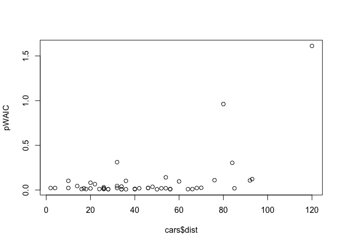<!-- -->

### **Frequentist deviance** is a generalization of using RSS to cases where models were fit by maximum likelihood, e.g. GLMs:

The total deviance is defined in terms of a ‘saturated model’ with
parameters for each observation the total deviance is 2 times the
log-likelihood ratio of the full model compared to the reduced model. In
the framework of the GLM, suppose there are two nested models, M1 and
M2. M1 is more parameterized and contains all parameters in M2, plus k
additional parameters. Then, under the null hypothesis that M2 (the
simpler model) is the true model, the difference between the deviances
for the two models follows, an approximate chi-squared distribution with
k-degrees of freedom (Wilkes Theorm). This can be used for hypothesis
testing on the deviance.  
<https://en.wikipedia.org/wiki/Deviance_(statistics)> – text above
modified from article.

Model comparison – this can help us understand how variables are related
to one another.

This returns to the fungus treatment experiment example.

``` r
## R code 7.26
set.seed(77)


N <- 500
h0 <- rnorm(n = N,mean = 10,sd = 2)
treatment <- rep(0:1, each = N/2)
fungus <- rbinom(n = N, size = 1, prob = (0.5 - treatment*0.4) )
h1 <- h0 + rnorm(N, 5 - 3*fungus)
d <- data.frame( h0=h0 , h1=h1 , treatment=treatment , fungus=fungus )

## R code 6.15
m6.6 <- quap(
    alist(
        h1 ~ dnorm( mu , sigma ),
        mu <- h0*p,
        p ~ dlnorm( 0 , 0.25 ),
        sigma ~ dexp( 1 )
    ), data=d )

m6.7 <- quap(
    alist(
        h1 ~ dnorm( mu , sigma ),
        mu <- h0 * p,
        p <- a + bt*treatment + bf*fungus,
        a ~ dlnorm( 0 , 0.2 ) ,
        bt ~ dnorm( 0 , 0.5 ),
        bf ~ dnorm( 0 , 0.5 ),
        sigma ~ dexp( 1 )
    ), data=d )

m6.8 <- quap(
    alist(
        h1 ~ dnorm( mu , sigma ),
        mu <- h0 * p,
        p <- a + bt*treatment,
        a ~ dlnorm( 0 , 0.2 ),
        bt ~ dnorm( 0 , 0.5 ),
        sigma ~ dexp( 1 )
    ), data=d )

compare( m6.6 , m6.7 , m6.8 , func=WAIC )
```

    ##          WAIC       SE    dWAIC      dSE    pWAIC       weight
    ## m6.7 1659.181 32.89590   0.0000       NA 3.802362 1.000000e+00
    ## m6.8 1977.513 28.04745 318.3312 30.27320 2.800760 7.503237e-70
    ## m6.6 2036.948 25.37183 377.7669 30.87275 1.518993 9.310282e-83

We can also compare the pareto smoothed importance sampling which has
nearly identical values.

6.7: h1 ~ T + F  
m6.8: h1 ~ T

Note that m6.8 is the data generating process and ‘correct’ causal
model, but these measures of model accuracy will tell us only what model
is best at prediction.

``` r
compare( m6.6 , m6.7 , m6.8 , func=PSIS )
```

    ##          PSIS       SE    dPSIS      dSE    pPSIS       weight
    ## m6.7 1659.239 32.98921   0.0000       NA 3.830855 1.000000e+00
    ## m6.8 1977.191 27.97176 317.9516 30.24374 2.633046 9.071799e-70
    ## m6.6 2037.208 25.36243 377.9689 30.92859 1.650995 8.415783e-83

(The weights are relative support for each model and are used in model
averaging)

Since these units are arbitrary, the standard error on the PSIS and WAIC
statistics is important. We also get a breakdown of the difference in
the standard errors in dSE. The difference between m6.7 and m6.8 is 40
and SE is 10. The 99% interval of the difference corresponds to a z
score of 2.6 and gives us the interval:

``` r
## R code 7.28
40.0 + c(-1,1)*10.4*2.6
```

    ## [1] 12.96 67.04

So this means that the 2 models are easily distinguishable by the out of
sample accuracy; m67 is a lot better.

``` r
## R code 7.29
plot( compare( m6.6 , m6.7 , m6.8 ) )
```

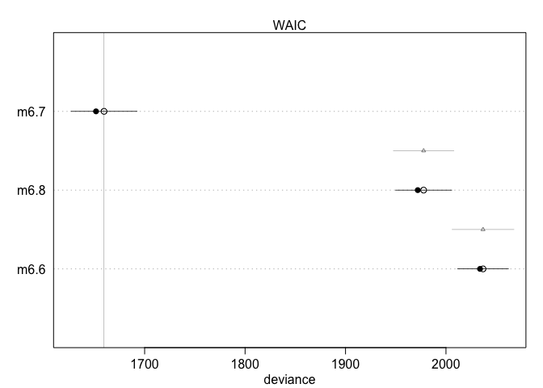<!-- -->

treatment only vs the intercept model- the 2 models are very similar -
the standard error of their difference is shown below and it is very
small.

``` r
## R code 7.30
set.seed(92)
waic_m6.6 <- WAIC( m6.6 , pointwise=TRUE )$WAIC
waic_m6.8 <- WAIC( m6.8 , pointwise=TRUE )$WAIC
diff_m6.6_m6.8 <- waic_m6.6 - waic_m6.8
sqrt( n*var( diff_m6.6_m6.8 ) )
```

    ## [1] 1.84237

this is also in the compare fun. – the standard errors in the contrasts
between models.

``` r
## R code 7.31
set.seed(93)
compare( m6.6 , m6.7 , m6.8 )@dSE
```

    ##          m6.6     m6.7     m6.8
    ## m6.6       NA 30.83404 15.65005
    ## m6.7 30.83404       NA 30.21708
    ## m6.8 15.65005 30.21708       NA

This shows us that even though we know T -\> H1 because we simulated the
data, it isn’t great at predicting H1 because there are other sources of
variation.

### outlier values

``` r
## R code 7.32

data(WaffleDivorce)
d <- WaffleDivorce
d$A <- standardize( d$MedianAgeMarriage )
d$D <- standardize( d$Divorce )
d$M <- standardize( d$Marriage )

m5.1 <- quap(
    alist(
        D ~ dnorm( mu , sigma ) ,
        mu <- a + bA * A ,
        a ~ dnorm( 0 , 0.2 ) ,
        bA ~ dnorm( 0 , 0.5 ) ,
        sigma ~ dexp( 1 )
    ) , data = d )

m5.2 <- quap(
    alist(
        D ~ dnorm( mu , sigma ) ,
        mu <- a + bM * M ,
        a ~ dnorm( 0 , 0.2 ) ,
        bM ~ dnorm( 0 , 0.5 ) ,
        sigma ~ dexp( 1 )
    ) , data = d )

m5.3 <- quap(
    alist(
        D ~ dnorm( mu , sigma ) ,
        mu <- a + bM*M + bA*A ,
        a ~ dnorm( 0 , 0.2 ) ,
        bM ~ dnorm( 0 , 0.5 ) ,
        bA ~ dnorm( 0 , 0.5 ) ,
        sigma ~ dexp( 1 )
    ) , data = d )

## R code 7.33
set.seed(24071847)
compare( m5.1 , m5.2 , m5.3 , func=PSIS )
```

    ## Some Pareto k values are high (>0.5). Set pointwise=TRUE to inspect individual points.
    ## Some Pareto k values are high (>0.5). Set pointwise=TRUE to inspect individual points.

    ## Some Pareto k values are very high (>1). Set pointwise=TRUE to inspect individual points.

    ##          PSIS       SE     dPSIS       dSE    pPSIS       weight
    ## m5.1 127.5665 14.69485  0.000000        NA 4.671425 0.8340176286
    ## m5.3 130.8062 16.15696  3.239685  1.808671 6.578663 0.1650769863
    ## m5.2 141.2178 11.56557 13.651299 10.923820 4.057204 0.0009053851

The warning that some pareto values are high means some approximations
PSIS makes are not being met for some outlier observations.

``` r
## R code 7.34
set.seed(24071847)
PSIS_m5.3 <- PSIS(m5.3,pointwise=TRUE)
```

    ## Some Pareto k values are very high (>1). Set pointwise=TRUE to inspect individual points.

``` r
set.seed(24071847)
WAIC_m5.3 <- WAIC(m5.3,pointwise=TRUE)
plot( PSIS_m5.3$k , WAIC_m5.3$penalty , xlab="PSIS Pareto k" ,
    ylab="WAIC penalty" , col=rangi2 , lwd=2 )
```

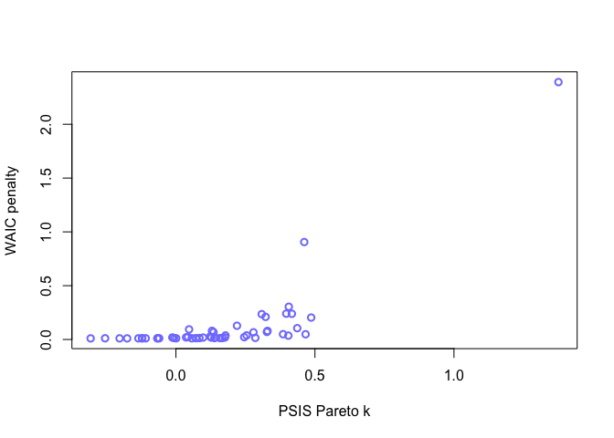<!-- -->

Now to my previous intuition that the highest WAIC penalty terms will be
at the values at the tails of the distribution, does that hold here?
Seems to… Idaho (upper right) hass a very high pareto K value and WAIC
penalty term because it has a very LOW rate of divorce for its average
age at marriage….This probably isn’t always true though there will be
some nonlinear relationships where there is a outlier in the middle of
the
distribution.

``` r
plot(d$MedianAgeMarriage, d$Divorce, main = 'lowest left corner = idaho')
```

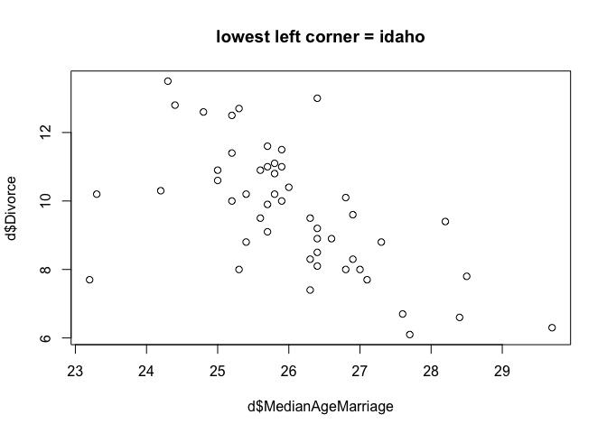<!-- -->

``` r
plot( d$Divorce, WAIC_m5.3$penalty , xlab="divorce rate" ,
    ylab="WAIC penalty" , col=rangi2 , lwd=2 )
```

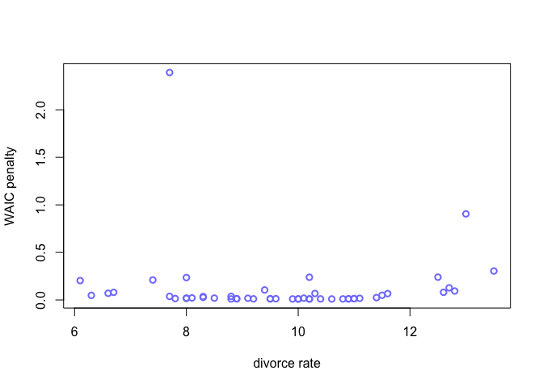<!-- -->

``` r
d[d$Location == 'Idaho', ]
```

    ##    Location Loc Population MedianAgeMarriage Marriage Marriage.SE Divorce
    ## 13    Idaho  ID       1.57              23.2     25.8        1.84     7.7
    ##    Divorce.SE WaffleHouses South Slaves1860 Population1860 PropSlaves1860
    ## 13       1.05            0     0          0              0              0
    ##            A         D        M
    ## 13 -2.294894 -1.091819 1.497141

Robust regression can be fit with student t distribution

``` r
## R code 7.35
m5.3t <- quap(
    alist(
        D ~ dstudent( 2 , mu , sigma ) ,
        mu <- a + bM*M + bA*A ,
        a ~ dnorm( 0 , 0.2 ) ,
        bM ~ dnorm( 0 , 0.5 ) ,
        bA ~ dnorm( 0 , 0.5 ) ,
        sigma ~ dexp( 1 )
    ) , data = d )

WAIC(m5.3t)
```

    ##      WAIC      lppd  penalty  std_err
    ## 1 133.722 -60.01001 6.851008 11.83619

Note there is now no warning about high penalty values.

``` r
suppressMessages(library(rethinking))
```

7.1 Information entropy is a way to measure the reduction in uncertainty
when we learn an outcome. The measure of uncertainty from some
probability distribution should be continuous, should increase as the
number of elements it predicts increases and should be an addative
combination of those things.

7.2 entropy of an event occuring 70% of the time.

``` r
 - ((0.7 * log(0.7) ) + (0.3 * log(0.3)))
```

    ## [1] 0.6108643

7.3 Entrpy of a loaded 4-sided die.

``` r
dice = list(one = 0.2, two = 0.25, three = 0.25, four = 0.3)

# the probabilities add to 1 of the dice. 
sum(unlist(dice))
```

    ## [1] 1

``` r
# calculate entropy manually 
xx = unlist(dice)
calc_entropy = function(x){ 
  -sum(x * log(x))
}
  
# calculate entropy manually 
ent1 = calc_entropy(x = xx)

# calc entropy with function 
ent2 = entropy::entropy.empirical(y = unlist(dice))

all.equal(ent1, ent2 )
```

    ## [1] TRUE

7.5

``` r
new.die = c(0, 0.33, 0.33, 0.33)
calc_entropy(new.die)
```

    ## [1] NaN

We actually need to drop the event that can’t happen.

``` r
calc_entropy(new.die[-1])
```

    ## [1] 1.097576

7.1m  
WAIC is like AIC but it has the penalty term instead of being equal to
2p is equal to the variance of the log probabilities of each observation
according to the model. The first term in each represents the deviance
(estimated divergence) of the model fit to the training data, for AIC
its the deviance, for WAIC, its a posterior distribution over each
observation with the penalty term also summing over a posterior
distribution. If the mean deviance is equal to the posterior mean then
AIC and WAIC will basically be the same.

7.2m With model selection, we are losing information about the
structural relationships between parameters in the model; model
selection based on information criteria is more for prediction whereas
model comparison is more for understanding the biology.

7.3m The values of information criteria are in arbitrary units so must
be compared to fits of the same data by definition.

7.4m if the prior is more informative in that narrowness improves the
fit, then the penalty term for aic stays the same (2p) and the penalty
term for WAIC will decrease because the posterior observation variance
will decrease. (*less flexible models (more regularized priors)
effective number of parameters (penalty) declines*).

7.5m informative priors reduce overfitting because they constrain the
parameter values a model considers as plausible making the model more
skeptical of more highly leveraged data points. (*the regularized model
finds the regular / recurring features of the data generation process*).

7.6m overly informatie piors are too constrained and will not even learn
the regular features.

7.7

``` r
data("Laffer")
d = Laffer
d$rev = d$tax_revenue / max(d$tax_revenue)
d$rate = d$tax_rate / max(d$tax_rate)

plot(d$rev, d$rate)
```

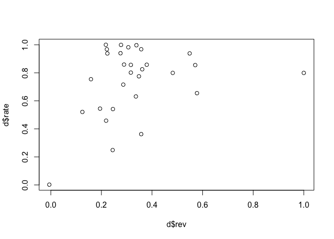<!-- -->

``` r
m1 = lm(rev ~ rate, data = d)


m1 = quap( 
  alist( 
    rev ~ dnorm(mu, sigma),
    mu <- alpha + bR*rate, 
    alpha ~ dnorm(0.5, 0.1),
    bR ~ dnorm(0.5, 0.1), 
    sigma ~ dexp(1)
    ), 
  data = d)

m2 = quap( 
  alist( 
    rev ~ dnorm(mu, sigma),
    mu <- alpha + bR*rate + bR*rate^2 + bR*rate^3, 
    alpha ~ dnorm(0.5, 0.1),
    bR ~ dnorm(0.5, 0.1), 
    sigma ~ dexp(1)
    ), 
  data = d)


compare(m1, m2)
```

    ##         WAIC       SE    dWAIC      dSE    pWAIC       weight
    ## m2 -5.028049 22.68973  0.00000       NA  7.62661 0.9992918672
    ## m1  9.476292 37.30428 14.50434 15.17792 15.42004 0.0007081328

``` r
rate.seq = seq(0,max(d$rate), length.out = 30)
rev.seq = seq(0, max(d$rev),length.out = 30)
mu.m1 = link(m1, data = list(rate = rate.seq))
mu.m2 = link(m2, data = list(rate = rate.seq))

m1.mean = apply(mu.m1, 2, mean)
m2.mean = apply(mu.m2, 2, mean)


# plot it all 
plot( rev ~ rate , d , col= rangi2  ) 
lines( x = rate.seq , y = m1.mean) 
lines( x = rate.seq , y = m2.mean, col = 'red') 
```

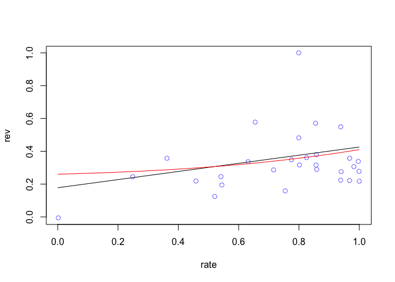<!-- -->

conclude that the relationship is positive even with a highly nonlinear
fit.

``` r
m1.waic = WAIC(m1)
m1.psis = PSIS(m1, pointwise = TRUE)
```

    ## Some Pareto k values are very high (>1). Set pointwise=TRUE to inspect individual points.

``` r
plot(m1.psis$penalty)
```

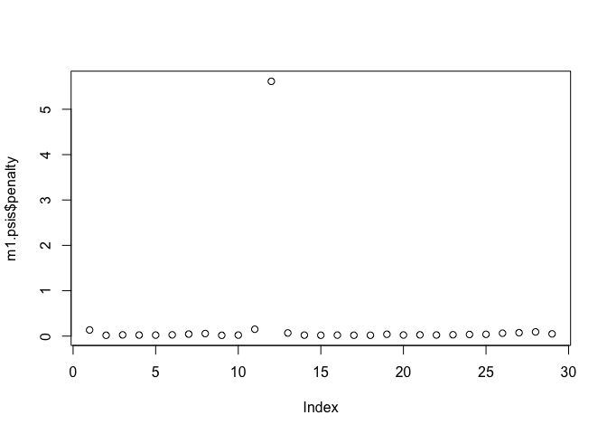<!-- -->
