Chapter 9 Markov Chain Monte Carlo
================

### understanding the metropolis / Rosenbluth algorithm with Markov Chain simulation

Imagine visiting “islands” (parameter values) in proportion to their
population size (posterior probabilities) for a certain number of weeks
(samples from th posterior). The metropolis is the “grandparent” of
other strategies – hard coded below. This is a special case of the
metropolis algorithm:

``` r
suppressMessages(library(rethinking))
r = rangi2
set.seed(1990)
## R code 9.1
num_weeks <- 1e3
positions <- rep(0,num_weeks)
# start at the biggest island, island 10. 
current <- 10
for ( i in 1:num_weeks ) {
  
    ## record current position
    positions[i] <- current
    ## flip coin to generate proposal (left or right)
    proposal <- current + sample( c(-1,1) , size=1 )
    # this part just ensures he goes in a circle. 
    ## now make sure he loops around the archipelago
    if ( proposal < 1 ) proposal <- 10
    if ( proposal > 10 ) proposal <- 1
    
    # This part is the meat of it 
    ## move?
    # e.g. if proposal= 8, current= 9 ; prob = 0.88 
    # if proposal = 9 current = 8, then 'prob' = 1.25
    prob_move <- proposal/current
    
    # if proposal bigger than current, he always moves because prob_move is > 1 
    # if proposal is smaller then if a random uniform sample bound 0,1 is less than 
    # prob_move, then he moves -- he moves in proportion to the prob_move
    # we thus update current to take the value of the new island. 
    current <- ifelse( runif(1) < prob_move , proposal , current )
    #print(current)
}

## R code 9.2
par(mfrow=c(1,2))
plot( 1:400 , positions[1:400] , col = r) 
plot(table(positions), col = r) 
```

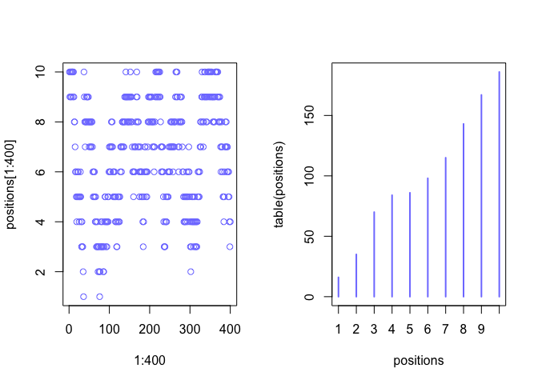<!-- -->

A Markov chain can be summarized by the transition probability matrix –
see Bertsekas p 342.

### Gibbs sampling

Gibbs samplers make **adaptive proposals** the distribution of propsed
parameter values adjusts itself intelligently.

samplers use distributions of conjugate pairs of and likeliooods.  
conjugate pairs have analytic solutions for posterior distribution of an
individual parameter.

An issue with gibbs samplers - correlations in parameter values form
narrow valleys. metropolis and gibbs get stuck because they dont know
enought about the shape of the distribution (the posterior).

The **concentration of measure** principal: most of the probability mass
of a high dimensional distribution is always very far from the mode. The
3 dimensional space the sphere is densest at its core, like the peak of
a mountain but the vollume increases as we move away from the core

this keeps happening as you add more dimensions. With 10 dimensions
you’re far from the mode of robability mass.  
**the sampled points are in a thin high dimensional shell far from the
mode**

``` r
## R code 9.4
D1 = 1
D <- 10
T <- 1e3
Y1 <- rmvnorm(n = T,mean = rep(0,D1), sigma = diag(D1))
Y <- rmvnorm(n = T,mean = rep(0,D), sigma = diag(D))
rad_dist <- function( Y ) sqrt( sum(Y^2) )

Rd1 = sapply( 1:T , function(i) rad_dist( Y1[i,] ) )
Rd <- sapply( 1:T , function(i) rad_dist( Y[i,] ) )
par(mfrow = c(2,1))
dens( Rd1 , col = r,
      main =  'N(0,1) normal dist. \n radial distance from mode of probability mass')
dens( Rd , col = r,
      main = 'N[k = 10](0,1) multiariate normal \nradial distance from mode of probability mass')
```

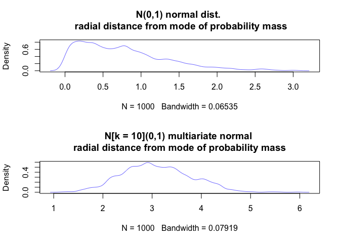<!-- -->

### Hamiltonian monte carlo

*Whenever there is a randomized way of doing something, there is a
non-randomized way that delivers better performance but requires more
thought*

HMC uses physical simulations - its like you flick a marble in a bowl in
a random direction; and after some time interval stop and record where
the marble is. As the marble rolls uphill the momentum slows as
translational energy is converted to gravitational potantial energy; the
frequency of time spent in the bottom of the bowl is highest which by
analogy is the highest density part of the probability mass. it also has
really low *autocorrelation* the adjacent samples have no correlation in
contrast to metropolis. Its simulating this things like the total energy
of the system must be conserved or the algorithm rejects the proposal
for the particle. HMC calculates the *gradient* the slope in all
directions by using automatic differentiation (a generalized version of
back-propegation).

2 settings needed:  
leapfrog steps – long paths  
step size – small steps , path can turn sharply

these need to be tuned to not get autocurrelation (p. 274), this happens
automatically in the stan hmc sampler algorithms in a warmup stage, and
by using NUTS (no u turn sampler) algorithms.

hard coded HMC:

1.  function `U` returning the negative log probability of the data at
    the current parameter values(position)  
2.  function `grad_u` for the gradient of neg log probability at current
    position  
3.  step size `epsilon`  
4.  amount of leapfrog steps `L`  
5.  starting position `current_q`

This is for the model on p 273

xi ∼ Normal( µx , 1)  
yi ∼ Normal( µy , 1)  
µx ∼ Normal(0, 0.5)  
µy ∼ Normal(0, 0.5)

``` r
# test data
set.seed(7)
y <- rnorm(50)
x <- rnorm(50)
x <- as.numeric(scale(x))
y <- as.numeric(scale(y))
plot(x,y, col = r)
```

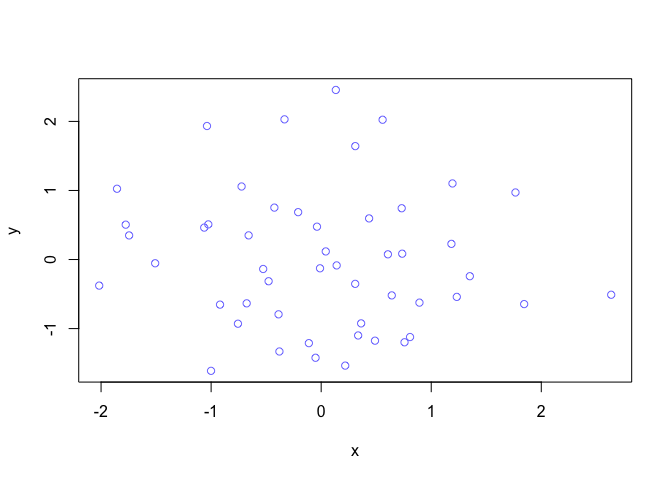<!-- -->

``` r
## R code 9.5
# see expression on p 276 
# U needs to return neg-log-probability
U <- function( q , a=0 , b=1 , k=0 , d=1 ) {
    muy <- q[1]
    mux <- q[2]
    U <- 
      sum( dnorm(y, mean = muy, sd = 1, log=TRUE)) + 
      sum( dnorm(x,mean =  mux,sd =  1, log=TRUE) ) +
      dnorm(muy,a,b,log=TRUE) + dnorm(mux,k,d,log=TRUE)
    return( -U )
}

## R code 9.6
# gradient function
# need vector of partial derivatives of U with respect to vector q
U_gradient <- function( q , a=0 , b=1 , k=0 , d=1 ) {
    muy <- q[1]
    mux <- q[2]
    G1 <- sum( y - muy ) + (a - muy)/b^2 #dU/dmuy
    G2 <- sum( x - mux ) + (k - mux)/d^2 #dU/dmux
    return( c( -G1 , -G2 ) ) # negative bc energy is neg-log-prob
}
```

Below we call this function `HMC2`

``` r
## R code 9.8
HMC2 <- function (U, grad_U, epsilon, L, current_q) {
  q = current_q
  p = rnorm(length(q),0,1) # random flick - p is momentum.
  current_p = p
  
  # Make a half step for momentum at the beginning
  p = p - epsilon * grad_U(q) / 2
  
  # initialize bookkeeping - saves trajectory
  qtraj <- matrix(NA,nrow=L+1,ncol=length(q))
  ptraj <- qtraj
  qtraj[1,] <- current_q
  ptraj[1,] <- p

  # here is where the action is over the leapfrog steps
  # L steps are taken uing he gradient to compute log posterior at each point. 
  # Alternate full steps for position and momentum
  for ( i in 1:L ) {
    q = q + epsilon * p # Full step for the position
    
    # Make a full step for the momentum, except at end of trajectory
    if ( i!=L ) {
        p = p - epsilon * grad_U(q)
        ptraj[i+1, ] <- p
    }
    qtraj[i+1, ] <- q
  }

  ## R code 9.10
  # Make a half step for momentum at the end
  p = p - epsilon * grad_U(q) / 2
  ptraj[L+1, ] <- p
  # Negate momentum at end of trajectory to make the proposal symmetric
  p = -p
  # Evaluate potential and kinetic energies at start and end of trajectory
  current_U = U(current_q)
  current_K = sum(current_p^2) / 2
  proposed_U = U(q)
  proposed_K = sum(p^2) / 2
  # Accept or reject the state at end of trajectory, returning either
  # the position at the end of the trajectory or the initial position
  accept <- 0
  if (runif(1) < exp(current_U-proposed_U+current_K-proposed_K)) {
    new_q <- q  # accept
    accept <- 1
  } else new_q <- current_q  # reject
  return(list( q=new_q, traj=qtraj, ptraj=ptraj, accept=accept ))
}
```

Run the simulation

``` r
## R code 9.7
library(shape) # for fancy arrows
Q <- list()
Q$q <- c(-0.1,0.2)
pr <- 0.3
plot( NULL , ylab="muy" , xlab="mux" , xlim=c(-pr,pr) , ylim=c(-pr,pr) )
step <- 0.03
L <- 11 # 0.03/28 for U-turns --- 11 for working example
n_samples <- 4
path_col <- col.alpha("black",0.5)
points( Q$q[1] , Q$q[2] , pch=4 , col="black" )
for ( i in 1:n_samples ) {
    Q <- HMC2( U , U_gradient , step , L , Q$q )
    if ( n_samples < 10 ) {
      for ( j in 1:L ) {
        K0 <- sum(Q$ptraj[j,]^2)/2 # kinetic energy
        lines( Q$traj[j:(j+1),1] , Q$traj[j:(j+1),2] , col=path_col , lwd=1+2*K0 )
      }
      points( Q$traj[1:L+1,] , pch=16 , col="white" , cex=0.35 )
      Arrows( Q$traj[L,1] , Q$traj[L,2] , Q$traj[L+1,1] , Q$traj[L+1,2] ,
          arr.length=0.35 , arr.adj = 0.7 )
      text( Q$traj[L+1,1] , Q$traj[L+1,2] , i , cex=0.8 , pos=4 , offset=0.4 )
    }
    points( Q$traj[L+1,1] , Q$traj[L+1,2] , pch=ifelse( Q$accept==1 , 16 , 1 ) ,
        col=ifelse( abs(Q$dH)>0.1 , "red" , "black" ) )
}
```

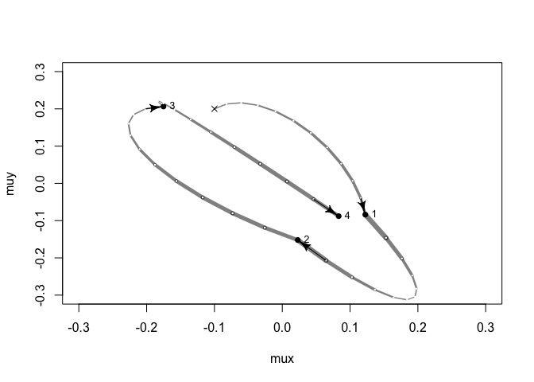<!-- -->

### fit model with HMC stan with ulam

Similar to `brms` in that it is a wrapper to `stan` but we use math
stats notation to build models as in `quap`

Terrain ruggedness example.  
To use ulam we need to process the data for stan to only have the
variables of interest in the model.

``` r
## R code 9.11
library(rethinking)
data(rugged)
d <- rugged
d$log_gdp <- log(d$rgdppc_2000)
dd <- d[ complete.cases(d$rgdppc_2000) , ]
dd$log_gdp_std <- dd$log_gdp / mean(dd$log_gdp)
dd$rugged_std <- dd$rugged / max(dd$rugged)
dd$cid <- ifelse( dd$cont_africa==1 , 1 , 2 )


## R code 9.13
dat_slim <- list(
    log_gdp_std = dd$log_gdp_std,
    rugged_std = dd$rugged_std,
    cid = as.integer( dd$cid )
)
str(dat_slim)
```

    ## List of 3
    ##  $ log_gdp_std: num [1:170] 0.88 0.965 1.166 1.104 0.915 ...
    ##  $ rugged_std : num [1:170] 0.138 0.553 0.124 0.125 0.433 ...
    ##  $ cid        : int [1:170] 1 2 2 2 2 2 2 2 2 1 ...

``` r
## R code 9.14
f9.14 = alist(
  log_gdp_std ~ dnorm( mu , sigma ) ,
  mu <- a[cid] + b[cid]*( rugged_std - 0.215 ) ,
  a[cid] ~ dnorm( 1 , 0.1 ) ,
  b[cid] ~ dnorm( 0 , 0.3 ) ,
  sigma ~ dexp( 1 )
) 

# fit model using HMC with stan 

m9.1 <- ulam(f9.14, data=dat_slim , chains=4, cores=4)
```

    ## Trying to compile a simple C file

    ## Running /Library/Frameworks/R.framework/Resources/bin/R CMD SHLIB foo.c
    ## clang -I"/Library/Frameworks/R.framework/Resources/include" -DNDEBUG   -I"/Library/Frameworks/R.framework/Versions/3.5/Resources/library/Rcpp/include/"  -I"/Library/Frameworks/R.framework/Versions/3.5/Resources/library/RcppEigen/include/"  -I"/Library/Frameworks/R.framework/Versions/3.5/Resources/library/RcppEigen/include/unsupported"  -I"/Users/matthewmule/Library/R/3.5/library/BH/include" -I"/Users/matthewmule/Library/R/3.5/library/StanHeaders/include/src/"  -I"/Users/matthewmule/Library/R/3.5/library/StanHeaders/include/"  -I"/Users/matthewmule/Library/R/3.5/library/rstan/include" -DEIGEN_NO_DEBUG  -D_REENTRANT  -DBOOST_DISABLE_ASSERTS -DBOOST_PENDING_INTEGER_LOG2_HPP -include stan/math/prim/mat/fun/Eigen.hpp   -isysroot /Library/Developer/CommandLineTools/SDKs/MacOSX.sdk -I/usr/local/include   -fPIC  -Wall -g -O2  -c foo.c -o foo.o
    ## In file included from <built-in>:1:
    ## In file included from /Users/matthewmule/Library/R/3.5/library/StanHeaders/include/stan/math/prim/mat/fun/Eigen.hpp:13:
    ## In file included from /Library/Frameworks/R.framework/Versions/3.5/Resources/library/RcppEigen/include/Eigen/Dense:1:
    ## In file included from /Library/Frameworks/R.framework/Versions/3.5/Resources/library/RcppEigen/include/Eigen/Core:88:
    ## /Library/Frameworks/R.framework/Versions/3.5/Resources/library/RcppEigen/include/Eigen/src/Core/util/Macros.h:613:1: error: unknown type name 'namespace'
    ## namespace Eigen {
    ## ^
    ## /Library/Frameworks/R.framework/Versions/3.5/Resources/library/RcppEigen/include/Eigen/src/Core/util/Macros.h:613:16: error: expected ';' after top level declarator
    ## namespace Eigen {
    ##                ^
    ##                ;
    ## In file included from <built-in>:1:
    ## In file included from /Users/matthewmule/Library/R/3.5/library/StanHeaders/include/stan/math/prim/mat/fun/Eigen.hpp:13:
    ## In file included from /Library/Frameworks/R.framework/Versions/3.5/Resources/library/RcppEigen/include/Eigen/Dense:1:
    ## /Library/Frameworks/R.framework/Versions/3.5/Resources/library/RcppEigen/include/Eigen/Core:96:10: fatal error: 'complex' file not found
    ## #include <complex>
    ##          ^~~~~~~~~
    ## 3 errors generated.
    ## make: *** [foo.o] Error 1

``` r
# view results 
precis(m9.1, depth = 2)
```

    ##             mean          sd        5.5%       94.5%    n_eff     Rhat4
    ## a[1]   0.8867460 0.015513793  0.86189717  0.91102606 2192.932 0.9997776
    ## a[2]   1.0506145 0.010225230  1.03411541  1.06714008 2932.658 0.9996291
    ## b[1]   0.1301312 0.073498934  0.01169699  0.25000466 1859.390 0.9995221
    ## b[2]  -0.1435068 0.054194287 -0.23289032 -0.05778793 2493.204 0.9986827
    ## sigma  0.1115278 0.006181262  0.10255317  0.12153256 2561.729 0.9993196

We can also extract the stan code created by ulam for m9.14 which was
made by our model formula.

``` r
stancode(m9.1)
```

    ## data{
    ##     vector[170] log_gdp_std;
    ##     vector[170] rugged_std;
    ##     int cid[170];
    ## }
    ## parameters{
    ##     vector[2] a;
    ##     vector[2] b;
    ##     real<lower=0> sigma;
    ## }
    ## model{
    ##     vector[170] mu;
    ##     sigma ~ exponential( 1 );
    ##     b ~ normal( 0 , 0.3 );
    ##     a ~ normal( 1 , 0.1 );
    ##     for ( i in 1:170 ) {
    ##         mu[i] = a[cid[i]] + b[cid[i]] * (rugged_std[i] - 0.215);
    ##     }
    ##     log_gdp_std ~ normal( mu , sigma );
    ## }

rhat indictes convergence of the markov chains to the target
distribution. should be around 1

### Assessing model with posterior visualization and diagnostic plots

posterior distributions of

``` r
## R code 9.19
pairs( m9.1 )
```

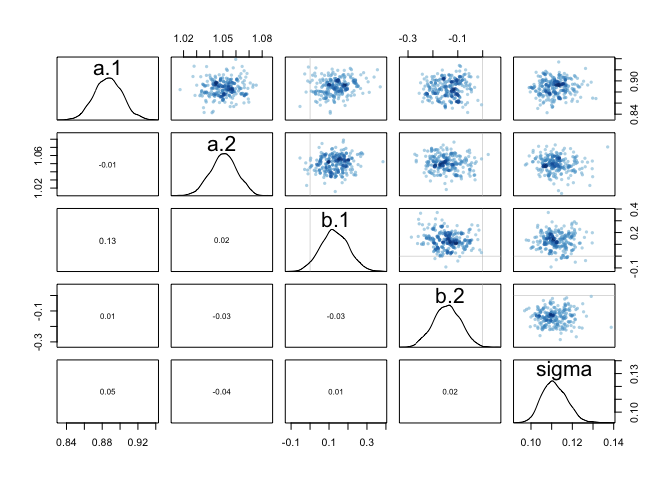<!-- -->

Trace plots and trace rank plots – look for three things  
1\. stationary - each chain sticks to concentrated area  
2\. good mixing - chain explores the full region  
3\. convergence - all chains converge at same region

``` r
## R code 9.20
traceplot( m9.1 )
```

    ## [1] 1000
    ## [1] 1
    ## [1] 1000

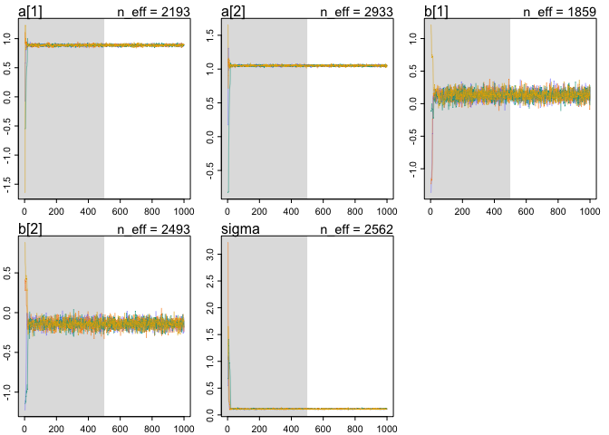<!-- -->

Trace rank plots  
for each parameter, take all the samples from each chain the lowest gets
rank 1 the largest gets rank 4 (bc we had 4 chains here). If the markov
chain is exploring the sample space effectively the traces will be
largely overlapping.  
these are healthy trace rank plots.

``` r
## R code 9.21
trankplot( m9.1 )
```

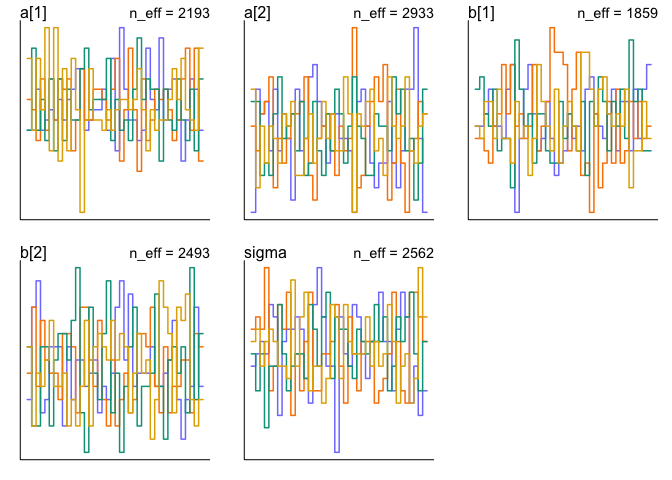<!-- -->

### diagnostics

`n_eff` - how many samples do we need? The ore importatn quakntity is
the number of effective samples – we hae autocorrelationin the samples;
think of as the length of the markov chain with no autocorrelation that
would provide the same quality of estimate as your chain. In a linear
model setting, often 200 effective samples are sugfficient to estimate
the posterior mean and an order of magnitude more are needed to estimate
the posterior variance.

`rhat` - if this is above 1 the chain hasn’t converged.

How many chains do we need?  
one short chain to debug, 4 chains for verification and inference.

### Understanding poor performance

– using bad prior:

``` r
## R code 9.22
y <- c(-1,1)
set.seed(11)
m9.2 <- ulam(
    alist(
        y ~ dnorm( mu , sigma ) ,
        mu <- alpha ,
        alpha ~ dnorm( 0 , 1000 ) ,
        sigma ~ dexp( 0.0001 )
    ) , data=list(y=y) , chains=3 )
```

    ## Trying to compile a simple C file

    ## Running /Library/Frameworks/R.framework/Resources/bin/R CMD SHLIB foo.c
    ## clang -I"/Library/Frameworks/R.framework/Resources/include" -DNDEBUG   -I"/Library/Frameworks/R.framework/Versions/3.5/Resources/library/Rcpp/include/"  -I"/Library/Frameworks/R.framework/Versions/3.5/Resources/library/RcppEigen/include/"  -I"/Library/Frameworks/R.framework/Versions/3.5/Resources/library/RcppEigen/include/unsupported"  -I"/Users/matthewmule/Library/R/3.5/library/BH/include" -I"/Users/matthewmule/Library/R/3.5/library/StanHeaders/include/src/"  -I"/Users/matthewmule/Library/R/3.5/library/StanHeaders/include/"  -I"/Users/matthewmule/Library/R/3.5/library/rstan/include" -DEIGEN_NO_DEBUG  -D_REENTRANT  -DBOOST_DISABLE_ASSERTS -DBOOST_PENDING_INTEGER_LOG2_HPP -include stan/math/prim/mat/fun/Eigen.hpp   -isysroot /Library/Developer/CommandLineTools/SDKs/MacOSX.sdk -I/usr/local/include   -fPIC  -Wall -g -O2  -c foo.c -o foo.o
    ## In file included from <built-in>:1:
    ## In file included from /Users/matthewmule/Library/R/3.5/library/StanHeaders/include/stan/math/prim/mat/fun/Eigen.hpp:13:
    ## In file included from /Library/Frameworks/R.framework/Versions/3.5/Resources/library/RcppEigen/include/Eigen/Dense:1:
    ## In file included from /Library/Frameworks/R.framework/Versions/3.5/Resources/library/RcppEigen/include/Eigen/Core:88:
    ## /Library/Frameworks/R.framework/Versions/3.5/Resources/library/RcppEigen/include/Eigen/src/Core/util/Macros.h:613:1: error: unknown type name 'namespace'
    ## namespace Eigen {
    ## ^
    ## /Library/Frameworks/R.framework/Versions/3.5/Resources/library/RcppEigen/include/Eigen/src/Core/util/Macros.h:613:16: error: expected ';' after top level declarator
    ## namespace Eigen {
    ##                ^
    ##                ;
    ## In file included from <built-in>:1:
    ## In file included from /Users/matthewmule/Library/R/3.5/library/StanHeaders/include/stan/math/prim/mat/fun/Eigen.hpp:13:
    ## In file included from /Library/Frameworks/R.framework/Versions/3.5/Resources/library/RcppEigen/include/Eigen/Dense:1:
    ## /Library/Frameworks/R.framework/Versions/3.5/Resources/library/RcppEigen/include/Eigen/Core:96:10: fatal error: 'complex' file not found
    ## #include <complex>
    ##          ^~~~~~~~~
    ## 3 errors generated.
    ## make: *** [foo.o] Error 1
    ## 
    ## SAMPLING FOR MODEL '726d002e27cec1633082261fcfedb813' NOW (CHAIN 1).
    ## Chain 1: 
    ## Chain 1: Gradient evaluation took 1.3e-05 seconds
    ## Chain 1: 1000 transitions using 10 leapfrog steps per transition would take 0.13 seconds.
    ## Chain 1: Adjust your expectations accordingly!
    ## Chain 1: 
    ## Chain 1: 
    ## Chain 1: Iteration:   1 / 1000 [  0%]  (Warmup)
    ## Chain 1: Iteration: 100 / 1000 [ 10%]  (Warmup)
    ## Chain 1: Iteration: 200 / 1000 [ 20%]  (Warmup)
    ## Chain 1: Iteration: 300 / 1000 [ 30%]  (Warmup)
    ## Chain 1: Iteration: 400 / 1000 [ 40%]  (Warmup)
    ## Chain 1: Iteration: 500 / 1000 [ 50%]  (Warmup)
    ## Chain 1: Iteration: 501 / 1000 [ 50%]  (Sampling)
    ## Chain 1: Iteration: 600 / 1000 [ 60%]  (Sampling)
    ## Chain 1: Iteration: 700 / 1000 [ 70%]  (Sampling)
    ## Chain 1: Iteration: 800 / 1000 [ 80%]  (Sampling)
    ## Chain 1: Iteration: 900 / 1000 [ 90%]  (Sampling)
    ## Chain 1: Iteration: 1000 / 1000 [100%]  (Sampling)
    ## Chain 1: 
    ## Chain 1:  Elapsed Time: 0.041155 seconds (Warm-up)
    ## Chain 1:                0.024234 seconds (Sampling)
    ## Chain 1:                0.065389 seconds (Total)
    ## Chain 1: 
    ## 
    ## SAMPLING FOR MODEL '726d002e27cec1633082261fcfedb813' NOW (CHAIN 2).
    ## Chain 2: 
    ## Chain 2: Gradient evaluation took 2e-06 seconds
    ## Chain 2: 1000 transitions using 10 leapfrog steps per transition would take 0.02 seconds.
    ## Chain 2: Adjust your expectations accordingly!
    ## Chain 2: 
    ## Chain 2: 
    ## Chain 2: Iteration:   1 / 1000 [  0%]  (Warmup)
    ## Chain 2: Iteration: 100 / 1000 [ 10%]  (Warmup)
    ## Chain 2: Iteration: 200 / 1000 [ 20%]  (Warmup)
    ## Chain 2: Iteration: 300 / 1000 [ 30%]  (Warmup)
    ## Chain 2: Iteration: 400 / 1000 [ 40%]  (Warmup)
    ## Chain 2: Iteration: 500 / 1000 [ 50%]  (Warmup)
    ## Chain 2: Iteration: 501 / 1000 [ 50%]  (Sampling)
    ## Chain 2: Iteration: 600 / 1000 [ 60%]  (Sampling)
    ## Chain 2: Iteration: 700 / 1000 [ 70%]  (Sampling)
    ## Chain 2: Iteration: 800 / 1000 [ 80%]  (Sampling)
    ## Chain 2: Iteration: 900 / 1000 [ 90%]  (Sampling)
    ## Chain 2: Iteration: 1000 / 1000 [100%]  (Sampling)
    ## Chain 2: 
    ## Chain 2:  Elapsed Time: 0.033183 seconds (Warm-up)
    ## Chain 2:                0.071883 seconds (Sampling)
    ## Chain 2:                0.105066 seconds (Total)
    ## Chain 2: 
    ## 
    ## SAMPLING FOR MODEL '726d002e27cec1633082261fcfedb813' NOW (CHAIN 3).
    ## Chain 3: 
    ## Chain 3: Gradient evaluation took 4e-06 seconds
    ## Chain 3: 1000 transitions using 10 leapfrog steps per transition would take 0.04 seconds.
    ## Chain 3: Adjust your expectations accordingly!
    ## Chain 3: 
    ## Chain 3: 
    ## Chain 3: Iteration:   1 / 1000 [  0%]  (Warmup)
    ## Chain 3: Iteration: 100 / 1000 [ 10%]  (Warmup)
    ## Chain 3: Iteration: 200 / 1000 [ 20%]  (Warmup)
    ## Chain 3: Iteration: 300 / 1000 [ 30%]  (Warmup)
    ## Chain 3: Iteration: 400 / 1000 [ 40%]  (Warmup)
    ## Chain 3: Iteration: 500 / 1000 [ 50%]  (Warmup)
    ## Chain 3: Iteration: 501 / 1000 [ 50%]  (Sampling)
    ## Chain 3: Iteration: 600 / 1000 [ 60%]  (Sampling)
    ## Chain 3: Iteration: 700 / 1000 [ 70%]  (Sampling)
    ## Chain 3: Iteration: 800 / 1000 [ 80%]  (Sampling)
    ## Chain 3: Iteration: 900 / 1000 [ 90%]  (Sampling)
    ## Chain 3: Iteration: 1000 / 1000 [100%]  (Sampling)
    ## Chain 3: 
    ## Chain 3:  Elapsed Time: 0.061298 seconds (Warm-up)
    ## Chain 3:                0.012286 seconds (Sampling)
    ## Chain 3:                0.073584 seconds (Total)
    ## Chain 3:

    ## Warning: There were 65 divergent transitions after warmup. Increasing adapt_delta above 0.95 may help. See
    ## http://mc-stan.org/misc/warnings.html#divergent-transitions-after-warmup

    ## Warning: Examine the pairs() plot to diagnose sampling problems

    ## Warning: The largest R-hat is 1.08, indicating chains have not mixed.
    ## Running the chains for more iterations may help. See
    ## http://mc-stan.org/misc/warnings.html#r-hat

    ## Warning: Bulk Effective Samples Size (ESS) is too low, indicating posterior means and medians may be unreliable.
    ## Running the chains for more iterations may help. See
    ## http://mc-stan.org/misc/warnings.html#bulk-ess

    ## Warning: Tail Effective Samples Size (ESS) is too low, indicating posterior variances and tail quantiles may be unreliable.
    ## Running the chains for more iterations may help. See
    ## http://mc-stan.org/misc/warnings.html#tail-ess

``` r
## R code 9.23
precis( m9.2 )
```

    ##            mean        sd        5.5%     94.5%    n_eff    Rhat4
    ## alpha  18.51603  347.4088 -355.304293  466.0076 129.6900 1.024441
    ## sigma 508.85264 1448.3735    6.843207 1892.8863 162.8832 1.015591

we should have gotten parameter values around 0. stan couldn’t explore
part of the posterior becauseof the bad prior. The absurd values are due
to **divergent transitions** and exploring a parameter space frmo a bad
prior far from the actual highest density.

The red points below are divergent
    transitions.

``` r
pairs(m9.2@stanfit)
```

    ## Warning in KernSmooth::bkde2D(x, bandwidth = bandwidth, gridsize = nbin, :
    ## Binning grid too coarse for current (small) bandwidth: consider increasing
    ## 'gridsize'
    
    ## Warning in KernSmooth::bkde2D(x, bandwidth = bandwidth, gridsize = nbin, :
    ## Binning grid too coarse for current (small) bandwidth: consider increasing
    ## 'gridsize'
    
    ## Warning in KernSmooth::bkde2D(x, bandwidth = bandwidth, gridsize = nbin, :
    ## Binning grid too coarse for current (small) bandwidth: consider increasing
    ## 'gridsize'

<!-- -->

the chains spend a lot of time around one extreme value with minimal
overlap.

``` r
trankplot(m9.2)
```

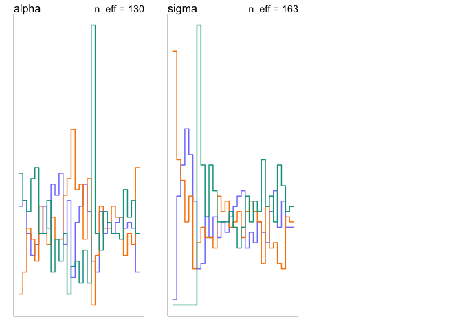<!-- -->

Now with better priors.

``` r
## R code 9.24
set.seed(11)
m9.3 <- ulam(
    alist(
        y ~ dnorm( mu , sigma ) ,
        mu <- alpha ,
        alpha ~ dnorm( 1 , 10 ) ,
        sigma ~ dexp( 1 )
    ) , data=list(y=y) , chains=3 )
```

    ## Trying to compile a simple C file

    ## Running /Library/Frameworks/R.framework/Resources/bin/R CMD SHLIB foo.c
    ## clang -I"/Library/Frameworks/R.framework/Resources/include" -DNDEBUG   -I"/Library/Frameworks/R.framework/Versions/3.5/Resources/library/Rcpp/include/"  -I"/Library/Frameworks/R.framework/Versions/3.5/Resources/library/RcppEigen/include/"  -I"/Library/Frameworks/R.framework/Versions/3.5/Resources/library/RcppEigen/include/unsupported"  -I"/Users/matthewmule/Library/R/3.5/library/BH/include" -I"/Users/matthewmule/Library/R/3.5/library/StanHeaders/include/src/"  -I"/Users/matthewmule/Library/R/3.5/library/StanHeaders/include/"  -I"/Users/matthewmule/Library/R/3.5/library/rstan/include" -DEIGEN_NO_DEBUG  -D_REENTRANT  -DBOOST_DISABLE_ASSERTS -DBOOST_PENDING_INTEGER_LOG2_HPP -include stan/math/prim/mat/fun/Eigen.hpp   -isysroot /Library/Developer/CommandLineTools/SDKs/MacOSX.sdk -I/usr/local/include   -fPIC  -Wall -g -O2  -c foo.c -o foo.o
    ## In file included from <built-in>:1:
    ## In file included from /Users/matthewmule/Library/R/3.5/library/StanHeaders/include/stan/math/prim/mat/fun/Eigen.hpp:13:
    ## In file included from /Library/Frameworks/R.framework/Versions/3.5/Resources/library/RcppEigen/include/Eigen/Dense:1:
    ## In file included from /Library/Frameworks/R.framework/Versions/3.5/Resources/library/RcppEigen/include/Eigen/Core:88:
    ## /Library/Frameworks/R.framework/Versions/3.5/Resources/library/RcppEigen/include/Eigen/src/Core/util/Macros.h:613:1: error: unknown type name 'namespace'
    ## namespace Eigen {
    ## ^
    ## /Library/Frameworks/R.framework/Versions/3.5/Resources/library/RcppEigen/include/Eigen/src/Core/util/Macros.h:613:16: error: expected ';' after top level declarator
    ## namespace Eigen {
    ##                ^
    ##                ;
    ## In file included from <built-in>:1:
    ## In file included from /Users/matthewmule/Library/R/3.5/library/StanHeaders/include/stan/math/prim/mat/fun/Eigen.hpp:13:
    ## In file included from /Library/Frameworks/R.framework/Versions/3.5/Resources/library/RcppEigen/include/Eigen/Dense:1:
    ## /Library/Frameworks/R.framework/Versions/3.5/Resources/library/RcppEigen/include/Eigen/Core:96:10: fatal error: 'complex' file not found
    ## #include <complex>
    ##          ^~~~~~~~~
    ## 3 errors generated.
    ## make: *** [foo.o] Error 1
    ## 
    ## SAMPLING FOR MODEL 'db8b93ccfa83872ce482c35ebed2c618' NOW (CHAIN 1).
    ## Chain 1: 
    ## Chain 1: Gradient evaluation took 1.1e-05 seconds
    ## Chain 1: 1000 transitions using 10 leapfrog steps per transition would take 0.11 seconds.
    ## Chain 1: Adjust your expectations accordingly!
    ## Chain 1: 
    ## Chain 1: 
    ## Chain 1: Iteration:   1 / 1000 [  0%]  (Warmup)
    ## Chain 1: Iteration: 100 / 1000 [ 10%]  (Warmup)
    ## Chain 1: Iteration: 200 / 1000 [ 20%]  (Warmup)
    ## Chain 1: Iteration: 300 / 1000 [ 30%]  (Warmup)
    ## Chain 1: Iteration: 400 / 1000 [ 40%]  (Warmup)
    ## Chain 1: Iteration: 500 / 1000 [ 50%]  (Warmup)
    ## Chain 1: Iteration: 501 / 1000 [ 50%]  (Sampling)
    ## Chain 1: Iteration: 600 / 1000 [ 60%]  (Sampling)
    ## Chain 1: Iteration: 700 / 1000 [ 70%]  (Sampling)
    ## Chain 1: Iteration: 800 / 1000 [ 80%]  (Sampling)
    ## Chain 1: Iteration: 900 / 1000 [ 90%]  (Sampling)
    ## Chain 1: Iteration: 1000 / 1000 [100%]  (Sampling)
    ## Chain 1: 
    ## Chain 1:  Elapsed Time: 0.013951 seconds (Warm-up)
    ## Chain 1:                0.01217 seconds (Sampling)
    ## Chain 1:                0.026121 seconds (Total)
    ## Chain 1: 
    ## 
    ## SAMPLING FOR MODEL 'db8b93ccfa83872ce482c35ebed2c618' NOW (CHAIN 2).
    ## Chain 2: 
    ## Chain 2: Gradient evaluation took 4e-06 seconds
    ## Chain 2: 1000 transitions using 10 leapfrog steps per transition would take 0.04 seconds.
    ## Chain 2: Adjust your expectations accordingly!
    ## Chain 2: 
    ## Chain 2: 
    ## Chain 2: Iteration:   1 / 1000 [  0%]  (Warmup)
    ## Chain 2: Iteration: 100 / 1000 [ 10%]  (Warmup)
    ## Chain 2: Iteration: 200 / 1000 [ 20%]  (Warmup)
    ## Chain 2: Iteration: 300 / 1000 [ 30%]  (Warmup)
    ## Chain 2: Iteration: 400 / 1000 [ 40%]  (Warmup)
    ## Chain 2: Iteration: 500 / 1000 [ 50%]  (Warmup)
    ## Chain 2: Iteration: 501 / 1000 [ 50%]  (Sampling)
    ## Chain 2: Iteration: 600 / 1000 [ 60%]  (Sampling)
    ## Chain 2: Iteration: 700 / 1000 [ 70%]  (Sampling)
    ## Chain 2: Iteration: 800 / 1000 [ 80%]  (Sampling)
    ## Chain 2: Iteration: 900 / 1000 [ 90%]  (Sampling)
    ## Chain 2: Iteration: 1000 / 1000 [100%]  (Sampling)
    ## Chain 2: 
    ## Chain 2:  Elapsed Time: 0.015472 seconds (Warm-up)
    ## Chain 2:                0.012602 seconds (Sampling)
    ## Chain 2:                0.028074 seconds (Total)
    ## Chain 2: 
    ## 
    ## SAMPLING FOR MODEL 'db8b93ccfa83872ce482c35ebed2c618' NOW (CHAIN 3).
    ## Chain 3: 
    ## Chain 3: Gradient evaluation took 3e-06 seconds
    ## Chain 3: 1000 transitions using 10 leapfrog steps per transition would take 0.03 seconds.
    ## Chain 3: Adjust your expectations accordingly!
    ## Chain 3: 
    ## Chain 3: 
    ## Chain 3: Iteration:   1 / 1000 [  0%]  (Warmup)
    ## Chain 3: Iteration: 100 / 1000 [ 10%]  (Warmup)
    ## Chain 3: Iteration: 200 / 1000 [ 20%]  (Warmup)
    ## Chain 3: Iteration: 300 / 1000 [ 30%]  (Warmup)
    ## Chain 3: Iteration: 400 / 1000 [ 40%]  (Warmup)
    ## Chain 3: Iteration: 500 / 1000 [ 50%]  (Warmup)
    ## Chain 3: Iteration: 501 / 1000 [ 50%]  (Sampling)
    ## Chain 3: Iteration: 600 / 1000 [ 60%]  (Sampling)
    ## Chain 3: Iteration: 700 / 1000 [ 70%]  (Sampling)
    ## Chain 3: Iteration: 800 / 1000 [ 80%]  (Sampling)
    ## Chain 3: Iteration: 900 / 1000 [ 90%]  (Sampling)
    ## Chain 3: Iteration: 1000 / 1000 [100%]  (Sampling)
    ## Chain 3: 
    ## Chain 3:  Elapsed Time: 0.014367 seconds (Warm-up)
    ## Chain 3:                0.01207 seconds (Sampling)
    ## Chain 3:                0.026437 seconds (Total)
    ## Chain 3:

    ## Warning: Bulk Effective Samples Size (ESS) is too low, indicating posterior means and medians may be unreliable.
    ## Running the chains for more iterations may help. See
    ## http://mc-stan.org/misc/warnings.html#bulk-ess

    ## Warning: Tail Effective Samples Size (ESS) is too low, indicating posterior variances and tail quantiles may be unreliable.
    ## Running the chains for more iterations may help. See
    ## http://mc-stan.org/misc/warnings.html#tail-ess

``` r
precis( m9.3 )
```

    ##              mean       sd       5.5%    94.5%    n_eff    Rhat4
    ## alpha -0.04269595 1.313838 -2.0175004 1.893930 217.4987 1.013277
    ## sigma  1.62812096 0.914940  0.6963403 3.314256 214.2865 1.020421

``` r
trankplot(m9.3)
```

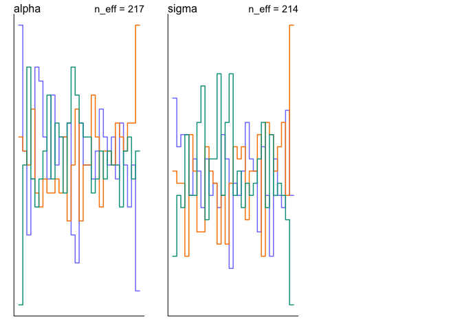<!-- -->

9E1  
For the metropolis algorithm the proposal must be symmetric. You can
have a discrete or contiinuous distribution with any likelihhhood.

9E2  
Gibbs sampling is more efficient because it is not completely random and
uses analytical solutions for the posterior to make adaptive / smart
updating steps. Gibbs can get stuck in some posterior regions.

9E3  
HMC cant handle discrete parameters.

9E4  
number of effective samples is a measure of autocorelation. increase
autocorrelation decrese effective number of parameters because less
samples provide equivalent information about the posterior when the
values are very highly correlated.

9E5  
R hat should approach 1 if sampling from the posterior correctly.

9E6 and 9E7 see book

9M1

Note fitting these with `log_lik= TRUE` in order to use WIAC to see if
they are differrent.

``` r
data(rugged)
d <- rugged
d$log_gdp <- log(d$rgdppc_2000)
dd <- d[ complete.cases(d$rgdppc_2000) , ]
dd$log_gdp_std <- dd$log_gdp / mean(dd$log_gdp)
dd$rugged_std <- dd$rugged / max(dd$rugged)
dd$cid <- ifelse( dd$cont_africa==1 , 1 , 2 )

## R code 9.13
dat_slim <- list(
    log_gdp_std= dd$log_gdp_std,
    rugged_std = dd$rugged_std,
    cid = as.integer( dd$cid )
)

# previous model 
# ## R code 9.14
# f9.14 = alist(
#   log_gdp_std ~ dnorm(mu, sigma),
#   mu <- a[cid] + b[cid]*( rugged_std - 0.215 ),
#   a[cid] ~ dnorm( 1 , 0.1 ) ,
#   b[cid] ~ dnorm( 0 , 0.3 ) ,
#   sigma ~ dexp( 1 )
# )
# 
# # fit model using HMC with stan


## R code 9.14
f9.15 = alist(
  log_gdp_std ~ dnorm(mu, sigma),
  mu <- a[cid] + b[cid]*( rugged_std - 0.215 ),
  a[cid] ~ dnorm( 1 , 0.1 ) ,
  b[cid] ~ dnorm( 0 , 0.3 ) ,
  sigma ~ dexp( 0.3 )
) 

# fit model using HMC with stan 
m9.15 <- ulam(f9.15, data=dat_slim ,  log_lik = TRUE, chains=4, cores=4,)
```

    ## Trying to compile a simple C file

    ## Running /Library/Frameworks/R.framework/Resources/bin/R CMD SHLIB foo.c
    ## clang -I"/Library/Frameworks/R.framework/Resources/include" -DNDEBUG   -I"/Library/Frameworks/R.framework/Versions/3.5/Resources/library/Rcpp/include/"  -I"/Library/Frameworks/R.framework/Versions/3.5/Resources/library/RcppEigen/include/"  -I"/Library/Frameworks/R.framework/Versions/3.5/Resources/library/RcppEigen/include/unsupported"  -I"/Users/matthewmule/Library/R/3.5/library/BH/include" -I"/Users/matthewmule/Library/R/3.5/library/StanHeaders/include/src/"  -I"/Users/matthewmule/Library/R/3.5/library/StanHeaders/include/"  -I"/Users/matthewmule/Library/R/3.5/library/rstan/include" -DEIGEN_NO_DEBUG  -D_REENTRANT  -DBOOST_DISABLE_ASSERTS -DBOOST_PENDING_INTEGER_LOG2_HPP -include stan/math/prim/mat/fun/Eigen.hpp   -isysroot /Library/Developer/CommandLineTools/SDKs/MacOSX.sdk -I/usr/local/include   -fPIC  -Wall -g -O2  -c foo.c -o foo.o
    ## In file included from <built-in>:1:
    ## In file included from /Users/matthewmule/Library/R/3.5/library/StanHeaders/include/stan/math/prim/mat/fun/Eigen.hpp:13:
    ## In file included from /Library/Frameworks/R.framework/Versions/3.5/Resources/library/RcppEigen/include/Eigen/Dense:1:
    ## In file included from /Library/Frameworks/R.framework/Versions/3.5/Resources/library/RcppEigen/include/Eigen/Core:88:
    ## /Library/Frameworks/R.framework/Versions/3.5/Resources/library/RcppEigen/include/Eigen/src/Core/util/Macros.h:613:1: error: unknown type name 'namespace'
    ## namespace Eigen {
    ## ^
    ## /Library/Frameworks/R.framework/Versions/3.5/Resources/library/RcppEigen/include/Eigen/src/Core/util/Macros.h:613:16: error: expected ';' after top level declarator
    ## namespace Eigen {
    ##                ^
    ##                ;
    ## In file included from <built-in>:1:
    ## In file included from /Users/matthewmule/Library/R/3.5/library/StanHeaders/include/stan/math/prim/mat/fun/Eigen.hpp:13:
    ## In file included from /Library/Frameworks/R.framework/Versions/3.5/Resources/library/RcppEigen/include/Eigen/Dense:1:
    ## /Library/Frameworks/R.framework/Versions/3.5/Resources/library/RcppEigen/include/Eigen/Core:96:10: fatal error: 'complex' file not found
    ## #include <complex>
    ##          ^~~~~~~~~
    ## 3 errors generated.
    ## make: *** [foo.o] Error 1

``` r
# refit original model 
m9.14 <- ulam(f9.14, data=dat_slim ,  log_lik = TRUE, chains=4, cores=4,)
```

    ## Trying to compile a simple C file

    ## Running /Library/Frameworks/R.framework/Resources/bin/R CMD SHLIB foo.c
    ## clang -I"/Library/Frameworks/R.framework/Resources/include" -DNDEBUG   -I"/Library/Frameworks/R.framework/Versions/3.5/Resources/library/Rcpp/include/"  -I"/Library/Frameworks/R.framework/Versions/3.5/Resources/library/RcppEigen/include/"  -I"/Library/Frameworks/R.framework/Versions/3.5/Resources/library/RcppEigen/include/unsupported"  -I"/Users/matthewmule/Library/R/3.5/library/BH/include" -I"/Users/matthewmule/Library/R/3.5/library/StanHeaders/include/src/"  -I"/Users/matthewmule/Library/R/3.5/library/StanHeaders/include/"  -I"/Users/matthewmule/Library/R/3.5/library/rstan/include" -DEIGEN_NO_DEBUG  -D_REENTRANT  -DBOOST_DISABLE_ASSERTS -DBOOST_PENDING_INTEGER_LOG2_HPP -include stan/math/prim/mat/fun/Eigen.hpp   -isysroot /Library/Developer/CommandLineTools/SDKs/MacOSX.sdk -I/usr/local/include   -fPIC  -Wall -g -O2  -c foo.c -o foo.o
    ## In file included from <built-in>:1:
    ## In file included from /Users/matthewmule/Library/R/3.5/library/StanHeaders/include/stan/math/prim/mat/fun/Eigen.hpp:13:
    ## In file included from /Library/Frameworks/R.framework/Versions/3.5/Resources/library/RcppEigen/include/Eigen/Dense:1:
    ## In file included from /Library/Frameworks/R.framework/Versions/3.5/Resources/library/RcppEigen/include/Eigen/Core:88:
    ## /Library/Frameworks/R.framework/Versions/3.5/Resources/library/RcppEigen/include/Eigen/src/Core/util/Macros.h:613:1: error: unknown type name 'namespace'
    ## namespace Eigen {
    ## ^
    ## /Library/Frameworks/R.framework/Versions/3.5/Resources/library/RcppEigen/include/Eigen/src/Core/util/Macros.h:613:16: error: expected ';' after top level declarator
    ## namespace Eigen {
    ##                ^
    ##                ;
    ## In file included from <built-in>:1:
    ## In file included from /Users/matthewmule/Library/R/3.5/library/StanHeaders/include/stan/math/prim/mat/fun/Eigen.hpp:13:
    ## In file included from /Library/Frameworks/R.framework/Versions/3.5/Resources/library/RcppEigen/include/Eigen/Dense:1:
    ## /Library/Frameworks/R.framework/Versions/3.5/Resources/library/RcppEigen/include/Eigen/Core:96:10: fatal error: 'complex' file not found
    ## #include <complex>
    ##          ^~~~~~~~~
    ## 3 errors generated.
    ## make: *** [foo.o] Error 1

``` r
# view results 
precis(m9.15, depth = 2)
```

    ##             mean          sd        5.5%       94.5%    n_eff     Rhat4
    ## a[1]   0.8868927 0.016789674  0.86108642  0.91417610 2911.002 0.9995283
    ## a[2]   1.0505131 0.010110628  1.03427472  1.06696288 2822.122 0.9995733
    ## b[1]   0.1334211 0.076855614  0.01134477  0.25496372 2418.390 0.9996146
    ## b[2]  -0.1434145 0.053564220 -0.22879123 -0.05739431 2610.930 0.9986068
    ## sigma  0.1116177 0.006177744  0.10235588  0.12172828 2313.682 1.0010143

``` r
trankplot(m9.15)
```

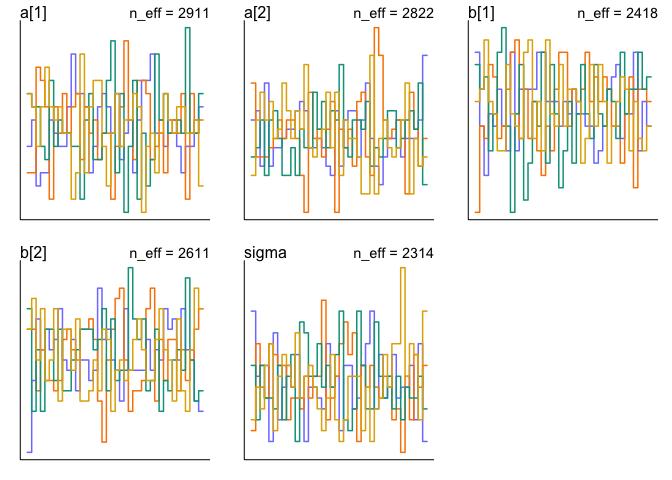<!-- -->

``` r
pairs(m9.15)
```

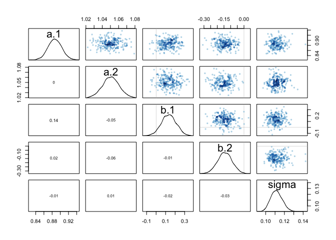<!-- -->

``` r
compare(m9.14, m9.15)
```

    ##            WAIC       SE      dWAIC       dSE    pWAIC    weight
    ## m9.14 -259.2976 14.60607 0.00000000        NA 4.910820 0.5058723
    ## m9.15 -259.2506 14.59195 0.04698075 0.1145121 4.925442 0.4941277

``` r
plot(compare(m9.14, m9.15))
```

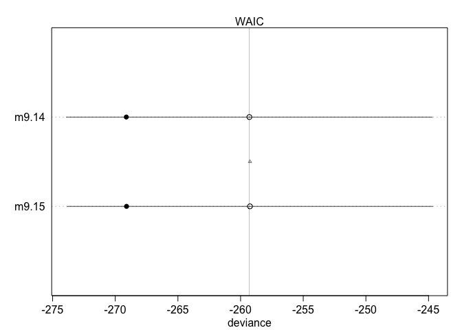<!-- -->

the narrow prior does not have a big effect.

``` r
curve( dexp(x,1)  , col="black" , ylim = c(0,1))
curve( dexp(x,0.3), add = TRUE, col="red" )
```

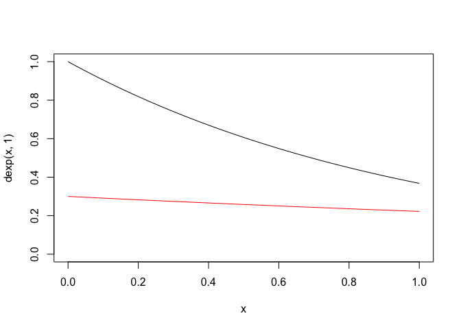<!-- -->
