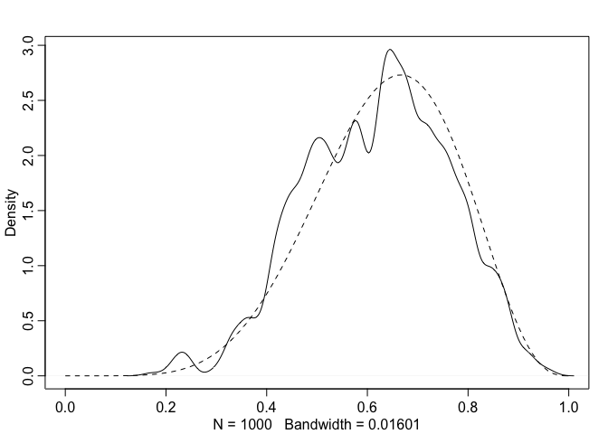

<!-- README.md is generated from README.Rmd. Please edit that file -->

# Rthink

<!-- badges: start -->

<!-- badges: end -->

This repository contains my own personal notes, code, and code to work
through examples and problem sets for the textbook [Statistical
Rethinking - *A Bayesian Course with Examples in R and
Stan*](https://xcelab.net/rm/statistical-rethinking/)" by Richard
Mcelreath. This repository is not endorsed by anyone affiliated with the
textbook they are simply notes.

### Resources:

<https://bookdown.org/ajkurz/Statistical_Rethinking_recoded/>

<!-- -->
