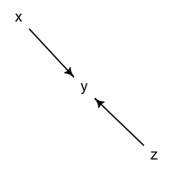
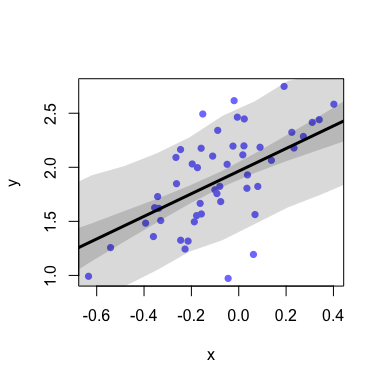

<!-- README.md is generated from README.Rmd. Please edit that file -->

# Statistical Rethinking

<!-- badges: start -->

<!-- badges: end -->

My notes, code, examples and problem set solutions for the textbook
[Statistical Rethinking - *A Bayesian Course with Examples in R and
Stan*](https://xcelab.net/rm/statistical-rethinking/)" The .md documents
for each chapter are readable.

### Course:

[book code
boxes](https://github.com/rmcelreath/rethinking/blob/master/book_code_boxes.txt)  
[course website](https://xcelab.net/rm/statistical-rethinking/)  
[2022
lectures](https://www.youtube.com/playlist?list=PLDcUM9US4XdMROZ57-OIRtIK0aOynbgZN)  
[2019
lectures](https://www.youtube.com/channel/UCNJK6_DZvcMqNSzQdEkzvzA)

### my notes / code / problem sets

[**Chapter 2**](https://github.com/MattPM/Rthink/blob/master/Chapter%202.%20Small%20Worlds%20and%20Large%20Worlds/ch2.md)  
[**Chapter 3**](https://github.com/MattPM/Rthink/blob/master/Chapter%203.%20Sampling%20the%20Imaginary/ch3.md)  
[**Chapter 4**](https://github.com/MattPM/Rthink/blob/master/Chapter%204.%20Geocentric%20Models/Ch4.md)

### code translations by others

[brms translation](https://bookdown.org/content/4857/)  
[julia translation](https://github.com/StatisticalRethinkingJulia)

``` r
suppressMessages(library(rethinking))
```

### quick links

sim some data

``` r
N = 50
z = rnorm(n = N, mean = 0, sd = 0.2)
x = z + rnorm(n = N, mean = 0, sd = 0.1)
y = x + rnorm(n = N, mean = 2,sd = 0.3)
d = data.frame(x,z,y)
pairs(d, col = rangi2)
```

<!-- -->

create dag

``` r
suppressMessages(library(dagitty))
dag = dagitty::dagitty(
"dag{
x -> y <- z
}")
drawdag(dag)
```

<!-- -->

``` r
impliedConditionalIndependencies(dag)
#> x _||_ z
adjustmentSets(dag, exposure = 'x', outcome = 'y')
#>  {}
```

fit model

``` r
f1 = alist( 
  # estimand
  y ~ dnorm(mu, sigma),
  # likelihood
  mu <- alpha + (Bx*x), 
  # priors 
  alpha ~ dnorm(0,0.5), 
  Bx ~ dnorm(0,0.5), 
  sigma ~ dexp(1)
  )

# fit model 
# m1 = ulam(flist = f1,data = d)
m1 = quap(flist = f1,data = d)
```

prior predictive simulation

``` r

# m1 = quap(flist, data)
# simulate prior from model formula 
p = extract.prior(m1)

# range of values for standrdized area to simulate priors over 
xseq = c(-2,2)

# simulate posterior distribution of mu
# data arg must be named as all predictors in the model, here just `x`
post.sim = link(fit = m1, post = p, data = list(x = c(-2,2)))

# plot implied prosterior lines 
plot(NULL, xlim = xseq, ylim = xseq)
for (i in 1:100) {
  lines(xseq, post.sim[i, ], col = col.alpha('black', alpha = 0.1))
}
```

<!-- -->

posterior

``` r
precis(m1)
#>            mean         sd      5.5%     94.5%
#> alpha 1.9418871 0.03740703 1.8821035 2.0016708
#> Bx    0.9020144 0.17436992 0.6233376 1.1806912
#> sigma 0.2599477 0.02610210 0.2182315 0.3016639
```

plot predicted mean and 89% compatibility intervals for the mean

``` r
sim.x = seq(-2, 2,length.out = 50)
# extract posterior distributions for 50 simulated x values 
post = link(m1, data = data.frame(x = sim.x))

plot(y ~ x , d, col = rangi2)
lines(sim.x, apply(post,2,mean))
shade(apply(post, 2, PI), sim.x)
```

<!-- -->

### Lectures

Chapters 1, 2 and 3  
\[1\] Modeling context and introduction  
\[2\] Bayesian Inference  
Chapters 4 and 5  
\[3\] Basic Regression  
\[4\] Categories & Curves  
Chapters 5 and 6  
\[5\] Elemental Confounds  
\[6\] Good & Bad Controls  
Chapters 7, 8 and 9  
\[7\] Overfitting  
\[8\] Markov chain Monte Carlo  
Chapters 10 and 11  
\[9\] Generalized Linear Models  
\[10\] Binomial GLMs  
Chapters 11 and 12  
\[11\] Poisson GLMs  
\[12\] Ordered Categories  
Chapter 13  
\[13\] Multilevel Models  
\[14\] Multi-Multilevel Models  
Chapter 14  
\[15\] Varying Slopes  
\[16\] Gaussian Processes  
Chapter 15  
\[17\] Measurement Error  
\[18\] Missing Data  
Chapters 16 and 17  
\[19\] Beyond GLMs: State-space Models, ODEs  
\[20\] Horoscopes
