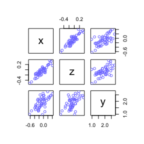

<!-- README.md is generated from README.Rmd. Please edit that file -->

# Statistical Rethinking

<!-- badges: start -->

<!-- badges: end -->

My notes, code, examples and problem set solutions for the textbook
[Statistical Rethinking - *A Bayesian Course with Examples in R and
Stan* by Richard
McElreath](https://xcelab.net/rm/statistical-rethinking/)" The .md
documents for each chapter are readable.

### Course:

[updated 2022
lectures](https://www.youtube.com/playlist?list=PLDcUM9US4XdMROZ57-OIRtIK0aOynbgZN)

### my notes / code / problem sets

[**Chapter 2**](https://github.com/MattPM/Rthink/blob/master/Chapter%202.%20Small%20Worlds%20and%20Large%20Worlds/ch2.md)  
[**Chapter 3**](https://github.com/MattPM/Rthink/blob/master/Chapter%203.%20Sampling%20the%20Imaginary/ch3.md)  
[**Chapter 4**](https://github.com/MattPM/Rthink/blob/master/Chapter%204.%20Geocentric%20Models/Ch4.md)  
[**Chapter 5**](https://github.com/MattPM/Rthink/blob/master/Chapter%205.%20DAGs%20multiple%20regression%20causal%20inference/ch5.md)  
[**Chapter 6**](https://github.com/MattPM/Rthink/blob/master/Chapter%206.%20bias%20colineariry%20berkson's%2C%20simpsons%20paradox%20types%20of%20bias/ch6.md)  
[**Chapter 7**](https://github.com/MattPM/Rthink/blob/master/Chapter%207.%20model%20selection%20information%20theory%20entropy%20cross%20validation/ch7.md)  
[**Chapter 8**](https://github.com/MattPM/Rthink/blob/master/chapter%208.%20interactions%20discrete%20and%20continuous/ch8.md)  
[**Chapter 9**](https://github.com/MattPM/Rthink/blob/master/Chapter%209.%20Markov%20Chain%20Monte%20Carlo/ch9.md)  
[**Chapter 10**](https://github.com/MattPM/Rthink/blob/master/Chapter%2010.%20GLMs%20and%20maximum%20entropy/ch10.md)  
<!-- [**Chapter 11**]()   --> <!-- [**Chapter 12**]()   -->
<!-- [**Chapter 13**]()   --> <!-- [**Chapter 14**]()   -->
<!-- [**Chapter 15**]()   -->

``` r
suppressMessages(library(rethinking))
set.seed(1990)
```

## Quick notes for using rethinking package tools

### sim some data

``` r
N = 50
z = rnorm(n = N, mean = 0, sd = 0.2)
x = z + rnorm(n = N, mean = 0, sd = 0.1)
y = x + rnorm(n = N, mean = 2,sd = 0.3)
d = data.frame(x,z,y)
pairs(d, col = rangi2)
```

<!-- -->

### create dag

``` r
suppressMessages(library(dagitty))
dag = dagitty::dagitty(
"dag{
x -> y <- z
}")
drawdag(dag)
```

<!-- -->

``` r
impliedConditionalIndependencies(dag)
#> x _||_ z
adjustmentSets(dag, exposure = 'x', outcome = 'y')
#>  {}
```

### Specify model formula and fit using mcmc (or quadratic approximation)

``` r
f1 = alist( 
  # estimand
  y ~ dnorm(mu, sigma),
  # likelihood
  mu <- alpha + Bx*x, 
  # priors 
  alpha ~ dnorm(0,0.5), 
  Bx ~ dnorm(0,0.5), 
  sigma ~ dexp(1)
  )

# fit model 
m1 = quap(flist = f1,data = d)
# m1 = ulam(flist = f1,data = d)

# summary of model fit
precis(m1, depth = 2)
#>            mean         sd      5.5%     94.5%
#> alpha 1.9631489 0.05145478 1.8809143 2.0453836
#> Bx    1.0430971 0.20647950 0.7131030 1.3730912
#> sigma 0.3409979 0.03469045 0.2855558 0.3964399
```

### calculate and visualize uncertainty in parameter estimates and prediction intervals of simulated data based on model

``` r
# specify interval of predictor values to simulate over
# multivariate models -- include other predictors 
xseq = seq(-2,2, length.out = 30)

# summarize estimand based on new predictor values
mu = link(m1, data = data.frame(x = xseq))
mu.mean = apply(mu, 2, mean)
mu.PI = apply(mu, 2, PI)

# simulate uncertainty in estimates based on full model 
dsim = sim(fit = m1, data = data.frame(x = xseq))
sim.pi = apply(dsim, 2, PI)

# plot summary
plot(y ~ x, d, col = rangi2, pch = 16)
lines(x = xseq,y = mu.mean, lwd = 3) # mean
shade(object = mu.PI, lim = xseq) # mean uncertainty
shade(object = sim.pi,lim = xseq)
```

<!-- -->

## Other topics

### prior predictive simulation

``` r

# m1 = quap(flist, data)
# simulate prior from model formula 
p = extract.prior(m1)

# range of values for standrdized area to simulate priors over 
xseq = c(-2,2)

# simulate posterior distribution of mu
# data arg must be named as all predictors in the model, here just `x`
post.sim = link(fit = m1, post = p, data = list(x = c(-2,2)))

# plot implied prosterior lines 
plot(NULL, xlim = xseq, ylim = xseq)
for (i in 1:100) {
  lines(xseq, post.sim[i, ], col = col.alpha('black', alpha = 0.1))
}
```

<!-- -->

### inspect posterior estimates

``` r
# note set depth = 2 for more complex models 
precis(m1)
#>            mean         sd      5.5%     94.5%
#> alpha 1.9631489 0.05145478 1.8809143 2.0453836
#> Bx    1.0430971 0.20647950 0.7131030 1.3730912
#> sigma 0.3409979 0.03469045 0.2855558 0.3964399
```

### View stan code for the model

``` r
stancode(m1)
```

the output of `stancode(m1)` is copied below:

``` stan
data{
    int<lower=1> N;
    real y[N];
    real x[N];
}
parameters{
    real alpha;
    real Bx;
    real<lower=0> sigma;
}
model{
    vector[N] mu;
    sigma ~ exponential( 1 );
    Bx ~ normal( 0 , 0.5 );
    alpha ~ normal( 0 , 0.5 );
    for ( i in 1:N ) {
        mu[i] = alpha + (Bx * x[i]);
    }
    y ~ normal( mu , sigma );
}
generated quantities{
    vector[N] mu;
    for ( i in 1:N ) {
        mu[i] = alpha + (Bx * x[i]);
    }
}
```

### Lectures

Chapters 1, 2 and 3  
\[1\] Modeling context and introduction  
\[2\] Bayesian Inference  
Chapters 4 and 5  
\[3\] Basic Regression  
\[4\] Categories & Curves  
Chapters 5 and 6  
\[5\] Elemental Confounds  
\[6\] Good & Bad Controls  
Chapters 7, 8 and 9  
\[7\] Overfitting  
\[8\] Markov chain Monte Carlo  
Chapters 10 and 11  
\[9\] Generalized Linear Models  
\[10\] Binomial GLMs  
Chapters 11 and 12  
\[11\] Poisson GLMs  
\[12\] Ordered Categories  
Chapter 13  
\[13\] Multilevel Models  
\[14\] Multi-Multilevel Models  
Chapter 14  
\[15\] Varying Slopes  
\[16\] Gaussian Processes  
Chapter 15  
\[17\] Measurement Error  
\[18\] Missing Data  
Chapters 16 and 17  
\[19\] Beyond GLMs: State-space Models, ODEs  
\[20\] Horoscopes
