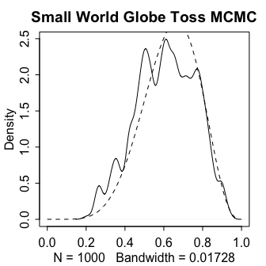

<!-- README.md is generated from README.Rmd. Please edit that file -->

# Rthink

<!-- badges: start -->

<!-- badges: end -->

This repository contains my notes, code, examples and problem set
solutions for the textbook [Statistical Rethinking - *A Bayesian Course
with Examples in R and
Stan*](https://xcelab.net/rm/statistical-rethinking/)" by Richard
Mcelreath. This repository and its contents are not endorsed by anyone
affiliated with the textbook they are simply personal notes for my own
education.

### Book Resources:

[lectures](https://www.youtube.com/watch?v=4WVelCswXo4&list=PLDcUM9US4XdNM4Edgs7weiyIguLSToZRI)  
[course website](https://xcelab.net/rm/statistical-rethinking/)  
[stan translation](https://vincentarelbundock.github.io/rethinking2/)  
[brms translation](https://bookdown.org/content/4857/)  
[R-INLA
translation](https://akawiecki.github.io/statistical_rethinking_inla/)  
[julia
translation](https://github.com/StatisticalRethinkingJulia)

### Notes code and problem sets

[**Chapter 2**](https://github.com/MattPM/Rthink/blob/master/Chapter%202.%20Small%20Worlds%20and%20Large%20Worlds/ch2.md)  
[**Chapter 3**](https://github.com/MattPM/Rthink/blob/master/Chapter%203.%20Sampling%20the%20Imaginary/ch3.md)  
[**Chapter 4**](https://github.com/MattPM/Rthink/blob/master/Chapter%204.%20Geocentric%20Models/Ch4.md)

<!-- -->

## Rethinking Package functions

``` r
lsf.str("package:rethinking") 
#> adjmat_from_dag : function (x)  
#> AIC : Formal class 'standardGeneric' [package "methods"] with 8 slots
#> arrowspline : function (from, to, by, shape = c(-1, -1, -1), arrow = TRUE, arrowlen = 0.1, 
#>     label = NULL, pos = 3, stem = 4, ...)  
#> axis_unscale : function (side = 1, at, orig, factor, ...)  
#> bins : function (x, n_bins = 30, rm.na = TRUE, ...)  
#> blank : function (ex = 1, w = 1, h = 1, ...)  
#> blank2 : function (ex = 1, w = 1, h = 1, ...)  
#> brain_loo_plot : function (fit, atx = c(35, 47, 60), aty = c(450, 900, 1300), xlim, 
#>     ylim, npts = 100)  
#> brain_plot : function (fit, atx = c(35, 47, 60), aty = c(450, 900, 1300), xlim, 
#>     ylim, npts = 100)  
#> chainmode : function (chain, ...)  
#> check_index : function (x)  
#> choose.csv : function (...)  
#> circle : function (x, y, r = 1, npts = 100, ...)  
#> cloglog : function (x)  
#> cmdstanr_model_write : function (the_model)  
#> coef : Formal class 'standardGeneric' [package "methods"] with 8 slots
#> coeftab : function (..., se = FALSE, se.inside = FALSE, nobs = TRUE, digits = 2, 
#>     width = 7, rotate = FALSE)  
#> coeftab_plot : function (x, y, pars, col.ci = "black", by.model = FALSE, prob = 0.95, 
#>     xlab = "Value", ...)  
#> coeftab_show : function (object)  
#> coerce_index : function (...)  
#> col.alpha : function (acol, alpha = 0.2)  
#> col.desat : function (acol, amt = 0.5)  
#> col.dist : function (x, mu = 0, sd = 1, col = "slateblue")  
#> compare : function (..., n = 1000, sort = "WAIC", func = WAIC, WAIC = TRUE, 
#>     refresh = 0, warn = TRUE, result_order = c(1, 5, 3, 6, 2, 4))  
#> concat : function (...)  
#> confint_quad : function (model = NULL, est, se, prob = 0.89)  
#> contour_xyz : function (x, y, z, ...)  
#> cov_GPL2 : function (x, sq_alpha, sq_rho, delta)  
#> cov_GPL2_scal : function (x, sq_alpha, sq_rho, delta)  
#> covmat : function (m, digits = 4)  
#> cstan : function (file, model_code, data = list(), chains = 1, cores = 1, 
#>     iter = 1000, warmup, threads = 1, control = list(adapt_delta = 0.95), 
#>     cpp_options = list(), save_warmup = TRUE, ...)  
#> cv_data_slice : function (do, N, exclude, include)  
#> cv_quap : function (quap_model, lno = 1, pw = FALSE, cores = 1, ...)  
#> dag_arc : function (x1, y1, x2, y2, xm, ym, col = "gray", length = 0.1, code = 3, 
#>     lwd = 1.5, goodarrow = TRUE)  
#> dag_copy_coords : function (x, y)  
#> dashboard : function (fit, warmup = FALSE, plot = TRUE, trank = TRUE)  
#> dbern : function (x, prob, log = FALSE)  
#> dbeta2 : function (x, prob, theta, log = FALSE)  
#> dbetabinom : function (x, size, prob, theta, shape1, shape2, log = FALSE)  
#> dcategorical : function (x, prob, log = TRUE)  
#> dens : function (x, adj = 0.5, norm.comp = FALSE, main = "", show.HPDI = FALSE, 
#>     show.zero = FALSE, rm.na = TRUE, add = FALSE, ...)  
#> denschart : function (x, pars, labels = NULL, groups = NULL, gdata = NULL, cex = par("cex"), 
#>     pt.cex = cex, bg = par("bg"), color = "gray", gcolor = par("fg"), 
#>     lcolor = "gray", xlim = range(unlist(x)), main = NULL, xlab = NULL, 
#>     ylab = NULL, height = 0.7, border = NA, adjust = 1, alpha = 0.4, 
#>     draw.zero = function() abline(v = 0, lty = 2, lwd = 0.5), label_vectors = TRUE, 
#>     drop_matrices = FALSE, drop_prefix = c("z_", "L_"), sort = FALSE, 
#>     ...)  
#> deviance : Formal class 'standardGeneric' [package "methods"] with 8 slots
#> dgamma2 : function (x, mu, scale, log = FALSE)  
#> dgampois : function (x, mu, scale, log = FALSE)  
#> dgnorm : function (x, mu, alpha, beta, log = FALSE)  
#> dgpareto : function (x, u = 0, shape = 1, scale = 1, log = FALSE)  
#> DIC : Formal class 'standardGeneric' [package "methods"] with 8 slots
#> dims : function (x)  
#> divergence_tracker : function (x, no_lp = TRUE, pars, ...)  
#> divergent : function (fit, warmup = FALSE)  
#> dlaplace : function (x, location = 0, lambda = 1, log = FALSE)  
#> dlkjcorr : function (x, eta = 1, log = TRUE)  
#> dmvnorm : function (x, mean = rep(0, p), sigma = diag(p), log = FALSE)  
#> dmvnorm2 : function (x, Mu, sigma, Rho, log = FALSE)  
#> dordlogit : function (x, phi, a, log = FALSE)  
#> dpareto : function (x, xmin = 0, alpha = 1, log = FALSE)  
#> drawdag : function (x, col_arrow = "black", col_segment = "black", col_labels = "black", 
#>     cex = 1, lwd = 1.5, goodarrow = TRUE, xlim, ylim, shapes, col_shapes, 
#>     radius = 3.5, add = FALSE, xkcd = FALSE, latent_mark = "c", ...)  
#> drawopenpaths : function (x, Z = list(), col_arrow = "red", ...)  
#> dstudent : function (x, nu = 2, mu = 0, sigma = 1, log = FALSE)  
#> dzagamma2 : function (x, prob, mu, scale, log = FALSE)  
#> dzibinom : function (x, p_zero, size, prob, log = FALSE)  
#> dzipois : function (x, p, lambda, log = FALSE)  
#> ensemble : function (..., data, n = 1000, func = WAIC, weights, refresh = 0, 
#>     replace = list(), do_link = TRUE, do_sim = TRUE)  
#> extract_prior_ulam : function (fit, n = 1000, iter = 2 * n, chains = 1, ...)  
#> extract_prior_ulam_proto : function (fit, n = 1000, distribution_library = ulam_dists, ...)  
#> extract.prior : Formal class 'standardGeneric' [package "methods"] with 8 slots
#> extract.samples : Formal class 'standardGeneric' [package "methods"] with 8 slots
#> fclip : function (x, xmin = NULL, xmax = NULL)  
#> flist_untag : function (flist, eval = TRUE)  
#> format_show : function (x, digits)  
#> glimmer : function (formula, data, family = gaussian, prefix = c("b_", "v_"), 
#>     default_prior = "dnorm(0,10)", ...)  
#> goCaslonPro : function ()  
#> graphdag : function (x, layout = layout_nicely, vertex.size = 30, vertex.label.family = "sans", 
#>     edge.curved = 0, edge.color = "black", edge.width = 1.5, edge.arrow.width = 1.2, 
#>     edge.arrow.size = 0.7, interact = FALSE, ...)  
#> grau : function (alpha = 0.5)  
#> histospark : function (x, width = 10)  
#> HMC_2D_sample : function (n = 100, U, U_gradient, step, L, start = c(0, 0), xlim = c(-5, 
#>     5), ylim = c(-4, 4), xlab = "x", ylab = "y", draw = TRUE, draw_contour = TRUE, 
#>     nlvls = 15, adj_lvls = 1, ...)  
#> HMC2 : function (U, grad_U, epsilon, L, current_q, ...)  
#> HPDI : function (samples, prob = 0.89)  
#> htmlhelp : function ()  
#> ICweights : function (dev)  
#> image_xyz : function (x, y, z, ...)  
#> inv_cloglog : function (x)  
#> inv_logit : function (x)  
#> lines_xkcd : function (x, y, col = "black", lwd = 5, lwdbg = 10, adj = 500, seg = 50)  
#> link : Formal class 'standardGeneric' [package "methods"] with 8 slots
#> link_ulam : function (fit, data, post, flatten = TRUE, symbols, ...)  
#> log_sum_exp : function (x)  
#> logistic : function (x)  
#> logit : function (x)  
#> logLik : Formal class 'standardGeneric' [package "methods"] with 8 slots
#> LOO : Formal class 'standardGeneric' [package "methods"] with 8 slots
#> lppd : function (fit, ...)  
#> make_ukey : function (n, m = 5, x = 2, bag = c("a", "b", "c", "d", "e", "f", "g", 
#>     "h", "j", "k", "m", "n", "p", "q", "r", "u", "w", "x", "y", "z", 
#>     0, 2, 3, 4, 6, 7, 8, 9))  
#> make.grid : function (n)  
#> map : function (flist, data, start, method = "BFGS", hessian = TRUE, debug = FALSE, 
#>     verbose = FALSE, dofit = TRUE, ...)  
#> map2stan : function (flist, data, start, pars, constraints = list(), types = list(), 
#>     sample = TRUE, iter = 2000, warmup = floor(iter/2), chains = 1, 
#>     debug = FALSE, verbose = FALSE, WAIC = TRUE, cores = 1, rng_seed, 
#>     rawstanfit = FALSE, control = list(adapt_delta = 0.95), add_unique_tag = TRUE, 
#>     code, log_lik = FALSE, DIC = FALSE, declare_all_data = TRUE, do_discrete_imputation = FALSE, 
#>     ...)  
#> mcmcpairs : function (x, alpha = 0.7, cex = 0.7, pch = 16, adj = 1, pars, n = 500, 
#>     ...)  
#> mcmcpairs_old : function (posterior, cex = 0.3, pch = 16, col = col.alpha("slateblue", 
#>     0.2), n = 1000, adj = 1, ...)  
#> mcreplicate : function (n, expr, refresh = 0.1, mc.cores = 2)  
#> multilogistic : function (x, lambda = 1, diff = TRUE, log = FALSE)  
#> nobs : Formal class 'standardGeneric' [package "methods"] with 8 slots
#> normalize : function (x)  
#> pairs : Formal class 'standardGeneric' [package "methods"] with 8 slots
#> PCI : function (samples, prob = 0.89)  
#> pdfblank : function (ex = 1, w = 1, h = 1, colormodel = "cmyk", ...)  
#> PI : function (samples, prob = 0.89)  
#> plot2y : function (..., y2lab = "2nd axis", y2col = NULL)  
#> plotchains : function (object, pars = names(object@start), ...)  
#> plotpost : function (object, n = 1000, col = col.alpha("slateblue", 0.3), cex = 0.8, 
#>     pch = 16, ...)  
#> plp : function (mapfit, prob = 0.9, xlim, postcol = "black", priorcol = "darkgray", 
#>     ...)  
#> pordlogit : function (x, phi, a, log = FALSE)  
#> postcheck : function (fit, x, prob = 0.89, window = 20, n = 1000, col = rangi2, 
#>     ...)  
#> postlistprecis : function (post, prob = 0.95, spark = FALSE)  
#> postmeans : function (post)  
#> precis : Formal class 'standardGeneric' [package "methods"] with 8 slots
#> precis_format : function (result, depth, sort, decreasing)  
#> precis_plot : function (x, y, pars, col.ci = "black", xlab = "Value", add = FALSE, 
#>     xlim = NULL, labels = rownames(x)[1:n], ...)  
#> precis_show : function (object)  
#> precis_show_old : function (object)  
#> precisx : function (model, depth = 1, pars, ci = TRUE, prob = 0.89, corr = FALSE, 
#>     digits = 2, warn = TRUE, spark = FALSE)  
#> predict_ordlogit : function (phi, a)  
#> progbar : function (current, min = 0, max = 100, starttime, update.interval = 100, 
#>     show.rate = FALSE)  
#> PSIS : Formal class 'standardGeneric' [package "methods"] with 8 slots
#> PSIS_list : function (object, n = 0, refresh = 0.1, pointwise = FALSE, log_lik = "log_lik", 
#>     warn = TRUE, ...)  
#> PSIS_map2stan : function (object, n = 0, refresh = -1, pointwise = FALSE, warn = TRUE, 
#>     ...)  
#> PSIS_quap : function (object, n = 1000, refresh = 0, pointwise = FALSE, warn = TRUE, 
#>     ...)  
#> PSIS_stanfit : function (object, n = 0, refresh = 0.1, pointwise = FALSE, log_lik = "log_lik", 
#>     warn = TRUE, ...)  
#> PSIS_ulam : function (object, n = 0, refresh = 0.1, pointwise = FALSE, log_lik = "log_lik", 
#>     warn = TRUE, ...)  
#> PSISk : function (model, ...)  
#> quap : function (flist, data, start, method = "BFGS", hessian = TRUE, debug = FALSE, 
#>     verbose = FALSE, dofit = TRUE, ...)  
#> rank_mat : function (x)  
#> rbern : function (n, prob = 0.5)  
#> rbeta2 : function (n, prob, theta)  
#> rbetabinom : function (n, size, prob, theta, shape1, shape2)  
#> rcategorical : function (n, prob)  
#> replicate2 : function (n, expr, interval = 0.1, simplify = "array")  
#> resample : function (object, ...)  
#> resample_old : function (object, iter = 10000, warmup = 1000, chains = 1, cores = 1, 
#>     DIC = TRUE, WAIC = TRUE, rng_seed, data, ...)  
#> rgamma2 : function (n, mu, scale)  
#> rgampois : function (n, mu, scale)  
#> rgpareto : function (n, u = 0, shape = 1, scale = 1)  
#> Rho : function (model, digits = 2)  
#> rinvwishart : function (s, df, Sigma, Prec)  
#> rlaplace : function (n, location = 0, lambda = 1)  
#> rlkjcorr : function (n, K, eta = 1)  
#> rmvnorm : function (n, mean = rep(0, nrow(sigma)), sigma = diag(length(mean)), 
#>     method = c("eigen", "svd", "chol"), pre0.9_9994 = FALSE)  
#> rmvnorm2 : function (n, Mu = rep(0, length(sigma)), sigma = rep(1, length(Mu)), 
#>     Rho = diag(length(Mu)), method = "chol")  
#> rordlogit : function (n, phi = 0, a)  
#> rpareto : function (n, xmin = 0, alpha = 1)  
#> rrformat : function (matrix, digits = 2, width = 7)  
#> rstudent : function (n, nu = 2, mu = 0, sigma = 1)  
#> rzibinom : function (n, p_zero, size, prob)  
#> rzipois : function (n, p, lambda)  
#> sample.naive.posterior : function (...)  
#> sample.qa.posterior : function (model, n = 10000, clean.names = TRUE, model.weights = "AICc", 
#>     nobs = 0, add.names = FALSE, fill.na = 0, verbose = FALSE)  
#> sd2 : function (x, na.rm = TRUE)  
#> se : function (model)  
#> segmentsby : function (x, y, by, ...)  
#> set_nice_margins : function ()  
#> set_ulam_cmdstan : function (x = TRUE)  
#> setcran : function (themirror = "https://cloud.r-project.org/")  
#> shade : function (object, lim, label = NULL, col = col.alpha("black", 0.15), 
#>     border = NA, ...)  
#> show.naive.posterior : function (est, se, model = NULL, level = 0.95, xlab = "estimate", 
#>     ylab = "likelihood", npts = 1000, ciy = NULL, show.density = TRUE, 
#>     show.ci = TRUE, zero.lines = TRUE, label = NULL, cols = NULL, 
#>     lwidths = NULL, ...)  
#> sim : Formal class 'standardGeneric' [package "methods"] with 8 slots
#> sim_core : function (fit, data, post, vars, n, refresh = 0, replace = list(), 
#>     debug = FALSE, ll = FALSE, ...)  
#> sim_happiness : function (seed = 1977, N_years = 1000, max_age = 65, N_births = 20, 
#>     aom = 18)  
#> sim_train_test : function (N = 20, k = 3, rho = c(0.15, -0.4), b_sigma = 100, WAIC = FALSE, 
#>     LOOCV = FALSE, LOOIC = FALSE, cv.cores = 1, return_model = FALSE)  
#> sim_ulam : function (fit, data, post, vars, variable, n = 1000, replace = list(), 
#>     ...)  
#> sim_ulam_new : function (fit, data, post, vars, variable, n = 1000, replace = list(), 
#>     debug = FALSE, ll = FALSE, refresh = 0, ...)  
#> sim.train.test : function (N = 20, k = 3, rho = c(0.15, -0.4), b_sigma = 100, DIC = FALSE, 
#>     WAIC = FALSE, devbar = FALSE, devbarout = FALSE)  
#> simplehist : function (x, round = TRUE, ylab = "Frequency", off = 0.2, lwd = 3, 
#>     col = c("black", rangi2), ...)  
#> simplehist_old : function (x, ylab = "Frequency", xlab = "Count", ycounts = TRUE, adjust = 1, 
#>     lcol = "black", bins = NULL, show.counts = 0, xlim = NULL, ylim = NULL, 
#>     ...)  
#> sketchdag : function (x, cleanup = 1, plot = TRUE, rescale = FALSE, grid = 0.2, 
#>     ...)  
#> softmax : function (...)  
#> stan_sampling_duration : function (object)  
#> stan_total_samples : function (stanfit)  
#> stancode : Formal class 'standardGeneric' [package "methods"] with 8 slots
#> standardize : function (x)  
#> stanergy : function (x, colscheme = "blue", binwidth = NULL, merge_chains = FALSE)  
#> traceplot_ulam : function (object, pars, chains, col = rethink_palette, alpha = 1, 
#>     bg = col.alpha("black", 0.15), ask = TRUE, window, trim = 100, 
#>     n_cols = 3, max_rows = 5, lwd = 0.5, lp = FALSE, ...)  
#> tracerplot : function (object, pars, col = rethink_palette, alpha = 1, bg = col.alpha("black", 
#>     0.15), ask = TRUE, window, n_cols = 3, max_rows = 5, lwd = 0.5, 
#>     ...)  
#> trankplot : function (object, bins = 30, pars, chains, col = rethink_palette, 
#>     alpha = 1, bg = col.alpha("black", 0.15), ask = TRUE, window, 
#>     n_cols = 3, max_rows = 5, lwd = 1.5, lp = FALSE, axes = FALSE, 
#>     off = 0, add = FALSE, stacked = FALSE, ...)  
#> ulam : function (flist, data, pars, pars_omit, start, chains = 1, cores = 1, 
#>     iter = 1000, control = list(adapt_delta = 0.95), distribution_library = ulam_dists, 
#>     macro_library = ulam_macros, custom, constraints, declare_all_data = TRUE, 
#>     log_lik = FALSE, sample = TRUE, messages = TRUE, pre_scan_data = TRUE, 
#>     coerce_int = TRUE, sample_prior = FALSE, file = NULL, cmdstan = ulam_options$use_cmdstan, 
#>     threads = 1, grain = 1, ...)  
#> unstandardize : function (x)  
#> var2 : function (x, na.rm = TRUE)  
#> vcov : Formal class 'standardGeneric' [package "methods"] with 8 slots
#> WAIC : Formal class 'standardGeneric' [package "methods"] with 8 slots
#> WAICp : function (x, pointwise = TRUE, ...)  
#> yn2bin : function (x)
```
