Chapter 8 Interactions
================

This chapter demonstrates categorical and continuous interaction models.

See written notes at end of lecture 7 for intuition on models using
indicator variables (captures vsriation in mean alpha level for groups)
vs interaction (captures variation in mean and slope for categorical and
continuous variables) and multilevel models (estiate a separate mean for
each group and estimate the variation across the means of groups
e.g. sigma ~ N(mu\[j\],
sigma\[j\])).

## Example of building a categorical interaction to capture variation in slope and intercept.

Data are about countries. We want to model GDP (G) ~ terrain
ruggedness(R) conditional on the country status (C) indicating inside or
outside of africa.

We want a model that can capture the fact that there is a different
trend for R vs GDP for african countries. What is shown below is
**wrong** because splitting the data and fitting a separate regression
model to each set of data.  
1\) This approach not expand to cases where we want to model variation
across the groups themselves (multilevel models), it won’t generalize to
a case where there are many categories.  
2\) reduces accuracy of parameters like sigma (for R) which we have here
assumed has a different value for each level of country – that’s wrong
we should have a single pooled estimate for R.  
3\) we cant esstimate uncertainty in predictive value of of the C
variable since it is not part of the statistical model, its just been
split up.  
4\) We cant use information criteria to compare models because the data
are different.

``` r
suppressMessages(library(rethinking))
suppressMessages(library(tidyverse))
data(rugged)
d <- rugged
dd <- d[ complete.cases(d$rgdppc_2000) , ]
p = 
ggplot(dd,aes( x = rugged, y = log(rgdppc_2000))) + 
    theme_bw() + 
    geom_point(size = 0.5) + 
    facet_wrap(~cont_africa) + 
    geom_smooth(method = 'lm') + 
    ggtitle('this is the wrong way to do this')
p
```

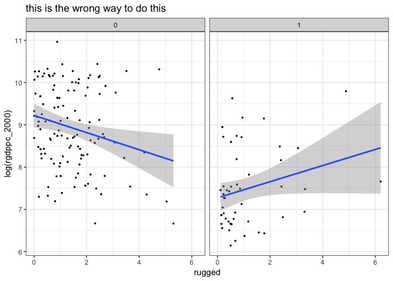<!-- -->

### rescaling variables

gdp is scaled by dividing by the mean. now 1 = mean, 0.8 = 20% less than
the mean 1.1 = 10% higher than the mean.  
ruggedness is scaled by dividing by the maximum because we want to
preserve the meaningful 0 values. These relationships will help set
meaningful priors.

``` r
## R code 8.1
library(rethinking)
data(rugged)
d <- rugged

# make log version of outcome
d$log_gdp <- log( d$rgdppc_2000 )

# extract countries with GDP data
dd <- d[ complete.cases(d$rgdppc_2000) , ]


# rescale variables
dd$log_gdp_std <- dd$log_gdp / mean(dd$log_gdp)
dd$rugged_std <- dd$rugged / max(dd$rugged)

par(mfrow = c(1,2))
plot(dd$log_gdp, dd$log_gdp_std)
plot(dd$rugged, dd$rugged_std)
```

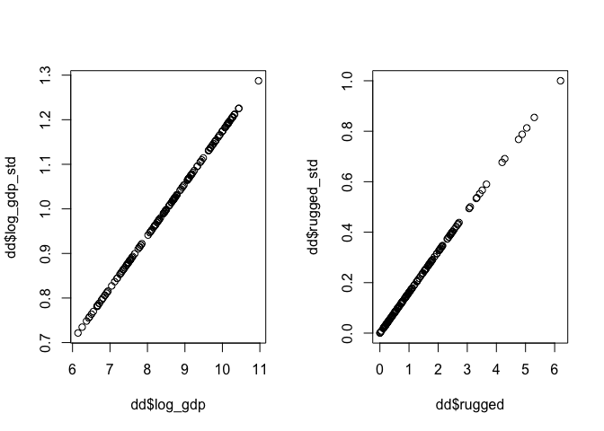<!-- -->

## prior predictive simulation

### fit simple model and see what priors imply.

extract posterior distrubutions for GDP at a set of simulated ruggedness
values  
simulate ruggedness values based on our standardized values use `prior
<- extract.prior( m8.1 )` to extract simulated distributions for each
prior.  
use `rugged_seq <- seq( from=-0.1 , to=1.1 , length.out=30 )` to
simulate ruggedness values.  
use link `mu <- link( m8.1 , post=prior ,
data=data.frame(rugged_std=rugged_seq) )` to get a posterior
distribution for the mean gdp at each simulated value of R based on the
models implied plausible values set by the priors.  
draw 50 lines from the prior predictive simulation

mu \<- link( m8.1 , post=prior ,
data=data.frame(rugged\_std=rugged\_seq) )

``` r
## Note this is a poor model because of bad priors 
## R code 8.2

mean.rugged = mean(dd$rugged_std)

f1 = alist(
    log_gdp_std ~ dnorm(mu, sigma) ,
    mu <- a + b*( rugged_std - mean.rugged),
    a ~ dnorm( 1 , 1 ) ,
    b ~ dnorm( 0 , 1 ) ,
    sigma ~ dexp( 1 )
    ) 
m8.1 <- quap(f1, data=dd)

## R code 8.3
set.seed(7)
prior <- extract.prior( m8.1 )

# extract prior predictive simulation 
rugged_seq <- seq( from=-0.1 , to=1.1 , length.out=30 ) 
mu <- link( m8.1 , post=prior , data=data.frame(rugged_std=rugged_seq) )

# set up the plot dimensions
# show hline  at the max and min values of gdp
plot( NULL , xlim=c(0,1) , ylim=c(0.5,1.5) ,
    xlab="ruggedness" , ylab="log GDP" )
abline( h=min(dd$log_gdp_std) , lty=2 )
abline( h=max(dd$log_gdp_std) , lty=2 )
for ( i in 1:50 ) lines( rugged_seq , mu[i,] , col=col.alpha("black",0.3) )
```

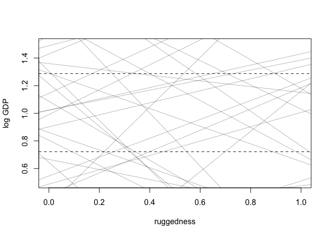<!-- -->

Many alpha values are far outside the observed range.  
*95% of gaussian mass is within 2 standard deviations*  
N(0,0.1) will thus assign 95% of the plausibility for GDP between 0.8
and 1.2; this makes sense intuitive based on the plot above and how the
scaled gdp represents the mean at 1.

The slopes are too variable. It is not possible that R explains all
observed variation in G. The slope of lines crossing across the observed
range are ~ 1.3 - 0.6.  
This is pretty similar to just looking at the absoluete range of values
for the outcome and constraining the prior to be in this range. Is it
‘valid’ to just do that if we don’t know what the range of values
might be?

``` r
max(dd$log_gdp_std) - min(dd$log_gdp_std)
```

    ## [1] 0.5658058

What is really governing our choices here are the range of the
standardized outcome variable G. A better prior on the slope is N(0.0.3)
so a slope of 0.6 will cover 2sd; 95 % of plausibility will be between
the maximum and mminimum range.

**We are still allowing for flipped efect sizes with these priors but we
are bounding the ranges of the estimates within plausible ranges.**

``` r
## R code 8.5
# model with better priors 
f2 = alist(
    log_gdp_std ~ dnorm( mu , sigma ) ,
    mu <- a + b*( rugged_std - mean.rugged ) ,
    a ~ dnorm( 1 , 0.1 ) , # tighter prior on sd 
    b ~ dnorm( 0 , 0.3 ) , # tighter prior on effect size 
    sigma ~ dexp(1)
    )

m8.1 <- quap(flist = f2, data=dd )

## R code 8.6
precis( m8.1 )
```

    ##              mean          sd        5.5%      94.5%
    ## a     0.999999438 0.010411973  0.98335909 1.01663978
    ## b     0.001990935 0.054793469 -0.08557961 0.08956148
    ## sigma 0.136497417 0.007396154  0.12467693 0.14831790

no relationship between R and
G.

### Using an indicator variable for a categorical variable sets a different intercept but not different slope at levels of the indicator

here again we use the index variable (instead of the indicator variable)
approach because it is easier to set priors.

**In the examples that follow country ID 1 = AFRICA country ID 2 = NOT
AFRICA**

``` r
## R code 8.7
# make variable to index Africa (1) or not (2)
dd$cid = ifelse(dd$cont_africa==1, yes = 1, no = 2)

## R code 8.8
f3 = alist(
    log_gdp_std ~ dnorm(mu, sigma), 
    mu <-  a[cid] + b*(dd$rugged_std - mean.rugged),
    a[cid] ~ dnorm(0, 0.1), 
    b ~ dnorm(0, 0.1 ), 
    sigma ~ dexp(1)
    ) 

m8.2 <- quap(flist = f3, data = dd)

## R code 8.9
compare( m8.1 , m8.2 )
```

    ##           WAIC       SE    dWAIC      dSE    pWAIC       weight
    ## m8.2 -249.7371 16.31068  0.00000       NA 4.017946 1.000000e+00
    ## m8.1 -188.7491 13.28823 60.98794 16.82785 2.697656 5.710015e-14

The standard error on the difference in WAIC scores (60) is ~16; m8.2
got all of the weight. This indicates the country indicator is picking
up some important information abotu the relationship between gdp and R.

``` r
## R code 8.10
precis( m8.2 , depth=2 )
```

    ##             mean          sd       5.5%      94.5%
    ## a[1]   0.8550222 0.016239923  0.8290677 0.88097672
    ## a[2]   1.0385793 0.010345730  1.0220448 1.05511375
    ## b     -0.0427853 0.042278284 -0.1103542 0.02478356
    ## sigma  0.1134156 0.006258172  0.1034139 0.12341739

extract posteriors for the alpha parameters

``` r
## R code 8.11
post <- extract.samples(m8.2)
# note the separate posterior for each alpha 
dim(post$a)
```

    ## [1] 10000     2

contrast the difference in alphas

``` r
diff_a1_a2 <- post$a[ ,1] - post$a[ ,2]
PI( diff_a1_a2 )
```

    ##         5%        94% 
    ## -0.2142958 -0.1525334

Note the output of `dim(post$a)` there is only one estimate for the
effect size but 2 alphas. The adding an indicator gives us 2 intercepts
and one slope. That is similar to a varying / random intercepts model
but we did not model the variation across levels of C like a multilevel
model.

``` r
mean(post$b)
```

    ## [1] -0.04248914

### specify an interaction model

We allow the alpha and beta parameters to vary by the country ID
variable by indexing those parameters over the levels of the variable.

Modeling an interaction between categorical variable like country and a
continuous variable like ruggedness has a simple interpretation; we are
allowing the intercept and the slope to vary for each country, without
modeling the variation across countries.

``` r
## R code 8.13
f4 = alist(log_gdp_std ~ dnorm(mu, sigma), 
           mu <- a[cid] + b[cid]*(rugged_std - mean.rugged), 
           a[cid] ~ dnorm(0, 0.1), 
           b[cid] ~ dnorm(0,0.3), 
           sigma ~ dexp(1)
           )

m8.3 <- quap(flist = f4, data=dd)

## R code 8.14
precis( m8.3 , depth=2 )
```

    ##             mean          sd         5.5%       94.5%
    ## a[1]   0.8616059 0.015992704  0.836046497  0.88716535
    ## a[2]   1.0405136 0.010092676  1.024383572  1.05664366
    ## b[1]   0.1127114 0.074877851 -0.006957827  0.23238071
    ## b[2]  -0.1380809 0.055234834 -0.226356810 -0.04980494
    ## sigma  0.1104849 0.006096402  0.100741641  0.12022810

The effect size for each b is reversed. This is interesting from a
causal perspective based on the dag and it also improves prediction:

``` r
## R code 8.15
compare( m8.1 , m8.2 , m8.3 , func=PSIS )
```

    ## Some Pareto k values are high (>0.5). Set pointwise=TRUE to inspect individual points.

    ##           PSIS       SE     dPSIS       dSE    pPSIS       weight
    ## m8.3 -255.6149 16.27919  0.000000        NA 5.294125 9.560395e-01
    ## m8.2 -249.4559 16.44975  6.159018  6.100856 4.172862 4.396045e-02
    ## m8.1 -188.8721 13.38715 66.742795 17.026531 2.637249 3.072290e-15

An interpretation is 8.3 is the better bodel but since 8.2 has non zero
weight there is still some degree of overfitting in 8.3. Check out
influental points

``` r
## R code 8.16
plot(PSIS( m8.3 , pointwise=TRUE )$k, col = rangi2)
```

    ## Some Pareto k values are high (>0.5). Set pointwise=TRUE to inspect individual points.

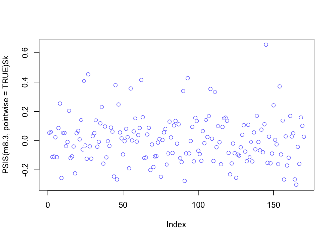<!-- -->

``` r
## R code 8.17
# plot Africa - cid=1
d.A1 <- dd[ dd$cid==1 , ]
mu <- link( m8.3 , data=data.frame( cid=1 , rugged_std=rugged_seq ) )
mu_mean <- apply( mu , 2 , mean )
mu_ci <- apply( mu , 2 , PI , prob=0.97 )

par(mfrow = c(1,2))
plot( d.A1$rugged_std , d.A1$log_gdp_std , pch=16 , col=rangi2 ,
    xlab="ruggedness (standardized)" , ylab="log GDP (as proportion of mean)" ,
    xlim=c(0,1) )
lines( rugged_seq , mu_mean , lwd=2 )
shade( mu_ci , rugged_seq , col=col.alpha(rangi2,0.3) )
mtext("African nations")

# plot non-Africa - cid=2
d.A0 <- dd[ dd$cid==2 , ]
mu <- link( m8.3 , data=data.frame( cid=2 , rugged_std=rugged_seq ) )
mu_mean <- apply( mu , 2 , mean )
mu_ci <- apply( mu , 2 , PI , prob=0.97 )

plot( d.A0$rugged_std , d.A0$log_gdp_std , pch=1 , col="black" ,
    xlab="ruggedness (standardized)" , ylab="log GDP (as proportion of mean)" ,
    xlim=c(0,1) )
lines( rugged_seq , mu_mean , lwd=2 )
shade( mu_ci , rugged_seq )
mtext("Non-African nations")
```

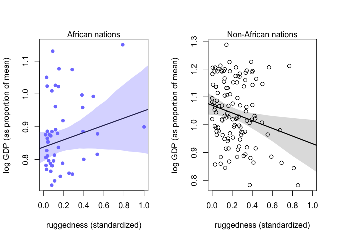<!-- -->

### symmetry of interpreting interaction models

These different phrasings represent the same statistical result (1) How
much does the association between ruggedness and log GDP depend upon
whether the nation is in Africa?  
(2) How much does the association of Africa with log GDP depend upon
ruggedness?

to visualize the second result you can make a counterfactual
plot–calculate the difference in gdp of nation inside and outside of
africa at the same level of ruggedness to visualize the implied
association of Africa with GDP.

model’s-eye view of data - imagining identical countries inside and
outside of africa as if we could independently manipulate ruggedness.

*At low ruggedness (below ~8.5) we would expect moving an imaginary
country to hurt its GDP but at ruggedness values \> 8.5 the model
expects moving the imaginary country to africa to help its gdp (the
model expects cid = africa to have higher GDP at y axis values \> 0)*

``` r
## R code 8.18
rugged_seq <- seq(from = -0.2, to = 1.2, length.out=30)
muA <- link( m8.3 , data=data.frame(cid=1,rugged_std=rugged_seq) )
muN <- link( m8.3 , data=data.frame(cid=2,rugged_std=rugged_seq) )
# africa vs non africa at the same level of ruggedness. 
delta <- muA - muN

# visualize 
plot(x = rugged_seq, y = apply(delta, 2, mean) , type = 'l', 
     ylab = 'expected difference in log gdp africa - non africa')
abline(b = 0,a = 0)
shade(apply(delta, 2, PI), rugged_seq)
```

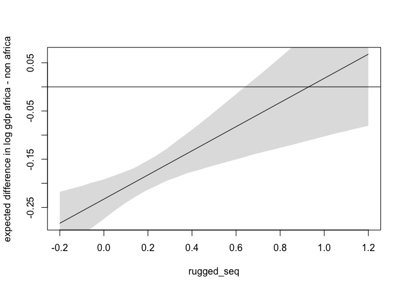<!-- -->

### Continuous interactions and their interpretation

  - Cont. interaction – the slope varies in a continuous fashion with a
    continuous variable.  
  - Interpretation of the model results with a tryptych plot.  
    The results of these models are challenging to interpret without
    visualizations.

Data – The size of blossoms from beds of tulips with different
greenhouses grown in different light conditions.

Bloom size = B  
water level = W  
shade = S  
(shade is an ordered level low mid high = 3 high shade low light)

The independent effects of S and W will increase B, but here we also
want to model the interaction between water and light(shade) because in
the absense of water , light has less impact. With an interaction we are
modeling the **interdependency** of the predictor variables.

``` r
## R code 8.19
library(rethinking)
data(tulips)
d <- tulips

# standardize variables 
## R code 8.20
d$B <- d$blooms / max(d$blooms)
d$W <- d$water - mean(d$water)
d$S <- d$shade - mean(d$shade)
pairs(d[ ,c('B', 'W', 'S')], col = rangi2)
```

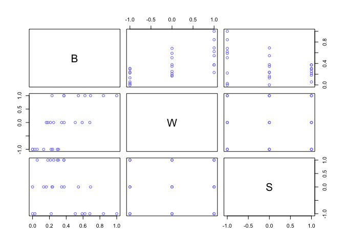<!-- -->

### Assigning meaningful priors

More important for later models and also really help think about what
the model coefficients mean. The large absolute maximum values of B are
rescaled so values represent percent of maximum value; we dont
standardize because 0 bloom is a meaningful bound we want to preserve.

The W and S variables are ordinal. We still rescaled
    them.

``` r
d$B; d$blooms
```

    ##  [1] 0.00000000 0.00000000 0.30702870 0.50729967 0.16357905 0.21221589
    ##  [7] 0.62204833 0.23162639 0.37314052 0.22147874 0.23765415 0.05494110
    ## [13] 0.58931040 0.34560084 0.18105403 1.00000000 0.54506996 0.37308522
    ## [19] 0.02770558 0.13186418 0.29516673 0.68019687 0.37582260 0.25067743
    ## [25] 0.84200630 0.68940441 0.37214511

    ##  [1]   0.00   0.00 111.04 183.47  59.16  76.75 224.97  83.77 134.95  80.10
    ## [11]  85.95  19.87 213.13 124.99  65.48 361.66 197.13 134.93  10.02  47.69
    ## [21] 106.75 246.00 135.92  90.66 304.52 249.33 134.59

``` r
d$shade; d$S
```

    ##  [1] 1 2 3 1 2 3 1 2 3 1 2 3 1 2 3 1 2 3 1 2 3 1 2 3 1 2 3

    ##  [1] -1  0  1 -1  0  1 -1  0  1 -1  0  1 -1  0  1 -1  0  1 -1  0  1 -1  0
    ## [24]  1 -1  0  1

#### intercept term

a ~ N(0.5, 1)  
This means we expect bloom to be 50% of max (it is bound 0,1) when S and
W are at their mean, but the prior for sd of alpha is too big.

We know the possible range of values for B because of how we rescaled
the data. We don’t have to know anything about hte absolute velue of
bloom but we know that the intercept cant be above the maximum (1) or
below the minumum (0) of the dat arescaled by dividing by the maximum
and therefore bounded between 0 and 1. We can calculate the fraction of
values for a are outside the possibl range with the N(0, 1) prior– 60%
of the possible values are outside the possible range:

``` r
## R code 8.21
# simulate 0100 values implied by the alpha prior
a <- rnorm( n = 100 , mean =  0.5 ,sd =  1 )

# how many are <0 or greater than 1 (outside the possible range) 
sum( a < 0 | a > 1 ) / length( a )
```

    ## [1] 0.69

2 standard deviations should contain 95% of the probability mass. for B,
0.5 is the mean, 0 is the minimum valid range. if we set a prior of
0.25, then 0.5 + (0.25x2) = 1 ; -(1 - 0.25x2) = 0. Only about 5% of the
remaining probability mass should be outside of the observed range, and
that is what we can simulate:

``` r
## R code 8.22
set.seed(1)
a <- rnorm( n = 1000 , mean = 0.5 , sd = 0.25 ) 
sum( a < 0 | a > 1 ) / length( a )
```

    ## [1] 0.06

#### effect size for water and shade

we want to allow effect size to be any direction but weakly bound to
plausible ranges.

These variables are rescaled -1, 1 – that means the range of values is
2.  
theorteical min and max of the outcome variable 0, 1 == 1 unit.  
Bloom = beta(S) + alpha  
ignore alpha  
1 = beta x 2  
1/2 = beta  
An effect size of 0.5 for the predictors will cover the observed range
of the outcome variable

## compare interaction model to multiple regression model.

``` r
## R code 8.23
f8.4 = alist(
    B ~ dnorm(mu, sigma), # estimand
    mu <- a + Bs*S + Bw*W, # likelihood
    # priors 
    a ~ dnorm(0, 0.25), 
    Bw ~ dnorm(0, 0.5), 
    Bs ~ dnorm(0, 0.5), 
    sigma ~ dexp(1)
)

m8.4 <- quap(flist = f8.4,data = d)
```

For an interaction model where we want the slope to be conditional on
values of another variable, we model the slope with its own linear
model.

make the multiple regression model into a interaction model:  
µi = alpha + Bx(xi) + Bz(zi)

define Bx with its own linear model  
gamma(x, i) = Bx + Bzx(zi)

gamma x, i is the slope defining how fast µ (outcome) changes with x.  
Bx is the rate of change when z is at its mean.  
Bzx is the rate change in gamma x,i as z changes.  
gamma depends on i because it has Zi in it

Due to the symmetry of interactions this also models Bxz(xi).

The conventional way to write this is  
µi = a + Bx(xi) + Bz(zi) + Bxz(xi \* zi)

setting the prior – the largest conceivable interaction would be the
same magnitude as the main effect but reversed.

``` r
## interaction model 
## R code 8.24
f8.5 = alist(
    B ~ dnorm( mu , sigma ) ,
    mu <- a + Bw*W + Bs*S + Bws*W*S ,
    a ~ dnorm( 0.5 , 0.25 ) ,
    Bw ~ dnorm( 0 , 0.25 ) ,
    Bs ~ dnorm( 0 , 0.25 ) ,
    Bws ~ dnorm( 0 , 0.25 ) ,
    sigma ~ dexp( 1 )
)
m8.5 <- quap( f8.5 , data=d )
precis(m8.5)
```

    ##             mean         sd        5.5%       94.5%
    ## a      0.3579846 0.02391917  0.31975714  0.39621204
    ## Bw     0.2067270 0.02923497  0.16000384  0.25345009
    ## Bs    -0.1134612 0.02922792 -0.16017302 -0.06674929
    ## Bws   -0.1431644 0.03568013 -0.20018813 -0.08614065
    ## sigma  0.1248467 0.01694104  0.09777165  0.15192175

Now to figure out what the interaction is telling us with a trypych
plot  
(aside this would take a shit load of ggplot code to make – this base is
way more elegant)

The effect of one predictor depends on the values of hte other
predictors.  
Make 3 scatterplots and choose a value for the un-viewed variables.

From left to right shade = -1, shade = 0 , shade = 1 in the
non-interaction model versus the interaction model

``` r
# select values for the unobserved variable S
s = c(-1, 0, 1) # representative low mid high values for s. 

# link with m8.4
par(mfrow = c(1,3))
for (i in 1:length(s)) {
    idx = which(d$S == s[i]) 
    plot( d$W[idx], d$B[idx],  xlim=c(-1,1), ylim =c(0,1),  col = rangi2, 
          main = paste0('multiple regression model s = ', s[i] ))
    mu = link(m8.4, data = data.frame(S = s[i], W = c(-1,0,1) ))
    for (i in 1:20) lines(x = c(-1,0,1), mu[i, ], col = col.alpha('black', alpha = 0.3))
}
```

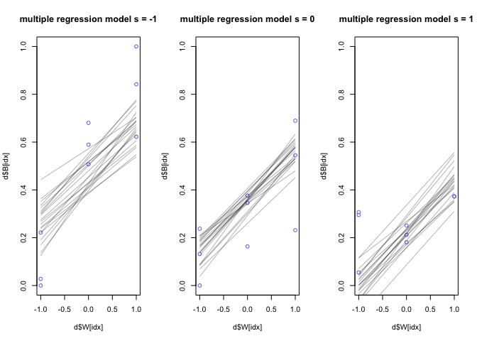<!-- -->

When shade is at its maximum water still helps in the multiple
regression model.

``` r
# link with m8.5
par(mfrow = c(1,3))
for (i in 1:length(s)) {
    idx = which(d$S == s[i]) 
    plot( d$W[idx], d$B[idx], xlim=c(-1,1), ylim =c(0,1),  col = rangi2, 
          main = paste0('interaction model s = ', s[i] ))
    mu = link(m8.5, data = data.frame(S = s[i], W = c(-1,0,1) ))
    for (i in 1:20) lines(x = c(-1,0,1), mu[i, ], col = col.alpha('black', alpha = 0.3))
}
```

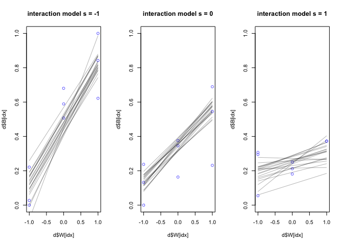<!-- -->

When shade is at its maximum, no amount of water matters in the
interaction model.

Easy.

8E1. For each of the causal relationships below, name a hypothetical
third variable that would lead to an interaction

1)  Bread dough rises because of yeast.  

<!-- end list -->

  - more with higher glucose in dough maybe.

<!-- end list -->

2)  Education leads to higher income.  
    education \* industry person works in.

3)  Gasoline makes a car go.  
    gas \* engine displacement.

8E2  
Not really clear what is meant here by “invokes an interaction”  
If it means the specific language of the statement is equivalent to an
interaction some are not interactions.

8E3. For each of the explanations in 8E2, write a linear model that
expresses the stated relationship.

For the onion relationship

``` r
µi = a + BhxH + BwW + Bwh*W*H
```

8M1. Tulip example – add temperature variable - two levels: cold and hot
and assume none grew under T = hot – explain in terms of interactions.

B is impacted by W conditional on presence of light and W has an effect
conditional on T; if T is very hot than in prioncipal the moisture in
the soil might evaporate? It’s an interaction because it made all blooms
0 instead of having an additive effect on blooms.

8M2. Make a regression model that says bloom = 0 if temperature is hot

assign T = 1 is hot T = 2 is cold

B ~ N(mu, alpha)  
mu\[i\] = a\[T - 1\] + BwW + BSs + Bws(W\*S)

8M3. Invent a dataset capturing raven population size (ravens are
scavengers) depending on wolves (carnivore) for food assuming wolves
tolerate raven population as ‘species interaction’. Would it be linear
biologically; no bc of carrying capacity and other species factors.

Need to capture correlation in the population and also that wolf
independent on Raven  
Not really a statistical interaction.

``` r
wolf = c(20, 30, 40, 50, 60, 70, 80, 200, 300, 400)
raven = c(22, 33, 44, 55, 66, 77, 80, 80, 85, 50)
plot(wolf, raven)
```

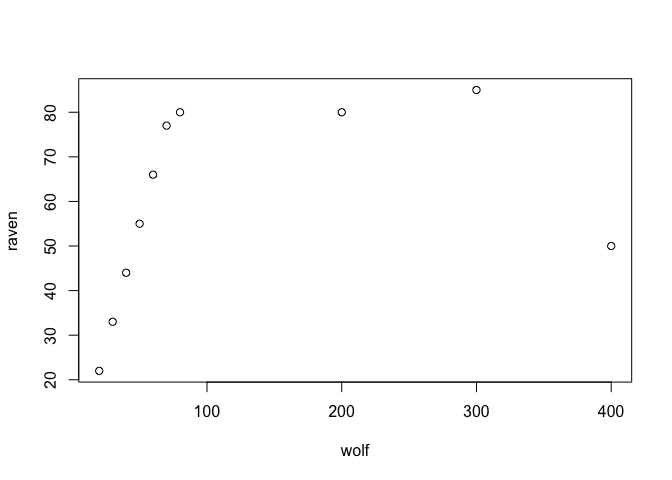<!-- -->

8H1  
tulips data – Include bed variable as a predictor in the interaction
model. Don’t interact bed with the other predictors; just include it as
a main effect. Note that bed is categorical.

``` r
library(rethinking)
data(tulips)
d <- tulips

# standardize variables 
## R code 8.20
d$B <- d$blooms / max(d$blooms)
d$W <- d$water - mean(d$water)
d$S <- d$shade - mean(d$shade)
d$bedID = as.numeric(d$bed)
pairs(d[ ,c('B', 'W', 'S', 'bedID')], col = rangi2)
```

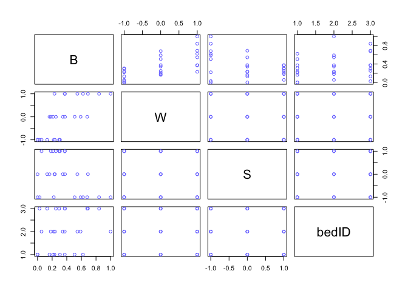<!-- -->

``` r
fbed = alist(
    B ~ dnorm( mu , sigma ) ,
    mu <- a[bedID] + Bw*W + Bs*S + Bws*W*S ,
    a[bedID] ~ dnorm( 0.5 , 0.25 ) ,
    Bw ~ dnorm( 0 , 0.25 ) ,
    Bs ~ dnorm( 0 , 0.25 ) ,
    Bws ~ dnorm( 0 , 0.25 ) ,
    sigma ~ dexp( 1 )
)
mbed <- quap( fbed , data=d )
plot(precis(mbed, depth = 3))
```

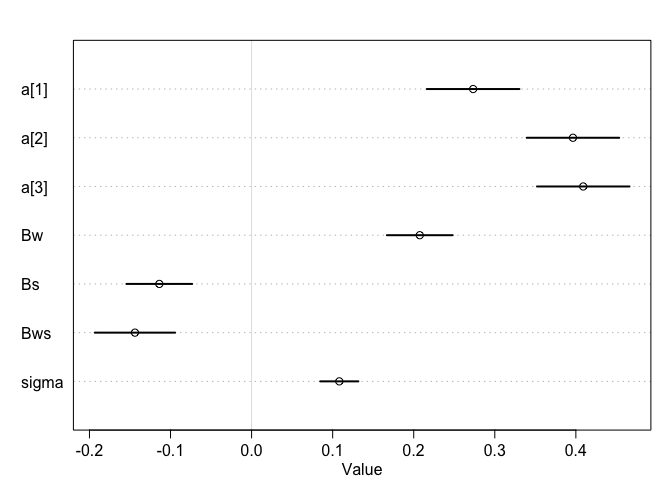<!-- -->

Bed 1 did a litle worse.

8.2H

``` r
compare(m8.5,mbed)
```

    ##           WAIC        SE    dWAIC      dSE    pWAIC    weight
    ## mbed -23.07827  9.974846 0.000000       NA 9.868381 0.7179988
    ## m8.5 -21.20916 10.776172 1.869113 7.721799 7.036200 0.2820012

The difference in the models is really modest, bed had little effect.

8H3  
using the terrain ruggedness dataset evaluate impact of the outlier
country seychelles on the inference.

``` r
data(rugged)
d <- rugged

# make log version of outcome
d$log_gdp <- log( d$rgdppc_2000 )

# extract countries with GDP data
dd <- d[ complete.cases(d$rgdppc_2000) , ]

# rescale variables
dd$G <- dd$log_gdp / mean(dd$log_gdp)
dd$R <- dd$rugged / max(dd$rugged)
dd$A <- dd$cont_africa + 1 

R.mean = mean(dd$R)

# specify interaction model 
f8.3 = alist(
    G ~ dnorm(mu, sigma), 
    mu <- a[A] + B[A]*(R - R.mean), 
    a[A] ~ dnorm(0, 0.1), 
    B[A] ~ dnorm(0,0.3), 
    sigma ~ dexp(1)
    )

m8.3 <- quap(flist = f8.3, data=dd)

psis.8.3 = PSIS(m8.3,pointwise = TRUE)
d2 = cbind(psis.8.3, dd)
ggplot(d2, aes(x = lppd, y = penalty, color = as.factor(A))) + geom_point() + ylim(0,1)
```

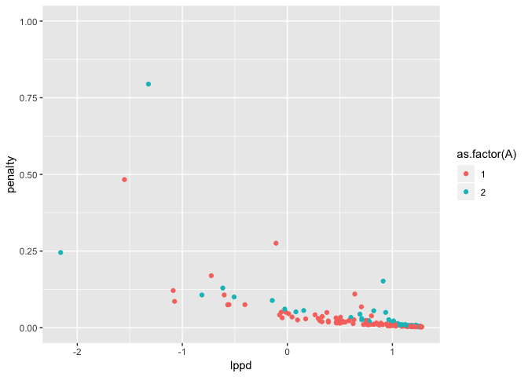<!-- -->

now with a student t distribution

``` r
f8.3.1 = alist(
    G ~ dstudent(2, mu, sigma), 
    mu <- a[A] + B[A]*(R - R.mean), 
    a[A] ~ dnorm(0, 0.1), 
    B[A] ~ dnorm(0,0.3), 
    sigma ~ dexp(1)
    )

m8.3.1 <- quap(flist = f8.3.1, data=dd)

psis.8.3.1 = PSIS(m8.3.1,pointwise = TRUE)
d3 = cbind(psis.8.3.1, dd)
ggplot(d3, aes(x = lppd, y = penalty, color = as.factor(A))) + geom_point() + ylim(0,1)
```

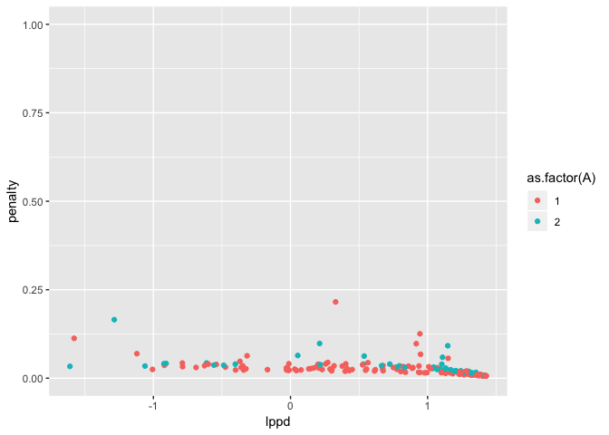<!-- -->

The predictive ability of the robust regression model is improved while
the coefficients remain largely the same:

``` r
plot(compare(m8.3, m8.3.1))
```

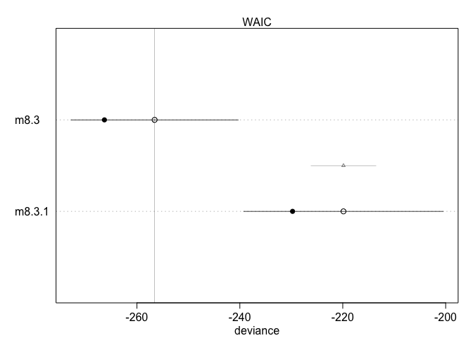<!-- -->

``` r
par(mfrow = c(1,2))
plot(precis(m8.3, depth = 2))
plot(precis(m8.3.1, depth = 2))
```

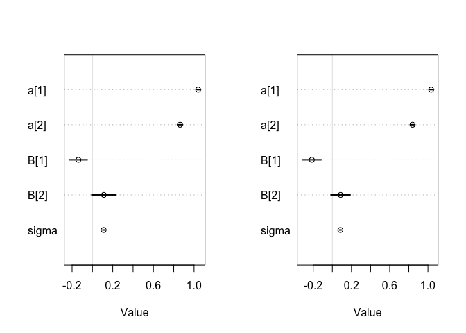<!-- -->
